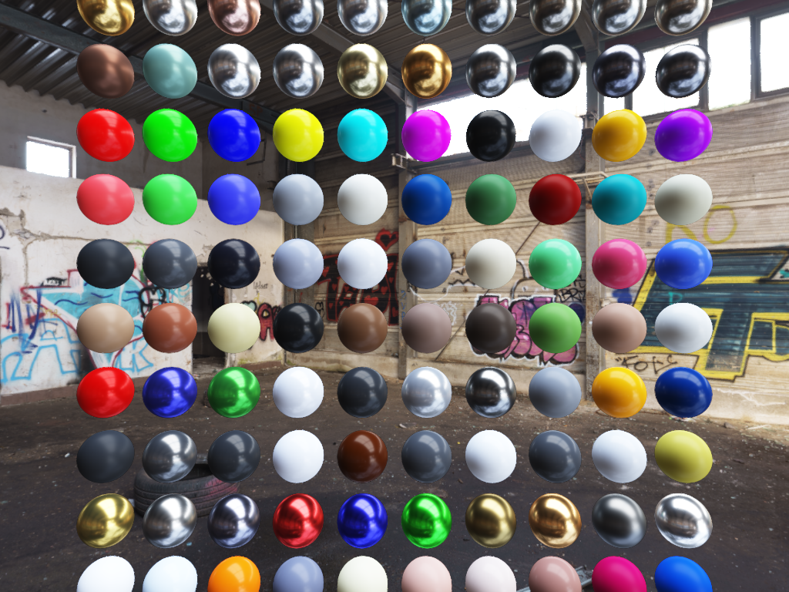

# Suckless-OGL

[](https://github.com/yoyonel/suckless-ogl/actions)
[](https://yoyonel.github.io/suckless-ogl/)
[](https://github.com/yoyonel/suckless-ogl/actions/workflows/github-code-scanning/codeql)
[](https://github.com/yoyonel/suckless-ogl/releases)
[](https://opensource.org/licenses/MIT)



**Suckless-OGL** is a minimalist 3D rendering engine written in C. Faithful to the "suckless" philosophy, it prioritizes a compact codebase, rigorous resource management, and an absence of unnecessary dependencies. It implements a modern pipeline based on **OpenGL 4.4 Core Profile**.

[🌐 **Documentation & Reports Portal**](https://yoyonel.github.io/suckless-ogl/)

## 🚀 Features
- **Minimalism**: Lightweight architecture focused on performance and readability.
- **Modern Rendering**: Support for Skyboxes, IcoSpheres, textures, and Phong lighting.
- **Dynamic Shaders**: Loading and compilation of GLSL files (vertex/fragment).
- **Shader Optimization**: Static (Release) or dynamic (Debug) compilation to balance flexibility and performance. [See Documentation](docs/shader_optimization.md).
- **Isolated Environment**: Native `distrobox` support to guarantee a reproducible build environment.
- **Quality & Testing**: Unit testing suite, code coverage, and static analysis via `clang-tidy`.

## 🛠️ Compilation and Usage

The project uses a `Makefile` wrapper that drives `CMake` to simplify interactions.
### Compilation Flags & Environment
The build is configured with the following settings:
- **Optimization**: `-Wall -Wextra -O2` for clean and performant code.
- **POSIX Standard**: `-D_POSIX_C_SOURCE=199309L` for `clock_gettime` support.
- **Static Analysis**: `clang-tidy` integration with strict header filters.
- **Containerization**: Default use of `distrobox` with the `clang-dev` image to isolate dependencies.

### Main Commands
| Command | Action |
| :--- | :--- |
| `make all` | Compiles the project (generates GLAD and the `app` binary). |
| `make debug` | Compiles in DEBUG mode (dynamic shaders, ideal for dev). |
| `make release` | Compiles in RELEASE mode (statically optimized shaders). |
| `make run` | Launches the DEBUG version. |
| `make run-release` | Launches the RELEASE version. |
| `make test` | Runs the unit test suite via `ctest`. |
| `make format` | Applies `clang-format` formatting on `src`, `include`, and `tests`. |
| `make lint` | Runs `clang-tidy` static analysis on source files. |
| `make coverage` | Generates a complete HTML report via `llvm-cov` in `build-coverage/`. |

## 🤖 CI/CD Workflow (GitHub Actions)

The pipeline is structured to optimize the build while guaranteeing maximum quality:

1. **Test & Coverage**: Instrumented compilation and test execution under **Xvfb** (virtual X server). A coverage report is generated and saved as an artifact.
2. **Lint & Format Check**:
   - Verifies that the code is formatted. If `make format` modifies a file, the CI fails.
   - Runs `make lint` to validate CERT compliance and security.
3. **Build & Release**:
   - Triggers on `master` or `v*` tags.
   - Packages the `app` binary with `assets/` and `shaders/` directories.
   - Compresses everything into a `.tar.gz` archive and creates an automatic **GitHub Release**.

## 📁 Project Structure
- `src/` & `include/`: Engine core (Log, App, Shader, Texture, Icosphere).
- `shaders/`: GLSL sources (Phong, Background/Skybox).
- `assets/`: HDR resources and textures.
- `tests/`: Unit tests (Icosphere, Shader, Skybox, Texture, Log).
- `docs/`: In-depth technical documentation.

## 📦 Docker / Podman
To test the application in a container with X11 forwarding:
```bash
make docker-build
make docker-run
```
(Requires a local X server and configured xhost permissions).

📄 License

This project is licensed under the MIT License. See the LICENSE file for more details.
