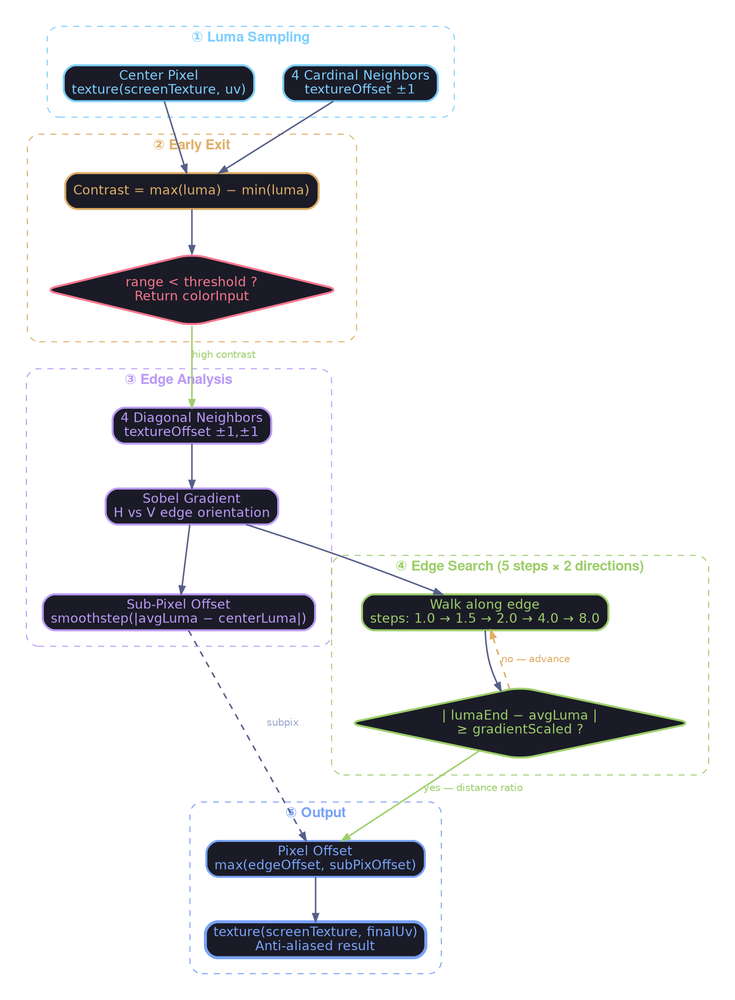
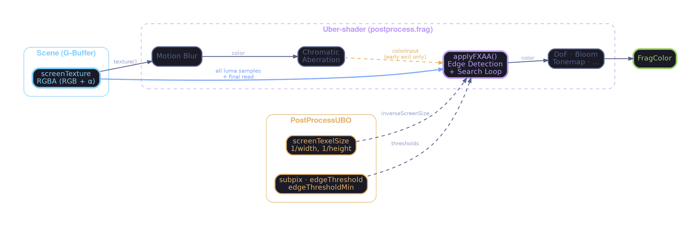

# FXAA 3.11 Implementation & Optimizations

This document details the Fast Approximate Anti-Aliasing (FXAA 3.11) implementation in Suckless-OGL, specifically focusing on the optimizations tailored for the Deferred/Forward PBR pipeline.

## Overview



FXAA is a single-pass, post-processing anti-aliasing technique that reduces jagged edges (aliasing) by analyzing the contrast between pixels (Luma).

**Version**: FXAA 3.11 Quality
**Location**: `shaders/postprocess/fxaa.glsl`

## Architecture

### Uber-shader Integration

FXAA runs inside the single-pass postprocess uber-shader (`postprocess.frag`). The pipeline order within the fragment shader is:

```
Motion Blur → Chromatic Aberration → FXAA → DoF → Bloom → Tone mapping → ...
```

Because MB and CA are applied before FXAA in the same draw call, there is **no intermediate texture** containing the MB/CA result — only the raw scene texture (`screenTexture`) is available for neighbor sampling. FXAA therefore operates on the raw scene for all luma comparisons and final color reads. The `colorInput` parameter (post-MB/CA) is only used for the **early exit** path (no edge detected → return the processed color as-is).

### Luma Modes

Two paths exist, selected at compile time via `#ifdef USE_TRANSPARENT_BILLBOARDS`:

| Mode | Alpha channel | Luma computation | Cost |
|:---|:---|:---|:---|
| **Legacy** (`!USE_TRANSPARENT_BILLBOARDS`) | Pre-computed luma | `texture(...).a` | Fastest — 0 ALU for luma |
| **Transparent** (`USE_TRANSPARENT_BILLBOARDS`) | Opacity data | `dot(rgb, vec3(0.299, 0.587, 0.114))` per sample | ~1 dot product per sample |

The current build defines `USE_TRANSPARENT_BILLBOARDS` (see `app_settings.h`), so the transparent path is active.

#### Pipeline Data Flow



## Key Optimizations

### 1. Linear Luma (ALU Savings)

`FxaaLuma()` uses a simple linear dot product:

```glsl
float FxaaLuma(vec3 rgb) {
    return dot(rgb, vec3(0.299, 0.587, 0.114));
}
```

This is the standard FXAA 3.11 approach. A previous implementation used `dot(sqrt(rgb), ...)` to approximate perceptual (gamma) luma, but this added **up to 18 `sqrt` calls per pixel** (8 neighbors + up to 10 in the search loop) with no measurable quality improvement. The linear luma is sufficient for edge detection contrast ratios.

### 2. Inverse Screen Size via UBO

Instead of calling `textureSize(screenTexture, 0)` per fragment (a GPU intrinsic query), the inverse screen size is passed through the `PostProcessUBO` as `screenTexelSize`:

```glsl
// In UBO (shaders/postprocess/ubo.glsl)
vec2 screenTexelSize;  // = 1.0 / vec2(width, height)

// In FXAA
vec2 inverseScreenSize = screenTexelSize;  // Free — just a UBO read
```

Updated on resize only (`postprocess_resize()` sets `ubo_dirty = true`).

### 3. Non-Linear Edge Search

Instead of stepping 1 pixel at a time, the search loop uses variable step sizes (`1.0, 1.5, 2.0, 4.0, 8.0`). This covers a search radius of **~16.5 pixels** with only 5 texture fetches per direction. The first sample at `±P0` is done before the loop; the loop advances from `P1` onward.

### 4. Luma Coherence

All luma comparisons (center, cardinal neighbors, corners, search loop endpoints) are sampled from the **same source** (`screenTexture`). This prevents phantom edge detection that would occur if the center pixel came from a different processing stage than its neighbors.

## Algorithm Steps

1. **Center + 4 cardinal lumas** — `textureOffset()` for N/S/E/W, `texture()` for center
2. **Early exit** — If contrast `range < max(thresholdMin, rangeMax × threshold)`, return `colorInput` (post-MB/CA)
3. **4 corner lumas** — `textureOffset()` for NW/NE/SW/SE
4. **Edge orientation** — Sobel-like gradient to determine horizontal vs vertical edge
5. **Sub-pixel offset** — Smoothstep-based blending for single-pixel artifacts
6. **Iterative search** — Walk along the edge in both directions with variable steps until contrast exceeds `gradientScaled`
7. **Final blend** — Read `screenTexture` at the offset UV; take the maximum of edge offset and sub-pixel offset

## Configuration

Settings are controlled via the `PostProcessUBO`:

```glsl
// UBO Layout (std140)
float fxaaQualitySubpix;            // Default: 0.75 (Range 0.0 - 1.0)
float fxaaQualityEdgeThreshold;     // Default: 0.125
float fxaaQualityEdgeThresholdMin;  // Default: 0.063
```

| Parameter | Effect | Lower | Higher |
|:---|:---|:---|:---|
| `subpix` | Sub-pixel AA strength | Sharper, more noise | Blurrier, less noise |
| `edgeThreshold` | Minimum contrast for AA | More edges processed | Only strong edges |
| `edgeThresholdMin` | Absolute minimum contrast | Catches subtle edges | Skips low-contrast areas |

## Debugging

Enable `enableFXAADebug` via the UI or `app_settings.h` to visualize:

| Color | Meaning |
|:---|:---|
| **Red** | Pixels displaced by edge AA |
| **Blue** | Pixels displaced by sub-pixel blending |
| **Dark gray** | Unaffected pixels (no edge detected) |

## Changelog

### 2026-02-07 — Performance & Correctness Audit

**Bug fix — Luma coherence**: Center luma was computed from `colorInput` (post-MB/CA result) while all neighbor lumas came from `screenTexture` (raw scene). This caused phantom edge detection wherever MB or CA modified the center pixel differently from its neighbors. Fixed: center now also sampled from `screenTexture`.

**Perf — Remove `sqrt` from `FxaaLuma`**: Replaced `dot(sqrt(rgb), vec3(...))` with `dot(rgb, vec3(...))`. Eliminates up to 18 `sqrt` calls per pixel in worst case (8 neighbor samples + 10 search loop samples).

**Perf — `screenTexelSize` via UBO**: Replaced per-fragment `textureSize()` call with a `vec2 screenTexelSize` field in the UBO header, updated only on resize.

**Cleanup — Remove dead `FXAA_MODE` dual-mode code**: The unused "Console Performance" mode (`FXAA_MODE == 0`) has been removed. Only the Quality path (5-step iterative search) remains.

**Fix — Quality step array**: Corrected off-by-one in the search step array (was 6 values for 5 steps). Adjusted step sizes to `{1.0, 1.5, 2.0, 4.0, 8.0}` for wider coverage.
