# Anatomie d'une Frame : Le Cycle de Vie Complet de suckless-ogl

*Un deep-dive technique — de `main()` aux photons sur l'écran.*

---

## Introduction

**suckless-ogl** est un moteur PBR (Physically-Based Rendering) léger et moderne en C11, construit sur OpenGL 4.4 Core Profile. Il rend une grille de 100 sphères métalliques/diélectriques éclairées par IBL (Image-Based Lighting) HDR, avec un pipeline complet de post-traitement (bloom, profondeur de champ, flou de mouvement, FXAA, tone mapping, color grading…).

Cet article retrace le **cycle de vie complet** de l'application : du premier octet alloué dans `main()` au moment où le GPU présente la première frame entièrement éclairée à l'écran. Nous couvrirons chaque couche — mémoire CPU, ressources GPU, le handshake X11/GLFW, la création du contexte OpenGL, la compilation de shaders, le chargement asynchrone de textures, et l'architecture de rendu multi-passes qui produit chaque frame.

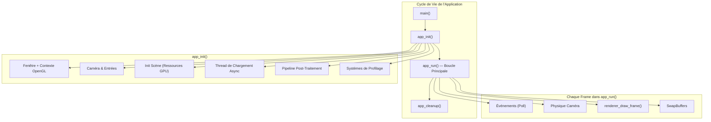

---

## Chapitre 1 — Le Point d'Entrée

Tout commence dans `main()` ([src/main.c](https://github.com/yoyonel/suckless-ogl/blob/master/src/main.c)) :

```c
int main(int argc, char* argv[])
{
    tracy_manager_init_global();          // 1. Bootstrap du profileur

    CliAction action = cli_handle_args(argc, argv);  // 2. Parsing CLI
    if (action == CLI_ACTION_EXIT_SUCCESS) return EXIT_SUCCESS;
    if (action == CLI_ACTION_EXIT_FAILURE) return EXIT_FAILURE;

    // 3. Allocation de la structure App (alignée SIMD)
    App* app = (App*)platform_aligned_alloc(sizeof(App), SIMD_ALIGNMENT);
    *app = (App){0};

    // 4. Initialiser tout
    if (!app_init(app, WINDOW_WIDTH, WINDOW_HEIGHT, "Icosphere Phong"))
        { app_cleanup(app); platform_aligned_free(app); return EXIT_FAILURE; }

    // 5. Lancer la boucle principale
    app_run(app);

    // 6. Nettoyage
    app_cleanup(app);
    platform_aligned_free(app);
    return EXIT_SUCCESS;
}
```

### Décisions de Conception Clés

| Décision | Justification |
|----------|---------------|
| **Allocation alignée SIMD** | La struct `App` contient des champs `mat4`/`vec3` (via cglm) qui bénéficient d'un alignement 16 octets pour la vectorisation SSE/NEON |
| **Zero-initialisation** `{0}` | État déterministe — chaque pointeur commence à `NULL`, chaque flag à `0` |
| **Tracy en premier** | Le profileur doit être initialisé avant tout autre sous-système pour capturer la timeline complète |
| **Structure `App` unique** | Tout l'état applicatif vit dans une seule allocation contiguë — cache-friendly, facile à passer |

!!! info "Taille de Fenêtre par Défaut"
    `WINDOW_WIDTH = 1920`, `WINDOW_HEIGHT = 1080` — configurable dans `include/app_settings.h`.

---

## Chapitre 2 — Ouvrir une Fenêtre (GLFW + X11 + OpenGL)

Le premier vrai travail se fait dans `window_create()` ([src/window.c](https://github.com/yoyonel/suckless-ogl/blob/master/src/window.c)).

### 2.1 — Initialisation GLFW & Window Hints

```c
glfwInit();
glfwWindowHint(GLFW_CONTEXT_VERSION_MAJOR, 4);
glfwWindowHint(GLFW_CONTEXT_VERSION_MINOR, 4);          // OpenGL 4.4
glfwWindowHint(GLFW_OPENGL_PROFILE, GLFW_OPENGL_CORE_PROFILE);
glfwWindowHint(GLFW_OPENGL_DEBUG_CONTEXT, GL_TRUE);     // Messages de debug
glfwWindowHint(GLFW_SAMPLES, DEFAULT_SAMPLES);           // MSAA = 1 (désactivé)
```

En coulisses, GLFW effectue un **handshake X11** :

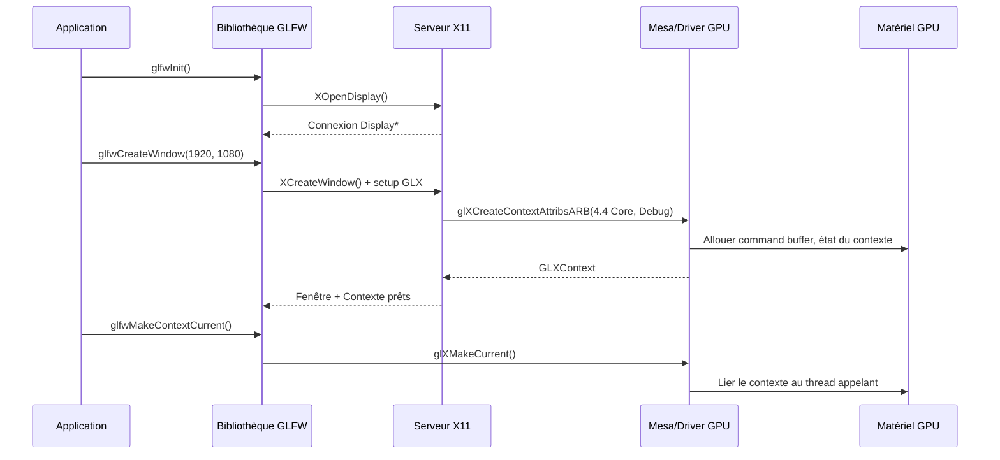

### 2.2 — GLAD : Chargement des Pointeurs de Fonctions OpenGL

```c
gladLoadGLLoader((GLADloadproc)glfwGetProcAddress);
```

OpenGL n'est **pas une bibliothèque** au sens traditionnel — c'est une spécification. Les adresses réelles des fonctions résident dans le driver GPU (Mesa, NVIDIA, AMD). GLAD interroge chaque adresse à l'exécution via `glXGetProcAddress` et remplit une table de pointeurs de fonctions. Après cet appel, des fonctions comme `glCreateShader`, `glDispatchCompute`, etc. sont utilisables.

### 2.3 — Contexte de Debug OpenGL

```c
setup_opengl_debug();
```

Cela active `GL_DEBUG_OUTPUT_SYNCHRONOUS` et enregistre un callback ([src/gl_debug.c](https://github.com/yoyonel/suckless-ogl/blob/master/src/gl_debug.c)) qui intercepte chaque erreur GL, avertissement et indication de performance. Une table de hachage déduplique les messages (log uniquement à la première occurrence). Les niveaux de sévérité correspondent au système de logging du projet :

| Sévérité GL | Niveau App | Exemple |
|------------|-----------|---------|
| `HIGH` | `ERROR` | Framebuffer invalide, échec compilation shader |
| `MEDIUM` | `WARNING` | Usage déprécié, chemin lent |
| `LOW` | `WARNING` | Indications de performance |
| `NOTIFICATION` | `INFO` | Information du driver |

### 2.4 — Callbacks d'Entrée & VSync

```c
glfwSwapInterval(0);                    // VSync OFF — FPS illimité
glfwSetKeyCallback(app->window, key_callback);
glfwSetCursorPosCallback(app->window, mouse_callback);
glfwSetScrollCallback(app->window, scroll_callback);
glfwSetFramebufferSizeCallback(app->window, framebuffer_size_callback);
glfwSetInputMode(app->window, GLFW_CURSOR, GLFW_CURSOR_DISABLED);  // Mode FPS
```

Le curseur est capturé en **mode relatif** — les mouvements de souris produisent des décalages delta pour le contrôle de la caméra orbitale, pas des coordonnées écran absolues.

---

## Chapitre 3 — Initialisation Côté CPU

Avant de toucher le GPU, plusieurs systèmes côté CPU sont démarrés.

### 3.1 — Caméra

```c
camera_init(&app->camera, 20.0F, -90.0F, 0.0F);
```

La caméra orbitale démarre à :

- **Distance** : 20 unités de l'origine
- **Lacet (Yaw)** : −90° (regarde le long de −Z)
- **Tangage (Pitch)** : 0° (niveau de l'horizon)
- **Champ de vision (FOV)** : 60° vertical
- **Z-clip** : [0.1, 1000.0]

La caméra utilise un **modèle physique à pas de temps fixe** (60 Hz) avec lissage exponentiel pour la rotation. L'entrée souris est filtrée par une EMA (Moyenne Mobile Exponentielle) pour atténuer le jitter.

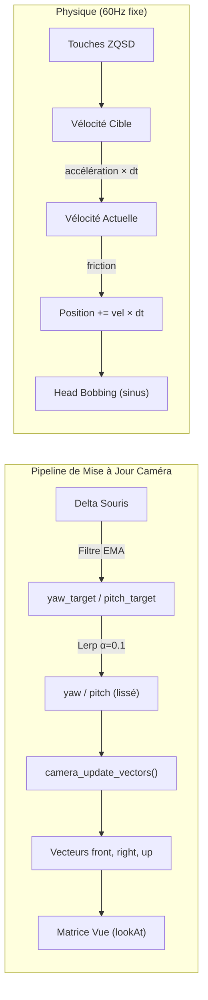

### 3.2 — Thread de Chargement Asynchrone

```c
app->async_loader = async_loader_create(&app->tracy_mgr);
```

Un **thread POSIX** dédié est lancé pour les I/O en arrière-plan. Il dort sur une variable de condition (`pthread_cond_wait`) jusqu'à ce qu'un travail soit mis en file. Cela empêche les lectures disque de bloquer la boucle de rendu.

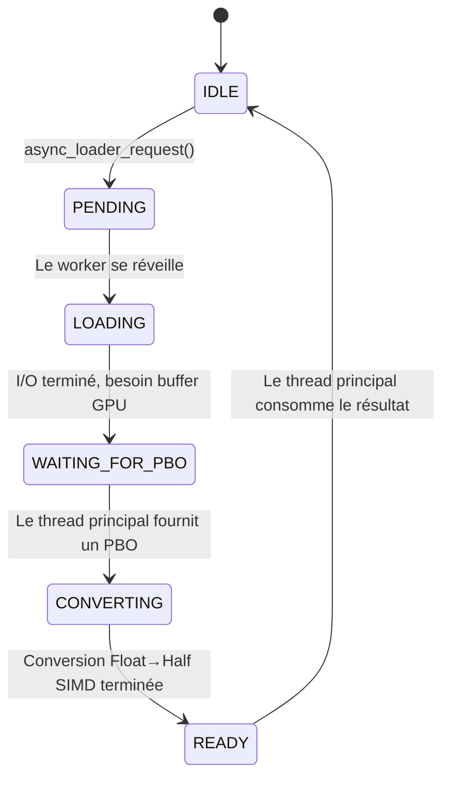

### 3.3 — Buffer Histogramme de Luminance

```c
app->lum_histogram_buffer = malloc(LUM_HISTOGRAM_MAP_SIZE *
                                    LUM_HISTOGRAM_MAP_SIZE * sizeof(float));
```

Un buffer CPU de 64×64 = 4 096 floats pour le readback de l'histogramme d'auto-exposition. Le GPU calcule la luminance de la scène, puis transfère le résultat de manière asynchrone vers le CPU via des fences PBO.

---

## Chapitre 4 — Initialisation de la Scène (Le GPU se Réveille)

`scene_init()` ([src/scene.c](https://github.com/yoyonel/suckless-ogl/blob/master/src/scene.c)) est l'endroit où le GPU reçoit son premier vrai travail.

### 4.1 — État Initial de la Scène

```c
scene->subdivisions    = 3;                     // Icosphère niveau 3
scene->wireframe       = 0;                     // Remplissage solide
scene->show_envmap     = 1;                     // Skybox visible
scene->billboard_mode  = 1;                     // Sphères transparentes
scene->sorting_mode    = SORTING_MODE_GPU_BITONIC;  // Tri GPU
scene->gi_mode         = GI_MODE_OFF;           // Pas de GI
scene->specular_aa_enabled = 1;                 // AA basé courbure
```

### 4.2 — Textures Sentinelles & BRDF LUT

Deux textures sentinelles sont créées immédiatement — elles servent de **fallback** quand une texture IBL n'est pas encore prête :

```c
scene->dummy_black_tex = render_utils_create_color_texture(0.0, 0.0, 0.0, 0.0);  // 1×1 RGBA
scene->dummy_white_tex = render_utils_create_color_texture(1.0, 1.0, 1.0, 1.0);  // 1×1 RGBA
```

Puis la **BRDF LUT** (Look-Up Table) est générée une seule fois, via compute shader :

```c
scene->brdf_lut_tex = build_brdf_lut_map(512);
```

| Propriété | Valeur |
|-----------|--------|
| Taille | 512 × 512 |
| Format | `GL_RG16F` (2 canaux, 16 bits float chacun) |
| Contenu | BRDF split-sum pré-intégrée (Schlick-GGX) |
| Shader | `shaders/IBL/spbrdf.glsl` (compute) |
| Groupes de travail | 16 × 16 (512/32 par axe) |

Cette texture mappe `(NdotV, rugosité)` → `(F0_scale, F0_bias)` et est utilisée chaque frame par le fragment shader PBR pour éviter l'intégration BRDF coûteuse en temps réel.

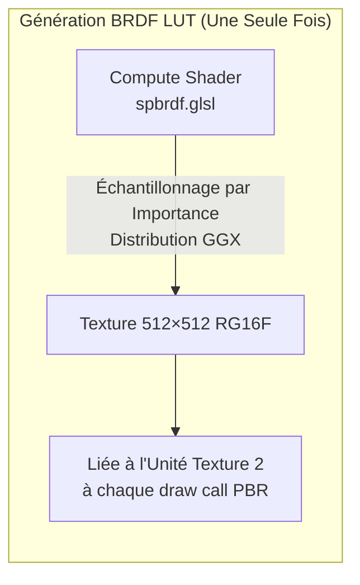

### 4.3 — Scan des Fichiers HDR

```c
scene_scan_hdr_files(scene);
```

Scanne `assets/textures/hdr/*.hdr` pour les cartes d'environnement disponibles. Les fichiers sont triés alphabétiquement et stockés dans `scene->hdr_files[]`. Le défaut est `env.hdr`.

### 4.4 — Deux Modes de Rendu : Billboard Ray-Tracing vs. Mesh Icosphère

Le moteur supporte deux stratégies de rendu des sphères. Le **mode par défaut** est le billboard avec ray-tracing.

#### Par défaut : Billboard + Ray-Tracing Par Pixel (billboard_mode = 1)

Chaque sphère est rendue comme un **simple quad aligné à l'écran** (4 sommets, 2 triangles). Le fragment shader effectue une **intersection rayon-sphère analytique** par pixel, produisant des sphères mathématiquement parfaites avec :

- Silhouettes parfaites au pixel près (jamais de facettes de polygones)
- Profondeur correcte par pixel (`gl_FragDepth` écrit depuis le point d'impact du rayon)
- Normales analytiquement lisses (vecteur `hitPos − center` normalisé)
- Anti-crénelage des bords via décroissance douce du discriminant
- Vraie transparence alpha (effet verre, avec tri arrière vers avant)

La géométrie du quad est un simple quad unité (±0.5), mais le vertex shader le projette pour entourer précisément la boîte englobante écran de la sphère via un calcul analytique de lignes tangentes (voir `computeBillboardSphere()` dans `projection_utils.glsl`).

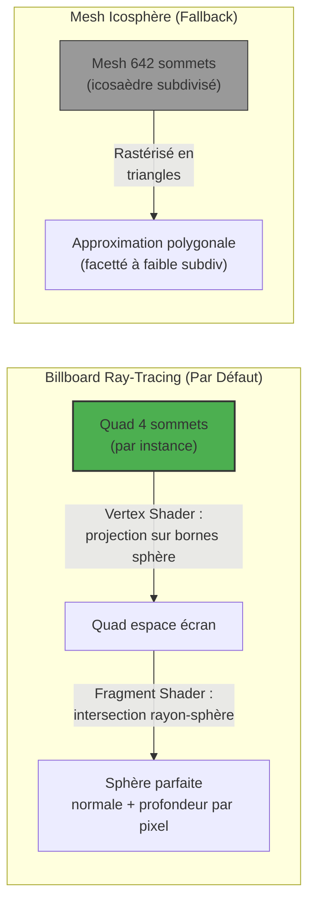

!!! tip "Pourquoi le Billboard Ray-Tracing ?"
    Avec 100 sphères, l'approche billboard utilise **100 × 4 = 400 sommets** au total, contre **100 × 642 = 64 200 sommets** pour des icosphères niveau 3. Plus important, les sphères sont **mathématiquement parfaites** à tout niveau de zoom — aucun artefact de tessellation.

#### Fallback : Mesh Icosphère Instancié (billboard_mode = 0)

Le chemin icosphère génère un mesh d'icosaèdre subdivisé, utilisé quand le mode billboard est désactivé :

```c
icosphere_generate(&scene->geometry, INITIAL_SUBDIVISIONS);  // Niveau 3
```

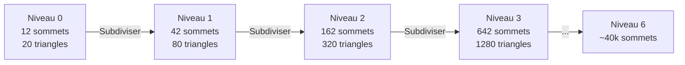

Chaque subdivision : division des arêtes aux milieux, normalisation sur la sphère unité, cache des milieux via table de hachage. Ce chemin rend des sphères opaques avec test de profondeur, sans tri.

### 4.5 — Buffers GPU

```c
glGenVertexArrays(1, &scene->icosphere_vao);
glGenBuffers(1, &scene->icosphere_vbo);   // Positions
glGenBuffers(1, &scene->icosphere_nbo);   // Normales
glGenBuffers(1, &scene->icosphere_ebo);   // Indices (triangles)
```

De la géométrie utilitaire supplémentaire est créée :

| Buffer | Utilisation | Nombre de Sommets |
|--------|------------|-------------------|
| `quad_vbo` | Quad plein écran (post-process, skybox) | 6 (2 triangles) |
| `wire_quad_vbo` | Quad wireframe debug | 4 (boucle de lignes) |
| `wire_cube_vbo` | Boîte englobante debug | 24 (12 lignes) |
| `empty_vao` | Draws sans attributs (chemin SSBO) | 0 |

### 4.6 — Bibliothèque de Matériaux

```c
scene->material_lib = material_load_presets("assets/materials/pbr_materials.json");
```

Le fichier JSON définit **101 presets de matériaux PBR** organisés par catégorie :

| Catégorie | Exemples | Métallique | Plage Rugosité |
|-----------|----------|------------|----------------|
| **Métaux Purs** | Or, Argent, Cuivre, Chrome | 1.0 | 0.05–0.2 |
| **Métaux Vieilli** | Fer Rouillé, Cuivre Oxydé | 0.7–0.95 | 0.4–0.8 |
| **Diélectriques Brillants** | Plastique Rouge/Bleu/Vert | 0.0 | 0.05–0.15 |
| **Matériaux Mats** | Tissu, Argile, Sable | 0.0 | 0.65–0.95 |
| **Pierres & Minéraux** | Granit, Marbre, Obsidienne | 0.0 | 0.35–0.85 |
| **Organiques** | Chêne, Cuir, Os | 0.0 | 0.35–0.75 |
| **Peintures** | Peinture Auto, Nacré, Satiné | 0.3–0.7 | 0.1–0.5 |
| **Techniques** | Caoutchouc, Carbone, Céramique | 0.0–0.1 | 0.05–0.85 |
| **Anodisé/Patine** | Anodisé Rouge, Laiton Terni | 0.5–0.98 | 0.05–0.65 |

Chaque matériau fournit : `albedo` (RVB), `metallic` (0–1), `roughness` (0–1).

### 4.7 — Configuration de la Grille d'Instances

```c
// Configuration de la grille (depuis app_settings.h)
const int cols    = 10;       // DEFAULT_COLS
const float spacing = 2.5F;   // DEFAULT_SPACING
```

Une **grille 10×10 de 100 sphères** est disposée dans le plan XY, centrée à l'origine :

```
Dimensions de la grille :
  Largeur = (10 - 1) × 2.5 = 22.5 unités
  Hauteur = (10 - 1) × 2.5 = 22.5 unités
  Z = 0 (toutes les sphères dans le même plan)

Formule de position :
  x = (col × 2.5) − 11.25
  y = −((row × 2.5) − 11.25)

Caméra à distance 20, regarde vers l'origine → voit toute la grille
```

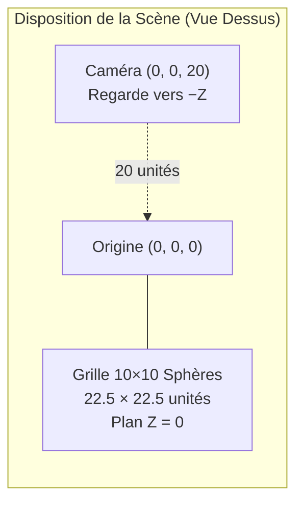

Chaque instance stocke :

```c
typedef struct SphereInstance {
    mat4  model;      // 64 octets — matrice de transformation 4×4
    vec3  albedo;     // 12 octets — couleur RVB
    float metallic;   //  4 octets
    float roughness;  //  4 octets
    float ao;         //  4 octets — toujours 1.0
} SphereInstance;     // Total : 88 octets par instance
```

Deux groupes de rendu sont créés :

1. **`billboard_group`** ★ — **Par défaut** : quads billboard transparents + ray-tracing par pixel + tri arrière vers avant
2. **`instanced_group`** — Fallback : rendu instancié opaque de mesh icosphère (VAO avec diviseurs d'attributs)

### 4.8 — Layout du VAO (Mode Billboard — Par Défaut)

En mode billboard, le VAO lie un **quad de 4 sommets** et les données matériaux par instance :

```
┌────────────────────────────────────────────────────────────────┐
│           VAO Billboard (Mode de Rendu par Défaut)              │
├────────────┬────────────┬─────────────────────────────────────┤
│  Location  │  Source    │  Description                        │
├────────────┼────────────┼─────────────────────────────────────┤
│  0         │  Quad VBO  │  vec3 position   (±0.5 quad verts)  │
│  1         │  Quad VBO  │  vec3 normale    (stub, inutilisé)  │
│  2–5       │  Inst VBO  │  mat4 model      (par instance)     │
│  6         │  Inst VBO  │  vec3 albedo     (par instance)     │
│  7         │  Inst VBO  │  vec3 pbr (M,R,AO) (par instance)   │
└────────────┴────────────┴─────────────────────────────────────┘

Locations 0–1 : glVertexAttribDivisor = 0 (avance par sommet, 4 sommets)
Locations 2–7 : glVertexAttribDivisor = 1 (avance par instance)
```

Le vertex shader extrait le centre et le rayon de la sphère depuis la matrice modèle, puis appelle `computeBillboardSphere()` pour projeter un quad englobant précis en espace écran. Le fragment shader ray-trace la surface réelle de la sphère.

Appel de draw : `glDrawArraysInstanced(GL_TRIANGLE_STRIP, 0, 4, 100)` — 100 quads, face culling désactivé.

### 4.9 — Grille de Sondes Lumineuses (Harmoniques Sphériques)

```c
light_probe_grid_init(&scene->probe_grid, 21, 21, 3);
```

Une grille de voxels 21×21×3 de sondes à Harmoniques Sphériques est allouée pour l'Illumination Globale optionnelle. Chaque sonde stocke des coefficients SH L0–L2 (7 textures, `GL_TEXTURE_3D`, `GL_RGBA16F`). L'AABB de la grille est calculé à partir des positions des sphères.

### 4.10 — Compilation des Shaders

Tous les shaders sont compilés pendant `scene_init()` :

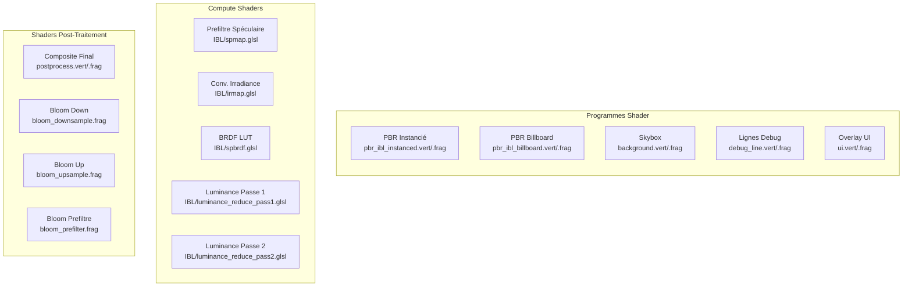

Le chargeur de shaders ([src/shader.c](https://github.com/yoyonel/suckless-ogl/blob/master/src/shader.c)) supporte un **système d'include `@header` personnalisé** :

```glsl
// Dans pbr_ibl_instanced.frag :
@header "pbr_functions.glsl"
@header "sh_probe.glsl"
```

Cela inline récursivement les fichiers (profondeur max : 16), avec dé-duplication par include-guard. Les locations d'uniforms sont mises en cache après le linking pour un accès rapide à l'exécution.

---

## Chapitre 5 — Configuration du Pipeline Post-Traitement

```c
postprocess_init(&app->postprocess, &app->gpu_profiler, 1920, 1080);
```

### 5.1 — Le FBO de Scène (Multi-Render Target)

Le framebuffer offscreen principal utilise le **MRT** (Multiple Render Targets) :

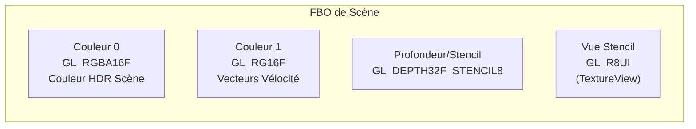

| Attachement | Format | Taille | Utilisation |
|------------|--------|--------|-------------|
| `GL_COLOR_ATTACHMENT0` | `GL_RGBA16F` | 1920×1080 | Couleur HDR scène (alpha = luma pour FXAA) |
| `GL_COLOR_ATTACHMENT1` | `GL_RG16F` | 1920×1080 | Vélocité par pixel pour flou de mouvement |
| `GL_DEPTH_STENCIL_ATTACHMENT` | `GL_DEPTH32F_STENCIL8` | 1920×1080 | Buffer de profondeur + masque stencil |
| Vue stencil | `GL_R8UI` | 1920×1080 | Stencil en lecture seule comme texture (pour post-process) |

### 5.2 — Ressources des Sous-Effets

Chaque effet de post-traitement initialise ses propres ressources :

| Effet | Ressources GPU |
|-------|---------------|
| **Bloom** | FBOs en chaîne mip (6 niveaux), textures prefiltre/downsample/upsample |
| **Profondeur de Champ** | Texture de flou, texture CoC (Cercle de Confusion) |
| **Auto-Exposition** | Texture downsample luminance, 2× PBOs (readback), 2× fences GLSync |
| **Flou de Mouvement** | Texture vélocité tile-max (compute), texture neighbor-max (compute) |
| **LUT 3D** | 32³ `GL_TEXTURE_3D` chargée depuis fichiers `.cube` |

### 5.3 — UBO (Uniform Buffer Object)

Tous les paramètres post-process sont empaquetés dans un seul UBO :

```c
typedef struct PostProcessUBO {
    uint32_t active_effects;      // Masque de bits des effets actifs
    float    time;                // Effets animés
    // Vignette, grain, balance des blancs, color grading,
    // courbe de tonemapping, intensité bloom, params DoF...
} PostProcessUBO;
```

Uploadé via `glBufferSubData` une fois par frame (ou juste l'en-tête si rien n'a changé), évitant les appels `glUniform*` par uniform.

### 5.4 — Effets Actifs par Défaut

```c
postprocess_enable(&app->postprocess, POSTFX_FXAA);  // Seul FXAA activé
```

Au démarrage, seul **FXAA** est actif. Les autres effets (bloom, DoF, flou de mouvement, grading…) sont basculés à l'exécution via raccourcis clavier.

---

## Chapitre 6 — Le Premier Chargement d'Environnement HDR

```c
env_manager_load(&app->env_mgr, app->async_loader, "env.hdr");
```

Cela déclenche le **pipeline de chargement d'environnement asynchrone** — l'opération multi-frames la plus complexe du moteur.

### 6.1 — Séquence de Chargement Asynchrone

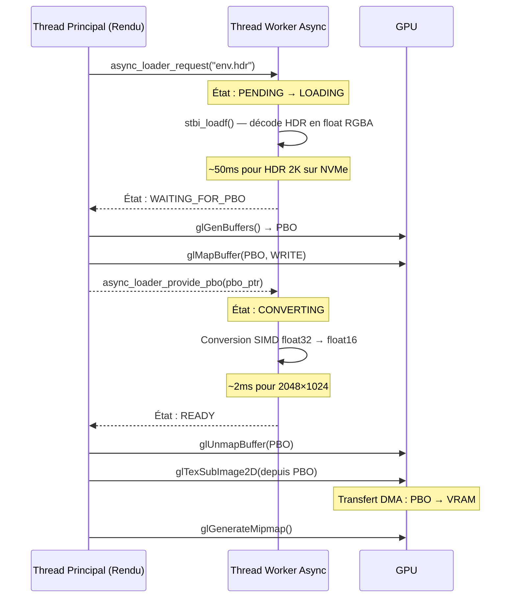

### 6.2 — Machine d'État de Transition

Lors du premier chargement, l'écran reste **noir** (pas de crossfade depuis une scène précédente) :

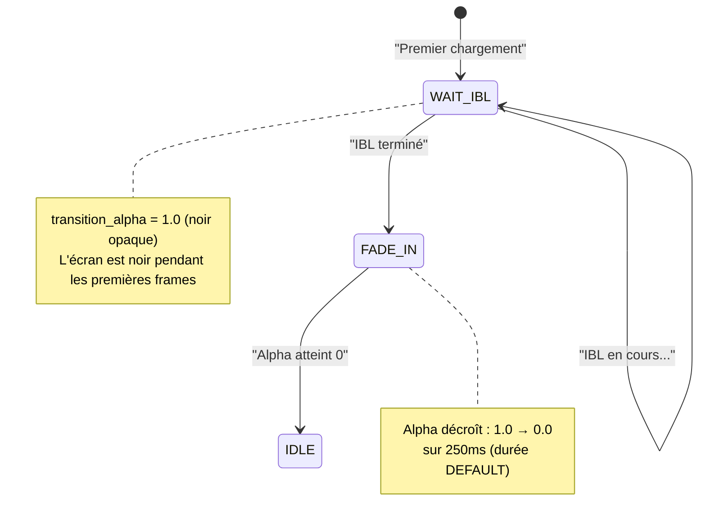

---

## Chapitre 7 — Génération IBL (Progressive, Multi-Frame)

Une fois la texture HDR uploadée, le **Coordinateur IBL** ([src/ibl_coordinator.c](https://github.com/yoyonel/suckless-ogl/blob/master/src/ibl_coordinator.c)) prend le relais. Il calcule trois maps sur plusieurs frames pour éviter les stalls GPU.

### 7.1 — Les Trois Maps IBL

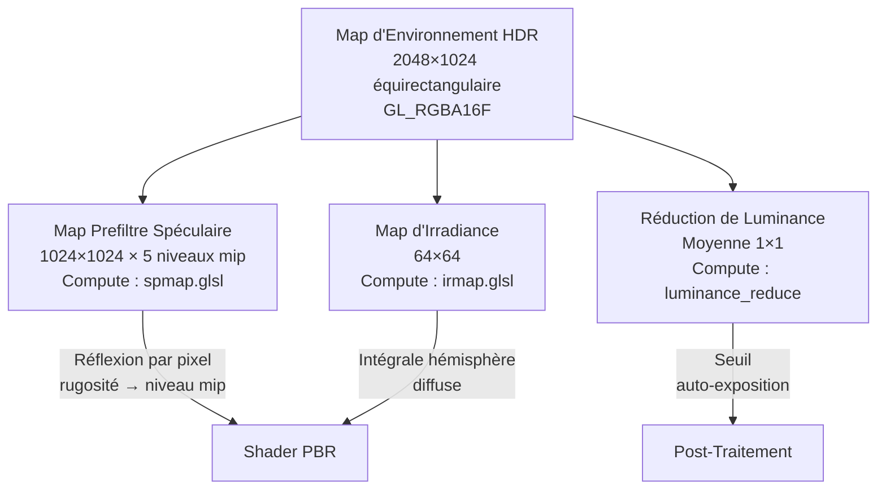

| Map | Résolution | Format | Niveaux Mip | Compute Shader |
|-----|-----------|--------|-------------|----------------|
| **Prefiltre Spéculaire** | 1024×1024 | `GL_RGBA16F` | 5 | `IBL/spmap.glsl` |
| **Irradiance** | 64×64 | `GL_RGBA16F` | 1 | `IBL/irmap.glsl` |
| **Luminance** | 1×1 | `GL_R32F` | 1 | `IBL/luminance_reduce_pass1/2.glsl` |

### 7.2 — Stratégie de Découpage Progressif

Pour éviter les pics de frame, chaque niveau mip est subdivisé en **tranches** traitées sur des frames consécutives :

| Étape IBL | GPU Matériel | GPU Logiciel (llvmpipe) |
|-----------|-------------|------------------------|
| Spéculaire Mip 0 (1024²) | 24 tranches (42 lignes chacune) | 1 tranche (complet) |
| Spéculaire Mip 1 (512²) | 8 tranches | 1 tranche |
| Spéculaire Mips 2–4 | Groupé (1 dispatch) | 1 tranche |
| Irradiance (64²) | 12 tranches | 1 tranche |
| Luminance | 2 dispatches (passe 1 + 2) | 2 dispatches |

```mermaid
gantt
    title Timeline de Génération IBL Progressive
    dateFormat X
    axisFormat Frame %s

    section Luminance
    Luminance Passe 1      :lum1, 0, 1
    Luminance Attente (fence) :lum2, 1, 2
    Luminance Readback     :lum3, 2, 3

    section Spéculaire Mip 0
    Tranche 1/24            :s1, 3, 4
    Tranche 2/24            :s2, 4, 5
    Tranche ...             :s3, 5, 6
    Tranche 24/24           :s4, 6, 7

    section Spéculaire Mip 1
    Tranche 1/8             :m1, 7, 8
    Tranche 8/8             :m2, 8, 9

    section Spéculaire Mips 2-4
    Dispatch groupé         :m3, 9, 10

    section Irradiance
    Tranche 1/12            :i1, 10, 11
    Tranche 12/12           :i2, 11, 12

    section Terminé
    IBL Complet → Fade In   :done, 12, 13
```

### 7.3 — Machine d'État

```c
enum IBLState {
    IBL_STATE_IDLE,             // Aucun travail
    IBL_STATE_LUMINANCE,        // Passe 1 : réduction luminance
    IBL_STATE_LUMINANCE_WAIT,   // Attente fence readback
    IBL_STATE_SPECULAR_INIT,    // Allocation texture spéculaire
    IBL_STATE_SPECULAR_MIPS,    // Génération progressive mips
    IBL_STATE_IRRADIANCE,       // Convolution irradiance progressive
    IBL_STATE_DONE              // Toutes les maps prêtes
};
```

---

## Chapitre 8 — La Boucle Principale

`app_run()` ([src/app.c](https://github.com/yoyonel/suckless-ogl/blob/master/src/app.c)) est le battement de cœur — une **boucle de jeu classique non-capée** avec physique à pas de temps fixe.

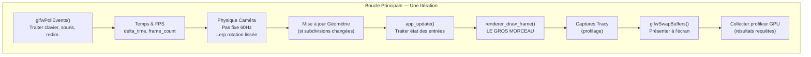

### 8.1 — Redimensionnement Différé

```c
if (app->resize_pending) {
    postprocess_resize(&app->postprocess, app->pending_width, app->pending_height);
    app->resize_pending = 0;
}
```

Les événements de redimensionnement sont **différés** — le callback GLFW ne fait qu'enregistrer les nouvelles dimensions. La recréation réelle des FBOs se fait au début de la frame suivante, en dehors du contexte limité du callback.

### 8.2 — Intégration Caméra à Pas Fixe

```c
app->camera.physics_accumulator += (float)app->delta_time;
while (app->camera.physics_accumulator >= app->camera.fixed_timestep) {
    camera_fixed_update(&app->camera);  // Vélocité, friction, bobbing
    app->camera.physics_accumulator -= app->camera.fixed_timestep;
}

// Rotation lissée (interpolation exponentielle)
float alpha = app->camera.rotation_smoothing;  // ~0.1
app->camera.yaw   += (app->camera.yaw_target   - app->camera.yaw)   * alpha;
app->camera.pitch += (app->camera.pitch_target - app->camera.pitch) * alpha;
camera_update_vectors(&app->camera);
```

Cela assure une physique déterministe indépendamment du frame rate, tandis que la rotation reste fluide via l'interpolation par frame.

---

## Chapitre 9 — Rendu d'une Frame

`renderer_draw_frame()` ([src/renderer.c](https://github.com/yoyonel/suckless-ogl/blob/master/src/renderer.c)) orchestre le pipeline de rendu complet pour chaque frame.

### 9.1 — Architecture Haut Niveau d'une Frame

```mermaid
graph TB
    subgraph "renderer_draw_frame()"
        A["GPU Profiler Begin"] --> B
        B["postprocess_begin()<br/>Bind FBO Scène<br/>Clear couleur/profondeur/stencil"] --> C

        subgraph "Configuration Vue"
            C["camera_get_view_matrix()"]
            C --> D["glm_perspective()<br/>FOV=60°, near=0.1, far=1000"]
            D --> E["ViewProj = Proj × View"]
            E --> F["InvViewProj = inverse(ViewProj)"]
        end

        F --> G["scene_render()"]

        subgraph "scene_render()"
            G --> G1["Passe Skybox<br/>(profondeur désactivée)"]
            G1 --> G2["Tri des Sphères<br/>(GPU Bitonique)"]
            G2 --> G3["Passe PBR Sphères<br/>(draw instancié)"]
        end

        G3 --> H["postprocess_end()<br/>Pipeline 7 Étapes"]
        H --> I["Overlay UI<br/>+ Transition Env"]
    end
```

### 9.2 — Passe 1 : Skybox

La skybox est dessinée **en premier**, avec le test de profondeur **désactivé**. Elle utilise une astuce de quad plein écran :

```glsl
// background.vert
gl_Position = vec4(in_position.xy, 1.0, 1.0);  // Profondeur = 1.0 (plan lointain)
vec4 pos = m_inv_view_proj * vec4(in_position.xy, 1.0, 1.0);
RayDir = pos.xyz / pos.w;  // Reconstruire rayon en espace monde
```

```glsl
// background.frag
vec2 uv = SampleEquirectangular(normalize(RayDir));
vec3 envColor = textureLod(environmentMap, uv, blur_lod).rgb;
// Protection NaN + clamping pour prévenir les fireflies
envColor = clamp(envColor, vec3(0.0), vec3(200.0));
FragColor = vec4(envColor, luma);  // Alpha = luma pour FXAA
VelocityOut = vec2(0.0);          // Pas de mouvement pour la skybox
```

La projection équirectangulaire mappe une image HDR 2D sur la sphère complète de directions en utilisant `atan`/`asin`.

### 9.3 — Passe 2 : Tri des Sphères (Tri Bitonique GPU)

Pour le rendu billboard transparent, les sphères doivent être dessinées **de l'arrière vers l'avant**. Le mode de tri par défaut est le **Tri Bitonique GPU** :

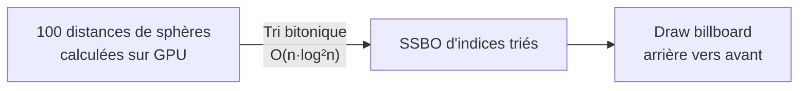

Trois modes de tri sont disponibles :

| Mode | Où | Algorithme | Complexité |
|------|-----|-----------|------------|
| `CPU_QSORT` | CPU | `qsort()` (stdlib) | O(n·log n) moy. |
| `CPU_RADIX` | CPU | Tri radix | O(n·k) |
| `GPU_BITONIC` ★ | GPU | Tri par fusion bitonique (compute) | O(n·log²n) |

### 9.4 — Passe 3 : Sphères PBR — Billboard Ray-Tracing (Par Défaut)

C'est la passe de rendu principale. En mode billboard par défaut, chaque sphère est un **quad de 4 sommets** dont le fragment shader effectue une **intersection rayon-sphère par pixel**.

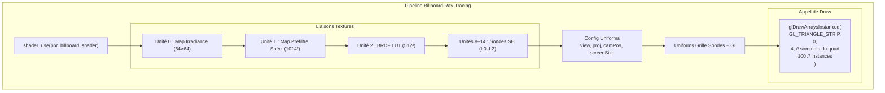

**Un seul appel de draw rend les 100 sphères** — avec alpha blending activé, ordre arrière vers avant.

| Métrique | Valeur |
|----------|--------|
| Sommets par sphère | **4** (quad billboard) |
| Triangles par sphère | 2 (triangle strip) |
| Instances | 100 (grille 10×10) |
| **Total sommets** | **400** |
| **Appels de draw** | **1** |
| Précision sphère | **Mathématiquement parfaite** (ray-tracée) |

### 9.5 — Le Fragment Shader Billboard (Intersection Rayon-Sphère)

Le fragment shader (`pbr_ibl_billboard.frag`) est là où la magie opère. Au lieu de shader un mesh de triangles rastérisé, il **intersecte analytiquement un rayon avec une sphère parfaite** :

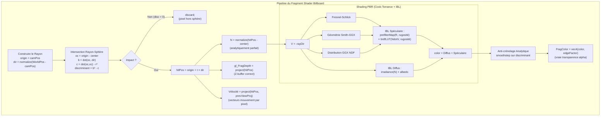

#### Détails Clés du Shader

**Intersection Rayon-Sphère** (analytique, pas de mesh nécessaire) :

```glsl
vec3 oc = rayOrigin - center;
float b = dot(oc, rayDir);
float c = dot(oc, oc) - radius * radius;
float discriminant = b * b - c;  // >0 = impact, <0 = raté
if (discriminant < 0.0) discard;
float t = -b - sqrt(discriminant);  // intersection la plus proche
vec3 hitPos = rayOrigin + t * rayDir;
vec3 N = normalize(hitPos - center);  // normale analytique parfaite
```

**Correction de Profondeur** — le quad billboard est plat, mais la sphère a de la profondeur. Le shader écrit la vraie profondeur projetée du point d'impact du rayon :

```glsl
vec4 clipPosActual = projection * view * vec4(sphereHitPos, 1.0);
gl_FragDepth = /* profondeur NDC depuis clipPosActual */;
```

**Anti-crénelage des Bords** — bords de sphère lisses sans MSAA, utilisant le discriminant comme métrique de distance au bord :

```glsl
float pixelSizeWorld = (2.0 * clipW) / (proj[1][1] * screenHeight);
float edgeFactor = smoothstep(0.0, 1.0, discriminant / (2.0 * radius * pixelSizeWorld));
FragColor = vec4(color * edgeFactor, edgeFactor);  // alpha prémultiplié
```

**Projection Billboard** — le vertex shader calcule un quad englobant précis en espace écran via projection analytique des lignes tangentes (`computeBillboardSphere()` dans `projection_utils.glsl`), gérant trois cas :

| Position Caméra | Stratégie Billboard |
|----------------|---------------------|
| En dehors de la sphère | Quad précis depuis projection tangente |
| À l'intérieur de la sphère | Quad plein écran (tout l'écran ray-tracé) |
| Derrière la caméra | Cullé (position hors écran) |

!!! info "Fallback : Chemin Mesh Icosphère"
    Quand `billboard_mode = 0`, le moteur repasse à `glDrawElementsInstanced()` avec le mesh icosphère (642 sommets × 100 instances = 128K triangles). Ce chemin est opaque, avec test de profondeur, et ne nécessite pas de tri. Il utilise `pbr_ibl_instanced.vert/.frag` avec les normales de sommets du mesh.

---

## Chapitre 10 — Pipeline Post-Traitement

Après le rendu de la scène 3D dans le FBO MRT, `postprocess_end()` applique jusqu'à **8 effets** dans un pipeline soigneusement ordonné.

### 10.1 — Le Pipeline en 7 Étapes


### 10.2 — Carte des Unités Texture

| Unité | Texture | Format | Utilisé Par |
|-------|---------|--------|-------------|
| 0 | Couleur Scène | `GL_RGBA16F` | FXAA, tonemapping, tous les effets |
| 1 | Bloom | `GL_RGBA16F` | Composite bloom |
| 2 | Profondeur Scène | `GL_DEPTH32F_STENCIL8` | DoF (CoC), brouillard |
| 3 | Auto-Exposition | `GL_R32F` | Exposition tonemapping |
| 4 | Vélocité | `GL_RG16F` | Flou de mouvement |
| 5 | Vélocité Neighbour Max | `GL_RG16F` | Flou de mouvement |
| 6 | Flou DoF | `GL_RGBA16F` | Composite profondeur de champ |
| 7 | Vue Stencil | `GL_R8UI` | Masque objet (effets stencil) |
| 8 | LUT 3D | `GL_RGB16F` | Color grading |

### 10.3 — Optimisation Shader

Le fragment shader post-process utilise des **#defines à la compilation** pour éliminer les branches :

```glsl
#ifdef OPT_ENABLE_BLOOM
    color += bloomTexture * bloomIntensity;
#endif

#ifdef OPT_ENABLE_FXAA
    color = fxaa(color, uv, texelSize);
#endif
```

Un **cache LRU de 32 entrées** stocke les variantes compilées pour différentes combinaisons de flags d'effets. Changer d'effets déclenche une recompilation paresseuse uniquement à la première occurrence d'une nouvelle combinaison.

---

## Chapitre 11 — La Première Frame Visible

Traçons ce qui apparaît réellement à l'écran pendant les premières secondes :

### Frames 1–2 : Écran Noir

- `transition_alpha = 1.0` → overlay noir complet
- Le FBO scène est vidé mais couvert par la transition
- Le loader asynchrone lit `env.hdr` depuis le disque

### Frames 3–4 : Upload HDR

- Transfert PBO → texture GPU (DMA)
- Génération des mipmaps
- Toujours noir (la transition bloque la vue)

### Frames 5–15 : Calcul IBL

- Réduction de luminance (2 frames)
- Prefiltre spéculaire (tranches progressives, ~8–10 frames)
- Convolution d'irradiance (~2–3 frames)
- Toujours écran noir, mais les sphères sont dessinées dans le FBO

### Frame ~16 : Le Fade In Commence

```c
mgr->transition_state = TRANSITION_FADE_IN;
```

- `transition_alpha` décroît de 1.0 → 0.0 sur 250ms
- La scène PBR entièrement éclairée devient visible
- Les sphères reflètent l'environnement, le BRDF crée des réponses métalliques/diélectriques réalistes

### Frame ~20+ : État Stable

Les transitions se terminent, et chaque frame suit le pipeline en régime stationnaire :

```
┌──────────────────────────────────────────────────────┐
│           FRAME EN RÉGIME STATIONNAIRE                │
│                                                       │
│  1. Poll Events          (~0.1ms CPU)                │
│  2. Update Caméra        (~0.01ms CPU)               │
│  3. Rendu Scène                                       │
│     a. Skybox            (~0.2ms GPU)                │
│     b. Tri Bitonique     (~0.1ms GPU, compute)       │
│     c. Sphères PBR       (~0.5ms GPU, ray-tracées)    │
│  4. Post-Traitement                                   │
│     a. Bloom             (~0.3ms GPU, si activé)     │
│     b. DoF               (~0.2ms GPU, si activé)     │
│     c. Auto-Exposition   (~0.1ms GPU)                │
│     d. Flou Mouvement    (~0.2ms GPU, si activé)     │
│     e. Composite Final   (~0.3ms GPU)                │
│  5. Overlay UI           (~0.1ms GPU)                │
│  6. SwapBuffers          (attente affichage)          │
│                                                       │
│  Temps frame typique : 1–3ms GPU                     │
│  (selon effets activés et GPU)                       │
└──────────────────────────────────────────────────────┘
```

---

## Chapitre 12 — Budget Mémoire GPU

Voici une estimation de la consommation VRAM en régime stationnaire :

### Textures

| Ressource | Résolution | Format | Taille |
|-----------|-----------|--------|--------|
| Environnement HDR | 2048×1024 | `GL_RGBA16F` | ~16 Mo (avec mips) |
| Prefiltre Spéculaire | 1024² × 5 mips | `GL_RGBA16F` | ~10.5 Mo |
| Irradiance | 64×64 | `GL_RGBA16F` | ~32 Ko |
| BRDF LUT | 512×512 | `GL_RG16F` | ~1 Mo |
| Couleur Scène (FBO) | 1920×1080 | `GL_RGBA16F` | ~16 Mo |
| Vélocité (FBO) | 1920×1080 | `GL_RG16F` | ~8 Mo |
| Profondeur/Stencil (FBO) | 1920×1080 | `GL_DEPTH32F_STENCIL8` | ~10 Mo |
| Chaîne Bloom (6 mips) | Divers | `GL_RGBA16F` | ~21 Mo |
| Flou DoF | 1920×1080 | `GL_RGBA16F` | ~16 Mo |
| Auto-Exposition | 64×64 → 1×1 | `GL_R32F` | ~16 Ko |
| Sondes SH (7 textures) | 21×21×3 | `GL_RGBA16F` | ~74 Ko |
| Textures sentinelles (2) | 1×1 | `GL_RGBA8` | ~8 o |

### Buffers

| Ressource | Nombre | Taille Unitaire | Total |
|-----------|--------|-----------------|-------|
| VBO Quad Billboard | 4 sommets | 12 o (vec3) | 48 o |
| VBO Instance Billboard | 100 instances | ~88 o | ~8.6 Ko |
| VBO Sphère (fallback) | 642 sommets | 12 o (vec3) | ~7.5 Ko |
| NBO Sphère (fallback) | 642 sommets | 12 o (vec3) | ~7.5 Ko |
| EBO Sphère (fallback) | 3840 indices | 4 o (uint) | ~15 Ko |
| VBO Instance (fallback) | 100 instances | ~88 o | ~8.6 Ko |
| SSBO Tri | 100 entrées | 8 o | ~800 o |
| VBO Quad écran | 6 sommets | 20 o | 120 o |
| UBO (post-process) | 1 | ~256 o | 256 o |
| PBO (readback) × 2 | 2 | 4 o | 8 o |
| PBO (histogramme) × 2 | 2 | 16 Ko | 32 Ko |

### Estimation VRAM Totale

| Catégorie | Approximation |
|-----------|--------------|
| Textures | ~99 Mo |
| Buffers | ~40 Ko |
| Shaders (compilés) | ~2 Mo |
| **Total** | **~101 Mo VRAM** |

!!! note "Coût Dominant"
    La carte d'environnement HDR + la chaîne bloom + les FBOs de scène dominent l'utilisation VRAM. En mode billboard par défaut, la géométrie est minimale (100 quads × 4 sommets = 400 sommets). Même en fallback icosphère (100 × 642 sommets), elle reste négligeable.

---

## Annexe A — Séquence d'Initialisation Complète (Ordonnée)

```
 1.  tracy_manager_init_global()         — Bootstrap du profileur
 2.  cli_handle_args()                   — Parsing CLI
 3.  platform_aligned_alloc(App)          — Allocation App (alignée SIMD)
 4.  app_binding_registry_init()          — Système d'aide F2
 5.  camera_init(20, -90°, 0°)           — Caméra orbitale
 6.  window_create(1920, 1080)            — GLFW + X11 + OpenGL 4.4
 7.  gladLoadGLLoader()                   — Chargement pointeurs fonctions GL
 8.  setup_opengl_debug()                 — Callback messages debug
 9.  glfwSwapInterval(0)                  — Désactiver VSync
10.  Enregistrer callbacks entrée          — Clavier, souris, scroll, redim.
11.  tracy_manager_init()                  — Profilage GPU
12.  async_coordinator_init()              — État double-buffer PBO
13.  malloc(buffer histogramme)            — Buffer 64×64 float
14.  async_loader_create()                 — Lancer thread worker
15.  scene_init()
     a. scene_init_state()                — Flags par défaut
     b. scene_init_core_shaders()          — Shaders PBR, skybox, debug
     c. render_utils_create_empty_vao()    — Pour chemin SSBO
     d. scene_init_billboard_shader()      — Vertex/fragment billboard
     e. Géométrie utilitaire               — Quad, wire cube, wire quad
     f. skybox_init()                      — VAO skybox + uniforms
     g. icosphere_init/generate(3)         — 642 sommets, 1280 tris
     h. Création buffers GL                — VBO, NBO, EBO
     i. material_load_presets()            — 101 matériaux PBR depuis JSON
     j. scene_init_compute_resources()     — Compute shaders IBL
     k. light_probe_grid_init(21,21,3)     — Grille sondes SH
     l. scene_init_instanced_shader()      — Attributs instanciés
     m. Locations uniforms debug            — Cache shader lignes
     n. Textures sentinelles (noir, blanc)  — Fallbacks 1×1
     o. BRDF LUT (512²)                    — Compute shader, une seule fois
     p. scene_init_instancing()             — Grille 10×10, 100 sphères
     q. Groupe billboard + trieur sphères   — Chemin transparent
     r. AABB grille sondes + update SH async — Préparation GI
16. env_manager_load("env.hdr")            — File chargement HDR async
17. glEnable(GL_DEPTH_TEST)                — État GL global
18. fps_init()                             — Compteur FPS (EMA)
19. postprocess_init(1920, 1080)           — FBO scène, bloom, DoF, etc.
20. postprocess_enable(FXAA)               — Effet par défaut
21. perf_mode_init()                       — Mode performance
22. gpu_profiler_init()                    — Requêtes timing GPU
23. effect_benchmark_init()                — Benchmark FX
```

---

## Annexe B — Référence des Fichiers Sources Clés

| Fichier | Rôle |
|---------|------|
| `src/main.c` | Point d'entrée, gestion du cycle de vie |
| `src/app.c` | `app_init()`, `app_run()`, `app_cleanup()` |
| `src/window.c` | Création contexte GLFW + OpenGL |
| `src/scene.c` | État scène, géométrie, instancing, passes de rendu |
| `src/renderer.c` | Orchestration frame (`renderer_draw_frame`) |
| `src/skybox.c` | Rendu environnement équirectangulaire |
| `src/postprocess.c` | Pipeline post-traitement complet (7 étapes) |
| `src/icosphere.c` | Génération mesh icosphère récursive |
| `src/shader.c` | Compilation shader avec includes `@header` |
| `src/texture.c` | Chargement texture HDR, upload PBO, mipmaps |
| `src/env_manager.c` | Machine d'état transition environnement |
| `src/ibl_coordinator.c` | Génération IBL progressive (spéculaire, irradiance) |
| `src/pbr.c` | Génération BRDF LUT, helpers uniforms PBR |
| `src/material.c` | Bibliothèque matériaux (chargement JSON) |
| `src/instanced_rendering.c` | Gestion VAO/VBO draw instancié |
| `src/billboard_rendering.c` | Quads billboard pour sphères transparentes |
| `src/billboard_sorting.c` | Tri transparence CPU/GPU |
| `src/async_loader.c` | Thread I/O arrière-plan (pthread) |
| `src/camera.c` | Caméra orbitale, physique pas fixe |
| `src/gl_debug.c` | Callback messages debug OpenGL |
| `include/app_settings.h` | Toutes les constantes de configuration |

---

## Annexe C — Flux de Données du Pipeline de Rendu

```mermaid
graph TB
    subgraph "CPU (par frame)"
        POLL["glfwPollEvents()"] --> TIME["Calcul Δt"]
        TIME --> CAM["Physique caméra<br/>(fixe 60Hz)"]
        CAM --> SORT["Tri des sphères<br/>(dispatch GPU)"]
    end

    subgraph "Passe GPU 1 : Scène"
        FBO["Bind FBO Scène<br/>Clear (0,0,0,1)"]
        FBO --> SKY["Passe Skybox<br/>Quad plein écran<br/>Échantillonnage équirectangulaire"]
        SKY --> STENCIL["Activer Stencil"]
        STENCIL --> SPHERES["Passe Billboard Ray-Trace<br/>1 draw call, 100 instances<br/>4 sommets/quad, sphères parfaites"]
    end

    subgraph "Passe GPU 2 : Post-Traitement"
        BLOOM["Bloom<br/>Downsample → Upsample"]
        DOF["Profondeur de Champ<br/>CoC → Flou"]
        EXPO["Auto-Exposition<br/>Réduction luminance"]
        MBLUR["Flou Mouvement<br/>Champ vélocité"]
        BLOOM --> COMP
        DOF --> COMP
        EXPO --> COMP
        MBLUR --> COMP
        COMP["Composite Final<br/>9 unités texture<br/>Paramètres UBO<br/>Draw quad plein écran"]
    end

    subgraph "Passe GPU 3 : UI"
        UI["Overlay Texte<br/>Timeline Profileur<br/>Transition Env"]
    end

    SORT --> FBO
    SPHERES --> BLOOM
    COMP --> UI
    UI --> SWAP["glfwSwapBuffers()"]
```
