# Anatomy of a Frame: The Complete Lifecycle of suckless-ogl

*A deep-dive technical walkthrough — from `main()` to photons on screen.*

---

## Introduction

**suckless-ogl** is a lean, modern C11 PBR (Physically-Based Rendering) engine built on OpenGL 4.4 Core Profile. It renders a grid of 100 metallic/dielectric spheres lit by HDR Image-Based Lighting (IBL), with a full post-processing pipeline (bloom, DoF, motion blur, FXAA, tone mapping, color grading…).

This article traces the **complete lifecycle** of the application: from the first byte allocated in `main()` to the moment the GPU presents the first fully-lit frame on screen. We'll cover every layer — CPU memory, GPU resources, the X11/GLFW windowing handshake, OpenGL context creation, shader compilation, asynchronous texture loading, and the multi-pass rendering architecture that produces each frame.

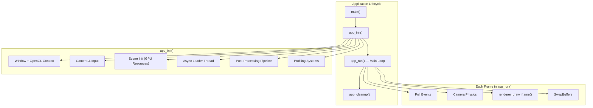

---

## Chapter 1 — The Entry Point

Everything begins in `main()` ([src/main.c](https://github.com/yoyonel/suckless-ogl/blob/master/src/main.c)):

```c
int main(int argc, char* argv[])
{
    tracy_manager_init_global();          // 1. Profiler bootstrap

    CliAction action = cli_handle_args(argc, argv);  // 2. CLI parsing
    if (action == CLI_ACTION_EXIT_SUCCESS) return EXIT_SUCCESS;
    if (action == CLI_ACTION_EXIT_FAILURE) return EXIT_FAILURE;

    // 3. Allocate the App structure (SIMD-aligned)
    App* app = (App*)platform_aligned_alloc(sizeof(App), SIMD_ALIGNMENT);
    *app = (App){0};

    // 4. Initialize everything
    if (!app_init(app, WINDOW_WIDTH, WINDOW_HEIGHT, "Icosphere Phong"))
        { app_cleanup(app); platform_aligned_free(app); return EXIT_FAILURE; }

    // 5. Run the main loop
    app_run(app);

    // 6. Teardown
    app_cleanup(app);
    platform_aligned_free(app);
    return EXIT_SUCCESS;
}
```

### Key Design Decisions

| Decision | Rationale |
|----------|-----------|
| **SIMD-aligned allocation** | The `App` struct contains `mat4`/`vec3` fields (via cglm) that benefit from 16-byte alignment for SSE/NEON vectorization |
| **Zero-initialization** `{0}` | Deterministic state — every pointer starts `NULL`, every flag starts `0` |
| **Tracy first** | The profiler must be initialized before any other subsystem to capture the full timeline |
| **Single `App` struct** | All application state lives in one contiguous allocation — cache-friendly, easy to pass around |

!!! info "Default Window Size"
    `WINDOW_WIDTH = 1920`, `WINDOW_HEIGHT = 1080` — configurable in `include/app_settings.h`.

---

## Chapter 2 — Opening a Window (GLFW + X11 + OpenGL)

The first real work happens in `window_create()` ([src/window.c](https://github.com/yoyonel/suckless-ogl/blob/master/src/window.c)).

### 2.1 — GLFW Initialization & Window Hints

```c
glfwInit();
glfwWindowHint(GLFW_CONTEXT_VERSION_MAJOR, 4);
glfwWindowHint(GLFW_CONTEXT_VERSION_MINOR, 4);          // OpenGL 4.4
glfwWindowHint(GLFW_OPENGL_PROFILE, GLFW_OPENGL_CORE_PROFILE);
glfwWindowHint(GLFW_OPENGL_DEBUG_CONTEXT, GL_TRUE);     // Debug messages
glfwWindowHint(GLFW_SAMPLES, DEFAULT_SAMPLES);           // MSAA = 1 (off)
```

Behind the scenes, GLFW performs an **X11 handshake**:

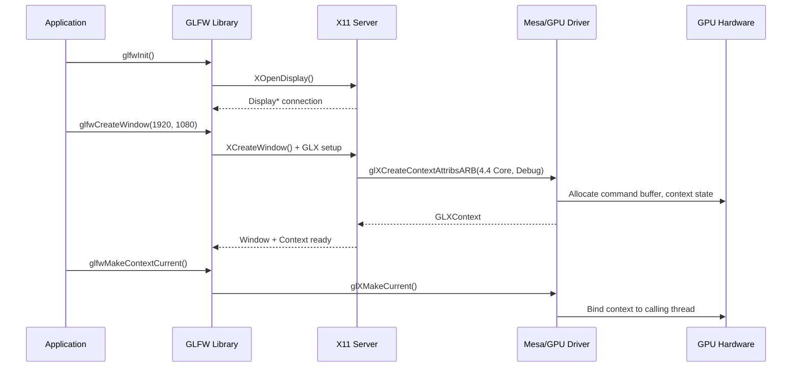

### 2.2 — GLAD: Loading OpenGL Function Pointers

```c
gladLoadGLLoader((GLADloadproc)glfwGetProcAddress);
```

OpenGL is **not a library** in the traditional sense — it's a specification. The actual function addresses live inside the GPU driver (Mesa, NVIDIA, AMD). GLAD queries each address at runtime via `glXGetProcAddress` and populates a table of function pointers. After this call, functions like `glCreateShader`, `glDispatchCompute`, etc. are usable.

### 2.3 — OpenGL Debug Context

```c
setup_opengl_debug();
```

This enables `GL_DEBUG_OUTPUT_SYNCHRONOUS` and registers a callback ([src/gl_debug.c](https://github.com/yoyonel/suckless-ogl/blob/master/src/gl_debug.c)) that intercepts every GL error, warning, and performance hint. A hash table deduplicates messages (log only first occurrence). Severity levels map to the project's logging system:

| GL Severity | App Level | Example |
|------------|-----------|---------|
| `HIGH` | `ERROR` | Invalid framebuffer, shader compile fail |
| `MEDIUM` | `WARNING` | Deprecated usage, slow path |
| `LOW` | `WARNING` | Performance hints |
| `NOTIFICATION` | `INFO` | Driver information |

### 2.4 — Input Callbacks & VSync

```c
glfwSwapInterval(0);                    // VSync OFF — unlimited FPS
glfwSetKeyCallback(app->window, key_callback);
glfwSetCursorPosCallback(app->window, mouse_callback);
glfwSetScrollCallback(app->window, scroll_callback);
glfwSetFramebufferSizeCallback(app->window, framebuffer_size_callback);
glfwSetInputMode(app->window, GLFW_CURSOR, GLFW_CURSOR_DISABLED);  // FPS-style
```

The cursor is captured in **relative mode** — mouse movements produce delta offsets for orbit camera control, not absolute screen coordinates.

---

## Chapter 3 — CPU-Side Initialization

Before touching the GPU, several CPU-side systems are bootstrapped.

### 3.1 — Camera

```c
camera_init(&app->camera, 20.0F, -90.0F, 0.0F);
```

The orbit camera starts at:

- **Distance**: 20 units from origin
- **Yaw**: −90° (looking along −Z)
- **Pitch**: 0° (horizon level)
- **FOV**: 60° vertical
- **Z-clip**: [0.1, 1000.0]

The camera uses a **fixed-timestep physics model** (60 Hz) with exponential smoothing for rotation. Mouse input is filtered through an EMA (Exponential Moving Average) to dampen jitter.

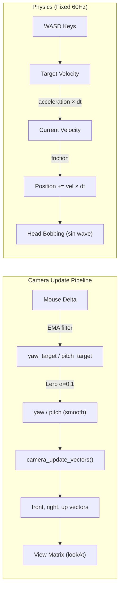

### 3.2 — Async Loader Thread

```c
app->async_loader = async_loader_create(&app->tracy_mgr);
```

A dedicated **POSIX thread** is spawned for background I/O. It sleeps on a condition variable (`pthread_cond_wait`) until work is queued. This prevents disk reads from stalling the render loop.

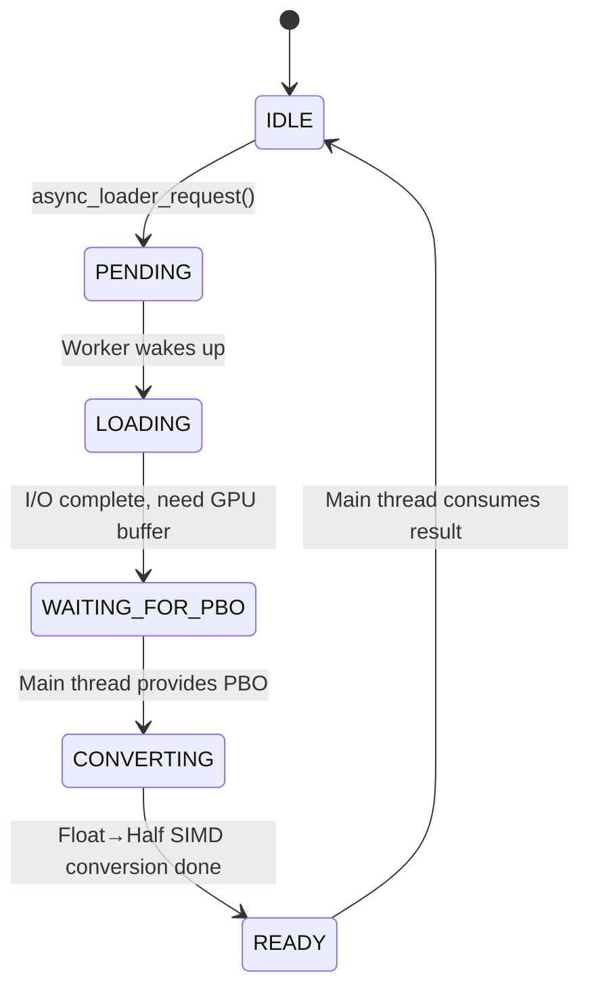

### 3.3 — Luminance Histogram Buffer

```c
app->lum_histogram_buffer = malloc(LUM_HISTOGRAM_MAP_SIZE *
                                    LUM_HISTOGRAM_MAP_SIZE * sizeof(float));
```

A 64×64 = 4,096-float CPU buffer for auto-exposure histogram readback. The GPU computes scene luminance, then asynchronously transfers the result back to CPU via PBO fences.

---

## Chapter 4 — Scene Initialization (The GPU Wakes Up)

`scene_init()` ([src/scene.c](https://github.com/yoyonel/suckless-ogl/blob/master/src/scene.c)) is where the GPU gets its first real work.

### 4.1 — Default Scene State

```c
scene->subdivisions    = 3;                     // Icosphere level 3
scene->wireframe       = 0;                     // Solid fill
scene->show_envmap     = 1;                     // Skybox visible
scene->billboard_mode  = 1;                     // Transparent spheres
scene->sorting_mode    = SORTING_MODE_GPU_BITONIC;  // GPU sorting
scene->gi_mode         = GI_MODE_OFF;           // No GI
scene->specular_aa_enabled = 1;                 // Curvature-based AA
```

### 4.2 — Dummy Textures & BRDF LUT

Two sentinel textures are created immediately — they serve as **fallbacks** whenever an IBL texture isn't ready yet:

```c
scene->dummy_black_tex = render_utils_create_color_texture(0.0, 0.0, 0.0, 0.0);  // 1×1 RGBA
scene->dummy_white_tex = render_utils_create_color_texture(1.0, 1.0, 1.0, 1.0);  // 1×1 RGBA
```

Then the **BRDF LUT** (Look-Up Table) is generated once, via compute shader:

```c
scene->brdf_lut_tex = build_brdf_lut_map(512);
```

| Property | Value |
|----------|-------|
| Size | 512 × 512 |
| Format | `GL_RG16F` (2 channels, 16-bit float each) |
| Content | Pre-integrated split-sum BRDF (Schlick-GGX) |
| Shader | `shaders/IBL/spbrdf.glsl` (compute) |
| Work groups | 16 × 16 (512/32 per axis) |

This texture maps `(NdotV, roughness)` → `(F0_scale, F0_bias)` and is used every frame by the PBR fragment shader to avoid expensive real-time BRDF integration.

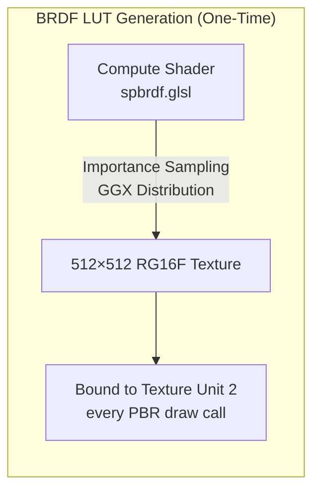

### 4.3 — HDR File Scanning

```c
scene_scan_hdr_files(scene);
```

Scans `assets/textures/hdr/*.hdr` for available environment maps. Files are sorted alphabetically and stored in `scene->hdr_files[]`. The default is `env.hdr`.

### 4.4 — Two Rendering Modes: Billboard Ray-Tracing vs. Icosphere Mesh

The engine supports two sphere rendering strategies. The **default** is billboard ray-tracing.

#### Default: Billboard + Per-Pixel Ray-Tracing (billboard_mode = 1)

Each sphere is rendered as a **single screen-aligned quad** (4 vertices, 2 triangles). The fragment shader performs an **analytical ray-sphere intersection** per pixel, producing mathematically perfect spheres with:

- Pixel-perfect silhouettes (no polygon faceting, ever)
- Correct per-pixel depth (`gl_FragDepth` written from the ray hit point)
- Analytically smooth normals (normalized `hitPos − center`)
- Edge anti-aliasing via smooth discriminant falloff
- True alpha transparency (glass-like, with back-to-front sorting)

The quad geometry is a simple unit quad (±0.5), but the vertex shader projects it to tightly enclose the sphere's screen-space bounding box via analytical tangent-line computation (see `computeBillboardSphere()` in `projection_utils.glsl`).

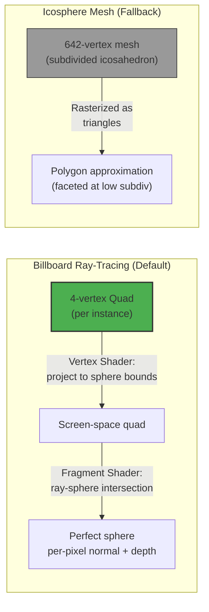

!!! tip "Why Billboard Ray-Tracing?"
    With 100 spheres, the billboard approach uses **100 × 4 = 400 vertices** total, versus **100 × 642 = 64,200 vertices** for level-3 icospheres. More importantly, the spheres are **mathematically perfect** at every zoom level — no tessellation artifacts.

#### Fallback: Instanced Icosphere Mesh (billboard_mode = 0)

The icosphere path generates a subdivided icosahedron mesh, used when billboard mode is disabled:

```c
icosphere_generate(&scene->geometry, INITIAL_SUBDIVISIONS);  // Level 3
```

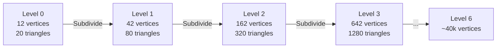

Each subdivision: split edges at midpoints, normalize onto unit sphere, cache midpoints via hash table. This path renders opaque, depth-tested spheres without sorting.

### 4.5 — GPU Buffers

```c
glGenVertexArrays(1, &scene->icosphere_vao);
glGenBuffers(1, &scene->icosphere_vbo);   // Positions
glGenBuffers(1, &scene->icosphere_nbo);   // Normals
glGenBuffers(1, &scene->icosphere_ebo);   // Indices (triangles)
```

Additional utility geometry is created:

| Buffer | Purpose | Vertex Count |
|--------|---------|--------------|
| `quad_vbo` | Fullscreen quad (post-process, skybox) | 6 (2 triangles) |
| `wire_quad_vbo` | Debug wireframe quad | 4 (line loop) |
| `wire_cube_vbo` | Debug bounding box | 24 (12 lines) |
| `empty_vao` | Attributeless draws (SSBO path) | 0 |

### 4.6 — Material Library

```c
scene->material_lib = material_load_presets("assets/materials/pbr_materials.json");
```

The JSON file defines **101 PBR material presets** organized by category:

| Category | Examples | Metallic | Roughness Range |
|----------|----------|----------|-----------------|
| **Pure Metals** | Gold, Silver, Copper, Chrome | 1.0 | 0.05–0.2 |
| **Weathered Metals** | Rusty Iron, Oxidized Copper | 0.7–0.95 | 0.4–0.8 |
| **Glossy Dielectrics** | Red/Blue/Green Plastic | 0.0 | 0.05–0.15 |
| **Matte Materials** | Fabric, Clay, Sand | 0.0 | 0.65–0.95 |
| **Stones & Minerals** | Granite, Marble, Obsidian | 0.0 | 0.35–0.85 |
| **Organics** | Oak, Leather, Bone | 0.0 | 0.35–0.75 |
| **Paint & Coatings** | Car Paint, Pearl, Satin | 0.3–0.7 | 0.1–0.5 |
| **Technical** | Rubber, Carbon, Ceramic | 0.0–0.1 | 0.05–0.85 |
| **Anodized/Patina** | Anodized Red, Tarnished Brass | 0.5–0.98 | 0.05–0.65 |

Each material provides: `albedo` (RGB), `metallic` (0–1), `roughness` (0–1).

### 4.7 — Instance Grid Setup

```c
// Grid configuration (from app_settings.h)
const int cols    = 10;       // DEFAULT_COLS
const float spacing = 2.5F;   // DEFAULT_SPACING
```

A **10×10 grid of 100 spheres** is laid out in the XY plane, centered at the origin:

```
Grid dimensions:
  Width  = (10 - 1) × 2.5 = 22.5 units
  Height = (10 - 1) × 2.5 = 22.5 units
  Z = 0 (all spheres in the same plane)

Position formula:
  x = (col × 2.5) − 11.25
  y = −((row × 2.5) − 11.25)

Camera at distance 20, looking at origin → sees entire grid
```

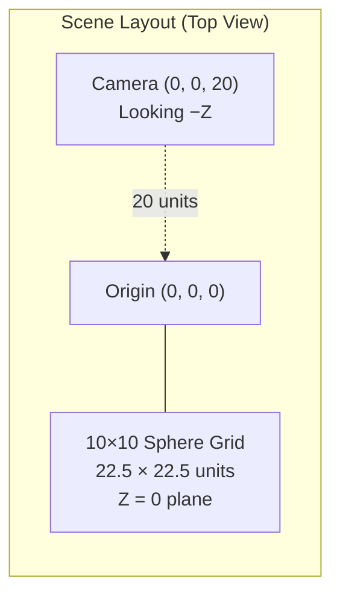

Each instance stores (defined in `include/sphere_types.h`):

```c
typedef struct SphereInstance {
    mat4  model;       // 64 bytes — 4×4 transform matrix
    vec3  albedo;      // 12 bytes — RGB color
    float metallic;    //  4 bytes
    float roughness;   //  4 bytes
    float ao;          //  4 bytes — always 1.0
    float padding;     //  4 bytes — alignment
    vec3  prev_center; // 12 bytes — previous frame center (motion blur)
} SphereInstance;      // Total: 128 bytes per instance (64-byte aligned)
```

Two rendering groups are created:

1. **`billboard_group`** ★ — **Default**: transparent billboard quads + per-pixel ray-tracing + back-to-front sorting
2. **`instanced_group`** — Fallback: opaque instanced icosphere mesh rendering (VAO with attribute divisors)

### 4.8 — VAO Layout (Billboard Mode — Default)

In billboard mode, the VAO binds a **4-vertex quad** and per-instance material data:

```
┌────────────────────────────────────────────────────────────────┐
│              Billboard VAO (Default Rendering Mode)            │
├────────────┬────────────┬─────────────────────────────────────┤
│  Location  │  Source    │  Description                        │
├────────────┼────────────┼─────────────────────────────────────┤
│  0         │  Quad VBO  │  vec3 position   (±0.5 quad verts)  │
│  1         │  Quad VBO  │  vec3 normal     (stub, unused)     │
│  2–5       │  Inst VBO  │  mat4 model      (per-instance)     │
│  6         │  Inst VBO  │  vec3 albedo     (per-instance)     │
│  7         │  Inst VBO  │  vec3 pbr (M,R,AO) (per-instance)   │
└────────────┴────────────┴─────────────────────────────────────┘

Location 0–1: glVertexAttribDivisor = 0 (advance per vertex, 4 verts)
Location 2–7: glVertexAttribDivisor = 1 (advance per instance)
```

The vertex shader extracts the sphere center and radius from the model matrix, then calls `computeBillboardSphere()` to project a tight screen-space bounding quad. The fragment shader ray-traces the actual sphere surface.

Draw call: `glDrawArraysInstanced(GL_TRIANGLE_STRIP, 0, 4, 100)` — 100 quads, face culling disabled.

### 4.9 — Light Probe Grid (Spherical Harmonics)

```c
light_probe_grid_init(&scene->probe_grid, 21, 21, 3);
```

A 21×21×3 voxel grid of Spherical Harmonics probes is allocated for optional Global Illumination. Each probe stores L0–L2 SH coefficients (7 textures, `GL_TEXTURE_3D`, `GL_RGBA16F`). The grid AABB is computed from the sphere positions.

### 4.10 — Shader Compilation

All shaders are compiled during `scene_init()`:

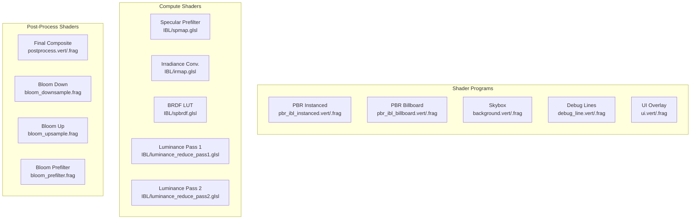

The shader loader ([src/shader.c](https://github.com/yoyonel/suckless-ogl/blob/master/src/shader.c)) supports a custom **`@header` include system**:

```glsl
// In pbr_ibl_instanced.frag:
@header "pbr_functions.glsl"
@header "sh_probe.glsl"
```

This recursively inlines files (max depth: 16), with include-guard deduplication. Uniform locations are cached after linking for fast runtime access.

---

## Chapter 5 — Post-Processing Pipeline Setup

```c
postprocess_init(&app->postprocess, &app->gpu_profiler, 1920, 1080);
```

### 5.1 — The Scene FBO (Multi-Render Target)

The core offscreen framebuffer uses **MRT** (Multiple Render Targets):

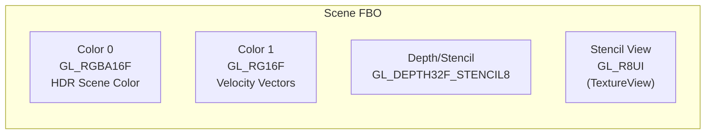

| Attachment | Format | Size | Purpose |
|-----------|--------|------|---------|
| `GL_COLOR_ATTACHMENT0` | `GL_RGBA16F` | 1920×1080 | HDR scene color (alpha = luma for FXAA) |
| `GL_COLOR_ATTACHMENT1` | `GL_RG16F` | 1920×1080 | Per-pixel velocity for motion blur |
| `GL_DEPTH_STENCIL_ATTACHMENT` | `GL_DEPTH32F_STENCIL8` | 1920×1080 | Depth buffer + stencil mask |
| Stencil view | `GL_R8UI` | 1920×1080 | Read-only stencil as texture (for post-process) |

### 5.2 — Sub-Effect Resources

Each post-processing effect initializes its own resources. Effects receive shared pipeline state through an `EffectContext` struct (source texture, viewport dimensions, depth/velocity textures, exposure) rather than a direct pointer to `PostProcess`. This seam decouples individual effects from the pipeline internals.

| Effect | GPU Resources |
|--------|--------------|
| **Bloom** | Mip-chain FBOs (6 levels), prefilter/downsample/upsample textures. `fx_bloom_render(BloomFX*, BloomParams*, EffectContext*)` |
| **DoF** | Blur texture, temp texture (ping-pong). `fx_dof_render(DoFFX*, DoFParams*, BloomFX*, EffectContext*)` — borrows bloom shaders for downsample/upsample |
| **Auto-Exposure** | Luminance downsample texture, 2× PBOs (readback), 2× GLSync fences. `fx_auto_exposure_render(AutoExposureFX*, AutoExposureParams*, EffectContext*)` |
| **Motion Blur** | Tile-max velocity texture (compute), neighbor-max texture (compute). `fx_motion_blur_render(MotionBlurFX*, EffectContext*)` |
| **3D LUT** | 32³ `GL_TEXTURE_3D` loaded from `.cube` files. `fx_lut3d_load_cube(LUT3DFX*, LUT3DParams*, const char*)` |

### 5.3 — UBO (Uniform Buffer Object)

All post-process parameters are packed into a single UBO:

```c
typedef struct PostProcessUBO {
    uint32_t active_effects;      // Bitmask of enabled effects
    float    time;                // Animated effects
    // Vignette, grain, white balance, color grading,
    // tonemapping curve, bloom intensity, DoF params...
} PostProcessUBO;
```

This is uploaded via `glBufferSubData` once per frame (or just the header if nothing changed), avoiding per-uniform `glUniform*` calls.

### 5.4 — Default Active Effects

```c
postprocess_enable(&app->postprocess, POSTFX_FXAA);  // Only FXAA enabled
```

On startup, only **FXAA** is active. Other effects (bloom, DoF, motion blur, grading…) are toggled at runtime via keyboard shortcuts.

---

## Chapter 6 — The First HDR Environment Load

```c
env_manager_load(&app->env_mgr, app->async_loader, "env.hdr");
```

This triggers the **asynchronous environment loading pipeline** — the most complex multi-frame operation in the engine.

### 6.1 — Async Loading Sequence

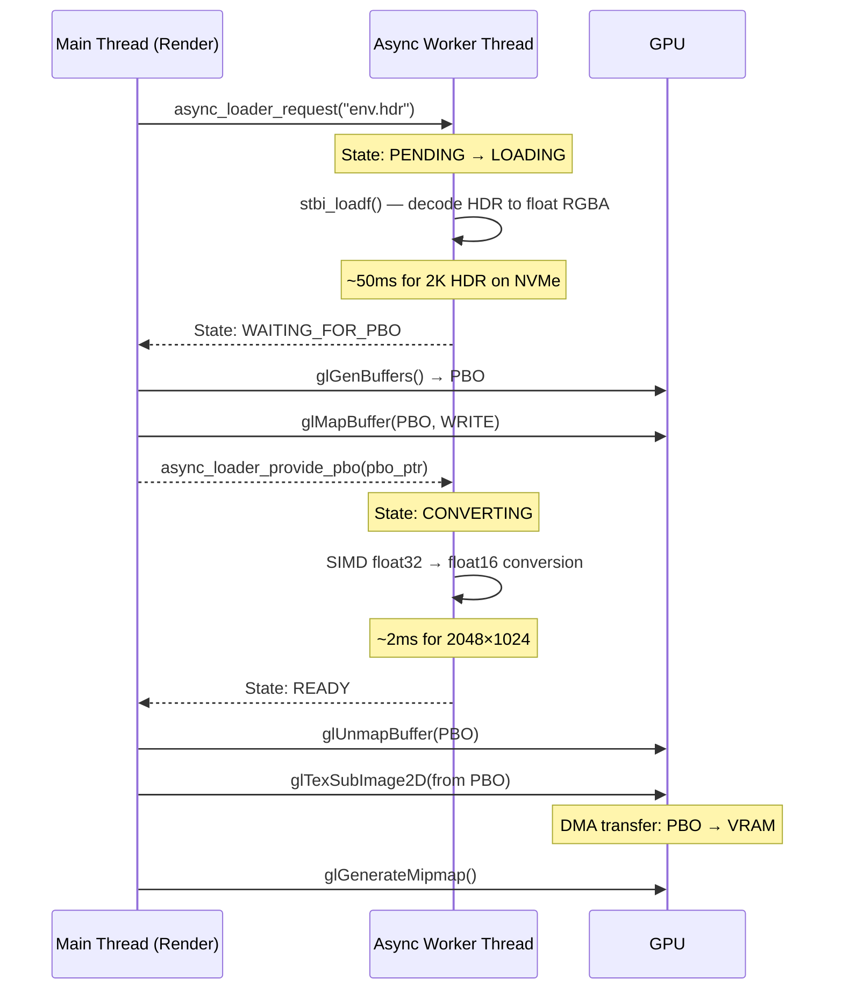

### 6.2 — Transition State Machine

During the first load, the screen stays **black** (no crossfade from a previous scene):

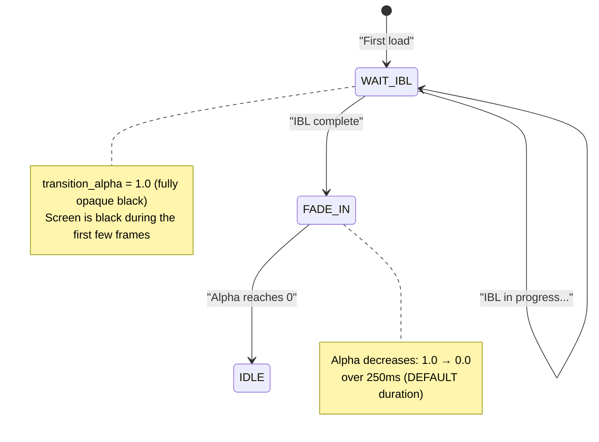

---

## Chapter 7 — IBL Generation (Progressive, Multi-Frame)

Once the HDR texture is uploaded, the **IBL Coordinator** ([src/ibl_coordinator.c](https://github.com/yoyonel/suckless-ogl/blob/master/src/ibl_coordinator.c)) takes over. It computes three maps across multiple frames to avoid GPU stalls.

### 7.1 — The Three IBL Maps

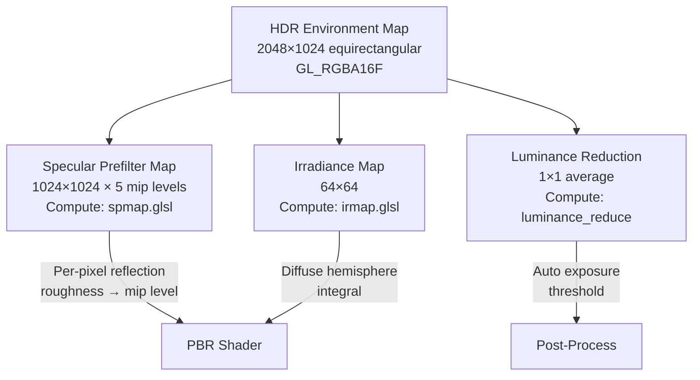

| Map | Resolution | Format | Mip Levels | Compute Shader |
|-----|-----------|--------|------------|----------------|
| **Specular Prefilter** | 1024×1024 | `GL_RGBA16F` | 5 | `IBL/spmap.glsl` |
| **Irradiance** | 64×64 | `GL_RGBA16F` | 1 | `IBL/irmap.glsl` |
| **Luminance** | 1×1 | `GL_R32F` | 1 | `IBL/luminance_reduce_pass1/2.glsl` |

### 7.2 — Progressive Slicing Strategy

To avoid frame spikes, each mip level is subdivided into **slices** processed over consecutive frames:

| IBL Stage | Hardware GPU | Software GPU (llvmpipe) |
|-----------|-------------|------------------------|
| Specular Mip 0 (1024²) | 24 slices (42 rows each) | 1 slice (full) |
| Specular Mip 1 (512²) | 8 slices | 1 slice |
| Specular Mips 2–4 | Grouped (1 dispatch) | 1 slice |
| Irradiance (64²) | 12 slices | 1 slice |
| Luminance | 2 dispatches (pass 1 + 2) | 2 dispatches |

```mermaid
gantt
    title IBL Progressive Generation Timeline
    dateFormat X
    axisFormat Frame %s

    section Luminance
    Luminance Pass 1      :lum1, 0, 1
    Luminance Wait (fence) :lum2, 1, 2
    Luminance Readback     :lum3, 2, 3

    section Specular Mip 0
    Slice 1/24            :s1, 3, 4
    Slice 2/24            :s2, 4, 5
    Slice ...             :s3, 5, 6
    Slice 24/24           :s4, 6, 7

    section Specular Mip 1
    Slice 1/8             :m1, 7, 8
    Slice 8/8             :m2, 8, 9

    section Specular Mips 2-4
    Grouped dispatch      :m3, 9, 10

    section Irradiance
    Slice 1/12            :i1, 10, 11
    Slice 12/12           :i2, 11, 12

    section Done
    IBL Complete → Fade In :done, 12, 13
```

### 7.3 — State Machine

```c
enum IBLState {
    IBL_STATE_IDLE,             // No work
    IBL_STATE_LUMINANCE,        // Pass 1: luminance reduction
    IBL_STATE_LUMINANCE_WAIT,   // Wait for readback fence
    IBL_STATE_SPECULAR_INIT,    // Allocate specular texture
    IBL_STATE_SPECULAR_MIPS,    // Progressive mip generation
    IBL_STATE_IRRADIANCE,       // Progressive irradiance conv.
    IBL_STATE_DONE              // All maps ready
};
```

---

## Chapter 8 — The Main Loop

`app_run()` ([src/app.c](https://github.com/yoyonel/suckless-ogl/blob/master/src/app.c)) is the heartbeat — a classic **uncapped game loop** with fixed-timestep physics.


### 8.1 — Deferred Resize

```c
if (app->resize_pending) {
    postprocess_resize(&app->postprocess, app->pending_width, app->pending_height);
    app->resize_pending = 0;
}
```

Window resize events are **deferred** — the GLFW callback only records the new dimensions. The actual FBO recreation happens at the start of the next frame, outside the callback's limited context.

### 8.2 — Camera Fixed-Timestep Integration

```c
app->camera.physics_accumulator += (float)app->delta_time;
while (app->camera.physics_accumulator >= app->camera.fixed_timestep) {
    camera_fixed_update(&app->camera);  // Velocity, friction, bobbing
    app->camera.physics_accumulator -= app->camera.fixed_timestep;
}

// Smooth rotation (exponential interpolation)
float alpha = app->camera.rotation_smoothing;  // ~0.1
app->camera.yaw   += (app->camera.yaw_target   - app->camera.yaw)   * alpha;
app->camera.pitch += (app->camera.pitch_target - app->camera.pitch) * alpha;
camera_update_vectors(&app->camera);
```

This ensures deterministic physics regardless of frame rate, while rotation stays smooth via per-frame interpolation.

---

## Chapter 9 — Rendering a Frame

`renderer_draw_frame(const RenderContext* ctx)` ([src/renderer.c](https://github.com/yoyonel/suckless-ogl/blob/master/src/renderer.c)) orchestrates the full rendering pipeline for each frame. It receives a single `RenderContext` struct containing all per-frame state (scene, camera, postprocess, profiler, dimensions, etc.) instead of individual parameters, decoupling the renderer from the `App` God Object.

### 9.1 — High-Level Frame Architecture

```mermaid
graph TB
    subgraph "renderer_draw_frame()"
        A["GPU Profiler Begin"] --> B
        B["postprocess_begin()<br/>Bind Scene FBO<br/>Clear color/depth/stencil"] --> C

        subgraph "View Setup"
            C["camera_get_view_matrix()"]
            C --> D["glm_perspective()<br/>FOV=60°, near=0.1, far=1000"]
            D --> E["ViewProj = Proj × View"]
            E --> F["InvViewProj = inverse(ViewProj)"]
        end

        F --> G["scene_render()"]

        subgraph "scene_render()"
            G --> G1["Skybox Pass<br/>(depth disabled)"]
            G1 --> G2["Sphere Sorting<br/>(GPU Bitonic)"]
            G2 --> G3["PBR Sphere Pass<br/>(instanced draw)"]
        end

        G3 --> H["postprocess_end()<br/>7-Stage Pipeline"]
        H --> I["UI Overlay<br/>+ Env Transition"]
    end
```

### 9.2 — Pass 1: Skybox

The skybox is drawn **first**, with depth testing **disabled**. It uses a fullscreen quad trick:

```glsl
// background.vert
gl_Position = vec4(in_position.xy, 1.0, 1.0);  // Depth = 1.0 (far plane)
vec4 pos = m_inv_view_proj * vec4(in_position.xy, 1.0, 1.0);
RayDir = pos.xyz / pos.w;  // Reconstruct world-space ray
```

```glsl
// background.frag
vec2 uv = SampleEquirectangular(normalize(RayDir));
vec3 envColor = textureLod(environmentMap, uv, blur_lod).rgb;
// NaN protection + clamping to prevent fireflies
envColor = clamp(envColor, vec3(0.0), vec3(200.0));
FragColor = vec4(envColor, luma);  // Alpha = luma for FXAA
VelocityOut = vec2(0.0);          // No motion for skybox
```

The equirectangular projection maps a 2D HDR image onto the full sphere of directions using `atan`/`asin`.

### 9.3 — Pass 2: Sphere Sorting (GPU Bitonic Sort)

For transparent billboard rendering, spheres must be drawn **back-to-front**. The default sorting mode is **GPU Bitonic Sort**:

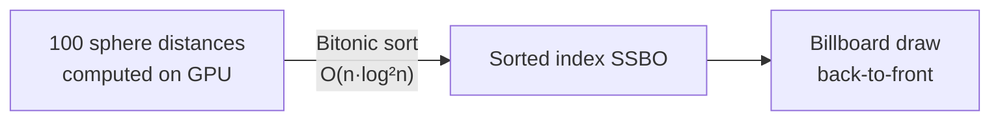

Three sorting modes are available:

| Mode | Where | Algorithm | Complexity |
|------|-------|-----------|------------|
| `CPU_QSORT` | CPU | `qsort()` (stdlib) | O(n·log n) avg |
| `CPU_RADIX` | CPU | Radix sort | O(n·k) |
| `GPU_BITONIC` ★ | GPU | Bitonic merge sort (compute) | O(n·log²n) |

### 9.4 — Pass 3: PBR Spheres — Billboard Ray-Tracing (Default)

This is the core rendering pass. In the default billboard mode, each sphere is a **4-vertex quad** whose fragment shader performs **per-pixel ray-sphere intersection**.

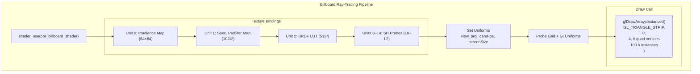

**A single draw call renders all 100 spheres** — with alpha blending enabled, back-to-front order.

| Metric | Value |
|--------|-------|
| Vertices per sphere | **4** (billboard quad) |
| Triangles per sphere | 2 (triangle strip) |
| Instances | 100 (10×10 grid) |
| **Total vertices** | **400** |
| **Draw calls** | **1** |
| Sphere precision | **Mathematically perfect** (ray-traced) |

### 9.5 — The Billboard Fragment Shader (Ray-Sphere Intersection)

The fragment shader (`pbr_ibl_billboard.frag`) is where the real magic happens. Instead of shading a rasterized triangle mesh, it **analytically intersects a ray with a perfect sphere**:

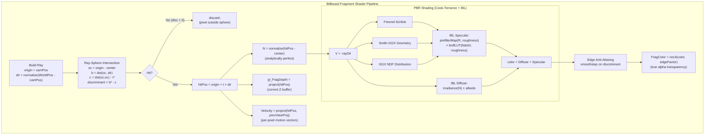

#### Key Shader Details

**Ray-Sphere Intersection** (analytical, no mesh needed):

```glsl
vec3 oc = rayOrigin - center;
float b = dot(oc, rayDir);
float c = dot(oc, oc) - radius * radius;
float discriminant = b * b - c;  // >0 = hit, <0 = miss
if (discriminant < 0.0) discard;
float t = -b - sqrt(discriminant);  // nearest intersection
vec3 hitPos = rayOrigin + t * rayDir;
vec3 N = normalize(hitPos - center);  // perfect analytic normal
```

**Depth Correction** — the billboard quad is flat, but the sphere has depth. The shader writes the true projected depth of the ray hit point:

```glsl
vec4 clipPosActual = projection * view * vec4(sphereHitPos, 1.0);
gl_FragDepth = /* NDC depth from clipPosActual */;
```

**Edge Anti-Aliasing** — smooth sphere edges without MSAA, using the discriminant as a distance-to-edge metric:

```glsl
float pixelSizeWorld = (2.0 * clipW) / (proj[1][1] * screenHeight);
float edgeFactor = smoothstep(0.0, 1.0, discriminant / (2.0 * radius * pixelSizeWorld));
FragColor = vec4(color * edgeFactor, edgeFactor);  // premultiplied alpha
```

**Billboard Projection** — the vertex shader computes a tight screen-space bounding quad via analytical tangent-line projection (`computeBillboardSphere()` in `projection_utils.glsl`), handling three cases:

| Camera Position | Billboard Strategy |
|----------------|--------------------|
| Outside sphere | Tight quad from tangent projection |
| Inside sphere | Fullscreen quad (entire screen ray-traced) |
| Behind camera | Culled (off-screen position) |

!!! info "Fallback: Icosphere Mesh Path"
    When `billboard_mode = 0`, the engine falls back to `glDrawElementsInstanced()` with the icosphere mesh (642 vertices × 100 instances = 128K triangles). This path is opaque, depth-tested, and does not require sorting. It uses `pbr_ibl_instanced.vert/.frag` with vertex normals from the mesh.

---

## Chapter 10 — Post-Processing Pipeline

After the 3D scene is rendered into the MRT FBO, `postprocess_end()` applies up to **8 effects** in a carefully ordered pipeline.

### 10.1 — The 7-Stage Pipeline


### 10.2 — Texture Unit Map

| Unit | Texture | Format | Used By |
|------|---------|--------|---------|
| 0 | Scene Color | `GL_RGBA16F` | FXAA, tonemapping, all effects |
| 1 | Bloom | `GL_RGBA16F` | Bloom composite |
| 2 | Scene Depth | `GL_DEPTH32F_STENCIL8` | DoF (CoC), fog |
| 3 | Auto-Exposure | `GL_R32F` | Tonemapping exposure |
| 4 | Velocity | `GL_RG16F` | Motion blur |
| 5 | Neighbor Max Velocity | `GL_RG16F` | Motion blur |
| 6 | DoF Blur | `GL_RGBA16F` | Depth of field composite |
| 7 | Stencil View | `GL_R8UI` | Object mask (stencil-based effects) |
| 8 | 3D LUT | `GL_RGB16F` | Color grading |

### 10.3 — Shader Optimization

The post-process fragment shader uses **compile-time #defines** to eliminate branches:

```glsl
#ifdef OPT_ENABLE_BLOOM
    color += bloomTexture * bloomIntensity;
#endif

#ifdef OPT_ENABLE_FXAA
    color = fxaa(color, uv, texelSize);
#endif
```

A 32-entry **LRU cache** stores compiled shader variants for different effect flag combinations. Switching effects triggers lazy recompilation only on the first occurrence of a new combination.

---

## Chapter 11 — The First Visible Frame

Let's trace what actually appears on screen during the first seconds:

### Frames 1–2: Black Screen

- `transition_alpha = 1.0` → full black overlay
- The scene FBO is cleared but covered by the transition
- The async loader is reading `env.hdr` from disk

### Frames 3–4: HDR Upload

- PBO → GPU texture transfer (DMA)
- Mipmap generation
- Still black (transition blocks view)

### Frames 5–15: IBL Computation

- Luminance reduction (2 frames)
- Specular prefilter (progressive slices, ~8–10 frames)
- Irradiance convolution (~2–3 frames)
- Still black screen, but spheres are being drawn into the FBO

### Frame ~16: Fade In Begins

```c
mgr->transition_state = TRANSITION_FADE_IN;
```

- `transition_alpha` decreases from 1.0 → 0.0 over 250ms
- The fully-lit PBR scene becomes visible
- Spheres reflect the environment, BRDF creates realistic metallic/dielectric responses

### Frame ~20+: Steady State

The transitions complete, and each frame now follows the steady-state pipeline:

```
┌──────────────────────────────────────────────────────┐
│                STEADY-STATE FRAME                     │
│                                                       │
│  1. Poll Events          (~0.1ms CPU)                │
│  2. Camera Update        (~0.01ms CPU)               │
│  3. Scene Render                                      │
│     a. Skybox            (~0.2ms GPU)                │
│     b. Bitonic Sort      (~0.1ms GPU, compute)       │
│     c. Billboard Spheres (~0.5ms GPU, 100 ray-traced │
│        quads, 1 draw call, perfect spheres)           │
│  4. Post-Processing                                   │
│     a. Bloom             (~0.3ms GPU, if enabled)    │
│     b. DoF               (~0.2ms GPU, if enabled)    │
│     c. Auto-Exposure     (~0.1ms GPU)                │
│     d. Motion Blur       (~0.2ms GPU, if enabled)    │
│     e. Final Composite   (~0.3ms GPU)                │
│  5. UI Overlay           (~0.1ms GPU)                │
│  6. SwapBuffers          (wait for display)           │
│                                                       │
│  Typical frame time: 1–3ms GPU                       │
│  (depending on effects enabled and GPU)              │
└──────────────────────────────────────────────────────┘
```

---

## Chapter 12 — GPU Memory Budget

Here's an estimate of VRAM consumption at steady state:

### Textures

| Resource | Resolution | Format | Size |
|----------|-----------|--------|------|
| HDR Environment | 2048×1024 | `GL_RGBA16F` | ~16 MB (with mips) |
| Specular Prefilter | 1024² × 5 mips | `GL_RGBA16F` | ~10.5 MB |
| Irradiance | 64×64 | `GL_RGBA16F` | ~32 KB |
| BRDF LUT | 512×512 | `GL_RG16F` | ~1 MB |
| Scene Color (FBO) | 1920×1080 | `GL_RGBA16F` | ~16 MB |
| Velocity (FBO) | 1920×1080 | `GL_RG16F` | ~8 MB |
| Depth/Stencil (FBO) | 1920×1080 | `GL_DEPTH32F_STENCIL8` | ~10 MB |
| Bloom chain (6 mips) | Various | `GL_RGBA16F` | ~21 MB |
| DoF blur | 1920×1080 | `GL_RGBA16F` | ~16 MB |
| Auto-Exposure | 64×64 → 1×1 | `GL_R32F` | ~16 KB |
| SH Probes (7 textures) | 21×21×3 | `GL_RGBA16F` | ~74 KB |
| Dummy textures (2) | 1×1 | `GL_RGBA8` | ~8 B |

### Buffers

| Resource | Count | Size Each | Total |
|----------|-------|-----------|-------|
| Billboard quad VBO | 4 verts | 12 B (vec3) | 48 B |
| Icosphere VBO (fallback) | 642 verts | 12 B (vec3) | ~7.5 KB |
| Icosphere NBO (fallback) | 642 verts | 12 B (vec3) | ~7.5 KB |
| Icosphere EBO (fallback) | 3840 indices | 4 B (uint) | ~15 KB |
| Instance VBO | 100 instances | ~88 B | ~8.6 KB |
| Sort SSBO | 100 entries | 8 B | ~800 B |
| Screen quad VBO | 6 verts | 20 B | 120 B |
| UBO (post-process) | 1 | ~256 B | 256 B |
| PBO (readback) × 2 | 2 | 4 B | 8 B |
| PBO (histogram) × 2 | 2 | 16 KB | 32 KB |

### Total VRAM Estimate

| Category | Approximate |
|----------|------------|
| Textures | ~99 MB |
| Buffers | ~40 KB |
| Shaders (compiled) | ~2 MB |
| **Total** | **~101 MB VRAM** |

!!! note "Dominant Cost"
    The HDR environment map + bloom chain + scene FBOs dominate VRAM usage. The geometry itself (100 billboard quads × 4 vertices in default mode) is negligible — the real sphere computation happens in the fragment shader via ray-tracing.

---

## Appendix A — Complete Initialization Sequence (Ordered)

```
 1.  tracy_manager_init_global()         — Profiler bootstrap
 2.  cli_handle_args()                   — Parse CLI
 3.  platform_aligned_alloc(App)          — Allocate App (SIMD-aligned)
 4.  app_binding_registry_init()          — F2 help system
 5.  camera_init(20, -90°, 0°)           — Orbit camera
 6.  window_create(1920, 1080)            — GLFW + X11 + OpenGL 4.4
 7.  gladLoadGLLoader()                   — Load GL function pointers
 8.  setup_opengl_debug()                 — Debug message callback
 9.  glfwSwapInterval(0)                  — Disable VSync
10.  Register input callbacks              — Key, mouse, scroll, resize
11.  tracy_manager_init()                  — GPU profiling
12.  async_coordinator_init()              — PBO double-buffer state
13.  malloc(histogram buffer)              — 64×64 float buffer
14.  async_loader_create()                 — Spawn worker thread
15.  scene_init()
     a. scene_init_state()                — Default flags
     b. scene_init_core_shaders()          — PBR, skybox, debug shaders
     c. render_utils_create_empty_vao()    — For SSBO path
     d. scene_init_billboard_shader()      — Billboard vertex/fragment
     e. Utility geometry                   — Quad, wire cube, wire quad
     f. skybox_init()                      — Skybox VAO + uniforms
     g. icosphere_init/generate(3)         — 642 verts, 1280 tris
     h. GL buffer creation                 — VBO, NBO, EBO
     i. material_load_presets()            — 101 PBR materials from JSON
     j. scene_init_compute_resources()     — IBL compute shaders
     k. light_probe_grid_init(21,21,3)     — SH probe grid
     l. scene_init_instanced_shader()      — Instanced attributes
     m. Debug uniform locations             — Line shader cache
     n. Dummy textures (black, white)       — 1×1 fallbacks
     o. BRDF LUT (512²)                    — Compute shader, one-time
     p. scene_init_instancing()             — 10×10 grid, 100 spheres
     q. Billboard group + sphere sorter     — Transparent path
     r. Probe grid AABB + async SH update  — GI preparation
16. env_manager_load("env.hdr")            — Queue async HDR load
17. glEnable(GL_DEPTH_TEST)                — Global GL state
18. fps_init()                             — FPS counter (EMA)
19. postprocess_init(1920, 1080)           — Scene FBO, bloom, DoF, etc.
20. postprocess_enable(FXAA)               — Default effect
21. perf_mode_init()                       — Performance mode
22. gpu_profiler_init()                    — GPU timing queries
23. effect_benchmark_init()                — FX benchmarking
```

---

## Appendix B — Key Source Files Reference

| File | Role |
|------|------|
| `src/main.c` | Entry point, lifecycle management |
| `src/app.c` | `app_init()`, `app_run()`, `app_cleanup()` |
| `src/window.c` | GLFW + OpenGL context creation |
| `src/scene.c` | Scene state, geometry, instancing, render passes |
| `src/renderer.c` | Frame orchestration (`renderer_draw_frame`, `RenderContext`) |
| `src/skybox.c` | Equirectangular environment rendering |
| `src/postprocess.c` | Full post-processing pipeline (7 stages) |
| `src/icosphere.c` | Recursive icosphere mesh generation |
| `src/shader.c` | Shader compilation with `@header` includes |
| `src/texture.c` | HDR texture loading, PBO upload, mipmaps |
| `src/env_manager.c` | Environment transition state machine |
| `src/ibl_coordinator.c` | Progressive IBL generation (specular, irradiance) |
| `src/pbr.c` | BRDF LUT generation, PBR uniform helpers |
| `src/material.c` | Material library (JSON loading) |
| `include/sphere_types.h` | Canonical `SphereInstance` type definition |
| `src/instanced_rendering.c` | VAO/VBO instanced draw management |
| `src/billboard_rendering.c` | Billboard quads for transparent spheres |
| `src/billboard_sorting.c` | CPU/GPU transparency sorting |
| `src/async_loader.c` | Background I/O thread (pthread) |
| `src/camera.c` | Orbit camera, fixed-timestep physics |
| `src/gl_debug.c` | OpenGL debug message callback |
| `include/app_settings.h` | All configuration constants |

---

## Appendix C — Rendering Pipeline Data Flow

```mermaid
graph TB
    subgraph "CPU (per frame)"
        POLL["glfwPollEvents()"] --> TIME["Δt calculation"]
        TIME --> CAM["Camera physics<br/>(fixed 60Hz)"]
        CAM --> SORT["Sphere sorting<br/>(GPU dispatch)"]
    end

    subgraph "GPU Pass 1: Scene"
        FBO["Bind Scene FBO<br/>Clear (0,0,0,1)"]
        FBO --> SKY["Skybox Pass<br/>Fullscreen quad<br/>Equirectangular sampling"]
        SKY --> STENCIL["Enable Stencil"]
        STENCIL --> SPHERES["Billboard Ray-Trace Pass<br/>1 draw call, 100 instances<br/>4 verts/quad, perfect spheres<br/>per-pixel intersection + depth"]
    end

    subgraph "GPU Pass 2: Post-Process"
        BLOOM["Bloom<br/>Downsample → Upsample"]
        DOF["Depth of Field<br/>CoC → Blur"]
        EXPO["Auto-Exposure<br/>Luminance reduction"]
        MBLUR["Motion Blur<br/>Velocity field"]
        BLOOM --> COMP
        DOF --> COMP
        EXPO --> COMP
        MBLUR --> COMP
        COMP["Final Composite<br/>9 texture units<br/>UBO parameters<br/>Fullscreen quad draw"]
    end

    subgraph "GPU Pass 3: UI"
        UI["Text Overlay<br/>Profiler Timeline<br/>Env Transition"]
    end

    SORT --> FBO
    SPHERES --> BLOOM
    COMP --> UI
    UI --> SWAP["glfwSwapBuffers()"]
```
