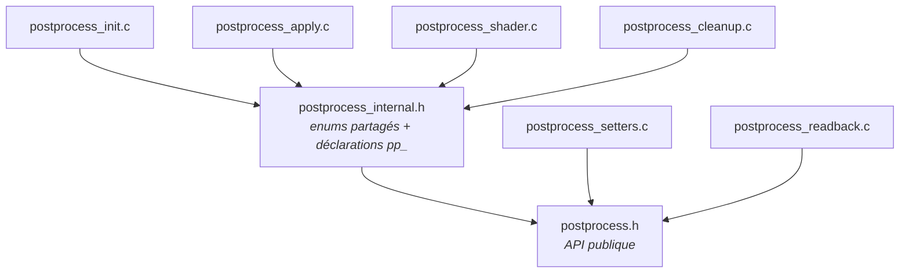

# Architecture de l'application

Ce document décrit l'architecture modulaire de l'application après le refactoring de `app.c`.

## Vue d'ensemble du refactoring

Le fichier monolithique `app.c` a été décomposé en modules cohérents. Chaque module a une responsabilité claire et des interfaces bien définies.

## Modules

### `app_ui` — Interface utilisateur

Gère l'affichage de la superposition d'informations, du clavier interactif et des métriques de performance.

**Responsabilités :**
- Rendu des textes et des indicateurs visuels
- Gestion de la disposition du clavier
- Affichage de la Timeline GPU

### `app_input` — Gestion des entrées

Traite les événements clavier et souris via les callbacks GLFW. Utilise `AppInputContext` (bundle de pointeurs ciblés) pour se découpler de l'objet God `App`, suivant le même pattern que `PostProcessInputContext`.

**Responsabilités :**
- Dispatch des commandes depuis les frappes clavier
- Gestion des modes modificateurs (Shift, Alt)
- Mode Dry-Run pour l'exploration des raccourcis

### `app_env` — Environnement HDR

Coordonne le chargement des cartes d'environnement et la transition entre elles.

**Responsabilités :**
- Chargement asynchrone des HDR
- Génération des cartes IBL (irradiance, spéculaire préfiltrée)
- Transitions (fondu enchaîné, écran noir)

### `app_scene` — Scène et primitives

Gère les objets de la scène, leur tri et leur rendu.

**Responsabilités :**
- Gestion des sphères (création, mise à jour, tri)
- Appel des passes de rendu (géométrie, skybox, post-traitement)
- Coordination du profiler GPU

## Propriété des données

La structure `App` reste le point d'entrée central. Elle possède tous les sous-systèmes et leur passe des pointeurs selon le besoin.

```
App
├── AppUI          (rendu de l'interface)
├── AppInput       (événements et raccourcis)
├── AppEnv         (environnement HDR)
├── AppScene       (scène 3D)
├── GPUProfiler    (métriques temporelles GPU)
├── AsyncLoader    (chargement asynchrone)
└── PostProcess    (effets de post-traitement)
    └── EffectContext  (seam vers les effets individuels)
```

### Décomposition de Scene

La structure `Scene` est entièrement décomposée en six sous-structs par domaine, chacune dans son propre header :

- **`SceneGPUResources`** (`include/scene_gpu_resources.h`) : tous les handles de ressources GPU — 28 GLuint pour textures, buffers, VAOs, programmes compute, plus le billboard UBO et les caches de binding IBL/SH. Accès via `scene->gpu.hdr_texture`, `scene->gpu.icosphere_vbo`, etc.
- **`SceneShaders`** (`include/scene_shaders.h`) : tous les pointeurs de shaders — `pbr_instanced`, `pbr_billboard`, `debug`, `debug_line`, `skybox` (+ conditionnel `pbr_ssbo`). Accès via `scene->shaders.pbr_instanced`, etc.
- **`SceneConfig`** (`include/scene_config.h`) : configuration runtime — `wireframe`, `billboard_mode`, `sorting_mode`, `pbr_debug_mode`, `show_envmap`, `env_lod`, `subdivisions`, `gi_mode`, `show_probe_grid`, `specular_aa_enabled`, `aa_mode`. Définit aussi les enums `SortingMode`, `GIMode`, `AAMode`. Accès via `scene->config.wireframe`, etc.
- **`SceneVisuals`** (`include/scene_visuals.h`) : effets visuels — `Skybox`, `TrailRenderer`, `ShockwaveRenderer`. Accès via `scene->visuals.skybox`, etc.
- **`SceneSimulation`** (`include/scene_simulation.h`) : état N-body — `NBodySim`, `nbody_mode`. Accès via `scene->simulation.nbody_sim`, etc.
- **`SceneLighting`** (`include/scene_lighting.h`) : IBL, probes et matériaux — `IBLCoordinator`, `LightProbeGrid`, `MaterialLib*`. Accès via `scene->lighting.ibl_coord`, etc.

Cela réduit le nombre de champs directs de `Scene` de ~50 à ~19 et déplace les définitions de types par domaine hors du monolithique `scene.h`.

### Décomposition de App (AppProfiling, AppInput, AppWindow)

La structure `App` est décomposée en sous-structs par domaine :

- **`AppProfiling`** (`include/app_profiling.h`) : regroupe le profiling et les métriques — `GPUProfiler`, `GPUProfilerUI`, `FpsCounter`, `TracyManager`, `GPUUsageMonitor`, `PerfModeContext`, `perf_mode_active`, `log_gpu_metrics`. Accès via `app->profiling->gpu_profiler`, etc. Init/cleanup délégués à `app_profiling_init()` / `app_profiling_cleanup()` dans `src/app_profiling.c`.
- **`AppInput`** (`include/app_input_state.h`) : regroupe la caméra, le gamepad, les raccourcis clavier et le lissage d'entrée — `Camera`, `GamepadState`, `AppBindingRegistry`, `AdaptiveSampler`, `camera_enabled`. Accès via `app->input->camera`, etc. Init/cleanup délégués à `app_input_state_init()` / `app_input_state_cleanup()` dans `src/app_input_state.c`.
- **`AppWindow`** (`include/app_window.h`) : regroupe le handle de fenêtre GLFW et tout l'état fenêtre/resize — `GLFWwindow* handle`, `is_fullscreen`, `saved_x/y`, `saved_width/height`, `resize_pending`, `pending_width/height`. Accès via `app->win.handle`, `app->win.is_fullscreen`, etc.

> **Note de nommage** : `app_input_state.h` héberge la définition de la sous-struct `AppInput`, tandis que le fichier existant `app_input.h` héberge le seam `AppInputContext` (bundle de pointeurs ciblés pour les handlers d'entrée, issue #204).

Cela réduit le nombre de champs directs de `App` de 24 à ~17. Chaque header de sous-struct possède ses dépendances de type et ses fonctions de délégation, gardant `app.c` focalisé sur l'orchestration.

### Décomposition du header PostProcess

Les définitions de types de `PostProcess` sont décomposées en cinq sous-headers, suivant le même pattern que la décomposition de Scene. `postprocess.h` (648 → 330 lignes) ne contient plus que la struct agrégat `PostProcess`, l'enum `PostProcessEffect`, `PostProcessPreset` et les signatures de fonctions.

- **`pp_params.h`** : les 10 structs de paramètres des effets uber-shader (`VignetteParams`, `GrainParams`, `ExposureParams`, `ChromAbberationParams`, `WhiteBalanceParams`, `ColorGradingParams`, `TonemapParams`, `FXAAParams`, `BandingParams`, `FogParams`) plus l'enum `BandingMode` et les valeurs `DEFAULT_*`. Les effets avec leur propre pipeline multi-pass (`BloomParams`, `DoFParams`, `AutoExposureParams`, `MotionBlurParams`, `LUT3DParams`) vivent dans leurs headers `fx_*.h` respectifs.
- **`pp_ubo.h`** : layout GPU `PostProcessUBO` (std140) — correspond au UBO du uber-shader GLSL.
- **`pp_gpu_resources.h`** : struct `PPGPUResources` — FBOs, textures, handle UBO, quad écran.
- **`pp_shader_state.h`** : `PPShaderState` + `ShaderCacheEntry` — état de compilation et cache de shaders.
- **`pp_exposure_readback.h`** : struct `PPExposureReadback` — readback PBO asynchrone pour l'auto-exposition et l'histogramme.

### Découpage des unités de traduction PostProcess

Le monolithique `postprocess.c` (1634 lignes) est découpé en six unités de traduction ciblées par domaine, chacune sous 360 lignes :

| UT | Lignes | Responsabilité |
|----|--------|----------------|
| `postprocess_init.c` | 358 | Initialisation, création des framebuffers, redimensionnement, textures factices |
| `postprocess_apply.c` | 360 | Passes de rendu begin/end, synchronisation UBO, passes bloom/DoF/AE/MB/composite |
| `postprocess_setters.c` | 268 | Enable/disable/toggle, setters de paramètres, application de presets |
| `postprocess_shader.c` | 223 | Recherche dans le cache de shaders, compilation optimisée, switching dynamique |
| `postprocess_readback.c` | 199 | Readback PBO, calcul d'histogramme, luminance, mise à jour des matrices |
| `postprocess_cleanup.c` | 97 | Libération des ressources (FBOs, quad, buffers de readback, cache de shaders) |



**Header interne** `postprocess_internal.h` fournit :

- Les enums d'unités de texture (`POSTPROCESS_TEX_UNIT_SCENE`, `_BLOOM`, `_DOF`, etc.)
- Les déclarations de fonctions internes préfixées `pp_` partagées entre les UT (ex. `pp_create_framebuffer`, `pp_destroy_framebuffer`, `pp_setup_sampler_uniforms`, `pp_update_current_shader`, `pp_is_shader_in_cache`)
- Inclus uniquement par les UT nécessitant l'état interne partagé ; `postprocess_setters.c` et `postprocess_readback.c` n'ont besoin que du `postprocess.h` public

### Extraction du cache d'uniformes Scene

Les structs de cache d'uniformes shader (`InstancedUniforms`, `DebugUniforms`, `BillboardUBO`, `BillboardUniforms`, `MAT4_FLOAT_COUNT`) sont extraites de `scene.h` (194 → 120 lignes) vers `scene_uniforms.h`. Ce sont des détails d'implémentation GPU accessibles uniquement par `scene_render.c` et `scene_init.c`. La struct `Scene` conserve ses champs d'uniformes par valeur ; les définitions de types sont simplement déplacées vers un sous-header ciblé.

### Privatisation des données de layout UI

Les données de layout statiques (tableau `KEY_LAYOUT_QWERTY[]` de 66 entrées, tableau `GAMEPAD_LAYOUT[]` de 16 entrées, ~60 constantes visuelles, définitions des structs `KeyPos`/`GamepadControlPos`) sont déplacées de `app_ui.h` (387 → 128 lignes) vers `app_ui.c`. Le header public n'expose plus que `HelpMode`, `AppUIOverlay` et 8 signatures de fonctions. Cela élimine la duplication des tableaux `static const` entre les unités de traduction et rend les modifications de layout locales à la recompilation.

### Seam GamepadContext

Le `GamepadContext` (`include/gamepad_context.h`) découple `gamepad_input.c` de `camera.h` :

- Contient uniquement la tranche minimale d'état caméra nécessaire pour l'entrée gamepad : `move_input[3]`, `yaw_target`, `pitch_target`, `fixed_timestep`, limites de pitch.
- `gamepad_write_input()` prend `GamepadContext*` au lieu de `Camera*`.
- Pattern bridge : `Camera ↔ GamepadContext` au site d'appel dans `app.c`.

### Découplage des effets (EffectContext)

Les effets de post-traitement (bloom, DoF, auto-exposition, flou de mouvement, LUT, LUT viz) sont entièrement découplés de l'objet God `PostProcess` via un seam `EffectContext` :

- **`EffectContext`** (`include/effects/effect_context.h`) : snapshot read-only de l'état partagé du pipeline (texture source, dimensions viewport, textures profondeur/vélocité, exposition).
- Les effets reçoivent `(FX*, Params*, const EffectContext*)` au lieu de `PostProcess*`.
- Cela élimine la dépendance bidirectionnelle : `postprocess.h` → `fx_*.h` (pour l'embedding des structs) reste, mais `fx_*.c` → `postprocess.h` est supprimé.
- Tous les effets sont désormais entièrement migrés : **bloom**, **DoF**, **auto-exposition**, **flou de mouvement**, **LUT 3D** et **LUT viz**. Plus aucun fichier source d'effet n'inclut `postprocess.h`.

### Nettoyage des dépendances d'en-têtes (env_manager.h, renderer.h)

Deux en-têtes de modules transportaient des includes transitifs inutiles, augmentant le couplage et le coût de recompilation :

- **`env_manager.h`** : incluait `postprocess.h` alors qu'il n'utilise que `PostProcess*` dans les signatures de fonctions. Remplacé par une déclaration anticipée `typedef struct PostProcess PostProcess;`. L'include concret reste dans `env_manager.c` qui appelle `postprocess_set_exposure_target()`.
- **`renderer.h`** : incluait 9 en-têtes projet (`action_notifier.h`, `camera.h`, `effect_benchmark.h`, `env_manager.h`, `gpu_profiler.h`, `gpu_profiler_ui.h`, `postprocess.h`, `scene.h`, `ui.h`) alors que `RenderContext` ne contient que des pointeurs. Tous remplacés par des déclarations anticipées. Seuls `<stdbool.h>` et `<stdint.h>` restent comme includes concrets. Le fichier `.c` inclut les en-têtes complets nécessaires.

### Réduction du fan-out d'includes (app_input.c, app_ui.c)

Les deux fichiers sources avec le plus haut fan-out d'includes ont été allégés en déplaçant la fonction pont `app_input_ctx_from_app()` vers `app.c` et en supprimant les includes inutilisés ou transitivement redondants :

- **`app_input.c`** : 25 → 17 includes. La fonction pont était la seule raison d'inclure `app.h`, `app_profiling.h` et `app_input_state.h`. Son déplacement vers `app.c` (qui inclut déjà ces trois en-têtes) élimine le couplage. Suppressions additionnelles : `window.h` (jamais utilisé), `action_notifier.h`, `app_settings.h`, `nbody.h`, `glad/glad.h`, `GLFW/glfw3.h` (tous disponibles transitivement).
- **`app_ui.c`** : 23 → 16 includes. Suppression de `stb_image.h` (aucun appel `stbi_*`), `<stdio.h>` et `<stdlib.h>` (aucune utilisation directe), plus 4 en-têtes transitivement redondants (`action_notifier.h`, `adaptive_sampler.h`, `app_binding.h`, `app_settings.h`).

**Principe** : un en-tête qui n'utilise un type qu'à travers un pointeur ou une référence doit faire une déclaration anticipée de ce type, pas inclure sa définition complète. Cela réduit la propagation des includes et accélère les builds incrémentaux.

## Configuration CMake

Les modules sont compilés séparément et liés à l'exécutable principal :

```cmake
target_sources(app PRIVATE
    src/app.c
    src/app_ui.c
    src/app_input.c
    src/app_env.c
    src/app_scene.c
)
```

Chaque module expose son interface via un en-tête dans `include/` avec le préfixe correspondant (`app_ui.h`, `app_input.h`, etc.).

## Métriques & Santé

> Dernière mise à jour : avril 2026 (Phase 10 — Architecture Deepening V)

### Taille du codebase

| Catégorie | Fichiers | LOC total |
|-----------|----------:|----------:|
| Sources (`src/*.c`) | 66 | 20 556 |
| En-têtes (`include/*.h`) | 87 | 7 839 |
| Tests (`tests/test_*.c`) | 69 | 12 666 |
| Shaders (`shaders/`) | 60 | — |

### LOC par module (top 15)

| Module | LOC | Notes |
|--------|----:|-------|
| `postprocess.c` | 1 634 | Monolithe historique — découpé en 6 UT (voir Découpage PostProcess) |
| `app_ui.c` | 1 317 | Rendu UI + données de layout (privatisées) |
| `app_input.c` | 925 | Dispatch entrées clavier/souris |
| `ui.c` | 879 | Intégration Dear ImGui |
| `shader.c` | 870 | Compilation & édition de liens shaders |
| `light_probes.c` | 752 | Grille de sondes lumineuses |
| `postprocess_presets.c` | 525 | Définitions de presets |
| `scene_render.c` | 494 | Appels de rendu de la scène |
| `postprocess_input.c` | 486 | Contrôles clavier post-process |
| `nbody.c` | 486 | Simulation N-body (CPU + compute) |
| `scene_init.c` | 476 | Création des ressources scène |
| `app.c` | 474 | Orchestrateur (boucle principale) |
| `billboard_sorting.c` | 472 | Tri en profondeur des billboards |
| `ibl_coordinator.c` | 443 | Machine d'état IBL |
| `async_loader.c` | 422 | Chargement HDR asynchrone |

**Règle** : les modules > 500 LOC sont candidats à une décomposition ultérieure.

### Fan-out d'includes des en-têtes

| En-tête | #includes | Statut |
|---------|----------:|--------|
| `scene.h` | 14 | Agrégat — attendu |
| `app.h` | 13 | Réduit de 22 (Phase 3) |
| `postprocess.h` | 11 | Agrégat — attendu |
| `app_profiling.h` | 7 | Sous-struct — acceptable |
| `gpu_profiler.h` | 7 | En-tête de domaine |
| `utils.h` | 7 | Utilitaires divers |
| `renderer.h` | 0 | Déclarations anticipées uniquement ✅ |

**Principe** : les en-têtes agrégats (`app.h`, `scene.h`, `postprocess.h`) ont naturellement un fan-out élevé. Les en-têtes de modules feuilles doivent rester ≤ 5.

### Couverture de test (LLVM-Cov, avril 2026)

| Métrique | Valeur | Cible |
|----------|-------:|------:|
| Lignes | 66,6 % | ≥ 78 % |
| Fonctions | 83,1 % | ≥ 85 % |
| Branches | 53,6 % | ≥ 50 % ✅ |

68 tests passent (unitaires + intégration, CTest).

## Graphe de dépendances include

Dépendances des modules principaux (en-têtes projet uniquement, hors système et vendeur) :

```mermaid
graph TD
    classDef aggregate fill:#1a1b26,stroke:#e0af68,color:#e0af68,stroke-width:2
    classDef substruct fill:#1a1b26,stroke:#7aa2f7,color:#7aa2f7
    classDef leaf fill:#1a1b26,stroke:#9ece6a,color:#9ece6a
    classDef effect fill:#1a1b26,stroke:#bb9af7,color:#bb9af7

    APP[app.h]:::aggregate
    SCENE[scene.h]:::aggregate
    PP[postprocess.h]:::aggregate
    REND[renderer.h]:::leaf

    %% Sous-structs App
    APP_PROF[app_profiling.h]:::substruct
    APP_INP[app_input_state.h]:::substruct
    APP_WIN[app_window.h]:::substruct
    APP_UI[app_ui.h]:::substruct

    %% Sous-structs Scene
    SC_GPU[scene_gpu_resources.h]:::substruct
    SC_SH[scene_shaders.h]:::substruct
    SC_CFG[scene_config.h]:::substruct
    SC_VIS[scene_visuals.h]:::substruct
    SC_SIM[scene_simulation.h]:::substruct
    SC_LIT[scene_lighting.h]:::substruct

    %% Sous-headers PostProcess
    PP_PAR[pp_params.h]:::substruct
    PP_GPU[pp_gpu_resources.h]:::substruct
    PP_SHD[pp_shader_state.h]:::substruct
    PP_RDB[pp_exposure_readback.h]:::substruct

    %% Effets
    FX_BL[fx_bloom.h]:::effect
    FX_DOF[fx_dof.h]:::effect
    FX_AE[fx_auto_exposure.h]:::effect
    FX_MB[fx_motion_blur.h]:::effect
    FX_LUT[fx_lut3d.h]:::effect
    EC[effect_context.h]:::effect

    %% App → dépendances directes
    APP --> SCENE
    APP --> PP
    APP --> APP_UI
    APP --> APP_WIN

    %% Sous-structs App (possédées, pas incluses par app.h)
    APP -.->|"possédée"| APP_PROF
    APP -.->|"possédée"| APP_INP

    %% Scene → sous-structs
    SCENE --> SC_GPU
    SCENE --> SC_SH
    SCENE --> SC_CFG
    SCENE --> SC_VIS
    SCENE --> SC_SIM
    SCENE --> SC_LIT

    %% PostProcess → sous-headers + effets
    PP --> PP_PAR
    PP --> PP_GPU
    PP --> PP_SHD
    PP --> PP_RDB
    PP --> FX_BL
    PP --> FX_DOF
    PP --> FX_AE
    PP --> FX_MB
    PP --> FX_LUT

    %% Découplage des effets
    FX_BL -.->|"runtime"| EC
    FX_DOF -.->|"runtime"| EC
    FX_AE -.->|"runtime"| EC
    FX_MB -.->|"runtime"| EC
    FX_LUT -.->|"runtime"| EC

    %% Renderer utilise uniquement des déclarations anticipées
    REND -.->|"décl. anticipée"| APP
    REND -.->|"décl. anticipée"| SCENE
    REND -.->|"décl. anticipée"| PP
```



**Légende** : Flèches pleines = dépendance `#include`. Flèches pointillées = déclaration anticipée ou dépendance runtime. Couleurs : 🟡 agrégat, 🔵 sous-struct, 🟢 feuille, 🟣 effet.
