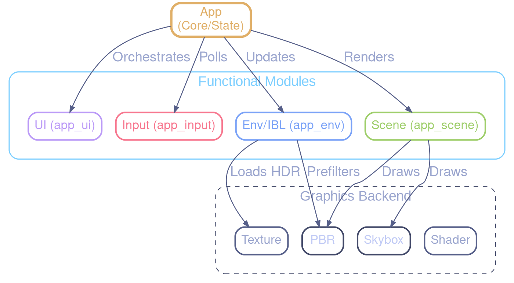
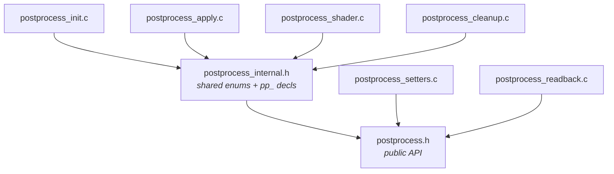

# Architecture Documentation - Refactoring Core

This document describes the architectural changes made during the `app.c` refactoring.

## Overview

The monolithic `app.c` has been split into several specialized modules to improve maintainability, reduce compilation times, and clarify responsibilities.

### Modules

| Module | Responsibility |
| :--- | :--- |
| `app.c` / `app.h` | Orchestrator: Initialization, main loop, high-level render pass management. |
| `app_ui.c` / `app_ui.h` | UI Rendering: Overlays, help screens, debug text, histograms, and loading spinners. |
| `app_input.c` / `app_input.h` | Input Handling: Keyboard callbacks, mouse/scroll events, and post-process feature toggles. Uses `AppInputContext` (focused pointer bundle) to decouple from the `App` God Object, following the same pattern as `PostProcessInputContext`. |
| `app_env.c` / `app_env.h` | Environment & IBL: HDR file scanning, asynchronous loading, and the IBL state machine. |
| `app_scene.c` / `app_scene.h` | Scene Rendering: Billboard groups, instanced groups, and procedural geometry updates. |

## Architecture Diagram

## Data Ownership

The `App` struct (defined in `app.h`) remains the central state container. Most modules take a pointer to `App` as their first argument.

To avoid cyclic dependencies:
- Core struct definitions (`App`, `Camera`, `AsyncRequest`) use named structs instead of anonymous ones to support forward declarations.
- Module headers are included at the **end** of `app.h` to ensure they can see the full `App` definition if necessary (though they primarily use pointers).
- Specialized source files (`.c`) include `app.h` and the required renderer headers directly.

### Scene Decomposition

The `Scene` struct is fully decomposed into six domain-aligned sub-structs, each in its own header:

- **`SceneGPUResources`** (`include/scene_gpu_resources.h`): All GPU resource handles — 28 GLuint handles for textures, buffers, VAOs, compute programs, plus billboard UBO and IBL/SH binding caches. Access via `scene->gpu.hdr_texture`, `scene->gpu.icosphere_vbo`, etc.
- **`SceneShaders`** (`include/scene_shaders.h`): All shader pointers — `pbr_instanced`, `pbr_billboard`, `debug`, `debug_line`, `skybox` (+ conditional `pbr_ssbo`). Access via `scene->shaders.pbr_instanced`, etc.
- **`SceneConfig`** (`include/scene_config.h`): Runtime configuration — `wireframe`, `billboard_mode`, `sorting_mode`, `pbr_debug_mode`, `show_envmap`, `env_lod`, `subdivisions`, `gi_mode`, `show_probe_grid`, `specular_aa_enabled`, `aa_mode`. Also defines `SortingMode`, `GIMode`, `AAMode` enums. Access via `scene->config.wireframe`, etc.
- **`SceneVisuals`** (`include/scene_visuals.h`): Visual effects — `Skybox`, `TrailRenderer`, `ShockwaveRenderer`. Access via `scene->visuals.skybox`, etc.
- **`SceneSimulation`** (`include/scene_simulation.h`): N-body state — `NBodySim`, `nbody_mode`. Access via `scene->simulation.nbody_sim`, etc.
- **`SceneLighting`** (`include/scene_lighting.h`): IBL, probes, and materials — `IBLCoordinator`, `LightProbeGrid`, `MaterialLib*`. Access via `scene->lighting.ibl_coord`, etc.

This reduces `Scene`'s direct field count from ~50 to ~19 and moves domain-specific type definitions out of the monolithic `scene.h`.

### App Decomposition (AppProfiling, AppInput, AppWindow)

The `App` struct is decomposed into domain-aligned sub-structs:

- **`AppProfiling`** (`include/app_profiling.h`): Groups profiling and metrics — `GPUProfiler`, `GPUProfilerUI`, `FpsCounter`, `TracyManager`, `GPUUsageMonitor`, `PerfModeContext`, `perf_mode_active`, `log_gpu_metrics`. Access via `app->profiling->gpu_profiler`, etc. Init/cleanup delegated to `app_profiling_init()` / `app_profiling_cleanup()` in `src/app_profiling.c`.
- **`AppInput`** (`include/app_input_state.h`): Groups camera, gamepad, key-bindings, and input smoothing — `Camera`, `GamepadState`, `AppBindingRegistry`, `AdaptiveSampler`, `camera_enabled`. Access via `app->input->camera`, etc. Init/cleanup delegated to `app_input_state_init()` / `app_input_state_cleanup()` in `src/app_input_state.c`.
- **`AppWindow`** (`include/app_window.h`): Groups GLFW window handle and all window/resize state — `GLFWwindow* handle`, `is_fullscreen`, `saved_x/y`, `saved_width/height`, `resize_pending`, `pending_width/height`. Access via `app->win.handle`, `app->win.is_fullscreen`, etc.

> **Naming note**: `app_input_state.h` hosts the `AppInput` sub-struct definition, while the existing `app_input.h` hosts the `AppInputContext` seam (focused pointer bundle for input handlers, issue #204).

This reduces `App`'s direct field count from 24 to ~17. Each sub-struct header owns its type dependencies and its delegation functions, keeping `app.c` focused on orchestration.

### PostProcess Header Decomposition

The `PostProcess` struct's type definitions are decomposed into five sub-headers, following the same pattern as the Scene decomposition. `postprocess.h` (648 → 330 lines) now only contains the aggregate `PostProcess` struct, `PostProcessEffect` enum, `PostProcessPreset`, and function signatures.

- **`pp_params.h`**: All 10 uber-shader effect parameter structs (`VignetteParams`, `GrainParams`, `ExposureParams`, `ChromAbberationParams`, `WhiteBalanceParams`, `ColorGradingParams`, `TonemapParams`, `FXAAParams`, `BandingParams`, `FogParams`) plus the `BandingMode` enum and `DEFAULT_*` values. Effects with their own multi-pass pipeline (`BloomParams`, `DoFParams`, `AutoExposureParams`, `MotionBlurParams`, `LUT3DParams`) live in their respective `fx_*.h` headers.
- **`pp_ubo.h`**: GPU-side `PostProcessUBO` layout (std140) — matches the GLSL uber-shader UBO.
- **`pp_gpu_resources.h`**: `PPGPUResources` struct — FBOs, textures, UBO handle, screen quad.
- **`pp_shader_state.h`**: `PPShaderState` + `ShaderCacheEntry` — shader compilation and caching state.
- **`pp_exposure_readback.h`**: `PPExposureReadback` struct — async PBO readback for auto-exposure and histogram.

### PostProcess Translation-Unit Split

The monolithic `postprocess.c` (1634 lines) is split into six domain-focused translation units, each under 360 lines:

| TU | Lines | Responsibility |
|----|-------|----------------|
| `postprocess_init.c` | 358 | Initialization, framebuffer creation, resize, dummy textures |
| `postprocess_apply.c` | 360 | Begin/end render pass, UBO sync, bloom/DoF/AE/MB/composite passes |
| `postprocess_setters.c` | 268 | Enable/disable/toggle, parameter setters, preset application |
| `postprocess_shader.c` | 223 | Shader cache lookup, optimized compile, dynamic switching |
| `postprocess_readback.c` | 199 | PBO readback, histogram computation, luminance, matrix updates |
| `postprocess_cleanup.c` | 97 | Resource teardown (FBOs, quad, readback buffers, shader cache) |

**Internal header** `postprocess_internal.h` provides:

- Texture unit enums (`POSTPROCESS_TEX_UNIT_SCENE`, `_BLOOM`, `_DOF`, etc.)
- `pp_`-prefixed internal function declarations shared across TUs (e.g. `pp_create_framebuffer`, `pp_destroy_framebuffer`, `pp_setup_sampler_uniforms`, `pp_update_current_shader`, `pp_is_shader_in_cache`)
- Only included by TUs that need shared internal state; `postprocess_setters.c` and `postprocess_readback.c` only need the public `postprocess.h`

### Scene Uniform Cache Extraction

Shader uniform cache structs (`InstancedUniforms`, `DebugUniforms`, `BillboardUBO`, `BillboardUniforms`, `MAT4_FLOAT_COUNT`) are extracted from `scene.h` (194 → 120 lines) into `scene_uniforms.h`. These are GPU implementation details only accessed by `scene_render.c` and `scene_init.c`. The `Scene` struct retains its by-value uniform fields; the type definitions simply move to a focused sub-header.

### UI Layout Data Privatization

Static layout data (66-entry `KEY_LAYOUT_QWERTY[]`, 16-entry `GAMEPAD_LAYOUT[]`, ~60 visual constants, `KeyPos`/`GamepadControlPos` struct definitions) is moved from `app_ui.h` (387 → 128 lines) into `app_ui.c`. The public header now exposes only `HelpMode`, `AppUIOverlay`, and 8 function signatures. This eliminates duplicated `static const` arrays across translation units and makes layout changes recompile-local.

### GamepadContext Seam

The `GamepadContext` (`include/gamepad_context.h`) decouples `gamepad_input.c` from `camera.h`:

- Contains only the minimal camera state slice needed for gamepad input: `move_input[3]`, `yaw_target`, `pitch_target`, `fixed_timestep`, pitch limits.
- `gamepad_write_input()` takes `GamepadContext*` instead of `Camera*`.
- Bridge pattern: `Camera ↔ GamepadContext` at the call site in `app.c`.

### Effect Decoupling (EffectContext)

Post-processing effects (bloom, DoF, auto-exposure, motion blur, LUT, LUT viz) are fully decoupled from the `PostProcess` God Object via an `EffectContext` seam:

- **`EffectContext`** (`include/effects/effect_context.h`): Read-only snapshot of shared pipeline state (source texture, viewport dimensions, depth/velocity textures, exposure).
- Effects receive `(FX*, Params*, const EffectContext*)` instead of `PostProcess*`.
- This eliminates the bidirectional dependency: `postprocess.h` → `fx_*.h` (for struct embedding) remains, but `fx_*.c` → `postprocess.h` is removed.
- All effects are now fully migrated: **bloom**, **DoF**, **auto-exposure**, **motion blur**, **LUT 3D**, and **LUT viz**. No effect source file includes `postprocess.h` anymore.

### Header Dependency Cleanup (env_manager.h, renderer.h)

Two module headers carried unnecessary transitive includes, increasing coupling and recompilation cost:

- **`env_manager.h`**: Previously included `postprocess.h` even though it only uses `PostProcess*` in function signatures. Replaced with a forward declaration `typedef struct PostProcess PostProcess;`. The concrete include stays in `env_manager.c` which calls `postprocess_set_exposure_target()`.
- **`renderer.h`**: Previously included 9 project headers (`action_notifier.h`, `camera.h`, `effect_benchmark.h`, `env_manager.h`, `gpu_profiler.h`, `gpu_profiler_ui.h`, `postprocess.h`, `scene.h`, `ui.h`) even though `RenderContext` holds only pointers. All replaced with forward declarations. Only `<stdbool.h>` and `<stdint.h>` remain as concrete includes. The `.c` file includes the full headers it needs.

**Principle**: A header that only uses a type through a pointer or reference should forward-declare that type, not include its full definition. This reduces include fan-out and speeds up incremental builds.

## Build System

The `CMakeLists.txt` has been updated to include the new source files. The `app` executable and `test_app` integration test both link against the new modular structure.

## Performance Impact

- **Compilation**: Parallel compilation is now more effective as changes to UI don't require re-compiling the IBL logic.
- **Runtime**: Zero overhead, as functions are simply moved into separate translation units. Inlining is still possible for performance-critical functions if they were moved to headers (though not currently required).
