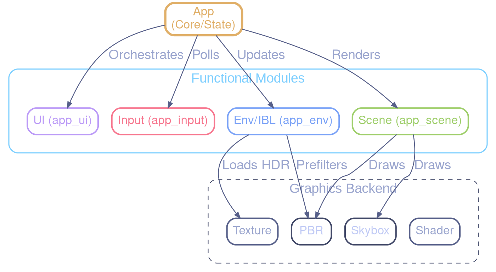

# Architecture Documentation - Refactoring Core

This document describes the architectural changes made during the `app.c` refactoring.

## Overview

The monolithic `app.c` has been split into several specialized modules to improve maintainability, reduce compilation times, and clarify responsibilities.

### Modules

| Module | Responsibility |
| :--- | :--- |
| `app.c` / `app.h` | Orchestrator: Initialization, main loop, high-level render pass management. |
| `app_ui.c` / `app_ui.h` | UI Rendering: Overlays, help screens, debug text, histograms, and loading spinners. |
| `app_input.c` / `app_input.h` | Input Handling: Keyboard callbacks, mouse/scroll events, and post-process feature toggles. Uses `AppInputContext` (focused pointer bundle) to decouple from the `App` God Object, following the same pattern as `PostProcessInputContext`. |
| `app_env.c` / `app_env.h` | Environment & IBL: HDR file scanning, asynchronous loading, and the IBL state machine. |
| `app_scene.c` / `app_scene.h` | Scene Rendering: Billboard groups, instanced groups, and procedural geometry updates. |

## Architecture Diagram

## Data Ownership

The `App` struct (defined in `app.h`) remains the central state container. Most modules take a pointer to `App` as their first argument.

To avoid cyclic dependencies:
- Core struct definitions (`App`, `Camera`, `AsyncRequest`) use named structs instead of anonymous ones to support forward declarations.
- Module headers are included at the **end** of `app.h` to ensure they can see the full `App` definition if necessary (though they primarily use pointers).
- Specialized source files (`.c`) include `app.h` and the required renderer headers directly.

### Scene Decomposition

The `Scene` struct is fully decomposed into six domain-aligned sub-structs, each in its own header:

- **`SceneGPUResources`** (`include/scene_gpu_resources.h`): All GPU resource handles — 28 GLuint handles for textures, buffers, VAOs, compute programs, plus billboard UBO and IBL/SH binding caches. Access via `scene->gpu.hdr_texture`, `scene->gpu.icosphere_vbo`, etc.
- **`SceneShaders`** (`include/scene_shaders.h`): All shader pointers — `pbr_instanced`, `pbr_billboard`, `debug`, `debug_line`, `skybox` (+ conditional `pbr_ssbo`). Access via `scene->shaders.pbr_instanced`, etc.
- **`SceneConfig`** (`include/scene_config.h`): Runtime configuration — `wireframe`, `billboard_mode`, `sorting_mode`, `pbr_debug_mode`, `show_envmap`, `env_lod`, `subdivisions`, `gi_mode`, `show_probe_grid`, `specular_aa_enabled`, `aa_mode`. Also defines `SortingMode`, `GIMode`, `AAMode` enums. Access via `scene->config.wireframe`, etc.
- **`SceneVisuals`** (`include/scene_visuals.h`): Visual effects — `Skybox`, `TrailRenderer`, `ShockwaveRenderer`. Access via `scene->visuals.skybox`, etc.
- **`SceneSimulation`** (`include/scene_simulation.h`): N-body state — `NBodySim`, `nbody_mode`. Access via `scene->simulation.nbody_sim`, etc.
- **`SceneLighting`** (`include/scene_lighting.h`): IBL, probes, and materials — `IBLCoordinator`, `LightProbeGrid`, `MaterialLib*`. Access via `scene->lighting.ibl_coord`, etc.

This reduces `Scene`'s direct field count from ~50 to ~19 and moves domain-specific type definitions out of the monolithic `scene.h`.

### App Decomposition (AppProfiling, AppInput, AppWindow)

The `App` struct is decomposed into domain-aligned sub-structs:

- **`AppProfiling`** (`include/app_profiling.h`): Groups profiling and metrics — `GPUProfiler`, `GPUProfilerUI`, `FpsCounter`, `TracyManager`, `GPUUsageMonitor`, `PerfModeContext`, `perf_mode_active`, `log_gpu_metrics`. Access via `app->profiling->gpu_profiler`, etc. Init/cleanup delegated to `app_profiling_init()` / `app_profiling_cleanup()` in `src/app_profiling.c`.
- **`AppInput`** (`include/app_input_state.h`): Groups camera, gamepad, key-bindings, and input smoothing — `Camera`, `GamepadState`, `AppBindingRegistry`, `AdaptiveSampler`, `camera_enabled`. Access via `app->input->camera`, etc. Init/cleanup delegated to `app_input_state_init()` / `app_input_state_cleanup()` in `src/app_input_state.c`.
- **`AppWindow`** (`include/app_window.h`): Groups GLFW window handle and all window/resize state — `GLFWwindow* handle`, `is_fullscreen`, `saved_x/y`, `saved_width/height`, `resize_pending`, `pending_width/height`. Access via `app->win.handle`, `app->win.is_fullscreen`, etc.

> **Naming note**: `app_input_state.h` hosts the `AppInput` sub-struct definition, while the existing `app_input.h` hosts the `AppInputContext` seam (focused pointer bundle for input handlers, issue #204).

This reduces `App`'s direct field count from 24 to ~17. Each sub-struct header owns its type dependencies and its delegation functions, keeping `app.c` focused on orchestration.

### PostProcess Decomposition (PPGPUResources, PPShaderState, PPExposureReadback)

The `PostProcess` struct is decomposed into three domain-aligned sub-structs:

- **`PPGPUResources`** (`postprocess.h`): All GPU resource handles — FBOs, textures, PBOs, histogram SSBOs. Access via `postprocess.gpu.scene_fbo`, etc.
- **`PPShaderState`** (`postprocess.h`): Shader programs and compilation state — shader IDs, optimization flags. Access via `postprocess.shaders.program`, etc.
- **`PPExposureReadback`** (`postprocess.h`): Async exposure readback state — PBO handles, fence, readback index. Access via `postprocess.readback.histogram_pbo`, etc.

### GamepadContext Seam

The `GamepadContext` (`include/gamepad_context.h`) decouples `gamepad_input.c` from `camera.h`:

- Contains only the minimal camera state slice needed for gamepad input: `move_input[3]`, `yaw_target`, `pitch_target`, `fixed_timestep`, pitch limits.
- `gamepad_write_input()` takes `GamepadContext*` instead of `Camera*`.
- Bridge pattern: `Camera ↔ GamepadContext` at the call site in `app.c`.

### Effect Decoupling (EffectContext)

Post-processing effects (bloom, DoF, auto-exposure, motion blur, LUT, LUT viz) are fully decoupled from the `PostProcess` God Object via an `EffectContext` seam:

- **`EffectContext`** (`include/effects/effect_context.h`): Read-only snapshot of shared pipeline state (source texture, viewport dimensions, depth/velocity textures, exposure).
- Effects receive `(FX*, Params*, const EffectContext*)` instead of `PostProcess*`.
- This eliminates the bidirectional dependency: `postprocess.h` → `fx_*.h` (for struct embedding) remains, but `fx_*.c` → `postprocess.h` is removed.
- All effects are now fully migrated: **bloom**, **DoF**, **auto-exposure**, **motion blur**, **LUT 3D**, and **LUT viz**. No effect source file includes `postprocess.h` anymore.

## Build System

The `CMakeLists.txt` has been updated to include the new source files. The `app` executable and `test_app` integration test both link against the new modular structure.

## Performance Impact

- **Compilation**: Parallel compilation is now more effective as changes to UI don't require re-compiling the IBL logic.
- **Runtime**: Zero overhead, as functions are simply moved into separate translation units. Inlining is still possible for performance-critical functions if they were moved to headers (though not currently required).
