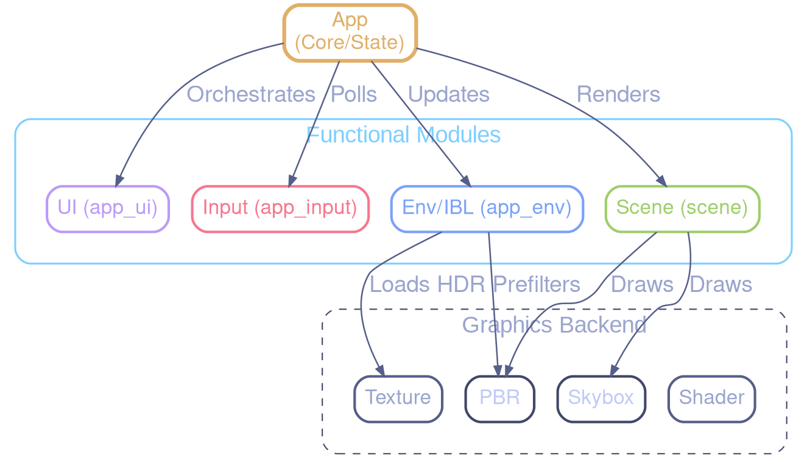

# Architecture Documentation - Refactoring Core

This document describes the architectural changes made during the `app.c` refactoring.

## Overview

The monolithic `app.c` has been split into several specialized modules to improve maintainability, reduce compilation times, and clarify responsibilities.

### Modules

| Module | Responsibility |
| :--- | :--- |
| `app.c` / `app.h` | Orchestrator: Initialization, main loop, high-level render pass management. |
| `app_ui.c` / `app_ui.h` | UI Rendering: Overlays, help screens, debug text, histograms, and loading spinners. |
| `app_input.c` / `app_input.h` | Input Handling: Keyboard callbacks, mouse/scroll events, and post-process feature toggles. |
| `app_env.c` / `app_env.h` | Environment & IBL: HDR file scanning, asynchronous loading, and the IBL state machine. |
| `scene.c` / `scene.h` | Scene Rendering: Billboard groups, instanced groups, and procedural geometry updates. |

## Architecture Diagram



## Data Ownership

The `App` struct (defined in `app.h`) remains the central state container. Most modules take a pointer to `App` as their first argument.

To avoid cyclic dependencies:

- Core struct definitions (`App`, `Camera`, `AsyncRequest`) use named structs instead of anonymous ones to support forward declarations.
- Module headers are included at the **end** of `app.h` to ensure they can see the full `App` definition if necessary (though they primarily use pointers).
- Specialized source files (`.c`) include `app.h` and the required renderer headers directly.

## Build System

The `CMakeLists.txt` has been updated to include the new source files. The `app` executable and `test_app` integration test both link against the new modular structure.

## Performance Impact

- **Compilation**: Parallel compilation is now more effective as changes to UI don't require re-compiling the IBL logic.
- **Runtime**: Zero overhead, as functions are simply moved into separate translation units. Inlining is still possible for performance-critical functions if they were moved to headers (though not currently required).

## Scene Rendering Polymorphism

The `Scene` module uses a **Strategy Pattern** (polymorphism in C) to handle different rendering paths without complex branching.

### The `SceneRenderer` Interface

Defined in `include/scene_renderer.h`, it provides a unified signature for all rendering strategies:

```c
typedef struct SceneRenderer {
    void (*render)(struct Scene* scene, mat4 view, mat4 proj,
                   vec3 camera_pos, mat4 previous_view_proj,
                   int width, int height);
} SceneRenderer;
```

### Concrete Strategies

1. **Instanced (`INSTANCED_STRATEGY`)**: Standard PBR rendering using hardware instancing for opaque spheres.
2. **SSBO (`SSBO_STRATEGY`)**: Alternative path using Shader Storage Buffer Objects for instance data (useful for high instance counts).
3. **Billboard (`BILLBOARD_STRATEGY`)**: High-performance ray-traced impostors for transparent spheres, featuring analytic anti-aliasing.

### Dynamic Dispatch

During `scene_render`, the appropriate strategy is selected based on the scene state:

```c
if (scene->billboard_mode) {
    scene->renderer = &BILLBOARD_STRATEGY;
} else {
    scene->renderer = &INSTANCED_STRATEGY;
#ifdef USE_SSBO_RENDERING
    scene->renderer = &SSBO_STRATEGY;
#endif
}

scene->renderer->render(scene, view, proj, camera_pos, previous_view_proj, width, height);
```

This architecture allows adding new rendering techniques (e.g., ray-tracing, mesh-shaders) by simply implementing a new `SceneRenderer` and plugging it into the dispatch logic.
