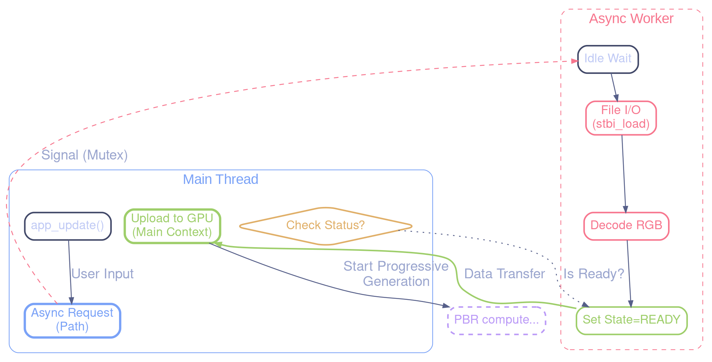

# Asynchronous Environment Map Loader

This document describes the asynchronous loading system implemented to handle heavy HDR environment maps without blocking the main application loop.

## Overview

Loading high-resolution HDR textures (e.g., 4k or 8k `.hdr` files) can take several hundred milliseconds or even seconds depending on disk speed. Performing this operation on the main thread causes the entire application to freeze (stop rendering and processing input), leading to a poor user experience.

The **Async Loader** decouples the **Disk I/O and CPU decompression** steps from the **Main Thread**, moving them to a background worker thread.

## Architecture

The system consists of three main components:

1.  **Async Loader Module** (`src/async_loader.c`)
    *   Manages a background worker thread (pthread).
    *   Maintains a single "request slot" protected by a mutex.
    *   Handles the `stbi_loadf` operation (Disk -> RAM).

2.  **Texture Loading Split** (`src/texture.c`)
    *   `texture_load_pixels`: Pure CPU function (Thread-safe). Loads raw float data.
    *   `texture_upload_hdr`: Pure OpenGL function (Main thread only). Uploads data to GPU.

3.  **Application Integration** (`src/app.c`)
    *   Initiates requests without blocking.
    *   **GPU Stall**: While Disk I/O is offloaded, the final OpenGL upload and IBL map generation (Prefiltering, Irradiance) still occur on the main thread. This may cause a slight frame drop *after* the loading finishes. This is expected behavior for this implementation phase.
    *   **Integrated Graphics**: On some integrated GPUs (e.g., Intel Iris Xe), the Compute Shader may time out for the 1024x1024 level (Mip 0). An optimization has been added to `spmap.glsl` to skip convolution for roughness ~0 and perform a direct copy instead.
    *   Polls for completion in the main loop.
    *   Finalizes the upload and generation pipeline on the main thread.

### Data Flow

