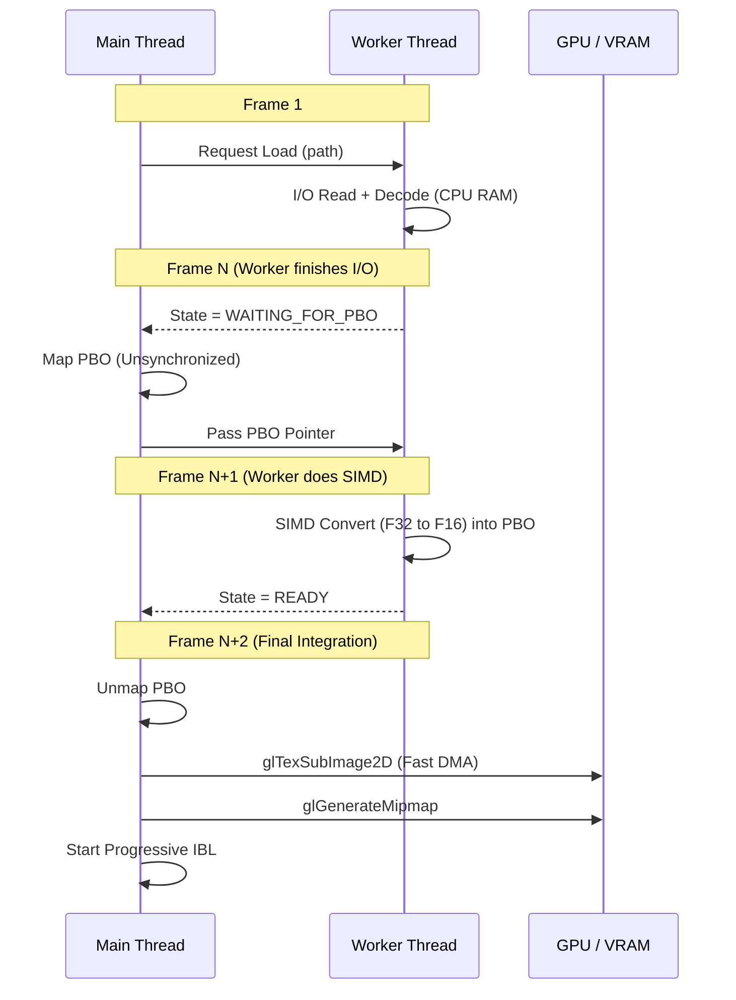

# Asynchronous Environment Map Loader

This document describes the asynchronous loading system implemented to handle heavy HDR environment maps without blocking the main application loop.

## Overview

Loading high-resolution HDR textures (e.g., 4k or 8k `.hdr` files) can take several hundred milliseconds or even seconds depending on disk speed. Performing this operation on the main thread causes the entire application to freeze (stop rendering and processing input), leading to a poor user experience.

The **Async Loader** decouples the **Disk I/O and CPU decompression** steps from the **Main Thread**, moving them to a background worker thread.

## Architecture

The system consists of several main components working together to ensure zero-stall loading:

1.  **Async Loader Module** (`src/async_loader.c`)
    *   Manages a background worker thread.
    *   Handles heavy I/O and SIMD format conversion.
    *   Implements the `WAITING_FOR_PBO` protocol to interact with the main thread.

2.  **Async Coordinator** (`src/async/async_coordinator.h`)
    *   Manages double-buffered PBOs on the main thread.
    *   Handles the mapping and provision of GPU memory to the worker.

3.  **Environment Manager** (`src/env_manager.c`)
    *   Orchestrates the multi-step loading process over several frames.

### Data Flow (PBO-based)

The loading process follows a specialized "handshake" to avoid shared contexts:

1.  **Main Thread**: Calls `async_loader_request(path)`.
2.  **Worker Thread**: Loads the file from disk and decodes it into a CPU float buffer. Transitions to `ASYNC_WAITING_FOR_PBO`.
3.  **Main Thread**: Detects the waiting state during `poll()`. It maps a PBO and provides the pointer to the worker.
4.  **Worker Thread**: Converts the float data directly into the mapped PBO memory using SIMD instructions. Transitions to `ASYNC_READY`.
5.  **Main Thread**: Detects `ASYNC_READY`. It unmaps the PBO and performs a `glTexSubImage2D` (DMA transfer) to the GPU texture.

This architecture ensures that the **Main Thread never touches the pixel data** and the **Worker Thread never touches the OpenGL context**.

### Scheduling Sequence

The complexity of the PBO-based approach is handled by spliting the work across several frames:

### The 3-Step Integration

To further reduce frame spikes, the final GPU integration is split across frames:

- **Step 1: Upload**: data is moved from PBO to a pre-allocated texture.
- **Step 2: Mipmaps**: `glGenerateMipmap` is called (allocated on first use).
- **Step 3: IBL Start**: The `IBLCoordinator` begins slicing the map for irradiance and pre-filtering.

### Detailed PBO Strategy
For more technical details on the PBO implementation, see [Async PBO Upload](async_pbo.md).
