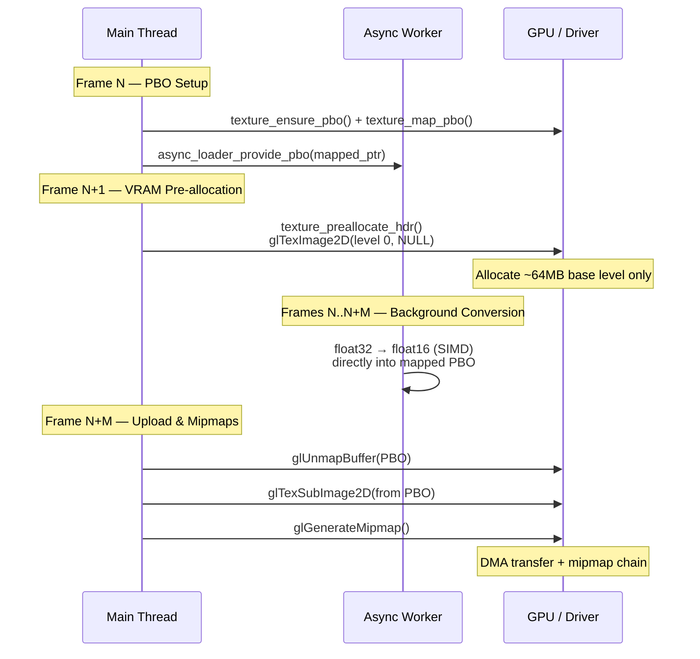
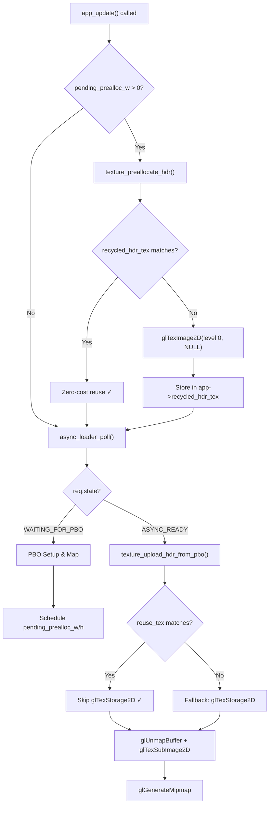
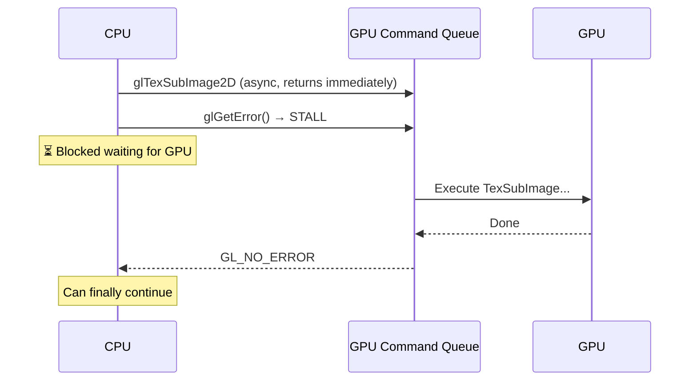

# Asynchronous Texture Upload Strategy

This document details the implementation of the asynchronous high-resolution texture upload system in `suckless-ogl`, specifically focusing on the **Double-Buffered Persistent Pixel Buffer Object (PBO)** strategy used to eliminate main-thread stalling, and the **Multi-Frame Resource Initialization** strategy that spreads GPU allocation costs across frames.

## The Problem

Uploading large 4K HDR textures (approx. 64MB) to the GPU is a heavy operation.

- **Direct Upload (`glTexImage2D`)**: Blocks the driver and main thread until the copy is complete (~50ms+), causing massive frame drops.
- **Naive PBO**: Using a single PBO allows asynchronous DMA transfer, but the *mapping* of that PBO (`glMapBufferRange`) can still block if the GPU is currently reading from it (Implicit Synchronization).
- **Monolithic Upload**: Even with PBOs, performing all GPU work (texture storage allocation, data upload, mipmap generation) in a single frame creates a ~60ms spike.

## Architecture Overview



## The Solution: Double-Buffered Persistent PBOs

To ensure the Main Thread *never* waits for the GPU, we use a **Ping-Pong** strategy with two persistent PBOs.

### Architecture

1. **Async Worker Thread**:
    - Loads the HDR file from disk (I/O).
    - Decodes to float buffer.
    - **Waits** for the Main Thread to provide a mapped GPU pointer.
    - Converts Float -> Half-Float (FP16) *directly* into the mapped memory.

2. **Main Thread (`app_update`)**:
    - Checks if the worker is waiting.
    - Selects the **next available PBO** (index `frame % 2`).
    - **Maps** the PBO with `GL_MAP_UNSYNCHRONIZED_BIT`.
    - Passes the pointer to the worker.
    - When worker finishes, **Unmaps** and calls `glTexSubImage2D`.

### Key Optimizations

#### 1. Double Buffering & Unsynchronized Mapping

By alternating between `upload_pbo[0]` and `upload_pbo[1]`, we guarantee that while the GPU is reading from PBO 0 (for the previous texture), we are mapping and writing to PBO 1.
This allows us to use `GL_MAP_UNSYNCHRONIZED_BIT`, which tells the driver: *"I promise I am not overwriting data you are currently using, so don't check, just give me the pointer immediately."*

#### 2. Persistent Allocation (No Orphaning)

Previously, we used `glBufferData(NULL)` (Orphaning) to force the driver to give us a new memory chunk. While this avoids synchronization, the *allocation itself* for 64MB took ~26-40ms on certain drivers.
**Current Approach**: We allocate the PBOs once (or resize only if larger textures are loaded). We reuse the existing VRAM storage, eliminating allocation overhead.

#### 3. 2-Step Upload

Instead of fully converting on the specific thread and then copying, we:

1. **Load** (Worker)
2. **Map** (Main Thread)
3. **Convert & Write** (Worker, directly into PBO)
4. **Upload** (Main Thread, DMA)

This prevents the Main Thread from ever touching the pixel data on the CPU, and prevents the Worker from needing a GL context.

## Multi-Frame Resource Initialization

### The Bottleneck

Even with the PBO strategy above, the upload frame still caused a ~60ms spike because all GPU-heavy operations were concentrated in a single frame:

| Operation | Approx. Cost | Cause |
|:---|:---:|:---|
| `glTexStorage2D` (13 mip levels) | ~15-20ms | VRAM allocation of ~85MB |
| `glUnmapBuffer` | ~1-3ms | Flush DMA write-combine |
| `glTexSubImage2D` | ~10-15ms | DMA transfer PBO → texture |
| `glGenerateMipmap` | ~10-15ms | GPU compute on 13 levels |
| `glGetError` × 3 | ~5-10ms | **GPU sync points** (pipeline stalls) |
| **Total** | **~45-65ms** | Single frame spike |

### The Strategy: Spread Work Across 3 Frames

Instead of doing everything in one frame, we distribute the work using the async loader's multi-step protocol as natural frame boundaries:

```mermaid
gantt
    title Frame Time Distribution
    dateFormat X
    axisFormat %s ms

    section Before (1 frame)
    PBO Setup + TexStorage + Upload + Mipmap + 3×glGetError :done, 0, 60

    section After (3 frames)
    Frame N  — PBO Setup & Map        :active, 0, 5
    Frame N+1 — TexPrealloc (level 0) :active, 8, 15
    Frame N+M — Upload + Mipmap       :active, 18, 38
```



#### Frame N: PBO Setup (`ASYNC_WAITING_FOR_PBO`)

```c
// app_update() — ASYNC_WAITING_FOR_PBO branch
texture_ensure_pbo(&app->upload_pbo[idx], &app->upload_pbo_size[idx], size);
void* ptr = texture_map_pbo(app->upload_pbo[idx], size);
async_loader_provide_pbo(app->async_loader, ptr, app->upload_pbo[idx]);

// Schedule deferred pre-allocation for NEXT frame
app->pending_prealloc_w = req.width;
app->pending_prealloc_h = req.height;
```

**Cost**: ~1-5ms (PBO reuse, no allocation)

#### Frame N+1: Deferred VRAM Pre-allocation

```c
// app_update() — top of function, before poll
if (app->pending_prealloc_w > 0) {
    app->recycled_hdr_tex = texture_preallocate_hdr(
        app->pending_prealloc_w, app->pending_prealloc_h,
        app->recycled_hdr_tex);
    app->pending_prealloc_w = 0;
}
```

Key decisions:

- **`glTexImage2D` instead of `glTexStorage2D`**: Allocates only level 0 (~64MB) instead of 13 mip levels (~85MB). The mipmap chain is created later by `glGenerateMipmap`.
- **No `glGetError()`**: Avoids forcing a GPU sync point. Errors are caught by the `GL_DEBUG_OUTPUT_SYNCHRONOUS` callback.
- **Texture reuse**: If `recycled_hdr_tex` already matches dimensions and format, the pre-allocation is a **no-op** (zero-cost path).

**Cost**: ~5-15ms first load, ~0ms on subsequent loads with same dimensions

#### Frame N+M: Upload from PBO (`ASYNC_READY`)

```c
// app_finalize_environment_load() → texture_upload_hdr_from_pbo()
// reuse_tex_id matches pre-allocated texture → skip glTexStorage2D ✓
glUnmapBuffer(PBO);
glTexSubImage2D(..., 0);   // DMA from PBO offset 0
glGenerateMipmap();        // Generates mip chain (also allocates mip levels)
```

**Cost**: ~20-30ms (irreducible GPU work)

### Deferred Pre-allocation Flow



## Sync Point Removal (`glGetError` Audit)

### Why `glGetError()` Stalls the Pipeline

`glGetError()` is a **synchronous query**: the CPU must wait for the GPU to process **all pending commands** before returning the error state. In a pipelined architecture, this defeats the purpose of asynchronous uploads.



### The Safety Net: `GL_DEBUG_OUTPUT_SYNCHRONOUS`

The application enables OpenGL debug output in synchronous mode (`gl_debug.c`):

```c
glEnable(GL_DEBUG_OUTPUT);
glEnable(GL_DEBUG_OUTPUT_SYNCHRONOUS);
```

This means **every GL error is already reported immediately** via the debug callback, making `glGetError()` calls redundant for error detection.

### Audit Results

| Location | Context | Action | Rationale |
|:---|:---|:---|:---|
| `ssbo_rendering.c:24` | After SSBO init | **Kept** | Init-time only, negligible cost |
| `texture.c` (was line 206) | Sticky error clear | **Removed** | Redundant with debug callback |
| `texture.c` (was line 260) | After `glTexStorage2D` | **Debug-only** (`#ifndef NDEBUG`) | Fallback path, useful for debugging |
| `texture.c` (was line 289) | After `glTexSubImage2D` | **Removed** | Hot path, debug callback catches errors |
| `texture.c` (was line 309) | After `glGenerateMipmap` | **Removed** | Hot path, debug callback catches errors |

## Evolution of the Implementation

### Phase 1: Naive Async (Blocked)

Initially, the worker converted data to a CPU buffer, and the Main Thread called `glBufferData`.

- **Result**: Main thread blocked for ~45ms during allocation/copy.

### Phase 2: Single PBO + Orphaning (Stalled)

We moved to PBOs, but reused a single PBO. We tried forcing `glBufferData(NULL)` to orphan.

- **Result**: `PBO Setup` allocated memory every frame, taking ~26-40ms. Frame time exploded.

### Phase 3: Single PBO + Sync (Blocked)

We tried removing orphaning.

- **Result**: `glMapBufferRange` blocked heavily because the GPU was still reading the previous upload. Implicit synchronization kicked in.

### Phase 4: Double-Buffered Persistent (Current PBO Strategy)

We implemented `upload_pbo[2]`.

- **Result**: `PBO Setup` dropped to **< 0.1ms**. The stall is completely gone, and we maintain 4k HDR streaming at full framerate.

### Phase 5: Multi-Frame Pre-allocation & Sync Point Removal (Current)

We split texture initialization across 3 frames and removed `glGetError()` sync points.

- **PBO Setup** in Frame N (~1-5ms)
- **VRAM Pre-allocation** deferred to Frame N+1 (~5-15ms, or 0ms with reuse)
- **Upload + Mipmaps** in Frame N+M (~20-30ms)
- **3 `glGetError()` sync points removed** from the upload path
- **`glTexImage2D(level 0)` replaces `glTexStorage2D(13 levels)`**: lighter allocation, mip chain deferred

**Result**: Worst-case frame spike reduced from ~60ms to ~20-30ms. With texture reuse (same dimensions), the pre-allocation frame is a no-op.

## Asynchronous Performance Readbacks (Exposure & Histogram)

The same PBO principle is applied in reverse for **GPU-to-CPU readbacks** (Auto-Exposure and Histogram).

### The Challenge

`glReadPixels` or `glGetTexImage` without PBOs will stall the CPU until the GPU finishes rendering the frame and transfers the data. This typically costs **1-2ms per call** even for small data.

### The Implementation

We use **Double-Buffered PBOs + Sync Fences**:

1. **Trigger Phase (Frame N)**:
   - Call `glGetTexImage` into `pbo[idx]`.
   - Insert a fence: `sync[idx] = glFenceSync(GL_SYNC_GPU_COMMANDS_COMPLETE, 0)`.
2. **Read Phase (Frame N+1)**:
   - Check the fence: `glClientWaitSync(sync[!idx], ..., 0)`.
   - If `GL_ALREADY_SIGNALED` or `GL_CONDITION_SATISFIED`, map the PBO and read.
   - If not signaled, **skip the update** for this frame. This prevents the CPU from ever stalling at the cost of 1 extra frame of latency for HUD values.

**Result**: Exposure calculation and histogram extraction cost **< 0.05ms** on the CPU, regardless of scene complexity.

## Code References

- **`src/app.c`**: Manages the PBO array loop and deferred pre-allocation in `app_update`. Fields: `pending_prealloc_w`, `pending_prealloc_h`.
- **`src/texture.c`**: `texture_ensure_pbo` (sizing), `texture_map_pbo` (flags), `texture_preallocate_hdr` (VRAM pre-allocation), `texture_upload_hdr_from_pbo` (upload pipeline).
- **`src/async_loader.c`**: Handles the threading state machine (`WAITING_FOR_PBO`).
- **`include/app.h`**: `App` struct holds `recycled_hdr_tex`, `pending_prealloc_w/h`, `upload_pbo[2]`.
- **`src/gl_debug.c`**: Configures `GL_DEBUG_OUTPUT_SYNCHRONOUS`.
