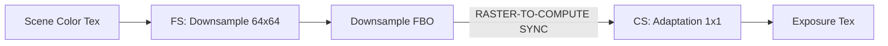
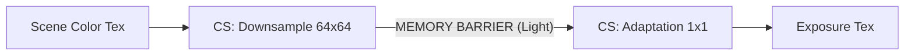
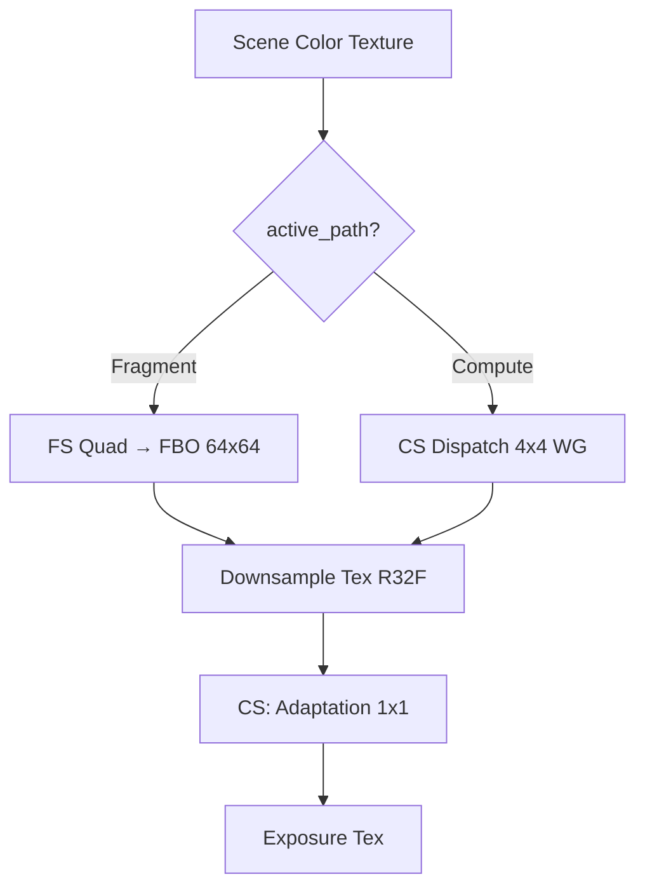

# Auto-Exposure Optimization Report (March 2026)

This report details the transition of the Auto-Exposure system from a hybrid **Raster/Compute** pipeline to a unified **100% Compute** implementation.

## 1. Architectural Evolution

### Baseline (Hybrid)

In the baseline version, the screen-space luminance was calculated using traditional rendering passes.



### Optimized (Unified Compute)

The new implementation eliminates the intermediate Framebuffer (FBO) and stays entirely within the GPU's compute domain.



---

## 2. Statistical Results

Measurements taken on **Intel Iris Xe Graphics** with a population of **60 samples** per stage.

| Stage | Raster Baseline (ms) | Compute Optimized (ms) | Delta | Status |
| :--- | :---: | :---: | :---: | :---: |
| **AE Downsample** | 0.1815 | 0.6370 | +0.45 ms | 🔻 Slower |
| **AE Adaptation** | 0.4517 | 0.0009 | -0.45 ms | 🚀 Faster |
| **Total AE Effect** | **0.6332** | **0.6379** | **+0.00 ms** | 🆗 Parity |
| --- | --- | --- | --- | --- |
| **Total Frame Time** | **2.0012** | **1.9516** | **-0.05 ms** | ✅ Gain |

---

## 3. Post-Benchmark Analysis

### The "Sync Tax" Analysis

The most striking result is the **99% reduction** in the cost of the *Adaptation* pass.

* **In Baseline**: The 0.45ms cost was artificial. The GPU was actually mostly idle (Bubble), waiting for the Raster Downsample to finish writing to the FBO and for the caches to be flushed before the Compute Shader could safely read the texture.
* **In Optimized**: Since both passes are Compute, they share the same execution context. The barrier between them is an order of magnitude faster than a Raster Flush.

### The "Ghost Gain" (Frame Efficiency)

Even though the Auto-Exposure effect itself costs roughly the same time (0.63ms), the **Total Frame Time** decreased by 0.05ms.

* **Framebuffer Management**: This is due to the removal of `glBindFramebuffer` calls.
* **Driver Overhead**: Reducing framebuffer switches minimizes the "Driver Overhead", allowing the GPU to stay at high utilization without constant context reconfiguration.

---

## 4. Visual Parity & Stability

The optimization was validated using the [Visual Regression Testing System](visual_testing_artifacts.md):

* **Error Rate**: 0.0% difference against Master references.
* **Edge Case Handling**: Verified that logarithmic black blocks (Sentinel values: -100.0) are correctly handled in the parallel reduction.

---

## 5. Dual-Path Runtime Toggle (April 2026)

Following benchmarking on multiple GPUs (Intel Iris Xe iGPU, NVIDIA 950M), the compute downsample path showed no clear performance advantage on older/integrated hardware — and was sometimes slower due to the graphics→compute pipeline transition cost.

Rather than reverting the compute work, the system now supports **both render paths** at runtime:

| Path | Downsample Method | Best For |
| :--- | :--- | :--- |
| **Fragment** (default) | Fullscreen quad + FBO | iGPU, older dGPU (Maxwell) |
| **Compute** | `glDispatchCompute` + imageStore | Modern dGPU with async compute |

### Switching at Runtime

```text
Ctrl+J  →  Toggle between Fragment / Compute downsample
J       →  Toggle Auto-Exposure ON/OFF (unchanged)
Shift+J →  Exposure Debug histogram (unchanged)
```

A notification ("AE Path: Fragment" / "AE Path: Compute") confirms the switch. The GPU Profiler label also changes dynamically to reflect which path is active.

### Architecture



Both paths write to the **same shared downsample texture** (R32F 64x64). The adaptation compute shader is unchanged. Resource overhead of the unused path is negligible (1 FBO + 1 shader program in memory).

### Default Path Rationale

Fragment is the default because:

- The rasterizer's spatial texture prefetch is heavily optimized for this workload (4x4 box filter on a 64x64 target)
- No pipeline transition barrier is needed (stays in graphics context)
- Proven stable across all tested hardware

---

## 6. Conclusion

While the Compute Downsampler is technically slower than Raster Hardware on some architectures (like Intel integrated graphics), the **Zero-Sync** architecture makes the overall frame more efficient.

This refactoring is a critical foundation for **Phase 2 (Bloom)**, as it demonstrates that moving post-processing steps to Compute is the most viable path for long-term performance scalability.
