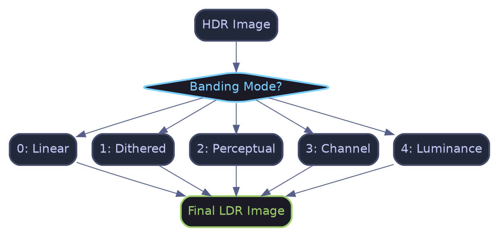
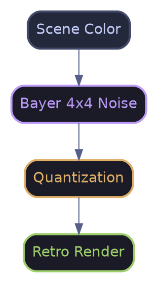
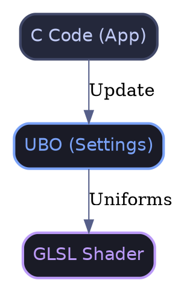

# Banding Effect (Color Quantization)

The **Banding** effect (or color depth reduction) is an artistic filter that intentionally reduces color precision to create styles ranging from retro computing to technical diagrams.

## 🚀 Quick Overview

The system offers **5 distinct modes**, cycled through **key '7'**. Each mode uses a different mathematical approach to compress the color space.

---

## 🎨 The 5 Artistic Styles

### 1. Pop Art (Linear)
The simplest mode. It divides the color space into equal steps.
- **Usage**: For a "Cel-shaded" or "Comic book" look.
- **Math**:
\f[ result = \frac{\lfloor color \cdot levels \rfloor}{levels} \f]

### 2. Retro Computing (Dithered)
Uses a **Bayer 4x4** matrix to simulate intermediate shades via a threshold grid.
- **Usage**: Macintosh, GameBoy, or old CGA monitor style.
- **Principle**:

### 3. Analog (Perceptual)
Applies a gamma curve before quantization to preserve more detail in dark areas.
- **Usage**: "Vintage video sensor" look.
- **Advantage**: Avoids massive black blobs in shadows.
\f[ result = \left( \frac{\lfloor color^{\gamma} \cdot levels \rfloor}{levels} \right)^{\frac{1}{\gamma}} \f]

### 4. CGA/VGA Style (Channel)
Reduces the precision of each RGB channel independently.
- **Usage**: Simulate limited hardware palettes (e.g., 8 red levels, 8 green, 4 blue).

### 5. Blueprint (Luminance)
Quantizes the perceived luminance of the image, then applies a color tint.
- **Usage**: Technical blueprints, holograms, futuristic interfaces.

---

## ⚙️ Parameters (PostProcessPreset)

| Parameter | Description |
| :--- | :--- |
| `mode` | Style selector (0 to 4). |
| `levels` | Number of color levels (e.g., 2.0 = Black/White). |
| `dither_strength` | Grain intensity (Mode 1 only). |
| `perceptual_gamma` | Contrast curve (Mode 2 only). |
| `channel_levels` | RGB channels (Mode 3) or Tint Color (Mode 4). |

---

## 🛠 Technical Integration

The effect is implemented in the PBR pipeline via an optimized Uber-shader.

