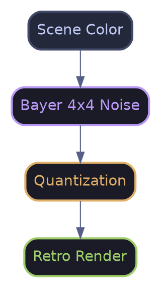
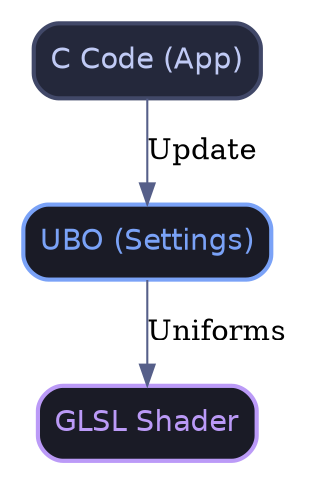

# Effet de Banding (Quantisation Couleurs)

L'effet de **Banding** (ou réduction de profondeur de couleur) est un filtre artistique qui réduit volontairement la précision des couleurs pour créer des styles allant du rétro-informatique au schéma technique.

## 🚀 Fonctionnement Rapide

Le système propose **5 modes distincts**, accessibles via un cycle sur la **touche '7'**. Chaque mode utilise une approche mathématique différente pour compresser l'espace colorimétrique.

---

## 🎨 Les 5 Styles Artistiques

### 1. Pop Art (Linear)

Le mode le plus simple. Il divise l'espace colorimétrique en paliers égaux.

- **Usage** : Pour un look "Cel-shaded" ou "Comic book".

- **Maths** :

\f[ result = \frac{\lfloor color \cdot levels \rfloor}{levels} \f]

### 2. Retro Computing (Dithered)

Utilise une matrice de **Bayer 4x4** pour simuler des nuances intermédiaires via une grille de seuils.

- **Usage** : Style Macintosh, GameBoy ou vieux moniteurs CGA.

- **Principe** :

### 3. Analog (Perceptual)

Applique une courbe de gamma avant la quantisation pour préserver plus de détails dans les zones sombres.

- **Usage** : Look "capteur vidéo vintage".

- **Avantage** : Évite les aplats noirs massifs dans les ombres.

\f[ result = \left( \frac{\lfloor color^{\gamma} \cdot levels \rfloor}{levels} \right)^{\frac{1}{\gamma}} \f]

### 4. CGA/VGA Style (Channel)

Réduit la précision de chaque canal RGB indépendamment.

- **Usage** : Simuler des palettes matérielles limitées (ex: 8 niveaux de rouge, 8 de vert, 4 de bleu).

### 5. Blueprint (Luminance)

Quantise la luminance perçue de l'image, puis applique une teinte colorée.

- **Usage** : Schémas techniques, hologrammes, interfaces futuristes.

---

## ⚙️ Paramètres (PostProcessPreset)

| Paramètre | Description |
| :-------- | :---------- |

| `mode` | Sélecteur du style (0 à 4). |
| `levels` | Nombre de niveaux de couleurs (ex: 2.0 = Noir/Blanc). |
| `dither_strength` | Intensité du grain (Mode 1 uniquement). |
| `perceptual_gamma` | Courbe de contraste (Mode 2 uniquement). |
| `channel_levels` | Canaux RGB (Mode 3) ou Couleur de Teinte (Mode 4). |

---

## 🛠 Intégration Technique

L'effet est implémenté dans le pipeline PBR via un Uber-shader optimisé.

