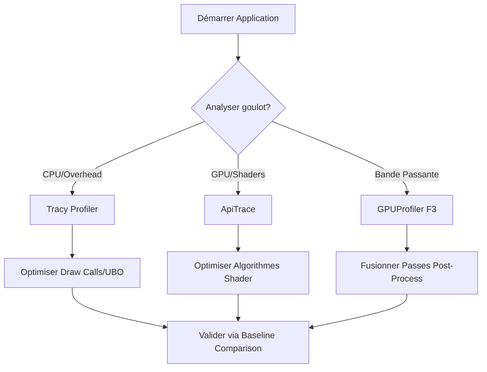

# Performance Benchmarking & Analysis Methodology

Ce document définit la méthodologie officielle pour mesurer, analyser et valider les performances graphiques de `suckless-ogl`.

## 1. Philosophie du Benchmarking

Dans ce projet, nous ne cherchons pas seulement à "augmenter les FPS", mais à **optimiser l'efficacité globale** :

- **CPU Bound** : Réduire le temps de préparation des commandes (overhead driver).
- **GPU Bound** : Réduire la complexité des shaders et l'overdraw.
- **Bandwidth Bound** : Réduire les transferts VRAM (critique sur iGPU).

## 2. L'Arsenal d'Outils

### A. Tracy Profiler (CPU/Stalls)

- **Usage** : `make run-tracy` (si activé) ou build avec `-DENABLE_TRACY=ON`.
- **Analyse** : Permet de voir si le CPU attend le GPU (`glMapBufferRange` bloquant, `glFinish`).
- **Indicateur clé** : La durée de la fonction `renderer_draw_frame`.

### B. ApiTrace (GPU Source of Truth)

- **Usage** : `just bench-record` puis `just bench-analyze`.
- **Analyse** : Mesure le temps réel passé sur le silicium du GPU pour chaque shader.
- **Indicateur clé** : Le tableau "Performance by Shader" généré par `trace_analyze.py`.

### C. GPUProfiler Interne (Temps Réel)

- **Usage** : Touche **F3** en cours d'exécution.
- **Analyse** : Utilise des requêtes `GL_TIMESTAMP` pour découper la frame en étapes (Geometry, Post-Process, UI).

## 3. Matériel et Architectures

L'analyse doit varier selon la cible :

| Architecture | Goulot d'étranglement typique | Stratégie d'optimisation |
| :--- | :--- | :--- |
| **Intel Iris Xe (iGPU)** | Bande passante mémoire (RAM partagée) | **Pass Merging** : Réduire le nombre de textures lues/écrites. |
| **NVIDIA 950M (dGPU)** | Fillrate et puissance de calcul (ALU) | **Early-Z / Depth Pre-pass** : Éliminer les pixels inutiles tôt. |
| **Moderne (RTX/Intel Arc)** | Draw Call Overhead (si > 5000) | **Multi-Draw Indirect (MDI)** & Bindless. |

## 4. Procédure de Validation (A/B Testing)

Pour chaque optimisation proposée :

1. **Baseline** : `just bench-all`. Notez le temps de la passe cible (ex: Post-Process).
2. **Implémentation** : Appliquez les changements.
3. **Comparaison** : `just bench-all`.
4. **Validation** : Le gain doit être supérieur à la variance (marge d'erreur de ~0.05ms).

## 5. Diagramme de Flux de Performance

