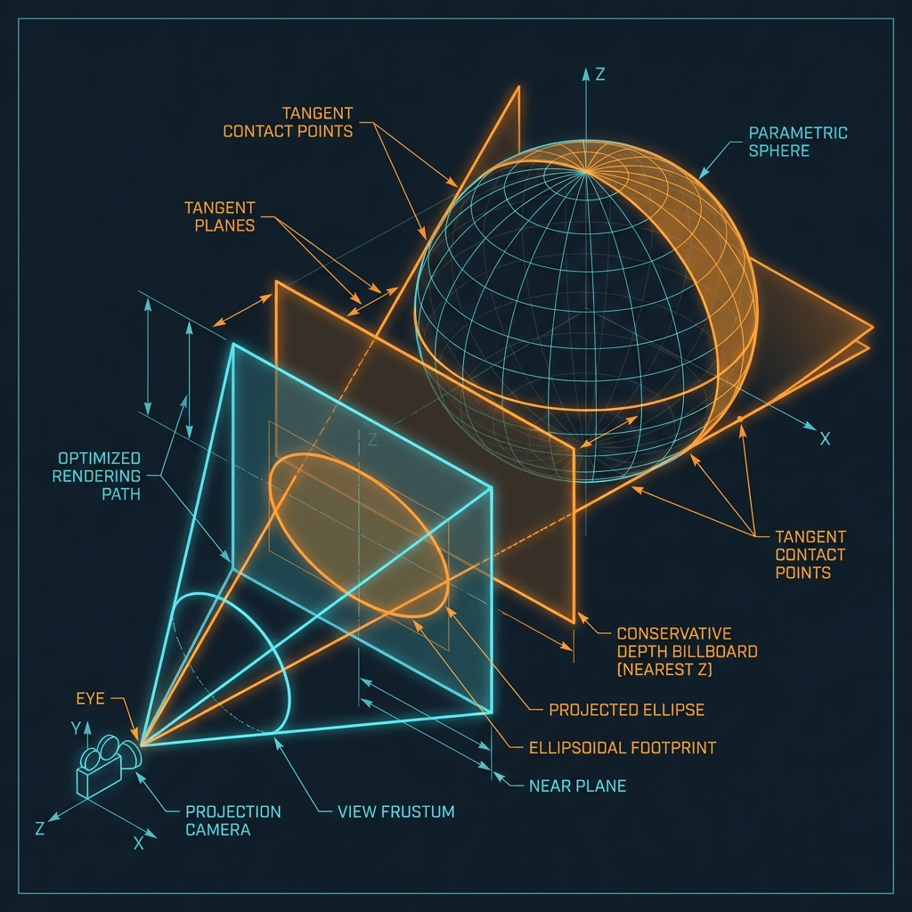
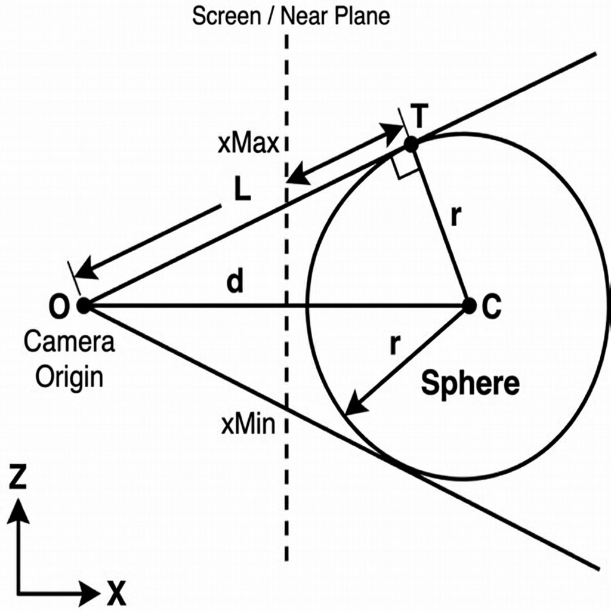
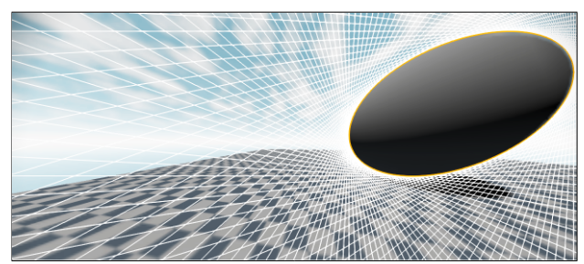

# Exact Sphere AABB Optimization

This document explains the mathematical method used to calculate the optimal screen-space bounding box (AABB) for sphere rendering.

## The Problem

When rendering spheres using ray-casting on a billboard (a generic quad), we want the quad to be as small as possible to minimize **fragment shader overdraw**.

A naive approach (projecting the center and adding the radius) fails because of **perspective distortion**. As a sphere moves to the edge of the field of view, its projection becomes an ellipse. A fixed-size quad would either be too large (wasteful) or too small (clipping the sphere).

## The Exact Solution: Tangent Planes

Instead of trying to project the sphere itself, we calculate the **viewing cone** that perfectly encompasses the sphere. This is equivalent to finding the planes passing through the camera origin (0,0,0) that are **tangent** to the sphere.

We solve this problem in 2D, independently for the X (width) and Y (height) axes.

### Geometry (XZ Plane)

Consider the top-down view (XZ plane) shown in the diagram above:
- **O**: Camera Origin at $(0,0)$.
- **C**: Sphere Center at $(C_x, C_z)$.
- **r**: Sphere Radius.
- **d**: Distance from Origin to Center ($d = \|C\|$).

We want to find the tangent lines $T_1$ and $T_2$.
The distance $L$ from the origin to the tangent points is given by Pythagoras in the right-angled triangle $\Delta OTC$:

$$ L = \sqrt{d^2 - r^2} $$

### Finding Tangent Normals (Without Trigonometry)

We can find the normal vectors of the tangent lines using simple 2D vector rotation.
The tangent lines are rotated relative to the center vector $\vec{C}$ by the angle $\alpha$.
By observing the similar triangles, we can derive the tangent direction vectors directly from $C$, $r$, and $L$:

$$ n_{x1} = \frac{C_x \cdot L - C_z \cdot r}{d^2} $$

$$ n_{z1} = \frac{C_z \cdot L + C_x \cdot r}{d^2} $$

(And symmetrically for the second tangent).

### Projection to NDC

Once we have the normal vector $(n_x, n_z)$ of a tangent line (which represents a ray from the camera), we project it to Normalized Device Coordinates (NDC) using the projection matrix elements.

For a standard perspective projection matrix $P$:
- $P_{00}$ scales X (based on Field of View).
- We project by dividing $x$ by $-z$ (since OpenGL looks down -Z).

$$ x_{ndc} = P_{00} \cdot \frac{n_x}{-n_z} $$

This gives us the exact screen-space coordinate of the edge of the sphere. We calculate the min/max of both tangents to find the AABB width. The same logic applies to the Y axis.

## Implementation Results

This method provides a **pixel-perfect bounding box**:
- **0% Overdraw** outside the sphere's actual screen footprint (excluding the corner areas of the quad).
- **Correct Perspective**: Handles elliptical distortion at screen edges perfectly.
- **Efficient**: Uses only square roots and basic arithmetic, avoiding expensive trigonometric functions (`acos`, `atan`).

## Robustness Handling

To ensure stability in all scenarios, two special cases are handled:

### 1. Camera Plane Singularity
When the sphere intersects the camera plane ($Z=0$), the tangent formulas can produce singularities or "wrap-around" artifacts where points behind the camera are projected inverted onto the screen.
**Solution**: If a tangent point lies behind the camera ($n_z \ge 0$), its projected screen coordinate is clamped to infinity ($\pm 10000.0$) in the correct direction. This ensures the quad extends to the screen edge.

### 2. Back-Projection Culling
Spheres located entirely behind the camera ($Z_{view} > 0$ and $d > r$) can mathematically project to valid screen coordinates (inverted).
**Solution**: These are explicitly culled in the Vertex Shader by checking if `viewPos.z > 0.0`.

### 3. Conservative Depth
To ensure correct Z-buffering when the sphere intersects other geometry (e.g. a wall or floor passing through it), the billboard quad is positioned at the sphere's **frontmost plane** ($Z_{nearest} = Z_{view} + R$) rather than its center.
This ensures the quad is drawn *before* any intersecting geometry that might be inside the sphere, safeguarding against incorrect occlusion. The Fragment Shader then outputs the precise per-pixel depth (`gl_FragDepth`) to carve out the true spherical shape.

## References

- **Mara, M., McGuire, M., & Luebke, D. (2013).** *2D Polyhedral Bounds of a Clipped, Perspective-Projected 3D Sphere*. Journal of Computer Graphics Techniques (JCGT).
  [PDF Reference](https://jcgt.org/published/0002/02/05/)

See `shaders/pbr_ibl_billboard.vert` for the GLSL implementation.

### Visual Illustration
The following image (from Mara et al.) demonstrates how the spherical projection creates an elliptical footprint on the screen, which our exact AABB calculation perfectly bounds:

