# Rapport d'Analyse de Code & Refactoring SRP (Juillet 2026)

**Date** : 3 juillet 2026
**Statut** : Résolu / Terminé

Ce rapport présente une analyse complète de la logique métier du codebase, en comptant et triant les lignes d'implémentation de chaque corps de fonction. Il met en lumière comment les fonctions monolithiques précédemment identifiées (qui violaient le principe de responsabilité unique ou SRP) ont été résolues, et explique les choix de conception structurelle tels que `app_render_ui_trampoline`.

---

## 📊 Métriques des fonctions du codebase (Après Refactoring)

En utilisant un parseur d'appariement d'accolades pour exclure les commentaires, les chaînes de caractères littérales et les définitions de macros, nous avons analysé les fichiers sources C dans le dossier `src/`. Voici la liste mise à jour des plus grandes fonctions, triées par ordre décroissant du nombre de lignes dans le corps de leur implémentation.

| Nom de la fonction | Fichier Source | Nombre de lignes | Plage de lignes | Notes / Statut |
| :--- | :--- | :---: | :---: | :--- |
| `postprocess_init` | `src/postprocess_init.c` | **150** | 171-320 | **Refactorisé** (Réduit depuis 229) |
| `app_draw_gamepad_help_overlay` | `src/app_ui.c` | **144** | 676-819 | Disposition de l'UI |
| `draw_help_overlay_keys` | `src/app_ui.c` | **139** | 836-974 | Disposition de l'UI |
| `billboard_sorter_sort_gpu` | `src/billboard_sorter.c` | **130** | 211-340 | Dispatch du compute shader GPU |
| `gpu_profiler_ui_draw` | `src/gpu_profiler_ui.c` | **129** | 223-351 | Disposition de l'UI |
| `app_run` | `src/app.c` | **127** | 219-345 | **Refactorisé** (Réduit depuis 207) |
| `postprocess_input_handle_key` | `src/postprocess_input.c` | **126** | 346-471 | Switch-case de mapping des entrées |
| `handle_preset_input` | `src/postprocess_input.c` | **124** | 144-267 | **Refactorisé** (Réduit depuis 210) |
| `handle_app_input` | `src/app_input.c` | **109** | 661-769 | Routage des entrées |
| `draw_debug_overlays` | `src/billboard_renderer.c` | **107** | 199-305 | Rendu de debug |
| `gpu_profiler_begin_frame` | `src/gpu_profiler.c` | **103** | 101-203 | Synchronisation des timestamps GPU |
| `postfx_final_composite` | `src/postprocess_apply.c` | **101** | 267-367 | Configuration de passe pipeline |
| `app_draw_help_overlay` | `src/app_ui.c` | **95** | 411-505 | Disposition de l'UI |
| `adaptive_sampler_should_sample` | `src/adaptive_sampler.c` | **88** | 101-188 | Logique du contrôleur |
| `billboard_sorter_sort_cpu_radix` | `src/billboard_sorter.c` | **88** | 421-508 | Implémentation du tri Radix |
| `light_probe_grid_render_debug` | `src/light_probes.c` | **88** | 677-764 | Rendu de debug |
| `compute_mean_luminance_gpu_start`| `src/pbr.c` | **85** | 284-368 | Dispatch PBO/GPU timing |
| `tracy_manager_async_transition` | `src/tracy_manager.c` | **85** | 142-226 | Transition de machine d'état |
| `fx_bloom_render` | `src/effects/fx_bloom.c` | **85** | 99-183 | Passe de rendu |
| `light_probe_worker` | `src/light_probes.c` | **84** | 345-428 | Mise à jour de sonde multithread |
| `postprocess_set_default_parameters` | `src/postprocess_init.c` | **84** | 84-167 | **Nouvel assistant statique** |
| `ubo_full_rebuild` | `src/postprocess_apply.c` | **82** | 161-242 | Compactage des données |
| `log_ascii_timeline` | `src/app_metrics.c` | **82** | 131-212 | Outils de journalisation texte |
| `renderer_draw_frame` | `src/renderer.c` | **82** | 27-108 | Configuration frame bas niveau |
| `light_probe_grid_sync` | `src/light_probes.c` | **81** | 544-624 | Synchronisation/upload de buffer |
| `app_handle_env_input` | `src/app_input.c` | **81** | 105-185 | Logique de callback d'entrées |
| `integrate_step` | `src/nbody/nbody_physics.c` | **81** | 64-144 | Étape de physique |

*(Note : `scene_render` a été réduite de 203 lignes à seulement **61** lignes propres, la retirant ainsi complètement de la liste des fonctions volumineuses)*

---

## 🔍 Résolution des fonctions monolithiques (Audit SRP)

Nous avons complété une refactorisation SRP complète sur les quatre fonctions ciblées. Voici le résumé des problèmes résolus :

### 1. `app_run` (`src/app.c`)
*   **Avant (207 lignes)** : Gérait la boucle d'événements GLFW, la mise à jour des timers, la mise à jour de la caméra (clavier / manettes), la détection de changement de subdivisions de l'icosphere et la régénération de son maillage.
*   **Après (127 lignes)** : Uniquement le moteur de la boucle principale de l'application.
    *   La logique d'actualisation de la caméra a été extraite dans `static void app_update_camera(App* app)`.
    *   La détection de modification des subdivisions et la régénération du maillage ont été extraites dans `static void app_update_mesh_subdivisions(App* app, int* last_subdiv)`.

### 2. `postprocess_init` (`src/postprocess_init.c`)
*   **Avant (229 lignes)** : Mélangeait la configuration statique des presets d'effets, la création de l'UBO de paramètres, l'allocation des PBOs d'exposition, l'allocation du buffer d'histogramme et la compilation de shaders.
*   **Après (150 lignes)** : Se consacre exclusivement à la création des ressources OpenGL et à l'initialisation des sous-systèmes.
    *   L'initialisation des paramètres et presets par défaut a été déportée dans `static void postprocess_set_default_parameters(PostProcess* post_processing)`.

### 3. `scene_render` (`src/scene_render.c`)
*   **Avant (203 lignes)** : Préparait les paramètres de dessin de la frame, rendait la skybox, configurait le tri des billboards transparents, dessinait la géométrie et orchestrait les VFX de traînées de particules et d'ondes de choc.
*   **Après (61 lignes)** : Orchestrateur de rendu de haut niveau très court et lisible.
    *   Le rendu de la skybox a été extrait dans `static void scene_render_skybox_pass(Scene* scene, GPUProfiler* profiler, mat4 inv_view_proj)`.
    *   La préparation et le rendu des billboards transparents ont été extraits dans `static void scene_render_billboards_pass(Scene* scene, GPUProfiler* profiler, mat4 view, mat4 proj, mat4 previous_view_proj, vec3 camera_pos, int width, int height)`.
    *   Le rendu des traînées N-body et ondes de choc a été extrait dans `static void scene_render_vfx_pass(Scene* scene, GPUProfiler* profiler, mat4 view, mat4 proj, vec3 camera_pos, int width, int height)`.

### 4. `handle_preset_input` (`src/postprocess_input.c`)
*   **Avant (210 lignes)** : Switch-case mappant les touches de raccourcis d'effets, avec des boucles de cyclage complexes pour les LUTs 3D et le banding d'images.
*   **Après (124 lignes)** : Table de routage clavier simplifiée.
    *   Le cyclage du mode de banding a été extrait dans `static void cycle_banding_styles(const PostProcessInputContext* ctx)`.
    *   Le chargement et cyclage des LUTs a été extrait dans `static void cycle_lut_styles(const PostProcessInputContext* ctx, int mods)`.

---

## 🔀 Le rôle de `app_render_ui_trampoline`

Dans `src/app.c`, la fonction adaptatrice suivante est conservée :

```c
static void app_render_ui_trampoline(void* user_data)
{
	app_render_ui((const App*)user_data);
}
```

### Pourquoi existe-t-il ?
Cette fonction est un adaptateur de type face à l'effacement de type (**Type Erasure Trampoline** / Design Pattern Adapter) conçu pour assurer la séparation des préoccupations (**SoC**) et empêcher les dépendances circulaires.

```mermaid
graph TD
    App[app.c / app.h <br/><i>Orchestrateur de haut niveau</i>]
    Renderer[renderer.c / renderer.h <br/><i>Pipeline de rendu bas niveau</i>]
    AppUI[app_ui.c / app_ui.h <br/><i>Interface Dear ImGui</i>]

    App -->|inclut| Renderer
    App -->|inclut| AppUI
    AppUI -->|prend const App*| App
    Renderer -.->|Rappel via RenderUIFn| App

    style Renderer fill:#1a1b26,stroke:#f7768e,stroke-width:2px;
    style App fill:#1a1b26,stroke:#7aa2f7,stroke-width:2px;
```



1.  **Prévention des Dépendances Circulaires** :
    *   `app.c` contrôle la boucle d'exécution et doit appeler `renderer_draw_frame` (défini dans `renderer.h`). `app.c` dépend donc de `renderer.h`.
    *   Si le module `renderer` appelait directement `app_render_ui(const App* app)`, il devrait connaître la définition de la structure `App`, obligeant `renderer.h` à inclure `app.h`.
    *   Cela créerait une **dépendance circulaire** : `app.h` 🔁 `renderer.h`, violant les règles d'architecture en couches.
2.  **Découplage de Contexte** :
    *   Pour garder le code de rendu bas niveau totalement déconnecté des structures applicatives, `renderer.h` définit une signature générique de callback :
        ```c
        typedef void (*RenderUIFn)(void* user_data);
        ```
    *   Le renderer appelle ce callback au moment opportun sans rien savoir de *qui* dessine l'interface ni de *quelle* structure lui est transmise.
3.  **Encapsulation Typée** :
    *   La fonction de dessin de l'interface utilisateur concrète est `void app_render_ui(const App* app)`.
    *   Puisque cette fonction attend un `const App*` et non un `void*`, la passer directement au renderer générerait des avertissements de compilation ou nécessiterait des casts risqués.
    *   La fonction adaptatrice `app_render_ui_trampoline` accepte le `void* user_data` attendu par le renderer, effectue le cast interne proprement vers `const App*` et appelle `app_render_ui`.
