# Code Analysis & SRP Refactoring Report (July 2026)

**Date**: July 3, 2026
**Status**: Resolved / Completed

This report presents a comprehensive analysis of the codebase's business logic, counting and sorting the lines of implementation for each function body. It highlights how the previously identified monolithic functions (violating the Single Responsibility Principle) have been resolved, and explains structural design choices such as `app_render_ui_trampoline`.

---

## 📊 Codebase Function Metrics (Post-Refactoring)

Using a brace-matching parser to exclude comments, string literals, and macro definitions, we analyzed the C source files in the `src/` directory. Below is the updated list of the largest functions, sorted in descending order by the number of lines in their implementation body.

| Function Name | Source File | Line Count | Line Range | Notes / Status |
| :--- | :--- | :---: | :---: | :--- |
| `postprocess_init` | `src/postprocess_init.c` | **150** | 171-320 | **Refactored** (Down from 229) |
| `app_draw_gamepad_help_overlay` | `src/app_ui.c` | **144** | 676-819 | UI Layout |
| `draw_help_overlay_keys` | `src/app_ui.c` | **139** | 836-974 | UI Layout |
| `billboard_sorter_sort_gpu` | `src/billboard_sorter.c` | **130** | 211-340 | GPU compute shader dispatch |
| `gpu_profiler_ui_draw` | `src/gpu_profiler_ui.c` | **129** | 223-351 | UI Layout |
| `app_run` | `src/app.c` | **127** | 219-345 | **Refactored** (Down from 207) |
| `postprocess_input_handle_key` | `src/postprocess_input.c` | **126** | 346-471 | Input mapping switch-case |
| `handle_preset_input` | `src/postprocess_input.c` | **124** | 144-267 | **Refactored** (Down from 210) |
| `handle_app_input` | `src/app_input.c` | **109** | 661-769 | Input routing |
| `draw_debug_overlays` | `src/billboard_renderer.c` | **107** | 199-305 | Debug rendering |
| `gpu_profiler_begin_frame` | `src/gpu_profiler.c` | **103** | 101-203 | GPU timestamps sync |
| `postfx_final_composite` | `src/postprocess_apply.c` | **101** | 267-367 | Pipeline pass config |
| `app_draw_help_overlay` | `src/app_ui.c` | **95** | 411-505 | UI Layout |
| `adaptive_sampler_should_sample` | `src/adaptive_sampler.c` | **88** | 101-188 | Controller logic |
| `billboard_sorter_sort_cpu_radix` | `src/billboard_sorter.c` | **88** | 421-508 | Radix sorting implementation |
| `light_probe_grid_render_debug` | `src/light_probes.c` | **88** | 677-764 | Debug rendering |
| `compute_mean_luminance_gpu_start`| `src/pbr.c` | **85** | 284-368 | PBO/GPU timing dispatch |
| `tracy_manager_async_transition` | `src/tracy_manager.c` | **85** | 142-226 | State machine transition |
| `fx_bloom_render` | `src/effects/fx_bloom.c` | **85** | 99-183 | Rendering pass |
| `light_probe_worker` | `src/light_probes.c` | **84** | 345-428 | Multithreaded probe update |
| `postprocess_set_default_parameters` | `src/postprocess_init.c` | **84** | 84-167 | **New static helper** |
| `ubo_full_rebuild` | `src/postprocess_apply.c` | **82** | 161-242 | Data packing |
| `log_ascii_timeline` | `src/app_metrics.c` | **82** | 131-212 | Text logging utils |
| `renderer_draw_frame` | `src/renderer.c` | **82** | 27-108 | Low-level frame setup |
| `light_probe_grid_sync` | `src/light_probes.c` | **81** | 544-624 | Buffer sync/upload |
| `app_handle_env_input` | `src/app_input.c` | **81** | 105-185 | Input callback logic |
| `integrate_step` | `src/nbody/nbody_physics.c` | **81** | 64-144 | Physics step |

*(Note: `scene_render` was reduced from 203 lines to a clean **61** lines, removing it entirely from the top bloated list)*

---

## 🔍 Resolution of Bloated Functions (SRP Audit)

We completed a full SRP refactoring on the four top-offenders. Here is the summary of issues resolved:

### 1. `app_run` (`src/app.c`)
*   **Before (207 lines)**: Handled GLFW event loop, timing update, camera updates (keyboard / gamepads), subdivision modification detection, and mesh rebuilds.
*   **After (127 lines)**: Core game loop driver only.
    *   Camera update logic extracted to `static void app_update_camera(App* app)`.
    *   Icosphere subdivision detection and regeneration extracted to `static void app_update_mesh_subdivisions(App* app, int* last_subdiv)`.

### 2. `postprocess_init` (`src/postprocess_init.c`)
*   **Before (229 lines)**: Combined static presets configuration, OpenGL settings UBO, exposure PBO allocations, histogram buffer setup, and shader compilation.
*   **After (150 lines)**: Focused exclusively on OpenGL resource allocations and subsystem bootstrapping.
    *   Default configuration parameters extracted to `static void postprocess_set_default_parameters(PostProcess* post_processing)`.

### 3. `scene_render` (`src/scene_render.c`)
*   **Before (203 lines)**: Packed parameters, loaded skyboxes, managed transparency sort, ran geometry draws, and rendered orbital trails & shockwaves.
*   **After (61 lines)**: Highly readable, top-level drawing orchestrator.
    *   Skybox drawing extracted to `static void scene_render_skybox_pass(Scene* scene, GPUProfiler* profiler, mat4 inv_view_proj)`.
    *   Billboard parameter construction and drawing extracted to `static void scene_render_billboards_pass(Scene* scene, GPUProfiler* profiler, mat4 view, mat4 proj, mat4 previous_view_proj, vec3 camera_pos, int width, int height)`.
    *   N-body trails and shockwaves rendering extracted to `static void scene_render_vfx_pass(Scene* scene, GPUProfiler* profiler, mat4 view, mat4 proj, vec3 camera_pos, int width, int height)`.

### 4. `handle_preset_input` (`src/postprocess_input.c`)
*   **Before (210 lines)**: Switch-case mapped preset selection keys, with complex cycling routines for 3D LUT arrays and Banding configurations.
*   **After (124 lines)**: Clean key-routing table.
    *   Banding style cycling extracted to `static void cycle_banding_styles(const PostProcessInputContext* ctx)`.
    *   LUT loading and cycling extracted to `static void cycle_lut_styles(const PostProcessInputContext* ctx, int mods)`.

---

## 🔀 The Role of `app_render_ui_trampoline`

In `src/app.c`, the following adapter remains:

```c
static void app_render_ui_trampoline(void* user_data)
{
	app_render_ui((const App*)user_data);
}
```

### Why does it exist?
This function is a **Type Erasure Trampoline** (Adapter Pattern) designed to enforce **Separation of Concerns (SoC)** and prevent circular dependencies.

```mermaid
graph TD
    App[app.c / app.h <br/><i>High-level Orchestrator</i>]
    Renderer[renderer.c / renderer.h <br/><i>Low-level Render Pipeline</i>]
    AppUI[app_ui.c / app_ui.h <br/><i>Dear ImGui User Interface</i>]

    App -->|includes| Renderer
    App -->|includes| AppUI
    AppUI -->|takes const App*| App
    Renderer -.->|Callback via RenderUIFn| App

    style Renderer fill:#1a1b26,stroke:#f7768e,stroke-width:2px;
    style App fill:#1a1b26,stroke:#7aa2f7,stroke-width:2px;
```



1.  **Circular Dependency Prevention**:
    *   `app.c` controls the execution loop and must call `renderer_draw_frame` (defined in `renderer.h`). Therefore, `app.c` depends on `renderer.h`.
    *   If the `renderer` module directly called `app_render_ui(const App* app)`, it would need to know the definition of the `App` structure, causing `renderer.h` to include `app.h`.
    *   This would create a **circular dependency**: `app.h` 🔁 `renderer.h`, violating architectural layering rules.
2.  **Context Decoupling**:
    *   To keep the low-level rendering code decoupled from high-level orchestrators, `renderer.h` defines a generic callback signature:
        ```c
        typedef void (*RenderUIFn)(void* user_data);
        ```
    *   The renderer executes this callback at the correct phase of the frame rendering loop without knowing *what* is drawing the UI or *what* structure is being passed.
3.  **Type-Safe Casting Wrapper**:
    *   The concrete UI drawing function is `void app_render_ui(const App* app)`.
    *   Since `app_render_ui` takes a concrete `const App*` rather than `void*`, passing it directly to `RenderUIFn` would cause compiler warnings or require dangerous type casting.
    *   `app_render_ui_trampoline` takes a generic `void* user_data` (matching `RenderUIFn`), casts it back to `const App*` internally, and calls `app_render_ui` cleanly.
