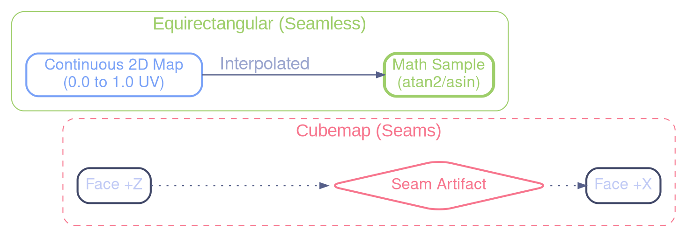

# Cubemap Seam Resolution

## 🔍 Identified Problem

The edges of the cubemap are visible as lines or artifacts. This can be caused by several factors:

1. **LOD too high**: A high `blur_lod` (4.0) uses low-resolution mipmap levels.

2. **Insufficient Resolution**: 512x512 might be too small.

3. **Filtering without seamless**: Transitions between faces are not smoothed.

4. **Edge Sampling**: Interpolation between faces is poorly handled.

## 🏁 Definitive Solution: Equirectangular Mapping

Although previous solutions (Seamless Cubemap, Increased Resolution) improved the situation, the most robust solution for this project was to **completely remove the cubemap conversion step**.

### Why?

1. **No more faces**: An equirectangular texture is a single continuous 2D rectangle. There are no longer "face edges" where seams can appear.

2. **Simplified Pipelines**: We go directly from the HDR image (panoramic) to rendering, without passing through a conversion compute shader.

3. **Less Memory**: No need to allocate an additional cubemap texture.

4. **Max Quality**: We sample the source data directly.

### Visual Comparison

### Comparison: Cubemap vs Equirectangular

| Feature     | Cubemap (Old)         | Equirectangular (Current)    |
| ----------- | --------------------- | ---------------------------- |
| Seams       | Possible at edges     | **Impossible**               |
| Complexity  | High (Compute Shader) | **Low** (Direct)             |
| Artifacts   | Mipmapping at corners | **None** (Continuous linear) |
| Flexibility | Industry standard     | Ideal for HDR visualizers    |

### Software Implementation

Switching to equirectangular allowed removing:

- The compute shader `equirect2cube.glsl`.

- The functions `texture_create_env_cubemap` and `texture_build_env_cubemap`.

- The complexity of managing 6 faces.

### Conclusion

For skybox rendering where the fidelity of the source HDR image is paramount, direct equirectangular mapping is the most "suckless" solution: less code, higher quality.
