# Index des diagrammes

*Cette page est générée automatiquement. **Survolez les titres** pour prévisualiser le diagramme.*

## [Chargeur de carte d'environnement asynchrone](../async_loader/)

  <a href="../async_loader/#scheduling-sequence" style="font-weight: 500; font-size: 1.1em; color: var(--md-typeset-a-color);">Séquence de planification</a> : La complexité de l'approche basée sur les PBO est gérée en distribuant le travail sur plusieurs frames :
  

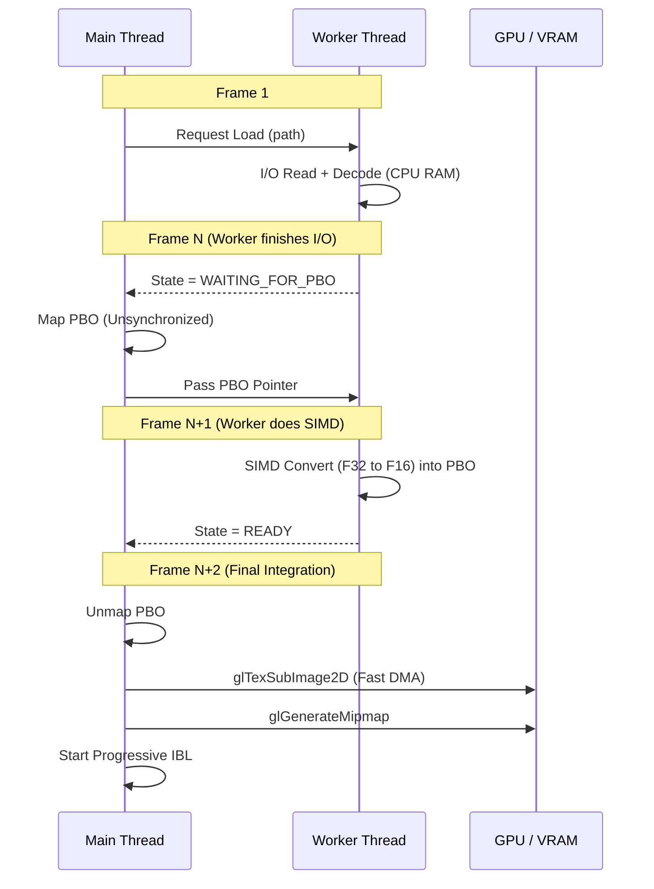
```mermaid
%%{init: {
"theme": "dark",
"themeVariables": {
"primaryColor": "#24283b",
"primaryTextColor": "#ffffff",
"primaryBorderColor": "#7aa2f7",
"lineColor": "#7aa2f7",
"signalColor": "#ffffff",
"signalTextColor": "#ffffff",
"messageColor": "#ffffff",
"messageTextColor": "#ffffff",
"labelTextColor": "#ffffff",
"actorTextColor": "#ffffff",
"actorBorder": "#7aa2f7",
"actorBkg": "#24283b",
"noteBkgColor": "#e0af68",
"noteTextColor": "#1a1b26"
}
}%%
sequenceDiagram
participant M as Main Thread
participant W as Worker Thread
participant G as GPU / VRAM
Note over M,W: Frame 1
M->>W: Request Load (path)
W->>W: I/O Read + Decode (CPU RAM)
Note over M,W: Frame N (Worker finishes I/O)
W-->>M: State = WAITING_FOR_PBO
M->>M: Map PBO (Unsynchronized)
M->>W: Pass PBO Pointer
Note over M,W: Frame N+1 (Worker does SIMD)
W->>W: SIMD Convert (F32 to F16) into PBO
W-->>M: State = READY
Note over M,W: Frame N+2 (Final Integration)
M->>M: Unmap PBO
M->>G: glTexSubImage2D (Fast DMA)
M->>G: glGenerateMipmap
M->>M: Start Progressive IBL
```

  

## [Stratégie d'upload de textures asynchrone](../async_pbo/)

  <a href="../async_pbo/#architecture-overview" style="font-weight: 500; font-size: 1.1em; color: var(--md-typeset-a-color);">Vue d'ensemble de l'architecture</a> : Upload monolithique : même avec les PBO, effectuer tout le travail GPU (allocation de stockage de texture, upload de données, génération de mipmaps) en une seule frame crée un pic de ~60ms.
  

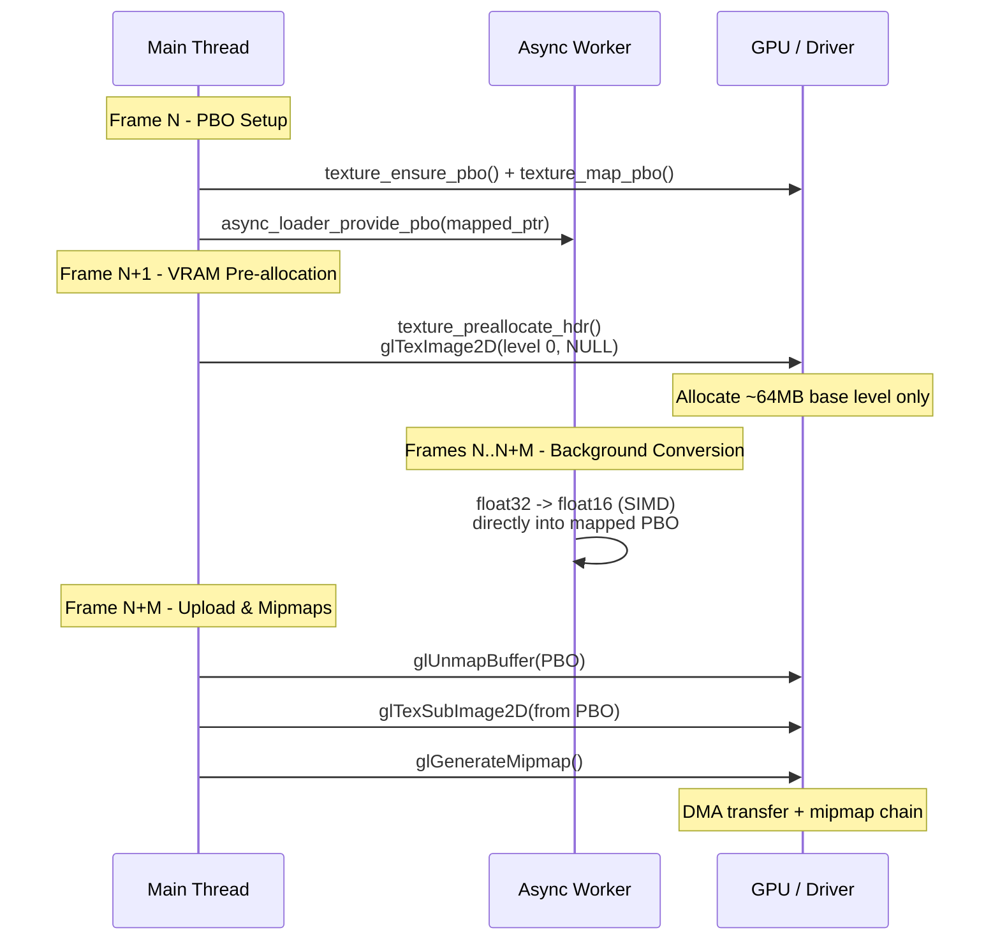
```mermaid
%%{init: {
"theme": "dark",
"themeVariables": {
"signalTextColor": "#ffffff",
"messageTextColor": "#ffffff",
"labelTextColor": "#ffffff",
"actorTextColor": "#ffffff",
"noteBkgColor": "#e0af68",
"noteTextColor": "#1a1b26",
"lineColor": "#7aa2f7"
}
}%%
sequenceDiagram
participant Main as Main Thread
participant Worker as Async Worker
participant GPU as GPU / Driver
Note over Main: Frame N - PBO Setup
Main->>GPU: texture_ensure_pbo() + texture_map_pbo()
Main->>Worker: async_loader_provide_pbo(mapped_ptr)
Note over Main: Frame N+1 - VRAM Pre-allocation
Main->>GPU: texture_preallocate_hdr()<br/>glTexImage2D(level 0, NULL)
Note over GPU: Allocate ~64MB base level only
Note over Worker: Frames N..N+M - Background Conversion
Worker->>Worker: float32 -> float16 (SIMD)<br/>directly into mapped PBO
Note over Main: Frame N+M - Upload & Mipmaps
Main->>GPU: glUnmapBuffer(PBO)
Main->>GPU: glTexSubImage2D(from PBO)
Main->>GPU: glGenerateMipmap()
Note over GPU: DMA transfer + mipmap chain
```

  

  <a href="../async_pbo/#the-strategy-spread-work-across-3-frames" style="font-weight: 500; font-size: 1.1em; color: var(--md-typeset-a-color);">La stratégie : distribuer le travail sur 3 frames</a> : Au lieu de tout faire en une frame, le travail est distribué en utilisant le protocole multi-étapes du chargeur asynchrone comme frontières naturelles de frames :
  

```mermaid
gantt
title Frame Time Distribution
dateFormat X
axisFormat %s ms
section Before (1 frame)
PBO Setup + TexStorage + Upload + Mipmap + 3×glGetError :done, 0, 60
section After (3 frames)
Frame N  - PBO Setup & Map        :active, 0, 5
Frame N+1 - TexPrealloc (level 0) :active, 8, 15
Frame N+M - Upload + Mipmap       :active, 18, 38
```

  

  <a href="../async_pbo/#deferred-pre-allocation-flow" style="font-weight: 500; font-size: 1.1em; color: var(--md-typeset-a-color);">Flux de pré-allocation différée</a> : Coût : ~20-30ms (travail GPU incompressible)
  

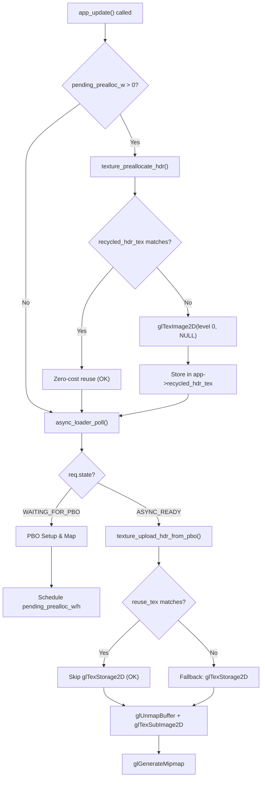
```mermaid
%%{init: {
"theme": "dark",
"themeVariables": {
"primaryColor": "#24283b",
"primaryTextColor": "#ffffff",
"primaryBorderColor": "#7aa2f7",
"lineColor": "#7aa2f7",
"labelTextColor": "#ffffff",
"actorTextColor": "#ffffff",
"actorBorder": "#7aa2f7",
"actorBkg": "#24283b",
"noteBkgColor": "#e0af68",
"noteTextColor": "#1a1b26"
}
}%%
flowchart TD
A["app_update() called"] --> B{"pending_prealloc_w > 0?"}
B -- Yes --> C["texture_preallocate_hdr()"]
C --> D{"recycled_hdr_tex matches?"}
D -- Yes --> E["Zero-cost reuse (OK)"]
D -- No --> F["glTexImage2D(level 0, NULL)"]
F --> G["Store in app->recycled_hdr_tex"]
B -- No --> H["async_loader_poll()"]
E --> H
G --> H
H --> I{"req.state?"}
I -- WAITING_FOR_PBO --> J["PBO Setup & Map"]
J --> K["Schedule pending_prealloc_w/h"]
I -- ASYNC_READY --> L["texture_upload_hdr_from_pbo()"]
L --> M{"reuse_tex matches?"}
M -- Yes --> N["Skip glTexStorage2D (OK)"]
M -- No --> O["Fallback: glTexStorage2D"]
N --> P["glUnmapBuffer + glTexSubImage2D"]
O --> P
P --> Q["glGenerateMipmap"]
```

  

  <a href="../async_pbo/#why-glgeterror-stalls-the-pipeline" style="font-weight: 500; font-size: 1.1em; color: var(--md-typeset-a-color);">Pourquoi `glGetError()` bloque le pipeline</a> : `glGetError()` est une requête synchrone : le CPU doit attendre que le GPU traite toutes les commandes en attente avant de retourner l'état d'erreur. Dans une architecture pipelinée, cela annule l'intérêt des uploads asynchrones.
  

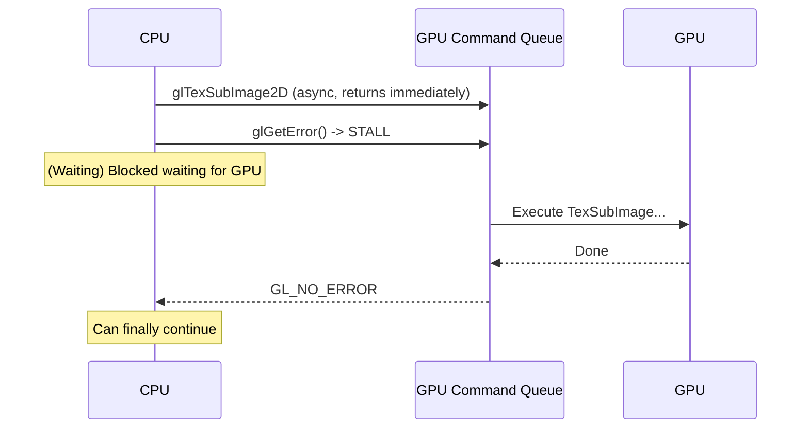
```mermaid
%%{init: {
"theme": "dark",
"themeVariables": {
"signalTextColor": "#ffffff",
"messageTextColor": "#ffffff",
"labelTextColor": "#ffffff",
"actorTextColor": "#ffffff",
"noteBkgColor": "#e0af68",
"noteTextColor": "#1a1b26",
"lineColor": "#7aa2f7"
}
}%%
sequenceDiagram
participant CPU
participant CmdQueue as GPU Command Queue
participant GPU
CPU->>CmdQueue: glTexSubImage2D (async, returns immediately)
CPU->>CmdQueue: glGetError() -> STALL
Note over CPU: (Waiting) Blocked waiting for GPU
CmdQueue->>GPU: Execute TexSubImage...
GPU-->>CmdQueue: Done
CmdQueue-->>CPU: GL_NO_ERROR
Note over CPU: Can finally continue
```

  

## [Transitions entre environnements HDR](../env_transitions.fr/)

  <a href="../env_transitions.fr/#machine-a-etats" style="font-weight: 500; font-size: 1.1em; color: var(--md-typeset-a-color);">Machine à états</a> : | Écran noir | Fondu vers le noir, chargement, fondu depuis le noir | `ALT+T` |
  

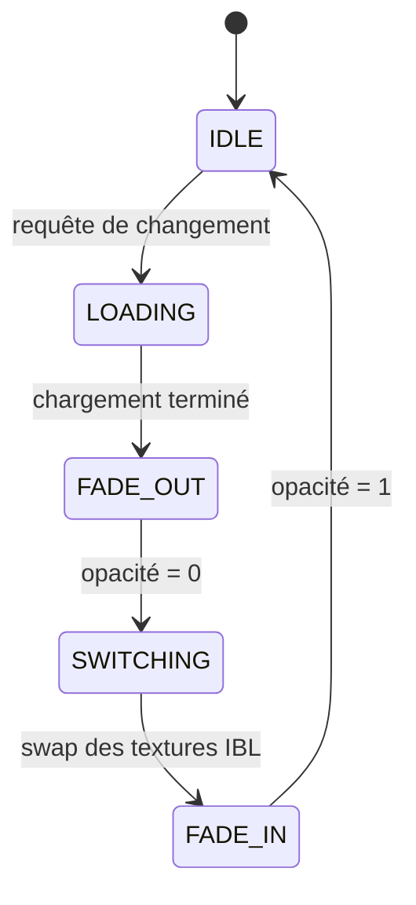
```mermaid
stateDiagram-v2
[*] --> IDLE
IDLE --> LOADING : requête de changement
LOADING --> FADE_OUT : chargement terminé
FADE_OUT --> SWITCHING : opacité = 0
SWITCHING --> FADE_IN : swap des textures IBL
FADE_IN --> IDLE : opacité = 1
```

  

## [Transitions d'environnement](../env_transitions/)

  <a href="../env_transitions/#state-machine" style="font-weight: 500; font-size: 1.1em; color: var(--md-typeset-a-color);">Machine à états</a> : Les transitions sont gouvernées par une machine à états dans `src/appenv.c`.
  

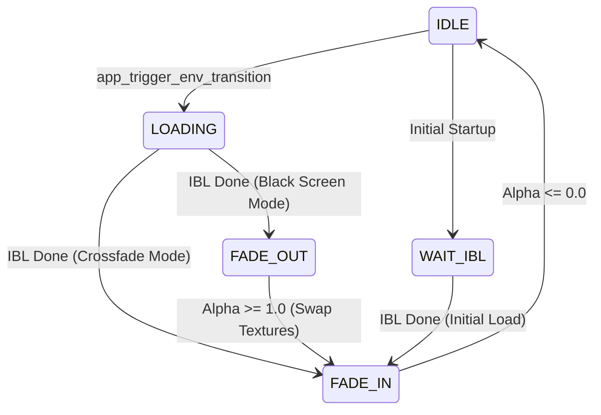
```mermaid
stateDiagram-v2
state "  IDLE  " as idle
state "  LOADING  " as loading
state "  FADE_OUT  " as fade_out
state "  FADE_IN  " as fade_in
state "  WAIT_IBL  " as wait_ibl
idle --> loading : app_trigger_env_transition
loading --> fade_out : IBL Done (Black Screen Mode)
loading --> fade_in : IBL Done (Crossfade Mode)
fade_out --> fade_in : Alpha >= 1.0 (Swap Textures)
fade_in --> idle : Alpha <= 0.0
idle --> wait_ibl : Initial Startup
wait_ibl --> fade_in : IBL Done (Initial Load)
```

  

## [Test agressif avec ASan](../fullscreen_deadlock/)

  <a href="../fullscreen_deadlock/#sequence-before-deadlock" style="font-weight: 500; font-size: 1.1em; color: var(--md-typeset-a-color);">Séquence avant (BLOCAGE)</a> : L'application est bloquée dans le callback de redimensionnement, essayant d'allouer/supprimer des ressources GPU, mais la file de commandes du pilote est souvent verrouillée ou bloquée pendant la négociation de changement de mode.
  

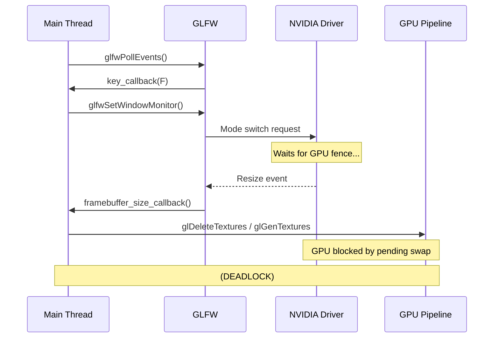
```mermaid
%%{init: {
"theme": "base",
"themeVariables": {
"primaryColor": "#7aa2f7",
"primaryTextColor": "#ffffff",
"primaryBorderColor": "#7aa2f7",
"lineColor": "#9aa5ce",
"secondaryColor": "#f7768e",
"tertiaryColor": "#1a1b26",
"noteBkgColor": "#e0af68",
"noteTextColor": "#1a1b26",
"actorBkg": "#24283b",
"actorBorder": "#7aa2f7",
"actorTextColor": "#ffffff",
"actorLineColor": "#7aa2f7",
"labelBoxBkgColor": "#1a1b26",
"labelBoxBorderColor": "#7aa2f7",
"labelTextColor": "#ffffff",
"loopTextColor": "#ffffff",
"messageTextColor": "#ffffff",
"signalTextColor": "#ffffff",
"activationBkgColor": "#414868",
"sequenceNumberColor": "#ffffff"
}
}%%
sequenceDiagram
participant Main as Main Thread
participant GLFW as GLFW
participant Driver as NVIDIA Driver
participant GPU as GPU Pipeline
Main->>GLFW: glfwPollEvents()
GLFW->>Main: key_callback(F)
Main->>GLFW: glfwSetWindowMonitor()
GLFW->>Driver: Mode switch request
Note over Driver: Waits for GPU fence...
Driver-->>GLFW: Resize event
GLFW->>Main: framebuffer_size_callback()
Main->>GPU: glDeleteTextures / glGenTextures
Note over GPU,Driver: GPU blocked by pending swap
Note over Main,GPU: (DEADLOCK)
```

  

  <a href="../fullscreen_deadlock/#sequence-after-fixed" style="font-weight: 500; font-size: 1.1em; color: var(--md-typeset-a-color);">Séquence après (CORRIGÉ)</a> : La solution est un motif de redimensionnement différé qui découple l'événement de redimensionnement du gestionnaire de fenêtres de la recréation coûteuse des ressources GPU.
  

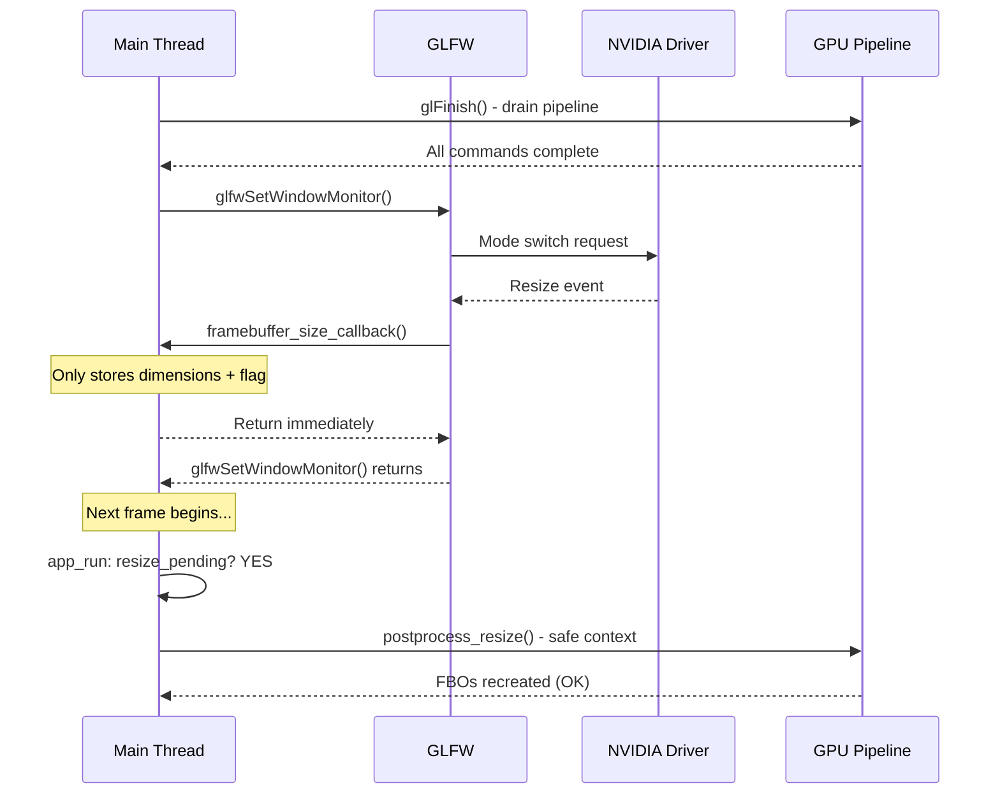
```mermaid
%%{init: {
"theme": "base",
"themeVariables": {
"primaryColor": "#7aa2f7",
"primaryTextColor": "#ffffff",
"primaryBorderColor": "#7aa2f7",
"lineColor": "#9aa5ce",
"secondaryColor": "#f7768e",
"tertiaryColor": "#1a1b26",
"noteBkgColor": "#e0af68",
"noteTextColor": "#1a1b26",
"actorBkg": "#24283b",
"actorBorder": "#7aa2f7",
"actorTextColor": "#ffffff",
"actorLineColor": "#7aa2f7",
"labelBoxBkgColor": "#1a1b26",
"labelBoxBorderColor": "#7aa2f7",
"labelTextColor": "#ffffff",
"loopTextColor": "#ffffff",
"messageTextColor": "#ffffff",
"signalTextColor": "#ffffff",
"activationBkgColor": "#414868",
"sequenceNumberColor": "#ffffff"
}
}%%
sequenceDiagram
participant Main as Main Thread
participant GLFW as GLFW
participant Driver as NVIDIA Driver
participant GPU as GPU Pipeline
Main->>GPU: glFinish() - drain pipeline
GPU-->>Main: All commands complete
Main->>GLFW: glfwSetWindowMonitor()
GLFW->>Driver: Mode switch request
Driver-->>GLFW: Resize event
GLFW->>Main: framebuffer_size_callback()
Note over Main: Only stores dimensions + flag
Main-->>GLFW: Return immediately
GLFW-->>Main: glfwSetWindowMonitor() returns
Note over Main: Next frame begins...
Main->>Main: app_run: resize_pending? YES
Main->>GPU: postprocess_resize() - safe context
GPU-->>Main: FBOs recreated (OK)
```

  

## [Illumination globale (1 rebond)](../global_illumination.fr/)

  <a href="../global_illumination.fr/#architecture-de-limplementation" style="font-weight: 500; font-size: 1.1em; color: var(--md-typeset-a-color);">Architecture de l'implémentation</a> : Le système combine un calcul CPU asynchrone et un échantillonnage GPU sans aucune interruption (stall) du thread de rendu principal.
  

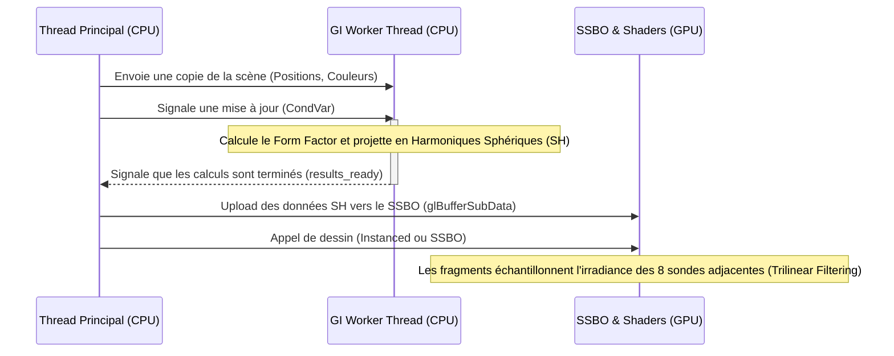
```mermaid
%%{init: {
"theme": "dark",
"themeVariables": {
"signalTextColor": "#ffffff",
"messageTextColor": "#ffffff",
"labelTextColor": "#ffffff",
"actorTextColor": "#ffffff",
"noteBkgColor": "#e0af68",
"noteTextColor": "#1a1b26",
"lineColor": "#7aa2f7"
}
}%%
sequenceDiagram
participant Main as Thread Principal (CPU)
participant Worker as GI Worker Thread (CPU)
participant GPU as SSBO & Shaders (GPU)
Main->>Worker: Envoie une copie de la scène (Positions, Couleurs)
Main->>Worker: Signale une mise à jour (CondVar)
activate Worker
Note over Worker: Calcule le Form Factor et projette en Harmoniques Sphériques (SH)
Worker-->>Main: Signale que les calculs sont terminés (results_ready)
deactivate Worker
Main->>GPU: Upload des données SH vers le SSBO (glBufferSubData)
Main->>GPU: Appel de dessin (Instanced ou SSBO)
Note over GPU: Les fragments échantillonnent l'irradiance des 8 sondes adjacentes (Trilinear Filtering)
```

  

## [Global Illumination (1-Bounce)](../global_illumination/)

  <a href="../global_illumination/#implementation-architecture" style="font-weight: 500; font-size: 1.1em; color: var(--md-typeset-a-color);">Architecture de l'implémentation</a> : Le système combine un calcul CPU asynchrone et un échantillonnage GPU, sans interruption (stall) du thread de rendu principal.
  

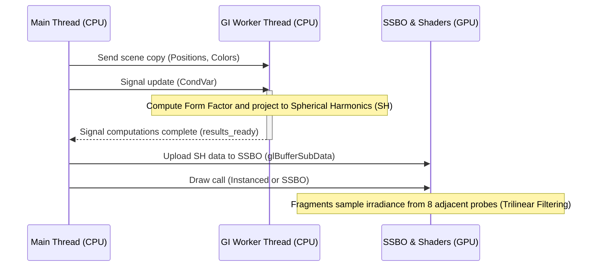
```mermaid
%%{init: {
"theme": "dark",
"themeVariables": {
"signalTextColor": "#ffffff",
"messageTextColor": "#ffffff",
"labelTextColor": "#ffffff",
"actorTextColor": "#ffffff",
"noteBkgColor": "#e0af68",
"noteTextColor": "#1a1b26",
"lineColor": "#7aa2f7"
}
}%%
sequenceDiagram
participant Main as Main Thread (CPU)
participant Worker as GI Worker Thread (CPU)
participant GPU as SSBO & Shaders (GPU)
Main->>Worker: Send scene copy (Positions, Colors)
Main->>Worker: Signal update (CondVar)
activate Worker
Note over Worker: Compute Form Factor and project to Spherical Harmonics (SH)
Worker-->>Main: Signal computations complete (results_ready)
deactivate Worker
Main->>GPU: Upload SH data to SSBO (glBufferSubData)
Main->>GPU: Draw call (Instanced or SSBO)
Note over GPU: Fragments sample irradiance from 8 adjacent probes (Trilinear Filtering)
```

  

## [Analyse de l'implémentation du Motion Blur](../motion_blur_analysis.fr/)

  <a href="../motion_blur_analysis.fr/#pipeline-de-rendu" style="font-weight: 500; font-size: 1.1em; color: var(--md-typeset-a-color);">Pipeline de rendu</a> : L'architecture actuelle repose sur des principes modernes de rendu basés sur l'approche Tile-Based / Neighbor Max, initialement introduite par Jean-Yves Bouguet et les chercheurs en rendu temps réel. L'idée principale est d'éviter les &quot;fuites&quot; de flou lorsqu'un objet rapide passe devant un arrière-plan fixe, un artefact très commun dans les premières implémentations de ce post-process.
  

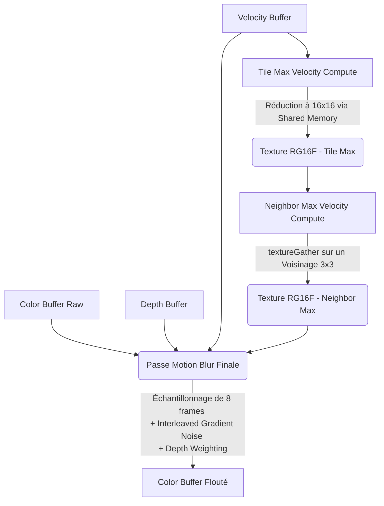
```mermaid
graph TD
V[Velocity Buffer] --> T[Tile Max Velocity Compute]
T -->|Réduction à 16x16 via Shared Memory| TTex(Texture RG16F - Tile Max)
TTex --> N[Neighbor Max Velocity Compute]
N -->|textureGather sur un Voisinage 3x3| NTex(Texture RG16F - Neighbor Max)
C[Color Buffer Raw] --> M(Passe Motion Blur Finale)
D[Depth Buffer] --> M
V --> M
NTex --> M
M -->|Échantillonnage de 8 frames \n+ Interleaved Gradient Noise \n+ Depth Weighting| O[Color Buffer Flouté]
```

  

  <a href="../motion_blur_analysis.fr/#4-lexemple-de-street-fighter-6-re-engine" style="font-weight: 500; font-size: 1.1em; color: var(--md-typeset-a-color);">4. L'Exemple de Street Fighter 6 (RE Engine)</a> : Contrairement à du flou Linéaire standard (« je prends un vecteur et je trace une ligne droite »), le moteur de Capcom stocke l'information de l'accélération en plus de la vitesse. L'échantillonnage de Flou est ainsi &quot;courbé&quot; dans l'espace afin de simuler la trajectoire radiale des membres et poings.
  

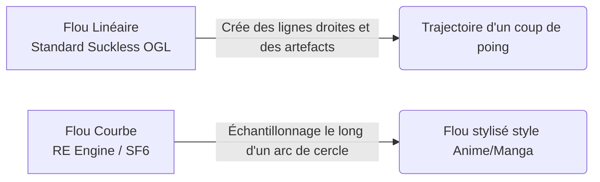
```mermaid
graph LR
A[Flou Linéaire \nStandard Suckless OGL] -->|Crée des lignes droites et des artefacts| B(Trajectoire d'un coup de poing)
C[Flou Courbe \nRE Engine / SF6] -->|Échantillonnage le long d'un arc de cercle| D(Flou stylisé style Anime/Manga)
```

  

## [Mode Performance et Notifications](../perf_and_notifications/)

  <a href="../perf_and_notifications/#architecture" style="font-weight: 500; font-size: 1.1em; color: var(--md-typeset-a-color);">Architecture</a> : 2. Natif : Repli sur les syscalls de scheduling Linux (`sched_setscheduler`, `setpriority`).
  

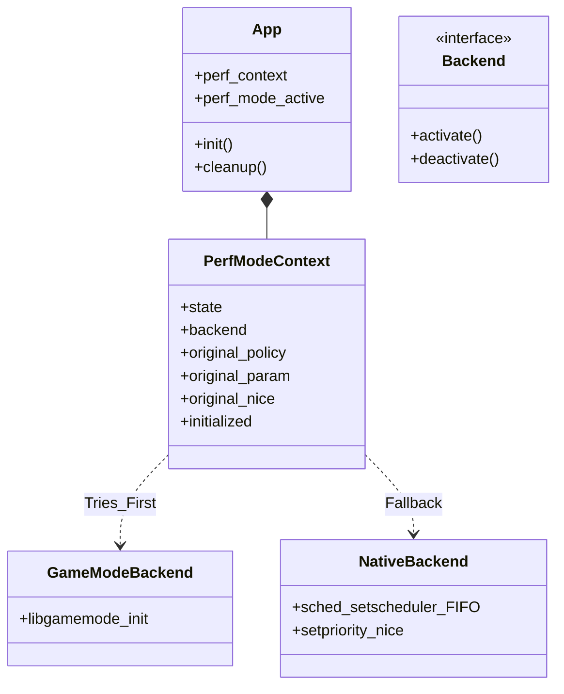
```mermaid
classDiagram
class App {
+perf_context
+perf_mode_active
+init()
+cleanup()
}
class PerfModeContext {
+state
+backend
+original_policy
+original_param
+original_nice
+initialized
}
class Backend
<<interface>> Backend
Backend : +activate()
Backend : +deactivate()
class GameModeBackend {
+libgamemode_init
}
class NativeBackend {
+sched_setscheduler_FIFO
+setpriority_nice
}
App *-- PerfModeContext
PerfModeContext ..> GameModeBackend : Tries_First
PerfModeContext ..> NativeBackend : Fallback
```

  

  <a href="../perf_and_notifications/#design" style="font-weight: 500; font-size: 1.1em; color: var(--md-typeset-a-color);">Conception</a> : Remplacement FIFO : Si le buffer est plein, la notification active la plus ancienne est écrasée.
  

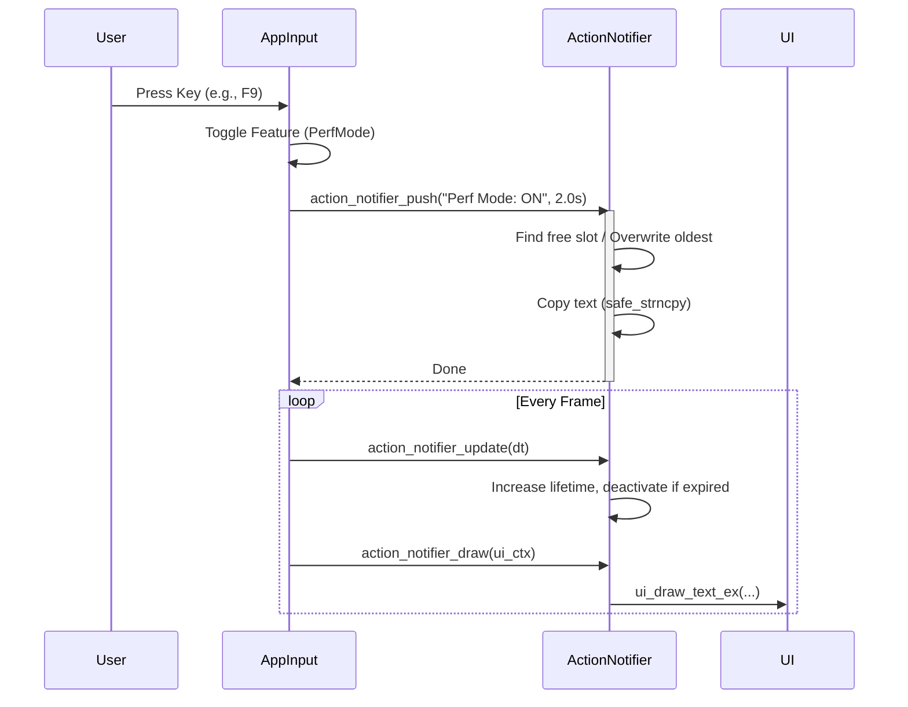
```mermaid
sequenceDiagram
participant User
participant AppInput
participant ActionNotifier
participant UI
User->>AppInput: Press Key (e.g., F9)
AppInput->>AppInput: Toggle Feature (PerfMode)
AppInput->>ActionNotifier: action_notifier_push("Perf Mode: ON", 2.0s)
activate ActionNotifier
ActionNotifier->>ActionNotifier: Find free slot / Overwrite oldest
ActionNotifier->>ActionNotifier: Copy text (safe_strncpy)
ActionNotifier-->>AppInput: Done
deactivate ActionNotifier
loop Every Frame
AppInput->>ActionNotifier: action_notifier_update(dt)
ActionNotifier->>ActionNotifier: Increase lifetime, deactivate if expired
AppInput->>ActionNotifier: action_notifier_draw(ui_ctx)
ActionNotifier->>UI: ui_draw_text_ex(...)
end
```

  

## [Couche d'abstraction de portabilité (PAL)](../portability_pal/)

  <a href="../portability_pal/#architecture" style="font-weight: 500; font-size: 1.1em; color: var(--md-typeset-a-color);">Architecture</a> : La PAL agit comme intermédiaire entre la logique de l'application principale et le système d'exploitation sous-jacent.
  

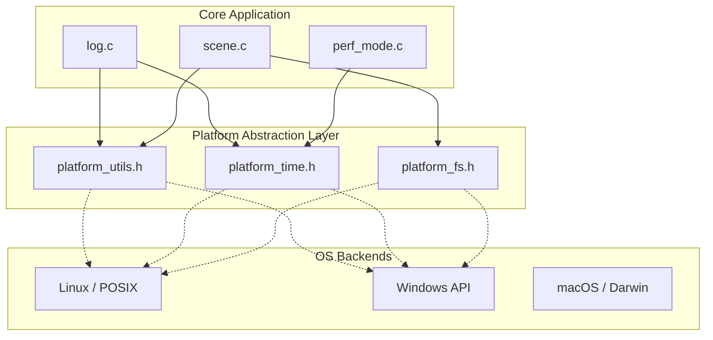
```mermaid
graph TD
subgraph Core Application
A[log.c]
B[scene.c]
C[perf_mode.c]
end
subgraph PAL [Platform Abstraction Layer]
D[platform_utils.h]
E[platform_time.h]
F[platform_fs.h]
end
subgraph OS Backends
G[Linux / POSIX]
H[Windows API]
I[macOS / Darwin]
end
A --> D
A --> E
B --> F
B --> D
C --> E
D -.-> G
D -.-> H
E -.-> G
E -.-> H
F -.-> G
F -.-> H
```

  

## [Architecture IBL progressive et asynchrone](../progressive_ibl/)

  <a href="../progressive_ibl/#d-specular-map-1024x1024" style="font-weight: 500; font-size: 1.1em; color: var(--md-typeset-a-color);">D. Carte spéculaire (1024×1024)</a> : Regroupement total des queues : regrouper les petits mips (3 à 10) évite de gaspiller 7 frames de latence pour des tâches minuscules (&lt;1ms chacune).
  

```mermaid
%%{init: {
"theme": "dark",
"themeVariables": {
"primaryColor": "#24283b",
"primaryTextColor": "#ffffff",
"primaryBorderColor": "#7aa2f7",
"lineColor": "#7aa2f7",
"labelTextColor": "#ffffff",
"actorTextColor": "#ffffff",
"actorBorder": "#7aa2f7",
"actorBkg": "#24283b",
"noteBkgColor": "#e0af68",
"noteTextColor": "#1a1b26"
}
}%%
flowchart LR
subgraph HeavyGroup["Heavy Workload Sliced"]
Mip0["Mip 0 4 Frames"]
Mip1["Mip 1 2 Frames"]
end
subgraph LightGroup["Fast Workload Grouped"]
Mip2["Mip 2 1 Frame"]
Tail["Mips 3-10 1 Frame"]
end
Start(["Start"]) --> Mip0
Mip0 --> Mip1
Mip1 --> Mip2
Mip2 --> Tail
Tail --> End(["Done"])
style HeavyGroup fill:#24283b,stroke:#f7768e,stroke-dasharray: 5, 5
style LightGroup fill:#24283b,stroke:#9ece6a
style Start fill:#7aa2f7,color:#ffffff
style End fill:#9ece6a,color:#ffffff
style Mip0 fill:#414868,stroke:#f7768e
style Mip1 fill:#414868,stroke:#f7768e
style Mip2 fill:#414868,stroke:#9ece6a
style Tail fill:#414868,stroke:#9ece6a
```

  

  <a href="../progressive_ibl/#43-solution-single-deferred-barrier" style="font-weight: 500; font-size: 1.1em; color: var(--md-typeset-a-color);">4.3 Solution : barrière différée unique</a> : Le chemin de cohérence est vidé.
  

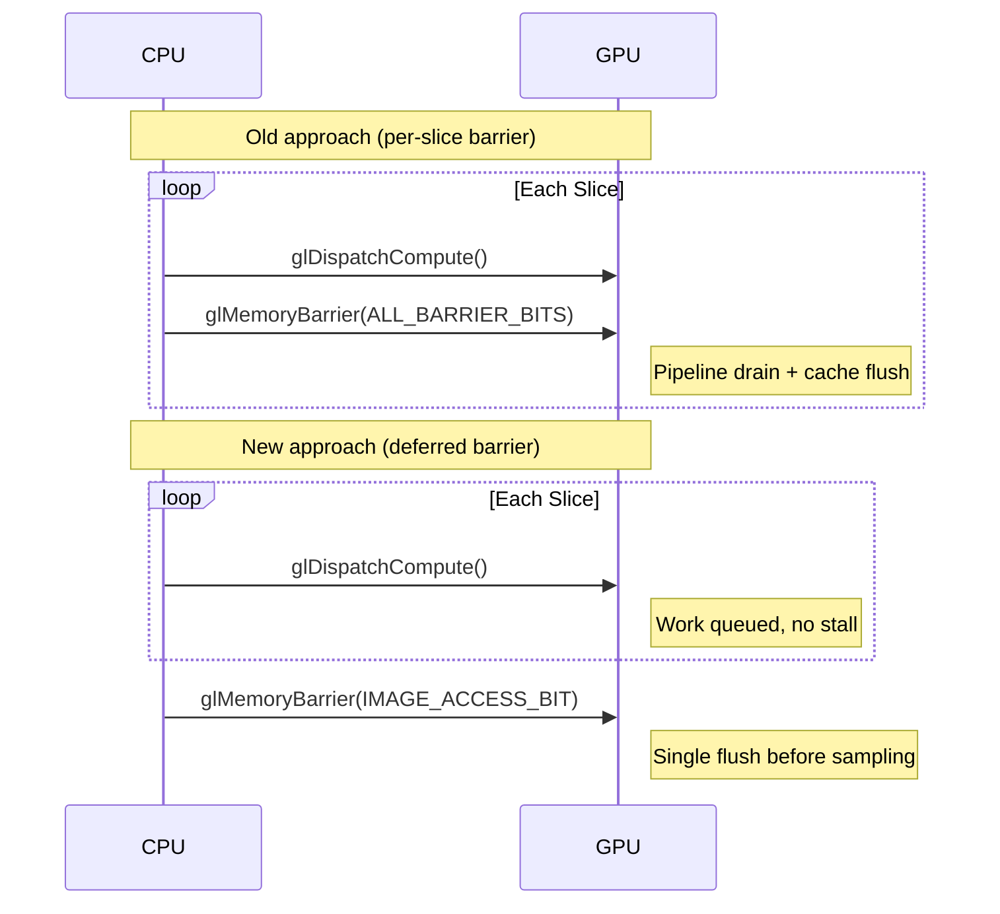
```mermaid
%%{init: {
"theme": "dark",
"themeVariables": {
"signalTextColor": "#ffffff",
"messageTextColor": "#ffffff",
"labelTextColor": "#ffffff",
"actorTextColor": "#ffffff",
"noteBkgColor": "#e0af68",
"noteTextColor": "#1a1b26",
"lineColor": "#7aa2f7"
}
}%%
sequenceDiagram
participant CPU
participant GPU
Note over CPU,GPU: Old approach (per-slice barrier)
loop Each Slice
CPU->>GPU: glDispatchCompute()
CPU->>GPU: glMemoryBarrier(ALL_BARRIER_BITS)
Note right of GPU: Pipeline drain + cache flush
end
Note over CPU,GPU: New approach (deferred barrier)
loop Each Slice
CPU->>GPU: glDispatchCompute()
Note right of GPU: Work queued, no stall
end
CPU->>GPU: glMemoryBarrier(IMAGE_ACCESS_BIT)
Note right of GPU: Single flush before sampling
```

  

## [Vue d'ensemble de la synchronisation et de l'asynchronie](../synchronization_overview/)

  <a href="../synchronization_overview/#frame-scheduling-task-interleaving" style="font-weight: 500; font-size: 1.1em; color: var(--md-typeset-a-color);">Planification des frames et entrelacement des tâches</a> : Le diagramme suivant illustre comment les différentes tâches asynchrones et progressives sont entrelacées dans la boucle principale de l'application pour éviter les pics de frame.
  

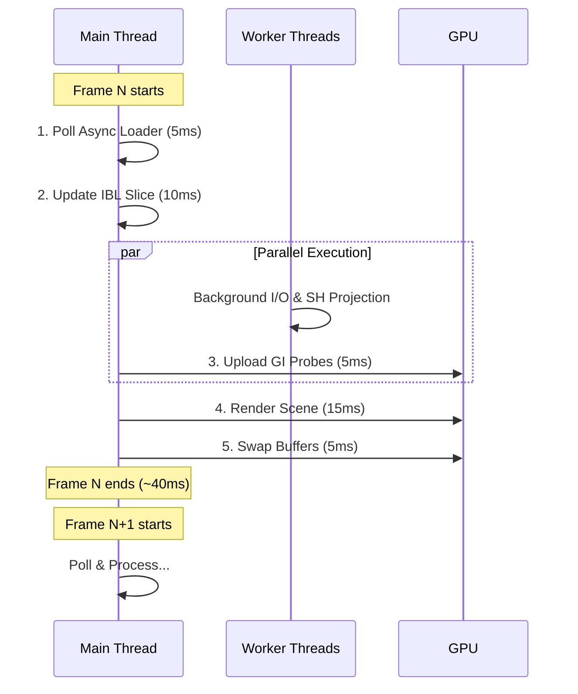
```mermaid
%%{init: {
"theme": "dark",
"themeVariables": {
"primaryColor": "#24283b",
"primaryTextColor": "#ffffff",
"primaryBorderColor": "#7aa2f7",
"lineColor": "#7aa2f7",
"signalColor": "#ffffff",
"signalTextColor": "#ffffff",
"messageColor": "#ffffff",
"messageTextColor": "#ffffff",
"labelTextColor": "#ffffff",
"actorTextColor": "#ffffff",
"actorBorder": "#7aa2f7",
"actorBkg": "#24283b",
"noteBkgColor": "#e0af68",
"noteTextColor": "#1a1b26"
}
}%%
sequenceDiagram
participant M as Main Thread
participant W as Worker Threads
participant G as GPU
Note over M: Frame N starts
M->>M: 1. Poll Async Loader (5ms)
M->>M: 2. Update IBL Slice (10ms)
par Parallel Execution
W->>W: Background I/O & SH Projection
M->>G: 3. Upload GI Probes (5ms)
end
M->>G: 4. Render Scene (15ms)
M->>G: 5. Swap Buffers (5ms)
Note over M: Frame N ends (~40ms)
Note over M: Frame N+1 starts
M->>M: Poll & Process...
```

  

## [Référence des paramètres visuels de l'interface](../ui_visual_parameters.fr/)

  <a href="../ui_visual_parameters.fr/#stabilisation-de-la-decroissance-du-survol" style="font-weight: 500; font-size: 1.1em; color: var(--md-typeset-a-color);">Stabilisation de la décroissance du survol</a> : Paramètres logiques qui garantissent un rendu &quot;Premium&quot; fluide lors de l'utilisation de la souris ou du clavier.
  

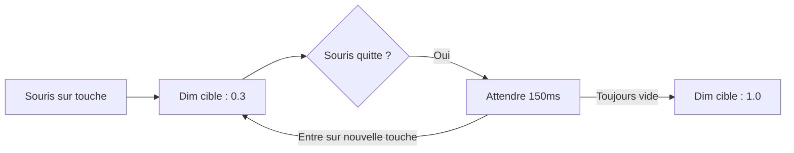
```mermaid
graph LR
A[Souris sur touche] --> B[Dim cible : 0.3]
B --> C{Souris quitte ?}
C -- Oui --> D[Attendre 150ms]
D -- Toujours vide --> E[Dim cible : 1.0]
D -- Entre sur nouvelle touche --> B
```

  

## [Référence des paramètres visuels de l'interface (EN)](../ui_visual_parameters/)

  <a href="../ui_visual_parameters/#hover-decay-stabilization" style="font-weight: 500; font-size: 1.1em; color: var(--md-typeset-a-color);">Stabilisation de la décroissance du survol</a> : Paramètres logiques qui garantissent un rendu &quot;Premium&quot; fluide lors de l'utilisation de la souris ou du clavier.
  

```mermaid
graph LR
A[Mouse over Key] --> B[Target Dim: 0.3]
B --> C{Mouse leaves?}
C -- Yes --> D[Wait 150ms]
D -- Still Empty --> E[Target Dim: 1.0]
D -- Enters New Key --> B
```

  

