# Index des Diagrammes

*Cette page est générée automatiquement. **Survolez les titres** pour voir un aperçu du diagramme.*

## [Asynchronous Environment Map Loader](../async_loader/)

  <a href="../async_loader/#scheduling-sequence" style="font-weight: 500; font-size: 1.1em; color: var(--md-typeset-a-color);">Scheduling Sequence</a> : The complexity of the PBO-based approach is handled by spliting the work across several frames:
  

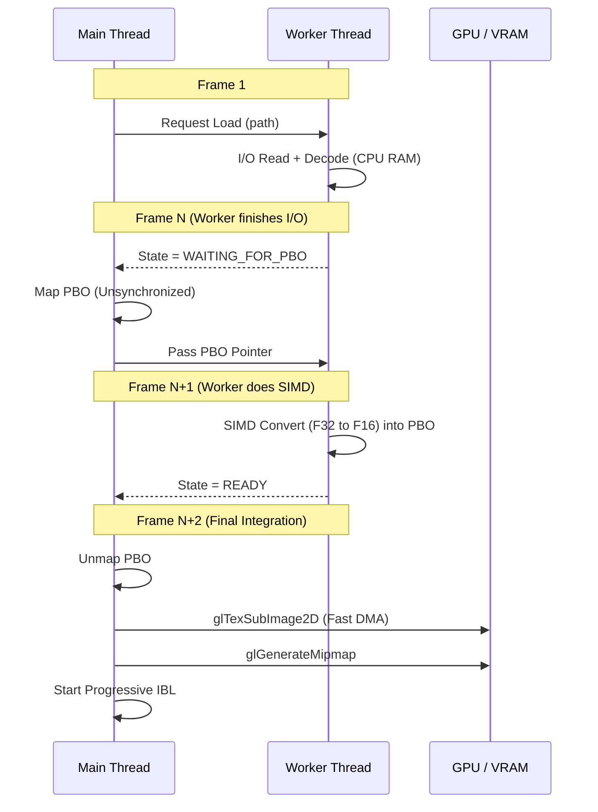

  

## [Asynchronous Texture Upload Strategy](../async_pbo/)

  <a href="../async_pbo/#architecture-overview" style="font-weight: 500; font-size: 1.1em; color: var(--md-typeset-a-color);">Architecture Overview</a> : - Monolithic Upload: Even with PBOs, performing all GPU work (texture storage allocation, data upload, mipmap generation) in a single frame creates a ~60ms spike.
  

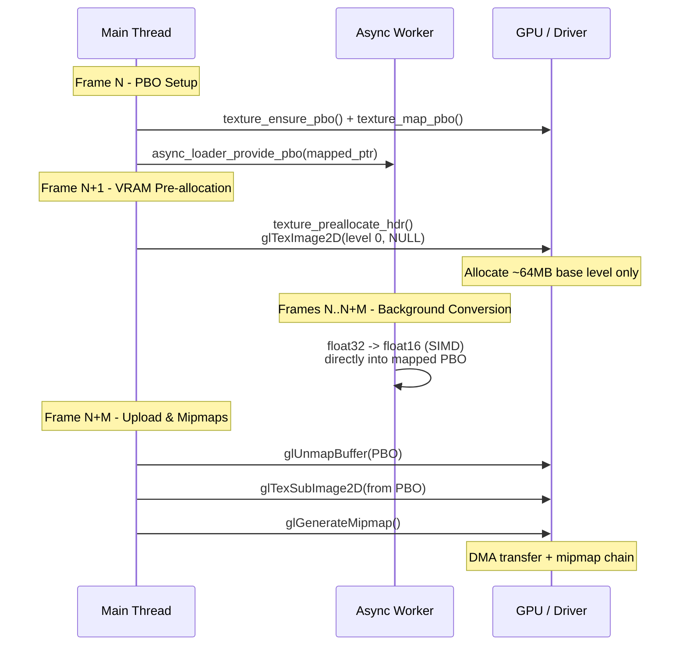

  

  <a href="../async_pbo/#the-strategy-spread-work-across-3-frames" style="font-weight: 500; font-size: 1.1em; color: var(--md-typeset-a-color);">The Strategy: Spread Work Across 3 Frames</a> : Instead of doing everything in one frame, we distribute the work using the async loader's multi-step protocol as natural frame boundaries:
  

```mermaid
gantt
title Frame Time Distribution
dateFormat X
axisFormat %s ms
section Before (1 frame)
PBO Setup + TexStorage + Upload + Mipmap + 3×glGetError :done, 0, 60
section After (3 frames)
Frame N  - PBO Setup & Map        :active, 0, 5
Frame N+1 - TexPrealloc (level 0) :active, 8, 15
Frame N+M - Upload + Mipmap       :active, 18, 38
```

  

  <a href="../async_pbo/#deferred-pre-allocation-flow" style="font-weight: 500; font-size: 1.1em; color: var(--md-typeset-a-color);">Deferred Pre-allocation Flow</a> : Cost: ~20-30ms (irreducible GPU work)
  

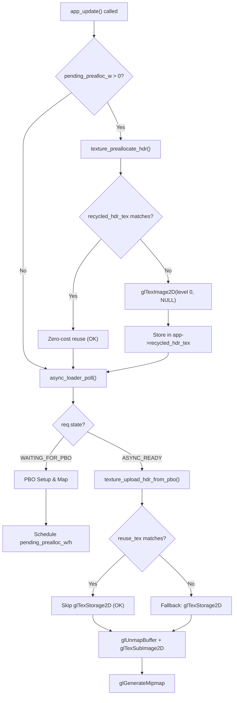

  

  <a href="../async_pbo/#why-glgeterror-stalls-the-pipeline" style="font-weight: 500; font-size: 1.1em; color: var(--md-typeset-a-color);">Why `glGetError()` Stalls the Pipeline</a> : `glGetError()` is a synchronous query: the CPU must wait for the GPU to process all pending commands before returning the error state. In a pipelined architecture, this defeats the purpose of asynchronous uploads.
  

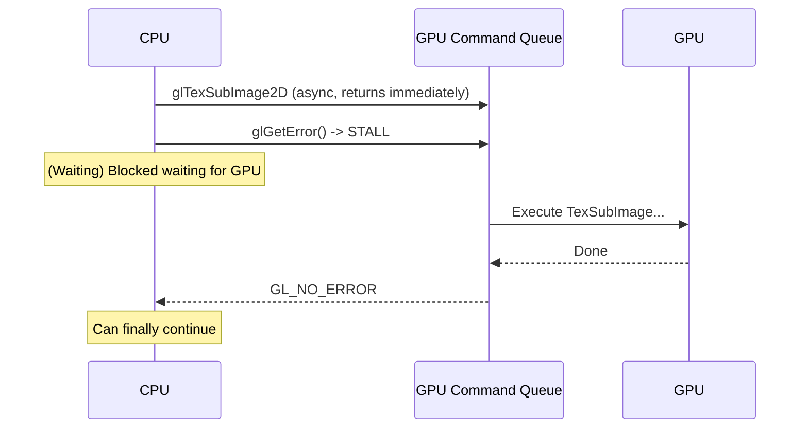

  

## [Environment Transitions](../env_transitions/)

  <a href="../env_transitions/#state-machine" style="font-weight: 500; font-size: 1.1em; color: var(--md-typeset-a-color);">State Machine</a> : Transitions are governed by a state machine in `src/appenv.c`.
  

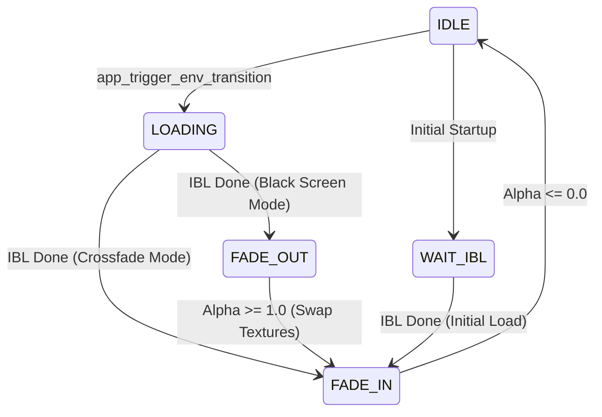

  

## [Aggressive test with ASan](../fullscreen_deadlock/)

  <a href="../fullscreen_deadlock/#sequence-before-deadlock" style="font-weight: 500; font-size: 1.1em; color: var(--md-typeset-a-color);">Sequence Before (DEADLOCK)</a> :    The Application is blocked inside the resize callback, trying to allocate/delete GPU resources, but the driver's command queue is often locked or stalled during the mode switch handshake.
  

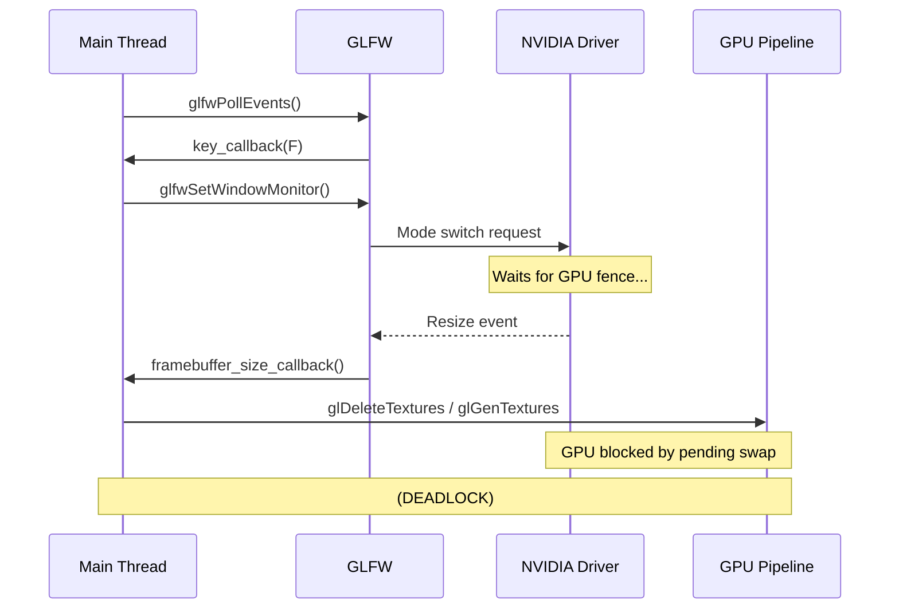

  

  <a href="../fullscreen_deadlock/#sequence-after-fixed" style="font-weight: 500; font-size: 1.1em; color: var(--md-typeset-a-color);">Sequence After (FIXED)</a> : The solution is a Deferred Resize pattern, which decouples the window manager's resize event from the expensive GPU resource recreation.
  

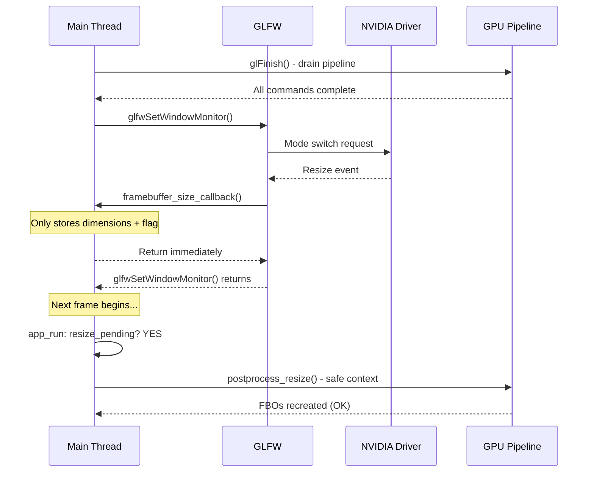

  

## [Global Illumination (1-Bounce)](../global_illumination/)

  <a href="../global_illumination/#architecture-de-limplementation" style="font-weight: 500; font-size: 1.1em; color: var(--md-typeset-a-color);">Architecture de l'Implémentation</a> : Le système combine un calcul CPU asynchrone et un échantillonnage GPU sans aucune interruption (stall) du thread de rendu principal.
  

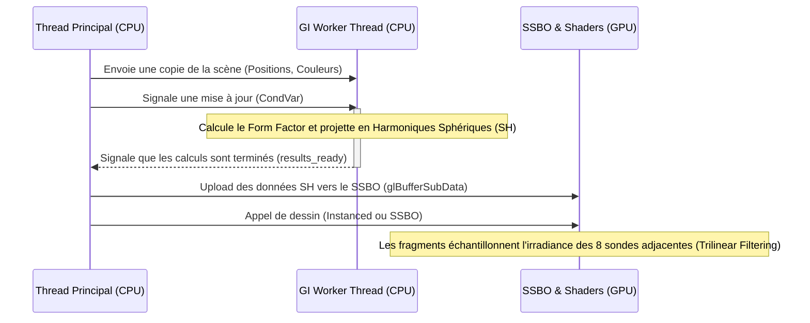

  

## [Performance Mode & Notifications](../perf_and_notifications/)

  <a href="../perf_and_notifications/#architecture" style="font-weight: 500; font-size: 1.1em; color: var(--md-typeset-a-color);">Architecture</a> : 2.  Native: Fallback using Linux scheduling syscalls (`schedsetscheduler`, `setpriority`).
  

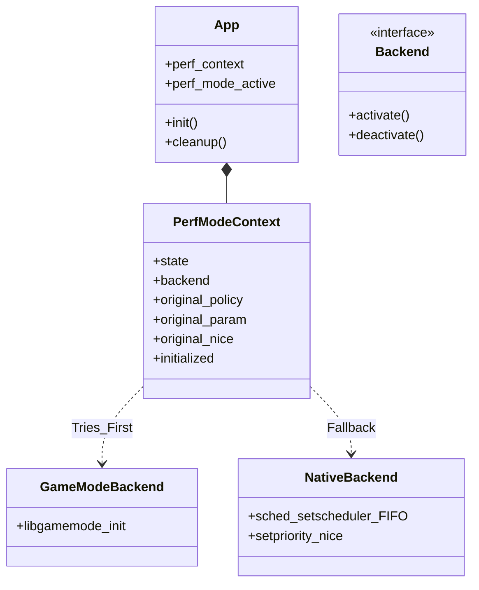

  

  <a href="../perf_and_notifications/#design" style="font-weight: 500; font-size: 1.1em; color: var(--md-typeset-a-color);">Design</a> : -   FIFO Replacement: If the buffer is full, the oldest active notification is overwritten.
  

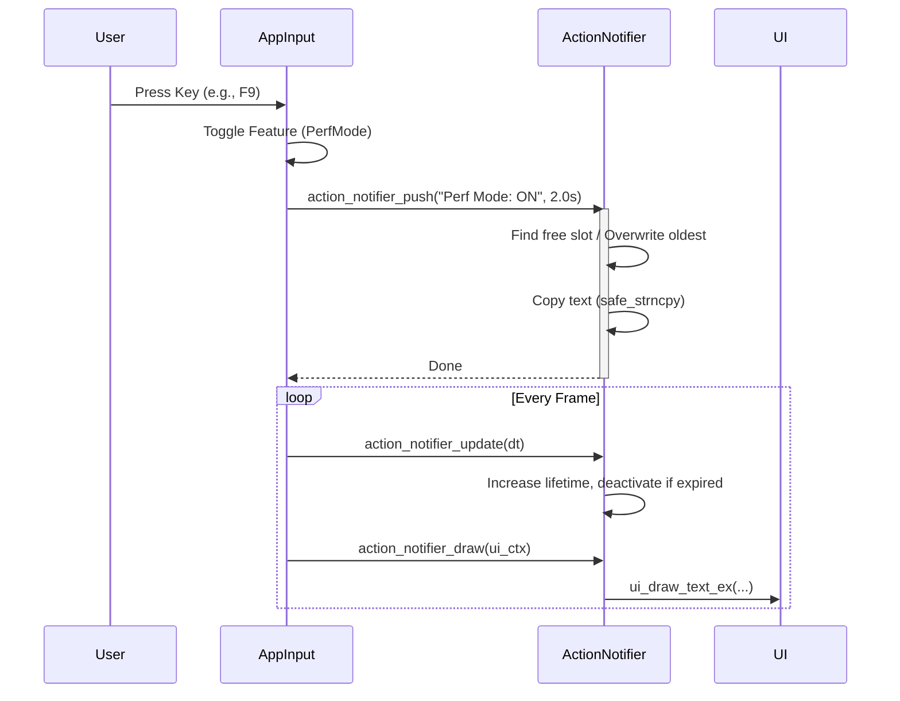

  

## [Platform Abstraction Layer (PAL)](../portability_pal/)

  <a href="../portability_pal/#architecture" style="font-weight: 500; font-size: 1.1em; color: var(--md-typeset-a-color);">Architecture</a> : The PAL acts as an intermediary between the core application logic and the underlying Operating System.
  

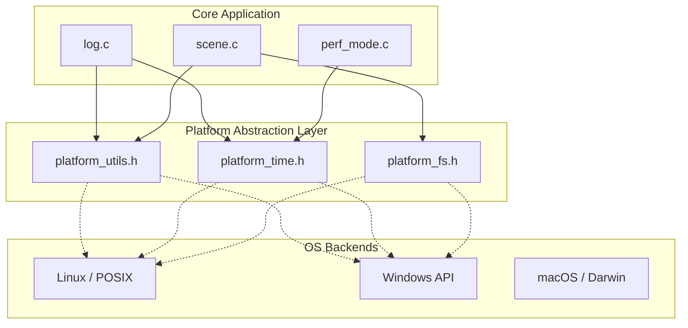

  

## [Progressive & Asynchronous IBL Architecture](../progressive_ibl/)

  <a href="../progressive_ibl/#d-specular-map-1024x1024" style="font-weight: 500; font-size: 1.1em; color: var(--md-typeset-a-color);">D. Specular Map (1024x1024)</a> : Total &quot;Tail Grouping&quot;: Grouping small mips (3 to 10) avoids wasting 7 frames of latency for tiny jobs (&lt;1ms each).
  

```mermaid
%%{init: {
"theme": "dark",
"themeVariables": {
"primaryColor": "#24283b",
"primaryTextColor": "#ffffff",
"primaryBorderColor": "#7aa2f7",
"lineColor": "#7aa2f7",
"labelTextColor": "#ffffff",
"actorTextColor": "#ffffff",
"actorBorder": "#7aa2f7",
"actorBkg": "#24283b",
"noteBkgColor": "#e0af68",
"noteTextColor": "#1a1b26"
}
}%%
flowchart LR
subgraph HeavyGroup["Heavy Workload Sliced"]
Mip0["Mip 0 4 Frames"]
Mip1["Mip 1 2 Frames"]
end
subgraph LightGroup["Fast Workload Grouped"]
Mip2["Mip 2 1 Frame"]
Tail["Mips 3-10 1 Frame"]
end
Start(["Start"]) --> Mip0
Mip0 --> Mip1
Mip1 --> Mip2
Mip2 --> Tail
Tail --> End(["Done"])
style HeavyGroup fill:#24283b,stroke:#f7768e,stroke-dasharray: 5, 5
style LightGroup fill:#24283b,stroke:#9ece6a
style Start fill:#7aa2f7,color:#ffffff
style End fill:#9ece6a,color:#ffffff
style Mip0 fill:#414868,stroke:#f7768e
style Mip1 fill:#414868,stroke:#f7768e
style Mip2 fill:#414868,stroke:#9ece6a
style Tail fill:#414868,stroke:#9ece6a
```

  

  <a href="../progressive_ibl/#43-solution-single-deferred-barrier" style="font-weight: 500; font-size: 1.1em; color: var(--md-typeset-a-color);">4.3 Solution: Single Deferred Barrier</a> : coherency path is flushed.
  

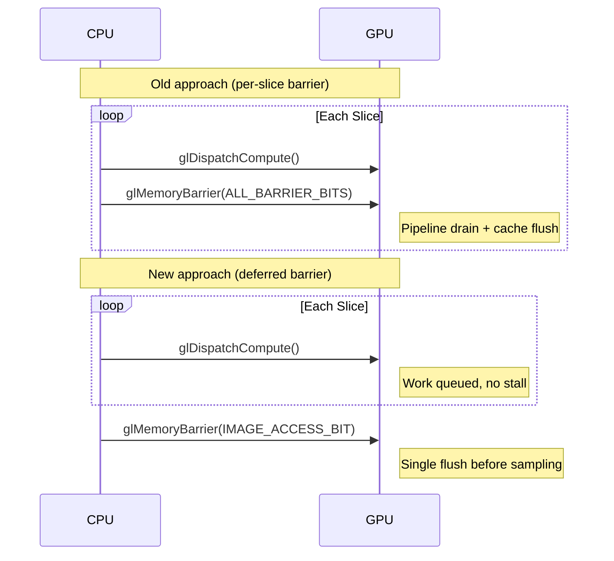

  

## [Synchronization & Asynchrony Overview](../synchronization_overview/)

  <a href="../synchronization_overview/#frame-scheduling-task-interleaving" style="font-weight: 500; font-size: 1.1em; color: var(--md-typeset-a-color);">Frame Scheduling & Task Interleaving</a> : The following diagram illustrates how the various asynchronous and progressive tasks are interleaved within the main application loop to avoid frame spikes.
  

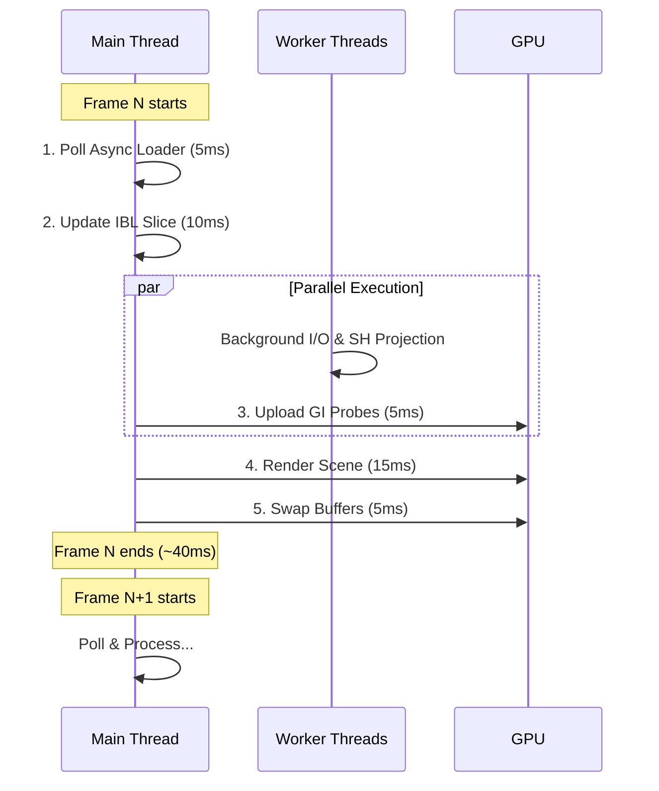

  

## [UI Visual Parameters Reference](../ui_visual_parameters/)

  <a href="../ui_visual_parameters/#hover-decay-stabilization" style="font-weight: 500; font-size: 1.1em; color: var(--md-typeset-a-color);">Hover Decay Stabilization</a> : Logic parameters that ensure a smooth &quot;Premium&quot; feel during mouse or keyboard usage.
  

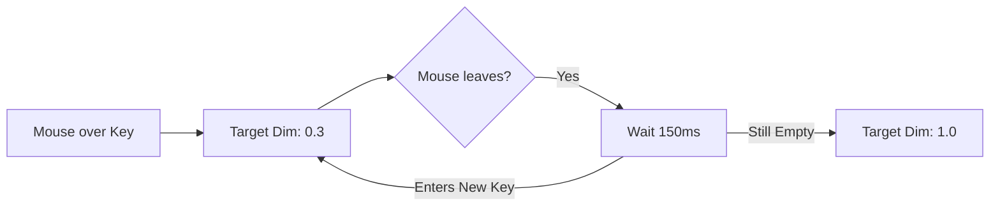

  

