# Diagram Index

*This page is auto-generated. **Hover over the titles** to preview the diagram.*

<style>
.diagram-item { position: relative; display: block; padding: 12px 0; border-bottom: 1px solid var(--md-code-bg-color); }
.mermaid-preview {
  opacity: 0;
  visibility: hidden;
  position: absolute;
  left: max(300px, 30%);
  top: -80px;
  z-index: 999;
  background: #1a1b26;
  border: 2px solid #7aa2f7;
  padding: 24px;
  border-radius: 12px;
  box-shadow: 0 15px 55px rgba(0,0,0,0.9);
  width: 750px;
  max-height: 600px;
  overflow: auto;
  pointer-events: none;
  transition: opacity 0.3s cubic-bezier(0.4, 0, 0.2, 1), transform 0.3s cubic-bezier(0.4, 0, 0.2, 1);
  transform: translateX(30px) scale(0.95);
}
.diagram-item:hover .mermaid-preview {
  opacity: 1;
  visibility: visible;
  transform: translateX(0) scale(1);
}
.mermaid-preview .mermaid { background: transparent !important; color: white !important; }
</style>

## [Anatomy of a Frame: The Complete Lifecycle of suckless-ogl](../application_lifecycle/)

<div class="diagram-item">
  <a href="../application_lifecycle/#introduction" style="font-weight: 500; font-size: 1.1em; color: var(--md-typeset-a-color);">Introduction</a> : <span style="opacity: 0.6; font-size: 0.85em;">This article traces the complete lifecycle of the application: from the first byte allocated in `main()` to the moment the GPU presents the first fully-lit frame on screen. We'll cover every layer — CPU memory, GPU resources, the X11/GLFW windowing handshake, OpenGL context creation, shader compilation, asynchronous texture loading, and the multi-pass rendering architecture that produces each frame.</span>
  <div class="mermaid-preview">

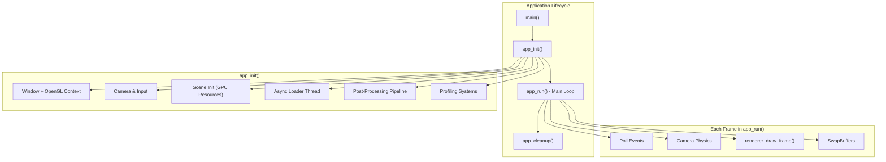

  </div>
</div>

<div class="diagram-item">
  <a href="../application_lifecycle/#21-glfw-initialization-window-hints" style="font-weight: 500; font-size: 1.1em; color: var(--md-typeset-a-color);">2.1 — GLFW Initialization & Window Hints</a> : <span style="opacity: 0.6; font-size: 0.85em;">Behind the scenes, GLFW performs an X11 handshake:</span>
  <div class="mermaid-preview">

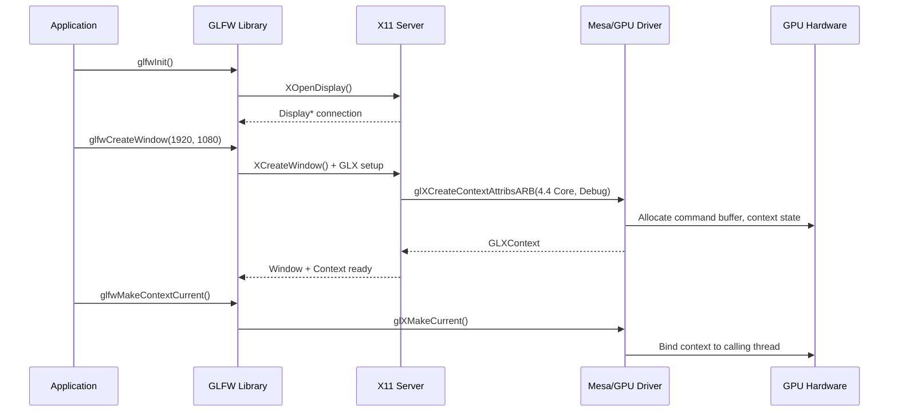

  </div>
</div>

<div class="diagram-item">
  <a href="../application_lifecycle/#31-camera" style="font-weight: 500; font-size: 1.1em; color: var(--md-typeset-a-color);">3.1 — Camera</a> : <span style="opacity: 0.6; font-size: 0.85em;">The camera uses a fixed-timestep physics model (60 Hz) with exponential smoothing for rotation. Mouse input is filtered through an EMA (Exponential Moving Average) to dampen jitter.</span>
  <div class="mermaid-preview">

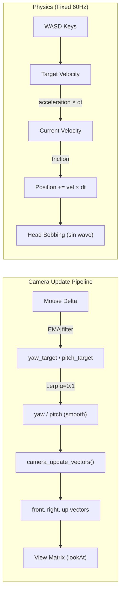

  </div>
</div>

<div class="diagram-item">
  <a href="../application_lifecycle/#32-async-loader-thread" style="font-weight: 500; font-size: 1.1em; color: var(--md-typeset-a-color);">3.2 — Async Loader Thread</a> : <span style="opacity: 0.6; font-size: 0.85em;">A dedicated POSIX thread is spawned for background I/O. It sleeps on a condition variable (`pthreadcondwait`) until work is queued. This prevents disk reads from stalling the render loop.</span>
  <div class="mermaid-preview">

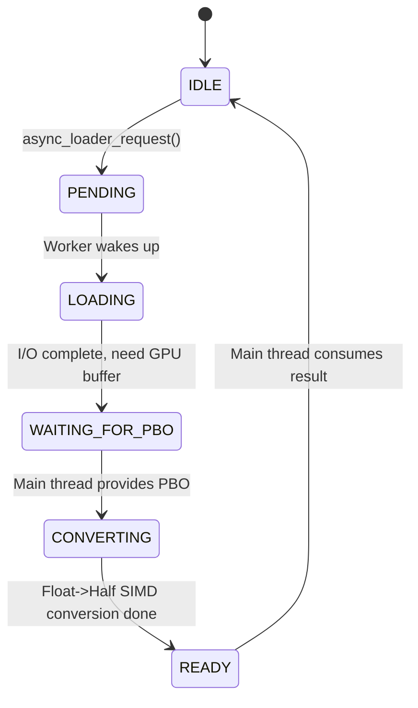

  </div>
</div>

<div class="diagram-item">
  <a href="../application_lifecycle/#42-dummy-textures-brdf-lut" style="font-weight: 500; font-size: 1.1em; color: var(--md-typeset-a-color);">4.2 — Dummy Textures & BRDF LUT</a> : <span style="opacity: 0.6; font-size: 0.85em;">This texture maps `(NdotV, roughness)` → `(F0scale, F0bias)` and is used every frame by the PBR fragment shader to avoid expensive real-time BRDF integration.</span>
  <div class="mermaid-preview">

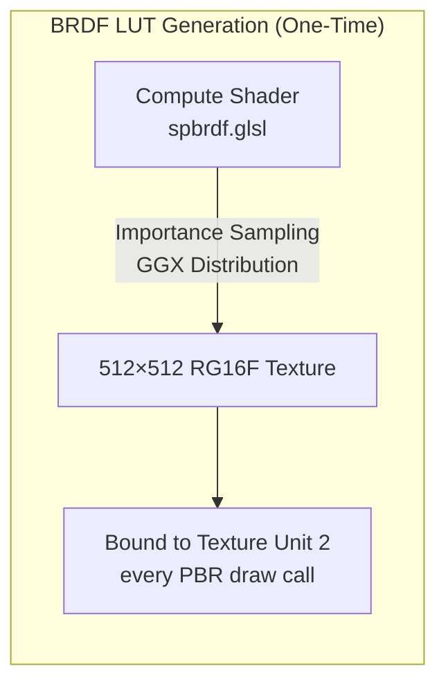

  </div>
</div>

<div class="diagram-item">
  <a href="../application_lifecycle/#44-two-rendering-modes-billboard-ray-tracing-vs-icosphere-mesh" style="font-weight: 500; font-size: 1.1em; color: var(--md-typeset-a-color);">4.4 — Two Rendering Modes: Billboard Ray-Tracing vs. Icosphere Mesh</a> : <span style="opacity: 0.6; font-size: 0.85em;">The quad geometry is a simple unit quad (±0.5), but the vertex shader projects it to tightly enclose the sphere's screen-space bounding box via analytical tangent-line computation (see `computeBillboardSphere()` in `projectionutils.glsl`).</span>
  <div class="mermaid-preview">

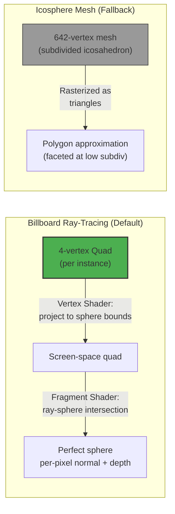

  </div>
</div>

<div class="diagram-item">
  <a href="../application_lifecycle/#44-two-rendering-modes-billboard-ray-tracing-vs-icosphere-mesh" style="font-weight: 500; font-size: 1.1em; color: var(--md-typeset-a-color);">4.4 — Two Rendering Modes: Billboard Ray-Tracing vs. Icosphere Mesh</a> : <span style="opacity: 0.6; font-size: 0.85em;">icospheregenerate(&scene-&gt;geometry, INITIALSUBDIVISIONS);  // Level 3</span>
  <div class="mermaid-preview">

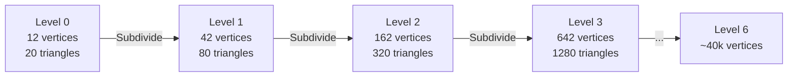

  </div>
</div>

<div class="diagram-item">
  <a href="../application_lifecycle/#47-instance-grid-setup" style="font-weight: 500; font-size: 1.1em; color: var(--md-typeset-a-color);">4.7 — Instance Grid Setup</a> : <span style="opacity: 0.6; font-size: 0.85em;">Camera at distance 20, looking at origin → sees entire grid</span>
  <div class="mermaid-preview">

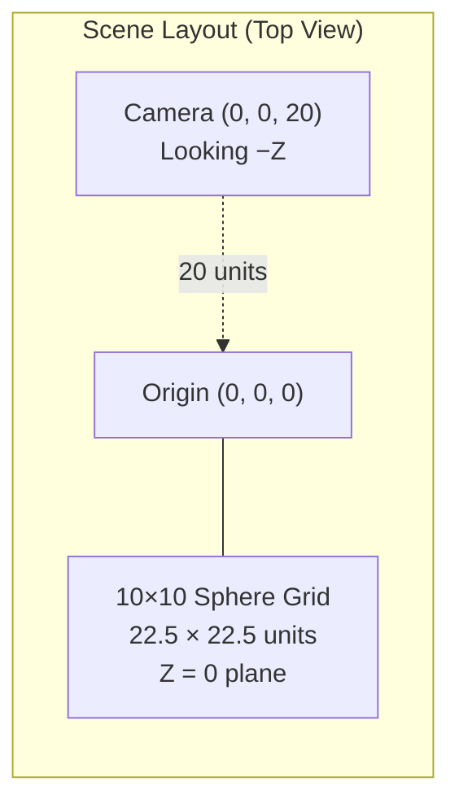

  </div>
</div>

<div class="diagram-item">
  <a href="../application_lifecycle/#410-shader-compilation" style="font-weight: 500; font-size: 1.1em; color: var(--md-typeset-a-color);">4.10 — Shader Compilation</a> : <span style="opacity: 0.6; font-size: 0.85em;">All shaders are compiled during `sceneinit()`:</span>
  <div class="mermaid-preview">

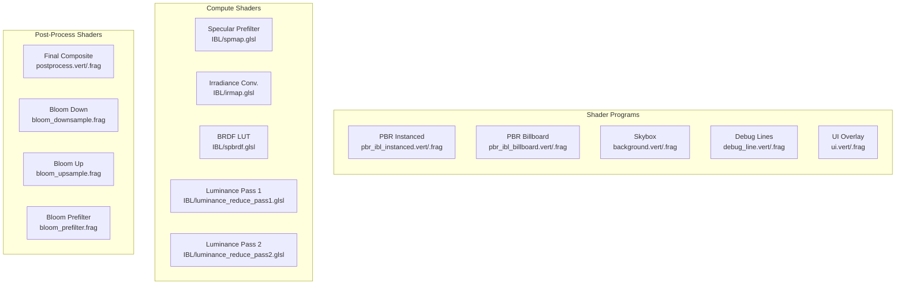

  </div>
</div>

<div class="diagram-item">
  <a href="../application_lifecycle/#51-the-scene-fbo-multi-render-target" style="font-weight: 500; font-size: 1.1em; color: var(--md-typeset-a-color);">5.1 — The Scene FBO (Multi-Render Target)</a> : <span style="opacity: 0.6; font-size: 0.85em;">The core offscreen framebuffer uses MRT (Multiple Render Targets):</span>
  <div class="mermaid-preview">

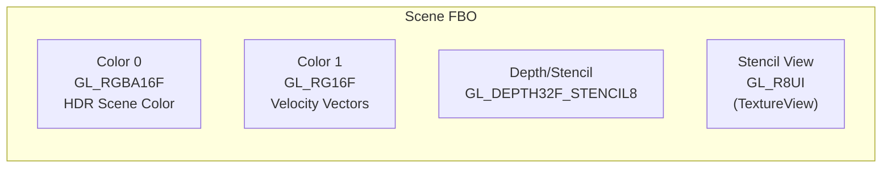

  </div>
</div>

<div class="diagram-item">
  <a href="../application_lifecycle/#61-async-loading-sequence" style="font-weight: 500; font-size: 1.1em; color: var(--md-typeset-a-color);">6.1 — Async Loading Sequence</a> : <span style="opacity: 0.6; font-size: 0.85em;">This triggers the asynchronous environment loading pipeline — the most complex multi-frame operation in the engine.</span>
  <div class="mermaid-preview">

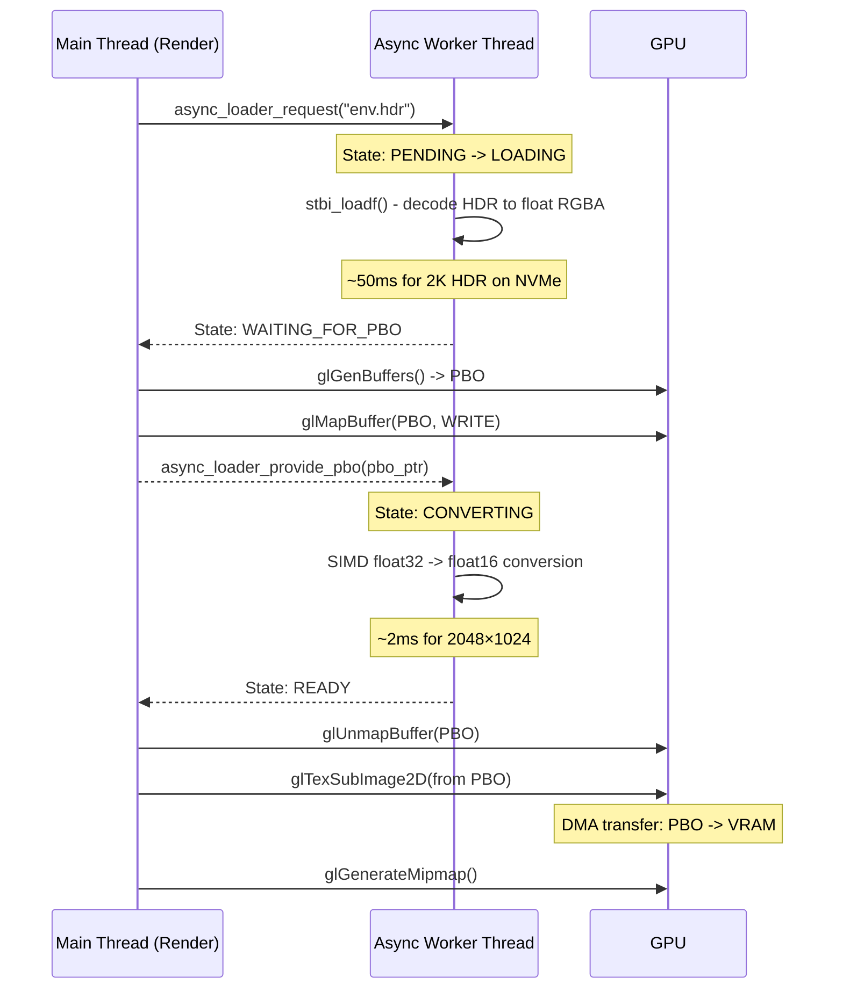

  </div>
</div>

<div class="diagram-item">
  <a href="../application_lifecycle/#62-transition-state-machine" style="font-weight: 500; font-size: 1.1em; color: var(--md-typeset-a-color);">6.2 — Transition State Machine</a> : <span style="opacity: 0.6; font-size: 0.85em;">During the first load, the screen stays black (no crossfade from a previous scene):</span>
  <div class="mermaid-preview">

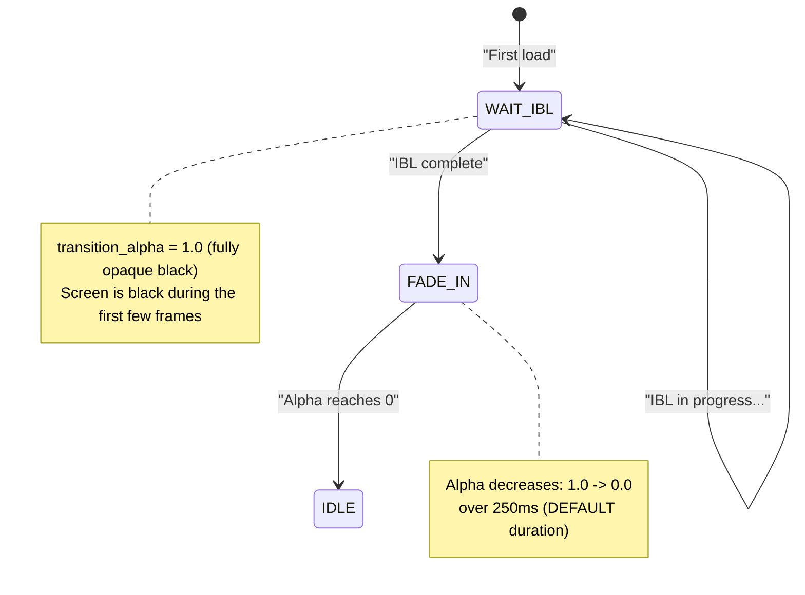

  </div>
</div>

<div class="diagram-item">
  <a href="../application_lifecycle/#71-the-three-ibl-maps" style="font-weight: 500; font-size: 1.1em; color: var(--md-typeset-a-color);">7.1 — The Three IBL Maps</a> : <span style="opacity: 0.6; font-size: 0.85em;">Once the HDR texture is uploaded, the IBL Coordinator ([src/iblcoordinator.c](https://github.com/yoyonel/suckless-ogl/blob/master/src/iblcoordinator.c)) takes over. It computes three maps across multiple frames to avoid GPU stalls.</span>
  <div class="mermaid-preview">

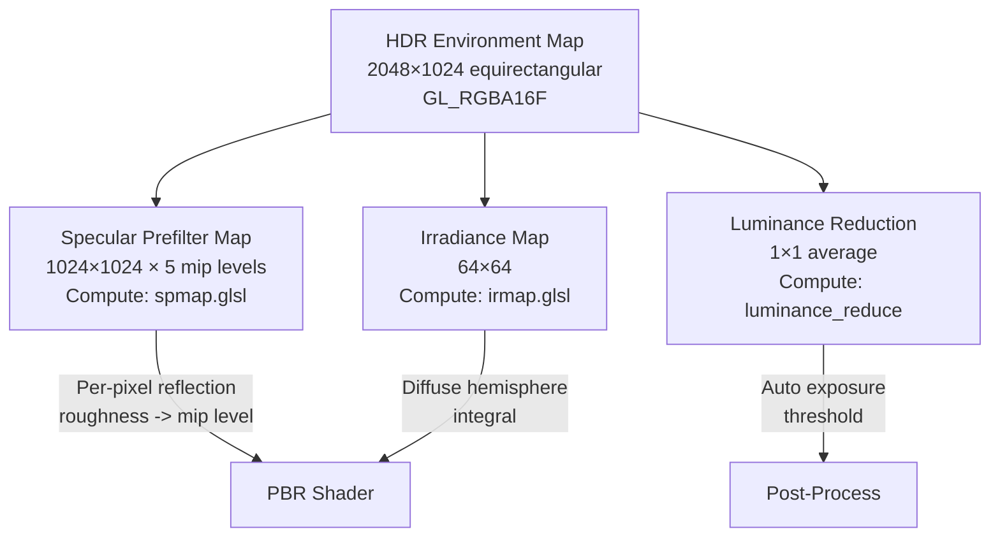

  </div>
</div>

<div class="diagram-item">
  <a href="../application_lifecycle/#72-progressive-slicing-strategy" style="font-weight: 500; font-size: 1.1em; color: var(--md-typeset-a-color);">7.2 — Progressive Slicing Strategy</a> : <span style="opacity: 0.6; font-size: 0.85em;">| Luminance | 2 dispatches (pass 1 + 2) | 2 dispatches |</span>
  <div class="mermaid-preview">

```mermaid
gantt
title IBL Progressive Generation Timeline
dateFormat X
axisFormat Frame %s
section Luminance
Luminance Pass 1      :lum1, 0, 1
Luminance Wait (fence) :lum2, 1, 2
Luminance Readback     :lum3, 2, 3
section Specular Mip 0
Slice 1/24            :s1, 3, 4
Slice 2/24            :s2, 4, 5
Slice ...             :s3, 5, 6
Slice 24/24           :s4, 6, 7
section Specular Mip 1
Slice 1/8             :m1, 7, 8
Slice 8/8             :m2, 8, 9
section Specular Mips 2-4
Grouped dispatch      :m3, 9, 10
section Irradiance
Slice 1/12            :i1, 10, 11
Slice 12/12           :i2, 11, 12
section Done
IBL Complete -> Fade In :done, 12, 13
```

  </div>
</div>

<div class="diagram-item">
  <a href="../application_lifecycle/#chapter-8-the-main-loop" style="font-weight: 500; font-size: 1.1em; color: var(--md-typeset-a-color);">Chapter 8 — The Main Loop</a> : <span style="opacity: 0.6; font-size: 0.85em;">`apprun()` ([src/app.c](https://github.com/yoyonel/suckless-ogl/blob/master/src/app.c)) is the heartbeat — a classic uncapped game loop with fixed-timestep physics.</span>
  <div class="mermaid-preview">

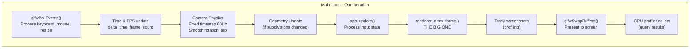

  </div>
</div>

<div class="diagram-item">
  <a href="../application_lifecycle/#91-high-level-frame-architecture" style="font-weight: 500; font-size: 1.1em; color: var(--md-typeset-a-color);">9.1 — High-Level Frame Architecture</a> : <span style="opacity: 0.6; font-size: 0.85em;">`rendererdrawframe()` ([src/renderer.c](https://github.com/yoyonel/suckless-ogl/blob/master/src/renderer.c)) orchestrates the full rendering pipeline for each frame.</span>
  <div class="mermaid-preview">

```mermaid
graph TB
subgraph "renderer_draw_frame()"
A["GPU Profiler Begin"] --> B
B["postprocess_begin()<br/>Bind Scene FBO<br/>Clear color/depth/stencil"] --> C
subgraph "View Setup"
C["camera_get_view_matrix()"]
C --> D["glm_perspective()<br/>FOV=60°, near=0.1, far=1000"]
D --> E["ViewProj = Proj × View"]
E --> F["InvViewProj = inverse(ViewProj)"]
end
F --> G["scene_render()"]
subgraph "scene_render()"
G --> G1["Skybox Pass<br/>(depth disabled)"]
G1 --> G2["Sphere Sorting<br/>(GPU Bitonic)"]
G2 --> G3["PBR Sphere Pass<br/>(instanced draw)"]
end
G3 --> H["postprocess_end()<br/>7-Stage Pipeline"]
H --> I["UI Overlay<br/>+ Env Transition"]
end
```

  </div>
</div>

<div class="diagram-item">
  <a href="../application_lifecycle/#93-pass-2-sphere-sorting-gpu-bitonic-sort" style="font-weight: 500; font-size: 1.1em; color: var(--md-typeset-a-color);">9.3 — Pass 2: Sphere Sorting (GPU Bitonic Sort)</a> : <span style="opacity: 0.6; font-size: 0.85em;">For transparent billboard rendering, spheres must be drawn back-to-front. The default sorting mode is GPU Bitonic Sort:</span>
  <div class="mermaid-preview">

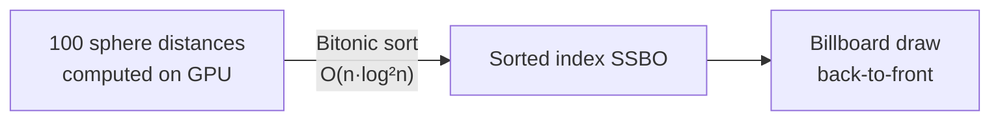

  </div>
</div>

<div class="diagram-item">
  <a href="../application_lifecycle/#94-pass-3-pbr-spheres-billboard-ray-tracing-default" style="font-weight: 500; font-size: 1.1em; color: var(--md-typeset-a-color);">9.4 — Pass 3: PBR Spheres — Billboard Ray-Tracing (Default)</a> : <span style="opacity: 0.6; font-size: 0.85em;">This is the core rendering pass. In the default billboard mode, each sphere is a 4-vertex quad whose fragment shader performs per-pixel ray-sphere intersection.</span>
  <div class="mermaid-preview">

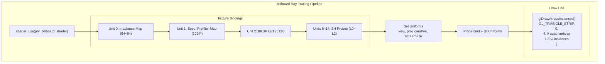

  </div>
</div>

<div class="diagram-item">
  <a href="../application_lifecycle/#95-the-billboard-fragment-shader-ray-sphere-intersection" style="font-weight: 500; font-size: 1.1em; color: var(--md-typeset-a-color);">9.5 — The Billboard Fragment Shader (Ray-Sphere Intersection)</a> : <span style="opacity: 0.6; font-size: 0.85em;">The fragment shader (`pbriblbillboard.frag`) is where the real magic happens. Instead of shading a rasterized triangle mesh, it analytically intersects a ray with a perfect sphere:</span>
  <div class="mermaid-preview">

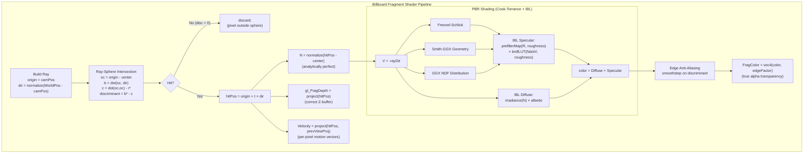

  </div>
</div>

<div class="diagram-item">
  <a href="../application_lifecycle/#101-the-7-stage-pipeline" style="font-weight: 500; font-size: 1.1em; color: var(--md-typeset-a-color);">10.1 — The 7-Stage Pipeline</a> : <span style="opacity: 0.6; font-size: 0.85em;">After the 3D scene is rendered into the MRT FBO, `postprocessend()` applies up to 8 effects in a carefully ordered pipeline.</span>
  <div class="mermaid-preview">

```mermaid
graph TB
subgraph "Post-Processing Pipeline"
A["Memory Barrier<br/>(flush MRT writes)"]
A --> B["① Bloom<br/>Downsample -> Threshold -> Upsample"]
B --> C["② Depth of Field<br/>CoC -> Bokeh blur"]
C --> D["③ Auto-Exposure<br/>Luminance reduction -> PBO readback"]
D --> E["④ Motion Blur<br/>Tile-max velocity -> Neighbor-max"]
E --> F
subgraph "⑤ Final Composite (Fullscreen Quad)"
F["Bind 9 Textures<br/>Scene + Bloom + Depth + Exposure<br/>+ Velocity + NeighborMax + DoF<br/>+ Stencil + LUT3D"]
F --> G["Upload UBO<br/>(all effect params)"]
G --> H["Draw fullscreen quad"]
end
subgraph "Fragment Shader Effects"
H --> I["Chromatic Aberration"]
I --> J["Vignette"]
J --> K["Film Grain"]
K --> L["White Balance"]
L --> M["Color Grading<br/>(Sat, Contrast, Gamma, Gain)"]
M --> N["Tonemapping<br/>(Filmic curve)"]
N --> O["3D LUT Grading"]
O --> P["FXAA"]
P --> Q["Dithering<br/>(Anti-banding)"]
Q --> R["Atmospheric Fog"]
end
R --> S["⑥ LUT Visualization<br/>(if enabled)"]
S --> T["⑦ Texture Cleanup<br/>(reset units to dummy)"]
end
```

  </div>
</div>

<div class="diagram-item">
  <a href="../application_lifecycle/#appendix-c-rendering-pipeline-data-flow" style="font-weight: 500; font-size: 1.1em; color: var(--md-typeset-a-color);">Appendix C — Rendering Pipeline Data Flow</a> : <span style="opacity: 0.6; font-size: 0.85em;">---</span>
  <div class="mermaid-preview">

```mermaid
graph TB
subgraph "CPU (per frame)"
POLL["glfwPollEvents()"] --> TIME["Δt calculation"]
TIME --> CAM["Camera physics<br/>(fixed 60Hz)"]
CAM --> SORT["Sphere sorting<br/>(GPU dispatch)"]
end
subgraph "GPU Pass 1: Scene"
FBO["Bind Scene FBO<br/>Clear (0,0,0,1)"]
FBO --> SKY["Skybox Pass<br/>Fullscreen quad<br/>Equirectangular sampling"]
SKY --> STENCIL["Enable Stencil"]
STENCIL --> SPHERES["Billboard Ray-Trace Pass<br/>1 draw call, 100 instances<br/>4 verts/quad, perfect spheres<br/>per-pixel intersection + depth"]
end
subgraph "GPU Pass 2: Post-Process"
BLOOM["Bloom<br/>Downsample -> Upsample"]
DOF["Depth of Field<br/>CoC -> Blur"]
EXPO["Auto-Exposure<br/>Luminance reduction"]
MBLUR["Motion Blur<br/>Velocity field"]
BLOOM --> COMP
DOF --> COMP
EXPO --> COMP
MBLUR --> COMP
COMP["Final Composite<br/>9 texture units<br/>UBO parameters<br/>Fullscreen quad draw"]
end
subgraph "GPU Pass 3: UI"
UI["Text Overlay<br/>Profiler Timeline<br/>Env Transition"]
end
SORT --> FBO
SPHERES --> BLOOM
COMP --> UI
UI --> SWAP["glfwSwapBuffers()"]
```

  </div>
</div>


## [Asynchronous Environment Map Loader](../async_loader/)

<div class="diagram-item">
  <a href="../async_loader/#scheduling-sequence" style="font-weight: 500; font-size: 1.1em; color: var(--md-typeset-a-color);">Scheduling Sequence</a> : <span style="opacity: 0.6; font-size: 0.85em;">The complexity of the PBO-based approach is handled by spliting the work across several frames:</span>
  <div class="mermaid-preview">

```mermaid
%%{init: {
"theme": "dark",
"themeVariables": {
"primaryColor": "#24283b",
"primaryTextColor": "#ffffff",
"primaryBorderColor": "#7aa2f7",
"lineColor": "#7aa2f7",
"signalColor": "#ffffff",
"signalTextColor": "#ffffff",
"messageColor": "#ffffff",
"messageTextColor": "#ffffff",
"labelTextColor": "#ffffff",
"actorTextColor": "#ffffff",
"actorBorder": "#7aa2f7",
"actorBkg": "#24283b",
"noteBkgColor": "#e0af68",
"noteTextColor": "#1a1b26"
}
}%%
sequenceDiagram
participant M as Main Thread
participant W as Worker Thread
participant G as GPU / VRAM
Note over M,W: Frame 1
M->>W: Request Load (path)
W->>W: I/O Read + Decode (CPU RAM)
Note over M,W: Frame N (Worker finishes I/O)
W-->>M: State = WAITING_FOR_PBO
M->>M: Map PBO (Unsynchronized)
M->>W: Pass PBO Pointer
Note over M,W: Frame N+1 (Worker does SIMD)
W->>W: SIMD Convert (F32 to F16) into PBO
W-->>M: State = READY
Note over M,W: Frame N+2 (Final Integration)
M->>M: Unmap PBO
M->>G: glTexSubImage2D (Fast DMA)
M->>G: glGenerateMipmap
M->>M: Start Progressive IBL
```

  </div>
</div>


## [Asynchronous Texture Upload Strategy](../async_pbo/)

<div class="diagram-item">
  <a href="../async_pbo/#architecture-overview" style="font-weight: 500; font-size: 1.1em; color: var(--md-typeset-a-color);">Architecture Overview</a> : <span style="opacity: 0.6; font-size: 0.85em;">- Monolithic Upload: Even with PBOs, performing all GPU work (texture storage allocation, data upload, mipmap generation) in a single frame creates a ~60ms spike.</span>
  <div class="mermaid-preview">

```mermaid
%%{init: {
"theme": "dark",
"themeVariables": {
"signalTextColor": "#ffffff",
"messageTextColor": "#ffffff",
"labelTextColor": "#ffffff",
"actorTextColor": "#ffffff",
"noteBkgColor": "#e0af68",
"noteTextColor": "#1a1b26",
"lineColor": "#7aa2f7"
}
}%%
sequenceDiagram
participant Main as Main Thread
participant Worker as Async Worker
participant GPU as GPU / Driver
Note over Main: Frame N - PBO Setup
Main->>GPU: texture_ensure_pbo() + texture_map_pbo()
Main->>Worker: async_loader_provide_pbo(mapped_ptr)
Note over Main: Frame N+1 - VRAM Pre-allocation
Main->>GPU: texture_preallocate_hdr()<br/>glTexImage2D(level 0, NULL)
Note over GPU: Allocate ~64MB base level only
Note over Worker: Frames N..N+M - Background Conversion
Worker->>Worker: float32 -> float16 (SIMD)<br/>directly into mapped PBO
Note over Main: Frame N+M - Upload & Mipmaps
Main->>GPU: glUnmapBuffer(PBO)
Main->>GPU: glTexSubImage2D(from PBO)
Main->>GPU: glGenerateMipmap()
Note over GPU: DMA transfer + mipmap chain
```

  </div>
</div>

<div class="diagram-item">
  <a href="../async_pbo/#the-strategy-spread-work-across-3-frames" style="font-weight: 500; font-size: 1.1em; color: var(--md-typeset-a-color);">The Strategy: Spread Work Across 3 Frames</a> : <span style="opacity: 0.6; font-size: 0.85em;">Instead of doing everything in one frame, we distribute the work using the async loader's multi-step protocol as natural frame boundaries:</span>
  <div class="mermaid-preview">

```mermaid
gantt
title Frame Time Distribution
dateFormat X
axisFormat %s ms
section Before (1 frame)
PBO Setup + TexStorage + Upload + Mipmap + 3×glGetError :done, 0, 60
section After (3 frames)
Frame N  - PBO Setup & Map        :active, 0, 5
Frame N+1 - TexPrealloc (level 0) :active, 8, 15
Frame N+M - Upload + Mipmap       :active, 18, 38
```

  </div>
</div>

<div class="diagram-item">
  <a href="../async_pbo/#deferred-pre-allocation-flow" style="font-weight: 500; font-size: 1.1em; color: var(--md-typeset-a-color);">Deferred Pre-allocation Flow</a> : <span style="opacity: 0.6; font-size: 0.85em;">Cost: ~20-30ms (irreducible GPU work)</span>
  <div class="mermaid-preview">

```mermaid
%%{init: {
"theme": "dark",
"themeVariables": {
"primaryColor": "#24283b",
"primaryTextColor": "#ffffff",
"primaryBorderColor": "#7aa2f7",
"lineColor": "#7aa2f7",
"labelTextColor": "#ffffff",
"actorTextColor": "#ffffff",
"actorBorder": "#7aa2f7",
"actorBkg": "#24283b",
"noteBkgColor": "#e0af68",
"noteTextColor": "#1a1b26"
}
}%%
flowchart TD
A["app_update() called"] --> B{"pending_prealloc_w > 0?"}
B -- Yes --> C["texture_preallocate_hdr()"]
C --> D{"recycled_hdr_tex matches?"}
D -- Yes --> E["Zero-cost reuse (OK)"]
D -- No --> F["glTexImage2D(level 0, NULL)"]
F --> G["Store in app->recycled_hdr_tex"]
B -- No --> H["async_loader_poll()"]
E --> H
G --> H
H --> I{"req.state?"}
I -- WAITING_FOR_PBO --> J["PBO Setup & Map"]
J --> K["Schedule pending_prealloc_w/h"]
I -- ASYNC_READY --> L["texture_upload_hdr_from_pbo()"]
L --> M{"reuse_tex matches?"}
M -- Yes --> N["Skip glTexStorage2D (OK)"]
M -- No --> O["Fallback: glTexStorage2D"]
N --> P["glUnmapBuffer + glTexSubImage2D"]
O --> P
P --> Q["glGenerateMipmap"]
```

  </div>
</div>

<div class="diagram-item">
  <a href="../async_pbo/#why-glgeterror-stalls-the-pipeline" style="font-weight: 500; font-size: 1.1em; color: var(--md-typeset-a-color);">Why `glGetError()` Stalls the Pipeline</a> : <span style="opacity: 0.6; font-size: 0.85em;">`glGetError()` is a synchronous query: the CPU must wait for the GPU to process all pending commands before returning the error state. In a pipelined architecture, this defeats the purpose of asynchronous uploads.</span>
  <div class="mermaid-preview">

```mermaid
%%{init: {
"theme": "dark",
"themeVariables": {
"signalTextColor": "#ffffff",
"messageTextColor": "#ffffff",
"labelTextColor": "#ffffff",
"actorTextColor": "#ffffff",
"noteBkgColor": "#e0af68",
"noteTextColor": "#1a1b26",
"lineColor": "#7aa2f7"
}
}%%
sequenceDiagram
participant CPU
participant CmdQueue as GPU Command Queue
participant GPU
CPU->>CmdQueue: glTexSubImage2D (async, returns immediately)
CPU->>CmdQueue: glGetError() -> STALL
Note over CPU: (Waiting) Blocked waiting for GPU
CmdQueue->>GPU: Execute TexSubImage...
GPU-->>CmdQueue: Done
CmdQueue-->>CPU: GL_NO_ERROR
Note over CPU: Can finally continue
```

  </div>
</div>


## [Auto-Exposure Optimization Report (March 2026)](../auto_exposure_opt_report/)

<div class="diagram-item">
  <a href="../auto_exposure_opt_report/#baseline-hybrid" style="font-weight: 500; font-size: 1.1em; color: var(--md-typeset-a-color);">Baseline (Hybrid)</a> : <span style="opacity: 0.6; font-size: 0.85em;">In the baseline version, the screen-space luminance was calculated using traditional rendering passes.</span>
  <div class="mermaid-preview">

```mermaid
graph LR
SCENE[Scene Color Tex] --> DS[FS: Downsample 64x64]
DS --> FBO[Downsample FBO]
FBO -- "RASTER-TO-COMPUTE SYNC" --> ADAPT[CS: Adaptation 1x1]
ADAPT --> EXP[Exposure Tex]
```

  </div>
</div>

<div class="diagram-item">
  <a href="../auto_exposure_opt_report/#optimized-unified-compute" style="font-weight: 500; font-size: 1.1em; color: var(--md-typeset-a-color);">Optimized (Unified Compute)</a> : <span style="opacity: 0.6; font-size: 0.85em;">The new implementation eliminates the intermediate Framebuffer (FBO) and stays entirely within the GPU's compute domain.</span>
  <div class="mermaid-preview">

```mermaid
graph LR
SCENE[Scene Color Tex] --> DS[CS: Downsample 64x64]
DS -- "MEMORY BARRIER (Light)" --> ADAPT[CS: Adaptation 1x1]
ADAPT --> EXP[Exposure Tex]
```

  </div>
</div>

<div class="diagram-item">
  <a href="../auto_exposure_opt_report/#architecture" style="font-weight: 500; font-size: 1.1em; color: var(--md-typeset-a-color);">Architecture</a> : <span style="opacity: 0.6; font-size: 0.85em;">A notification (&quot;AE Path: Fragment&quot; / &quot;AE Path: Compute&quot;) confirms the switch. The GPU Profiler label also changes dynamically to reflect which path is active.</span>
  <div class="mermaid-preview">

```mermaid
graph TD
SCENE[Scene Color Texture]
SCENE --> SWITCH{active_path?}
SWITCH -->|Fragment| FRAG["FS Quad -> FBO 64x64"]
SWITCH -->|Compute| COMP["CS Dispatch 4x4 WG"]
FRAG --> DS_TEX[Downsample Tex R32F]
COMP --> DS_TEX
DS_TEX --> ADAPT["CS: Adaptation 1x1"]
ADAPT --> EXP[Exposure Tex]
```

  </div>
</div>


## [Environment Transitions](../env_transitions/)

<div class="diagram-item">
  <a href="../env_transitions/#state-machine" style="font-weight: 500; font-size: 1.1em; color: var(--md-typeset-a-color);">State Machine</a> : <span style="opacity: 0.6; font-size: 0.85em;">Transitions are governed by a state machine in `src/appenv.c`.</span>
  <div class="mermaid-preview">

```mermaid
stateDiagram-v2
state "  IDLE  " as idle
state "  LOADING  " as loading
state "  FADE_OUT  " as fade_out
state "  FADE_IN  " as fade_in
state "  WAIT_IBL  " as wait_ibl
idle --> loading : app_trigger_env_transition
loading --> fade_out : IBL Done (Black Screen Mode)
loading --> fade_in : IBL Done (Crossfade Mode)
fade_out --> fade_in : Alpha >= 1.0 (Swap Textures)
fade_in --> idle : Alpha <= 0.0
idle --> wait_ibl : Initial Startup
wait_ibl --> fade_in : IBL Done (Initial Load)
```

  </div>
</div>


## [Aggressive test with ASan](../fullscreen_deadlock/)

<div class="diagram-item">
  <a href="../fullscreen_deadlock/#sequence-before-deadlock" style="font-weight: 500; font-size: 1.1em; color: var(--md-typeset-a-color);">Sequence Before (DEADLOCK)</a> : <span style="opacity: 0.6; font-size: 0.85em;">   The Application is blocked inside the resize callback, trying to allocate/delete GPU resources, but the driver's command queue is often locked or stalled during the mode switch handshake.</span>
  <div class="mermaid-preview">

```mermaid
%%{init: {
"theme": "base",
"themeVariables": {
"primaryColor": "#7aa2f7",
"primaryTextColor": "#ffffff",
"primaryBorderColor": "#7aa2f7",
"lineColor": "#9aa5ce",
"secondaryColor": "#f7768e",
"tertiaryColor": "#1a1b26",
"noteBkgColor": "#e0af68",
"noteTextColor": "#1a1b26",
"actorBkg": "#24283b",
"actorBorder": "#7aa2f7",
"actorTextColor": "#ffffff",
"actorLineColor": "#7aa2f7",
"labelBoxBkgColor": "#1a1b26",
"labelBoxBorderColor": "#7aa2f7",
"labelTextColor": "#ffffff",
"loopTextColor": "#ffffff",
"messageTextColor": "#ffffff",
"signalTextColor": "#ffffff",
"activationBkgColor": "#414868",
"sequenceNumberColor": "#ffffff"
}
}%%
sequenceDiagram
participant Main as Main Thread
participant GLFW as GLFW
participant Driver as NVIDIA Driver
participant GPU as GPU Pipeline
Main->>GLFW: glfwPollEvents()
GLFW->>Main: key_callback(F)
Main->>GLFW: glfwSetWindowMonitor()
GLFW->>Driver: Mode switch request
Note over Driver: Waits for GPU fence...
Driver-->>GLFW: Resize event
GLFW->>Main: framebuffer_size_callback()
Main->>GPU: glDeleteTextures / glGenTextures
Note over GPU,Driver: GPU blocked by pending swap
Note over Main,GPU: (DEADLOCK)
```

  </div>
</div>

<div class="diagram-item">
  <a href="../fullscreen_deadlock/#sequence-after-fixed" style="font-weight: 500; font-size: 1.1em; color: var(--md-typeset-a-color);">Sequence After (FIXED)</a> : <span style="opacity: 0.6; font-size: 0.85em;">The solution is a Deferred Resize pattern, which decouples the window manager's resize event from the expensive GPU resource recreation.</span>
  <div class="mermaid-preview">

```mermaid
%%{init: {
"theme": "base",
"themeVariables": {
"primaryColor": "#7aa2f7",
"primaryTextColor": "#ffffff",
"primaryBorderColor": "#7aa2f7",
"lineColor": "#9aa5ce",
"secondaryColor": "#f7768e",
"tertiaryColor": "#1a1b26",
"noteBkgColor": "#e0af68",
"noteTextColor": "#1a1b26",
"actorBkg": "#24283b",
"actorBorder": "#7aa2f7",
"actorTextColor": "#ffffff",
"actorLineColor": "#7aa2f7",
"labelBoxBkgColor": "#1a1b26",
"labelBoxBorderColor": "#7aa2f7",
"labelTextColor": "#ffffff",
"loopTextColor": "#ffffff",
"messageTextColor": "#ffffff",
"signalTextColor": "#ffffff",
"activationBkgColor": "#414868",
"sequenceNumberColor": "#ffffff"
}
}%%
sequenceDiagram
participant Main as Main Thread
participant GLFW as GLFW
participant Driver as NVIDIA Driver
participant GPU as GPU Pipeline
Main->>GPU: glFinish() - drain pipeline
GPU-->>Main: All commands complete
Main->>GLFW: glfwSetWindowMonitor()
GLFW->>Driver: Mode switch request
Driver-->>GLFW: Resize event
GLFW->>Main: framebuffer_size_callback()
Note over Main: Only stores dimensions + flag
Main-->>GLFW: Return immediately
GLFW-->>Main: glfwSetWindowMonitor() returns
Note over Main: Next frame begins...
Main->>Main: app_run: resize_pending? YES
Main->>GPU: postprocess_resize() - safe context
GPU-->>Main: FBOs recreated (OK)
```

  </div>
</div>


## [Gamepad Camera Control](../gamepad/)

<div class="diagram-item">
  <a href="../gamepad/#architecture" style="font-weight: 500; font-size: 1.1em; color: var(--md-typeset-a-color);">Architecture</a> : <span style="opacity: 0.6; font-size: 0.85em;">physics step.</span>
  <div class="mermaid-preview">

```mermaid
graph TD
subgraph "Per Frame (1x)"
GLFW[GLFW Gamepad API] --> POLL[gamepad_input_poll]
POLL -->|deadzone filter| AXES[state.axes cache]
POLL -->|edge detect| BTN[GamepadActions: L1/R1/Share]
end
subgraph "Per Physics Step (Nx)"
KB[camera_build_keyboard_input] --> MI[cam.move_input]
AXES --> WRITE[gamepad_write_input]
WRITE -->|overlay| MI
MI --> PHYS[camera_fixed_update]
end
```

  </div>
</div>


## [Global Illumination (1-Bounce)](../global_illumination/)

<div class="diagram-item">
  <a href="../global_illumination/#implementation-architecture" style="font-weight: 500; font-size: 1.1em; color: var(--md-typeset-a-color);">Implementation Architecture</a> : <span style="opacity: 0.6; font-size: 0.85em;">The system combines asynchronous CPU computation with GPU sampling, with no interruption (stall) to the main render thread.</span>
  <div class="mermaid-preview">

```mermaid
%%{init: {
"theme": "dark",
"themeVariables": {
"signalTextColor": "#ffffff",
"messageTextColor": "#ffffff",
"labelTextColor": "#ffffff",
"actorTextColor": "#ffffff",
"noteBkgColor": "#e0af68",
"noteTextColor": "#1a1b26",
"lineColor": "#7aa2f7"
}
}%%
sequenceDiagram
participant Main as Main Thread (CPU)
participant Worker as GI Worker Thread (CPU)
participant GPU as SSBO & Shaders (GPU)
Main->>Worker: Send scene copy (Positions, Colors)
Main->>Worker: Signal update (CondVar)
activate Worker
Note over Worker: Compute Form Factor and project to Spherical Harmonics (SH)
Worker-->>Main: Signal computations complete (results_ready)
deactivate Worker
Main->>GPU: Upload SH data to SSBO (glBufferSubData)
Main->>GPU: Draw call (Instanced or SSBO)
Note over GPU: Fragments sample irradiance from 8 adjacent probes (Trilinear Filtering)
```

  </div>
</div>


## [Domain Model — Ubiquitous Language](../glossary/)

<div class="diagram-item">
  <a href="../glossary/#relationships" style="font-weight: 500; font-size: 1.1em; color: var(--md-typeset-a-color);">🔗 Relationships</a> : <span style="opacity: 0.6; font-size: 0.85em;">---</span>
  <div class="mermaid-preview">

```mermaid
graph TD
Scene --> InstancedGroup["Instanced Group"]
Scene --> BillboardGroup["Billboard Group"]
Scene --> Skybox
Scene --> NBody["N-Body Simulation"]
Scene --> TrailRenderer["Trail Renderer"]
Scene --> IBLCoordinator["IBL Coordinator"]
Scene --> LightProbeGrid["Light Probe Grid"]
NBody -->|"contains up to 32"| Body
Body -->|"produces per frame"| SphereInstance["Sphere Instance"]
TrailRenderer -->|"one per Body"| TrailRing["Trail Ring"]
IBLCoordinator -->|"generates"| IrradianceMap["Irradiance Map"]
IBLCoordinator -->|"generates"| SpecularMap["Prefiltered Specular Map"]
LightProbeGrid -->|"lattice of"| LightProbe["Light Probe"]
LightProbe -->|"stores"| SH9
PostProcess -->|"chain of"| Effect
```

  </div>
</div>


## [GPU Usage Monitor](../gpu_usage_monitor/)

<div class="diagram-item">
  <a href="../gpu_usage_monitor/#architecture" style="font-weight: 500; font-size: 1.1em; color: var(--md-typeset-a-color);">Architecture</a> : <span style="opacity: 0.6; font-size: 0.85em;">| `nouveau` | `drm-engine-gr` | NVIDIA (open-source driver) |</span>
  <div class="mermaid-preview">

```mermaid
flowchart TD
A[gpu_usage_init] --> B[Scan /proc/self/fdinfo/]
B --> C{DRM render node?}
C -->|Yes| D[Read drm-driver & drm-client-id]
C -->|No| B
D --> E{Duplicate client-id?}
E -->|Yes| B
E -->|No| F[Keep FILE* stream open]
F --> B
B -->|Done| G[Store driver + engine_key]
H[gpu_usage_update] --> I{500ms elapsed?}
I -->|No| J[Return early]
I -->|Yes| K[Re-read all streams]
K --> L[Sum engine time across FDs]
L --> M["GPU% = Δgpu / Δwall × 100"]
M --> N[Clamp 0–100%]
```

  </div>
</div>


## [Motion Blur Implementation Analysis](../motion_blur_analysis/)

<div class="diagram-item">
  <a href="../motion_blur_analysis/#render-pipeline" style="font-weight: 500; font-size: 1.1em; color: var(--md-typeset-a-color);">Render Pipeline</a> : <span style="opacity: 0.6; font-size: 0.85em;">The current architecture is based on modern rendering principles using the Tile-Based / Neighbor Max approach, originally introduced by Jean-Yves Bouguet and real-time rendering researchers. The main idea is to prevent blur &quot;bleeding&quot; when a fast object passes in front of a static background — a very common artifact in early implementations of this post-process.</span>
  <div class="mermaid-preview">

```mermaid
graph TD
V[Velocity Buffer] --> T[Tile Max Velocity Compute]
T -->|Reduction at 16x16 via Shared Memory| TTex(Texture RG16F - Tile Max)
TTex --> N[Neighbor Max Velocity Compute]
N -->|textureGather over 3x3 Neighborhood| NTex(Texture RG16F - Neighbor Max)
C[Color Buffer Raw] --> M(Final Motion Blur Pass)
D[Depth Buffer] --> M
V --> M
NTex --> M
M -->|8-frame Sampling + Interleaved Gradient Noise + Depth Weighting| O[Blurred Color Buffer]
```

  </div>
</div>

<div class="diagram-item">
  <a href="../motion_blur_analysis/#4-the-street-fighter-6-case-study-re-engine" style="font-weight: 500; font-size: 1.1em; color: var(--md-typeset-a-color);">4. The Street Fighter 6 Case Study (RE Engine)</a> : <span style="opacity: 0.6; font-size: 0.85em;">Unlike standard linear blur (&quot;take a vector and trace a straight line&quot;), Capcom's engine stores acceleration information in addition to velocity. The blur sampling is thus &quot;curved&quot; in space to simulate the radial trajectory of limbs and fists.</span>
  <div class="mermaid-preview">

```mermaid
graph LR
A[Linear Blur \nStandard Suckless OGL] -->|Creates straight lines and artifacts| B(Punch trajectory)
C[Curved Blur \nRE Engine / SF6] -->|Sampling along a circular arc| D(Anime/Manga-style stylized blur)
```

  </div>
</div>


## [Multi-Draw Indirect (MDI) Refactoring Study](../multi_draw_indirect/)

<div class="diagram-item">
  <a href="../multi_draw_indirect/#4-action-plan-atomic-steps" style="font-weight: 500; font-size: 1.1em; color: var(--md-typeset-a-color);">4. Action Plan (Atomic Steps)</a> : <span style="opacity: 0.6; font-size: 0.85em;">---</span>
  <div class="mermaid-preview">

```mermaid
graph TD
A[Step 1: Geometry Atlas & Basic DIB] --> B[Step 2: MDI Pipeline for Spheres]
B --> C[Step 3: Dynamic MDI with Frustum Culling]
```

  </div>
</div>


## [Neon Trail Rendering](../neon_trails/)

<div class="diagram-item">
  <a href="../neon_trails/#architecture" style="font-weight: 500; font-size: 1.1em; color: var(--md-typeset-a-color);">Architecture</a> : <span style="opacity: 0.6; font-size: 0.85em;">Each change displays an on-screen notification with the current value.</span>
  <div class="mermaid-preview">

```mermaid
graph TD
A[TrailRenderer::neon] -->|intensity, width| B[build_ribbon CPU]
A -->|core_exp| C[trail.frag GPU]
B -->|HDR vertices| D[VBO Upload]
D --> E[glMultiDrawArrays]
C -->|Neon profile| E
E -->|HDR output| F[Bloom Post-Process]
F -->|Wide halo| G[Final Composite]
```

  </div>
</div>


## [Performance Mode & Notifications](../perf_and_notifications/)

<div class="diagram-item">
  <a href="../perf_and_notifications/#architecture" style="font-weight: 500; font-size: 1.1em; color: var(--md-typeset-a-color);">Architecture</a> : <span style="opacity: 0.6; font-size: 0.85em;">2.  Native: Fallback using Linux scheduling syscalls (`schedsetscheduler`, `setpriority`).</span>
  <div class="mermaid-preview">

```mermaid
classDiagram
class App {
+perf_context
+perf_mode_active
+init()
+cleanup()
}
class PerfModeContext {
+state
+backend
+original_policy
+original_param
+original_nice
+initialized
}
class Backend
<<interface>> Backend
Backend : +activate()
Backend : +deactivate()
class GameModeBackend {
+libgamemode_init
}
class NativeBackend {
+sched_setscheduler_FIFO
+setpriority_nice
}
App *-- PerfModeContext
PerfModeContext ..> GameModeBackend : Tries_First
PerfModeContext ..> NativeBackend : Fallback
```

  </div>
</div>

<div class="diagram-item">
  <a href="../perf_and_notifications/#design" style="font-weight: 500; font-size: 1.1em; color: var(--md-typeset-a-color);">Design</a> : <span style="opacity: 0.6; font-size: 0.85em;">-   FIFO Replacement: If the buffer is full, the oldest active notification is overwritten.</span>
  <div class="mermaid-preview">

```mermaid
sequenceDiagram
participant User
participant AppInput
participant ActionNotifier
participant UI
User->>AppInput: Press Key (e.g., F9)
AppInput->>AppInput: Toggle Feature (PerfMode)
AppInput->>ActionNotifier: action_notifier_push("Perf Mode: ON", 2.0s)
activate ActionNotifier
ActionNotifier->>ActionNotifier: Find free slot / Overwrite oldest
ActionNotifier->>ActionNotifier: Copy text (safe_strncpy)
ActionNotifier-->>AppInput: Done
deactivate ActionNotifier
loop Every Frame
AppInput->>ActionNotifier: action_notifier_update(dt)
ActionNotifier->>ActionNotifier: Increase lifetime, deactivate if expired
AppInput->>ActionNotifier: action_notifier_draw(ui_ctx)
ActionNotifier->>UI: ui_draw_text_ex(...)
end
```

  </div>
</div>


## [Platform Abstraction Layer (PAL)](../portability_pal/)

<div class="diagram-item">
  <a href="../portability_pal/#architecture" style="font-weight: 500; font-size: 1.1em; color: var(--md-typeset-a-color);">Architecture</a> : <span style="opacity: 0.6; font-size: 0.85em;">The PAL acts as an intermediary between the core application logic and the underlying Operating System.</span>
  <div class="mermaid-preview">

```mermaid
graph TD
subgraph Core Application
A[log.c]
B[scene.c]
C[perf_mode.c]
end
subgraph PAL [Platform Abstraction Layer]
D[platform_utils.h]
E[platform_time.h]
F[platform_fs.h]
end
subgraph OS Backends
G[Linux / POSIX]
H[Windows API]
I[macOS / Darwin]
end
A --> D
A --> E
B --> F
B --> D
C --> E
D -.-> G
D -.-> H
E -.-> G
E -.-> H
F -.-> G
F -.-> H
```

  </div>
</div>


## [Progressive & Asynchronous IBL Architecture](../progressive_ibl/)

<div class="diagram-item">
  <a href="../progressive_ibl/#d-specular-map-1024x1024" style="font-weight: 500; font-size: 1.1em; color: var(--md-typeset-a-color);">D. Specular Map (1024x1024)</a> : <span style="opacity: 0.6; font-size: 0.85em;">Total &quot;Tail Grouping&quot;: Grouping small mips (3 to 10) avoids wasting 7 frames of latency for tiny jobs (&lt;1ms each).</span>
  <div class="mermaid-preview">

```mermaid
%%{init: {
"theme": "dark",
"themeVariables": {
"primaryColor": "#24283b",
"primaryTextColor": "#ffffff",
"primaryBorderColor": "#7aa2f7",
"lineColor": "#7aa2f7",
"labelTextColor": "#ffffff",
"actorTextColor": "#ffffff",
"actorBorder": "#7aa2f7",
"actorBkg": "#24283b",
"noteBkgColor": "#e0af68",
"noteTextColor": "#1a1b26"
}
}%%
flowchart LR
subgraph HeavyGroup["Heavy Workload Sliced"]
Mip0["Mip 0 4 Frames"]
Mip1["Mip 1 2 Frames"]
end
subgraph LightGroup["Fast Workload Grouped"]
Mip2["Mip 2 1 Frame"]
Tail["Mips 3-10 1 Frame"]
end
Start(["Start"]) --> Mip0
Mip0 --> Mip1
Mip1 --> Mip2
Mip2 --> Tail
Tail --> End(["Done"])
style HeavyGroup fill:#24283b,stroke:#f7768e,stroke-dasharray: 5, 5
style LightGroup fill:#24283b,stroke:#9ece6a
style Start fill:#7aa2f7,color:#ffffff
style End fill:#9ece6a,color:#ffffff
style Mip0 fill:#414868,stroke:#f7768e
style Mip1 fill:#414868,stroke:#f7768e
style Mip2 fill:#414868,stroke:#9ece6a
style Tail fill:#414868,stroke:#9ece6a
```

  </div>
</div>

<div class="diagram-item">
  <a href="../progressive_ibl/#43-solution-single-deferred-barrier" style="font-weight: 500; font-size: 1.1em; color: var(--md-typeset-a-color);">4.3 Solution: Single Deferred Barrier</a> : <span style="opacity: 0.6; font-size: 0.85em;">coherency path is flushed.</span>
  <div class="mermaid-preview">

```mermaid
%%{init: {
"theme": "dark",
"themeVariables": {
"signalTextColor": "#ffffff",
"messageTextColor": "#ffffff",
"labelTextColor": "#ffffff",
"actorTextColor": "#ffffff",
"noteBkgColor": "#e0af68",
"noteTextColor": "#1a1b26",
"lineColor": "#7aa2f7"
}
}%%
sequenceDiagram
participant CPU
participant GPU
Note over CPU,GPU: Old approach (per-slice barrier)
loop Each Slice
CPU->>GPU: glDispatchCompute()
CPU->>GPU: glMemoryBarrier(ALL_BARRIER_BITS)
Note right of GPU: Pipeline drain + cache flush
end
Note over CPU,GPU: New approach (deferred barrier)
loop Each Slice
CPU->>GPU: glDispatchCompute()
Note right of GPU: Work queued, no stall
end
CPU->>GPU: glMemoryBarrier(IMAGE_ACCESS_BIT)
Note right of GPU: Single flush before sampling
```

  </div>
</div>


## [Synchronization & Asynchrony Overview](../synchronization_overview/)

<div class="diagram-item">
  <a href="../synchronization_overview/#frame-scheduling-task-interleaving" style="font-weight: 500; font-size: 1.1em; color: var(--md-typeset-a-color);">Frame Scheduling & Task Interleaving</a> : <span style="opacity: 0.6; font-size: 0.85em;">The following diagram illustrates how the various asynchronous and progressive tasks are interleaved within the main application loop to avoid frame spikes.</span>
  <div class="mermaid-preview">

```mermaid
%%{init: {
"theme": "dark",
"themeVariables": {
"primaryColor": "#24283b",
"primaryTextColor": "#ffffff",
"primaryBorderColor": "#7aa2f7",
"lineColor": "#7aa2f7",
"signalColor": "#ffffff",
"signalTextColor": "#ffffff",
"messageColor": "#ffffff",
"messageTextColor": "#ffffff",
"labelTextColor": "#ffffff",
"actorTextColor": "#ffffff",
"actorBorder": "#7aa2f7",
"actorBkg": "#24283b",
"noteBkgColor": "#e0af68",
"noteTextColor": "#1a1b26"
}
}%%
sequenceDiagram
participant M as Main Thread
participant W as Worker Threads
participant G as GPU
Note over M: Frame N starts
M->>M: 1. Poll Async Loader (5ms)
M->>M: 2. Update IBL Slice (10ms)
par Parallel Execution
W->>W: Background I/O & SH Projection
M->>G: 3. Upload GI Probes (5ms)
end
M->>G: 4. Render Scene (15ms)
M->>G: 5. Swap Buffers (5ms)
Note over M: Frame N ends (~40ms)
Note over M: Frame N+1 starts
M->>M: Poll & Process...
```

  </div>
</div>


## [UI Visual Parameters Reference](../ui_visual_parameters/)

<div class="diagram-item">
  <a href="../ui_visual_parameters/#hover-decay-stabilization" style="font-weight: 500; font-size: 1.1em; color: var(--md-typeset-a-color);">Hover Decay Stabilization</a> : <span style="opacity: 0.6; font-size: 0.85em;">Logic parameters that ensure a smooth &quot;Premium&quot; feel during mouse or keyboard usage.</span>
  <div class="mermaid-preview">

```mermaid
graph LR
A[Mouse over Key] --> B[Target Dim: 0.3]
B --> C{Mouse leaves?}
C -- Yes --> D[Wait 150ms]
D -- Still Empty --> E[Target Dim: 1.0]
D -- Enters New Key --> B
```

  </div>
</div>
