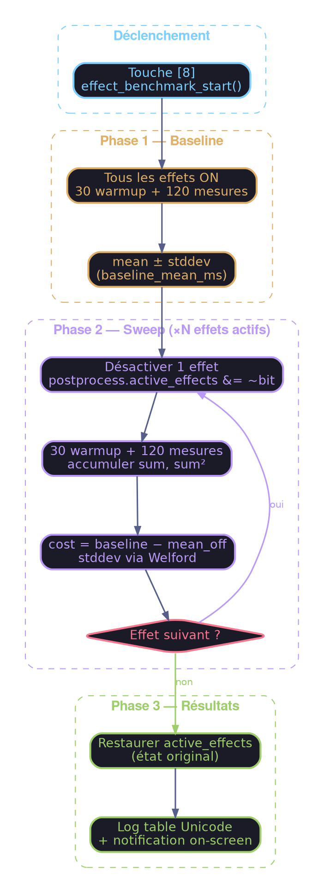

# Effect Benchmark — A/B GPU Cost Measurement

Outil de mesure automatisé du coût GPU individuel de chaque effet postprocess
au sein du uber-shader ("Final Composite"). Les effets multi-pass (Bloom, DoF,
Auto Exposure, Motion Blur) disposent déjà de leur propre stage GPU Profiler et
ne sont pas concernés.

## Vue d'ensemble



## Utilisation

| Touche | Action |
|--------|--------|
| **8**  | Démarre le sweep (ou affiche "Already running" si en cours) |

Le sweep dure environ **22 secondes** à 60 fps (8 phases × (30 + 120) frames ÷ 60).

1. Lancer l'application
2. Stabiliser la scène (ne pas bouger la caméra pendant le bench)
3. Appuyer sur **8**
4. Attendre la notification "FX Benchmark: Done (see log)"
5. Lire les résultats dans la sortie log

> ⚠️ **Important** : Ne pas interagir avec la scène ni toggle d'effets pendant
> le benchmark. Le système sauvegarde/restaure `active_effects` mais tout
> changement externe invaliderait les mesures.

## Lire les résultats

Exemple de sortie réelle (Intel Iris Xe, 1920×1080, scène IBL + 20 sphères) :

```text
╔══════════════════════════════════════════════════════╗
║       POSTPROCESS EFFECT BENCHMARK RESULTS         ║
╠══════════════════════════════════════════════════════╣
║ Baseline (all ON):   1.1308 ms (±0.0222 ms)     ║
╠════════════════════╦═══════════╦═══════════╦════════╣
║ Effect             ║  Cost(ms) ║ StdDev    ║ Status ║
╠════════════════════╬═══════════╬═══════════╬════════╣
║ FXAA               ║  +0.0110 ║   ±0.0042 ║   ON   ║
║ Chromatic Aberration ║     —    ║     —    ║  OFF   ║
║ Vignette           ║  +0.0109 ║   ±0.0045 ║   ON   ║
║ Grain              ║  -0.0014 ║   ±0.0242 ║   ON   ║
║ Color Grading      ║  -0.0289 ║   ±0.0342 ║   ON   ║
║ Banding            ║     —    ║     —    ║  OFF   ║
║ Exposure           ║     —    ║     —    ║  OFF   ║
╠════════════════════╬═══════════╬═══════════╬════════╣
║ Sum of costs       ║  -0.0083 ║           ║        ║
╚════════════════════╩═══════════╩═══════════╩════════╝
```

### Colonnes

| Colonne    | Signification |
|------------|---------------|
| **Effect** | Nom de l'effet postprocess |
| **Cost(ms)** | `baseline_mean - mean_with_effect_OFF`. Positif = l'effet coûte du temps GPU |
| **StdDev** | Écart-type sur 120 échantillons. Indique la stabilité de la mesure |
| **Status** | `ON` = testé (était actif), `OFF` = sauté (était déjà désactivé) |

### Interpréter les valeurs

#### Coût positif (+0.0110 ms)

L'effet ajoute du temps GPU. C'est le cas attendu. Plus la valeur est grande,
plus l'effet est coûteux.

#### Coût négatif (-0.0014 ms, -0.0289 ms)

Un coût négatif signifie que **désactiver l'effet ralentit le composite**.
C'est contre-intuitif mais normal sur un iGPU. Causes possibles :

1. **Bruit de mesure** — Si `|cost| < stddev`, la mesure est dans le bruit.
   Exemple : Grain coûte -0.0014 ms ± 0.0242 → le vrai coût est
   indistinguable de zéro.

2. **Divergence de branches** — Le uber-shader utilise des `if (effect_enabled)`.
   Sur les GPUs à exécution SIMD (wavefronts/warps), le coût d'une branche
   dépend de la **cohérence** au sein du warp. Désactiver un seul effet peut
   modifier le pattern de divergence et paradoxalement ralentir les warps
   voisins.

3. **Pression registres/cache** — Le compilateur GLSL peut réorganiser les
   registres quand le code mort est éliminé. Une configuration différente
   peut avoir une pression mémoire légèrement différente.

4. **Ordonnancement ALU/TEX** — Sur iGPU Intel, les ALUs partagent la bande
   passante mémoire avec le CPU. Un calcul en moins peut laisser les TEX
   units en attente sans recouvrement ALU.

#### Somme ≠ baseline

La ligne "Sum of costs" sera rarement égale à `baseline_mean`. C'est attendu :
les effets ne sont **pas additifs** car ils partagent les mêmes unités
d'exécution (ALU, caches texture, bande passante). L'interaction entre effets
crée des effets de masquage (latency hiding).

### Règles pratiques

| Observation | Conclusion |
|-------------|------------|
| `cost > 0` et `cost > 2 × stddev` | L'effet a un coût **significatif** et mesurable |
| `cost > 0` mais `cost < stddev` | Coût probable mais **non significatif** statistiquement |
| `cost ≈ 0` (positif ou négatif) et `stddev` élevé | **Bruit** — relancer le bench en stabilisant la scène |
| `cost < 0` et `|cost| > stddev` | Effet de **divergence/cache** — pas alarmant, inhérent au uber-shader |
| Tous les coûts très faibles (<0.05 ms) | Le postprocess n'est **pas le goulot** — chercher ailleurs (geometry, lighting) |

## Effets benchmarkés

Seuls les effets **fragment-shader** exécutés dans le draw call "Final Composite"
sont mesurés par A/B toggle :

| Effet | Bit | Macro |
|-------|-----|-------|
| FXAA | `1 << 12` | `POSTFX_FXAA` |
| Chromatic Aberration | `1 << 3` | `POSTFX_CHROM_ABBR` |
| Vignette | `1 << 0` | `POSTFX_VIGNETTE` |
| Grain | `1 << 1` | `POSTFX_GRAIN` |
| Color Grading | `1 << 5` | `POSTFX_COLOR_GRADING` |
| Banding | `1 << 14` | `POSTFX_BANDING` |
| Exposure | `1 << 2` | `POSTFX_EXPOSURE` |

Les effets **multi-pass** (Bloom, DoF, Auto Exposure, Motion Blur) ont déjà
leur propre stage dans le GPU Profiler (`F1` pour afficher l'overlay) et ne
nécessitent pas d'A/B testing.

## Architecture interne

### Pourquoi l'A/B ?

Les GPU timer queries (`GL_TIMESTAMP`) mesurent le temps entre deux draw calls.
Or, tous les effets fragment-shader s'exécutent dans un **unique** fullscreen
quad draw call ("Final Composite"). Il est impossible de placer des timers
*à l'intérieur* d'un draw call.

La méthode A/B contourne cette limitation :

```text
Coût(effet) = T(tous ON) − T(effet OFF)
```

### Machine à états

```graphviz
digraph BenchStateMachine {
    rankdir=LR;
    bgcolor="transparent";
    margin=0.2;
    nodesep=0.8;
    ranksep=1.0;

    node [shape=rect, style="filled,rounded", fontname="Helvetica", fontsize=12,
          fillcolor="#24283b", color="#414868", fontcolor="#c0caf5", penwidth=2];
    edge [color="#565f89", fontname="Helvetica", fontsize=10, fontcolor="#9aa5ce",
          arrowsize=0.8, penwidth=1.5];

    IDLE [label="BENCH_IDLE\n(attente)", fillcolor="#1a1b26", color="#565f89", fontcolor="#565f89"];
    BASELINE [label="BENCH_BASELINE\ntous effets ON\n30+120 frames",
              fillcolor="#1a1b26", color="#e0af68", fontcolor="#e0af68"];
    STABILIZE [label="BENCH_STABILIZE\ntous ON (reset)\n30 frames",
               fillcolor="#1a1b26", color="#7aa2f7", fontcolor="#7aa2f7"];
    EFFECT [label="BENCH_EFFECT_TEST\n1 effet OFF\n30+120 frames",
            fillcolor="#1a1b26", color="#bb9af7", fontcolor="#bb9af7"];
    DONE [label="BENCH_DONE\nrésultats loggés",
          fillcolor="#1a1b26", color="#9ece6a", fontcolor="#9ece6a"];

    IDLE -> BASELINE [label="start()", color="#7dcfff", fontcolor="#7dcfff"];
    BASELINE -> STABILIZE [label="120 samples"];
    STABILIZE -> EFFECT [label="warmup fini"];
    EFFECT -> STABILIZE [label="effet suivant\n(reset)", style=dashed, color="#7aa2f7", fontcolor="#7aa2f7"];
    EFFECT -> DONE [label="tous testés\nrestaure state", color="#9ece6a", fontcolor="#9ece6a"];
    DONE -> IDLE [label="start()\n(nouveau sweep)", style=dashed];
}
```



### Flux par frame

`effect_benchmark_update()` est appelée **après** `gpu_profiler_begin_frame()`
pour lire les résultats du frame N-1 (double-buffered timer queries) :

1. **Warmup** (30 frames) — Les résultats sont ignorés. Laisse le driver/GPU
   stabiliser les caches et le pipeline après le changement d'état.

2. **Accumulation** (120 frames) — Accumule `sum_ms` et `sum_sq_ms` pour
   calculer la moyenne et l'écart-type :

$$
\bar{x} = \frac{\sum x_i}{N}, \qquad \sigma = \sqrt{\frac{\sum x_i^2}{N} - \bar{x}^2}
$$

1. **Transition** — Calcule les stats, stocke le résultat, désactive l'effet
   suivant, remet le compteur à zéro.

### Fichiers

| Fichier | Rôle |
|---------|------|
| `include/effect_benchmark.h` | Types (`EffectBenchmark`, `BenchPhase`, `EffectBenchResult`), constantes, API |
| `src/effect_benchmark.c` | Machine à états, accumulation, table d'effets, affichage résultats |
| `include/app.h` | Champ `EffectBenchmark effect_bench` dans `App` |
| `src/app.c` | `effect_benchmark_init()` au démarrage, `effect_benchmark_update()` par frame |
| `src/app_input.c` | Binding touche `8` → `effect_benchmark_start()` |

### API

```c
// Initialisation (une fois au démarrage)
void effect_benchmark_init(EffectBenchmark* bench,
                           PostProcess* postprocess,
                           GPUProfiler* profiler);

// Démarrer un sweep (retourne false si déjà en cours)
bool effect_benchmark_start(EffectBenchmark* bench);

// Appeler chaque frame après gpu_profiler_begin_frame()
// Retourne true quand le sweep vient de se terminer
bool effect_benchmark_update(EffectBenchmark* bench);

// Vérifier si un bench est en cours
bool effect_benchmark_is_running(const EffectBenchmark* bench);

// Afficher les résultats (appelé automatiquement à la fin)
void effect_benchmark_log_results(const EffectBenchmark* bench);
```

### Paramètres de mesure

| Constante | Valeur | Rôle |
|-----------|--------|------|
| `BENCH_WARMUP_FRAMES` | 30 | Frames ignorées après chaque changement d'état (stabilisation pipeline) |
| `BENCH_MEASURE_FRAMES` | 120 | Frames échantillonnées par phase (≈2s à 60fps) |
| `BENCH_MAX_EFFECTS` | 16 | Capacité maximale de la table d'effets |

## Limites

1. **Précision iGPU** — Sur GPU intégré (Intel Iris Xe), la résolution des
   timer queries est de l'ordre de 80 ns. Les effets très légers (< 0.01 ms)
   sont souvent dans le bruit.

2. **Non-additivité** — Le coût d'un effet dépend des autres effets actifs
   (latency hiding, pression registres). La somme des coûts individuels ne
   sera pas égale au coût total.

3. **Stabilité scène requise** — Bouger la caméra pendant le bench modifie
   la charge fragment (overdraw, fill rate) et fausse les mesures.

4. **Divergence GPU** — Les branches `if` du uber-shader ont un coût qui
   dépend de la cohérence spatiale des pixels. L'A/B ne capture pas le coût
   de divergence additionnel quand *plusieurs* effets sont actifs simultanément.

## Changelog

| Date | Changement |
|------|-----------|
| 2026-02-07 | Création du module `effect_benchmark` (header, implémentation, intégration) |
| 2026-02-08 | Ajout de la phase `BENCH_STABILIZE` et du Timeout (2s) pour la fiabilité |
