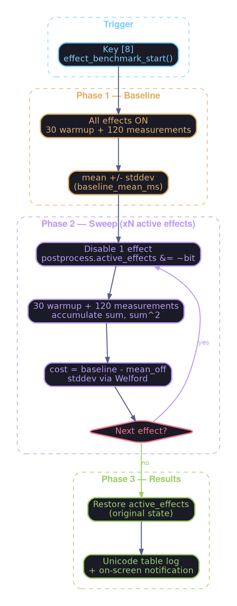
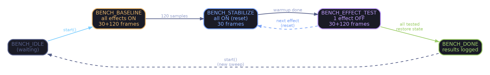

# Effect Benchmark — A/B GPU Cost Measurement

An automated tool for measuring the individual GPU cost of each post-process effect within the uber-shader ("Final Composite"). Multi-pass effects (Bloom, DoF, Auto Exposure, Motion Blur) already have their own GPU Profiler stage and are not affected.

## Overview



## Usage

| Key | Action |
|--------|--------|
| **8** | Start the sweep (or shows "Already running" if in progress) |

The sweep takes approximately **22 seconds** at 60 fps (8 phases × (30 + 120) frames ÷ 60).

1. Launch the application
2. Stabilize the scene (do not move the camera during the bench)
3. Press **8**
4. Wait for the "FX Benchmark: Done (see log)" notification
5. Read results in the log output

> ⚠️ **Important**: Do not interact with the scene or toggle effects during
> the benchmark. The system saves/restores `active_effects` but any external
> change would invalidate measurements.

## Reading the Results

Sample real output (Intel Iris Xe, 1920×1080, IBL scene + 20 spheres):

```text
╔══════════════════════════════════════════════════════╗
║       POSTPROCESS EFFECT BENCHMARK RESULTS         ║
╠══════════════════════════════════════════════════════╣
║ Baseline (all ON):   1.1308 ms (±0.0222 ms)     ║
╠════════════════════╦═══════════╦═══════════╦════════╣
║ Effect             ║  Cost(ms) ║ StdDev    ║ Status ║
╠════════════════════╬═══════════╬═══════════╬════════╣
║ FXAA               ║  +0.0110 ║   ±0.0042 ║   ON   ║
║ Chromatic Aberration ║     —    ║     —    ║  OFF   ║
║ Vignette           ║  +0.0109 ║   ±0.0045 ║   ON   ║
║ Grain              ║  -0.0014 ║   ±0.0242 ║   ON   ║
║ Color Grading      ║  -0.0289 ║   ±0.0342 ║   ON   ║
║ Banding            ║     —    ║     —    ║  OFF   ║
║ Exposure           ║     —    ║     —    ║  OFF   ║
╠════════════════════╬═══════════╬═══════════╬════════╣
║ Sum of costs       ║  -0.0083 ║           ║        ║
╚════════════════════╩═══════════╩═══════════╩════════╝
```

### Columns

| Column    | Meaning |
|------------|---------------|
| **Effect** | Post-process effect name |
| **Cost(ms)** | `baseline_mean - mean_with_effect_OFF`. Positive = the effect costs GPU time |
| **StdDev** | Standard deviation over 120 samples. Indicates measurement stability |
| **Status** | `ON` = tested (was active), `OFF` = skipped (was already disabled) |

### Interpreting Values

#### Positive cost (+0.0110 ms)

The effect adds GPU time. This is the expected case. The larger the value,
the more costly the effect.

#### Negative cost (-0.0014 ms, -0.0289 ms)

A negative cost means that **disabling the effect slows the composite**.
This is counter-intuitive but normal on an iGPU. Possible causes:

1. **Measurement noise** — If `|cost| < stddev`, the measurement is within noise.
   Example: Grain costs -0.0014 ms ± 0.0242 → true cost is
   indistinguishable from zero.

2. **Branch divergence** — The uber-shader uses `if (effect_enabled)`.
   On SIMD GPUs (wavefronts/warps), branch cost depends on **coherence**
   within the warp. Disabling a single effect may change the divergence
   pattern and paradoxically slow adjacent warps.

3. **Register/cache pressure** — The GLSL compiler may reorganize registers
   when dead code is eliminated. A different configuration may have slightly
   different memory pressure.

4. **ALU/TEX scheduling** — On Intel iGPU, ALUs share memory bandwidth with
   the CPU. One less computation may leave TEX units waiting without ALU
   overlap.

#### Sum ≠ baseline

The "Sum of costs" line will rarely equal `baseline_mean`. This is expected:
effects are **not additive** since they share the same execution units
(ALU, texture caches, bandwidth). The interaction between effects creates
masking effects (latency hiding).

### Practical Rules

| Observation | Conclusion |
|-------------|------------|
| `cost > 0` and `cost > 2 × stddev` | The effect has a **significant**, measurable cost |
| `cost > 0` but `cost < stddev` | Probable cost but **not statistically significant** |
| `cost ≈ 0` (pos or neg) and high `stddev` | **Noise** — re-run the bench with a stable scene |
| `cost < 0` and `|cost| > stddev` | **Divergence/cache** effect — not alarming, inherent to uber-shader |
| All costs very small (<0.05 ms) | Postprocess is **not the bottleneck** — look elsewhere (geometry, lighting) |

## Benchmarked Effects

Only **fragment-shader** effects executed in the "Final Composite" draw call
are measured by A/B toggle:

| Effect | Bit | Macro |
|-------|-----|-------|
| FXAA | `1 << 12` | `POSTFX_FXAA` |
| Chromatic Aberration | `1 << 3` | `POSTFX_CHROM_ABBR` |
| Vignette | `1 << 0` | `POSTFX_VIGNETTE` |
| Grain | `1 << 1` | `POSTFX_GRAIN` |
| Color Grading | `1 << 5` | `POSTFX_COLOR_GRADING` |
| Banding | `1 << 14` | `POSTFX_BANDING` |
| Exposure | `1 << 2` | `POSTFX_EXPOSURE` |

**Multi-pass effects** (Bloom, DoF, Auto Exposure, Motion Blur) already have
their own stage in the GPU Profiler (`F1` to display the overlay) and do not
need A/B testing.

## Internal Architecture

### Why A/B?

GPU timer queries (`GL_TIMESTAMP`) measure time between two draw calls.
However, all fragment-shader effects execute within a **single** fullscreen
quad draw call ("Final Composite"). It is impossible to place timers
*inside* a draw call.

The A/B method works around this:

```text
Cost(effect) = T(all ON) - T(effect OFF)
```

### State Machine



### Per-Frame Flow

`effect_benchmark_update()` is called **after** `gpu_profiler_begin_frame()`
to read frame N-1 results (double-buffered timer queries):

1. **Warmup** (30 frames) — Results are discarded. Lets the driver/GPU
   stabilize caches and the pipeline after the state change.

2. **Accumulation** (120 frames) — Accumulates `sum_ms` and `sum_sq_ms` to
   compute mean and standard deviation:

$$
\bar{x} = \frac{\sum x_i}{N}, \qquad \sigma = \sqrt{\frac{\sum x_i^2}{N} - \bar{x}^2}
$$

3. **Transition** — Computes stats, stores result, disables next effect, resets counter.

### Files

| File | Role |
|---------|------|
| `include/effect_benchmark.h` | Types (`EffectBenchmark`, `BenchPhase`, `EffectBenchResult`), constants, API |
| `src/effect_benchmark.c` | State machine, accumulation, effect table, result display |
| `include/app.h` | `EffectBenchmark effect_bench` field in `App` |
| `src/app.c` | `effect_benchmark_init()` at startup, `effect_benchmark_update()` per frame |
| `src/app_input.c` | Key `8` binding → `effect_benchmark_start()` |

### API

```c
// Initialization (once at startup)
void effect_benchmark_init(EffectBenchmark* bench,
                           PostProcess* postprocess,
                           GPUProfiler* profiler);

// Start a sweep (returns false if already running)
bool effect_benchmark_start(EffectBenchmark* bench);

// Call every frame after gpu_profiler_begin_frame()
// Returns true when the sweep just finished
bool effect_benchmark_update(EffectBenchmark* bench);

// Check if a benchmark is running
bool effect_benchmark_is_running(const EffectBenchmark* bench);

// Display results (called automatically at the end)
void effect_benchmark_log_results(const EffectBenchmark* bench);
```

### Measurement Parameters

| Constant | Value | Role |
|-----------|--------|------|
| `BENCH_WARMUP_FRAMES` | 30 | Frames discarded after each state change (pipeline stabilization) |
| `BENCH_MEASURE_FRAMES` | 120 | Frames sampled per phase (≈2s at 60fps) |
| `BENCH_MAX_EFFECTS` | 16 | Maximum effect table capacity |

## Limitations

1. **iGPU Precision** — On integrated GPU (Intel Iris Xe), timer query resolution is around 80 ns. Very light effects (< 0.01 ms) are often within noise.

2. **Non-Additivity** — The cost of an effect depends on other active effects (latency hiding, register pressure). The sum of individual costs will not equal the total cost.

3. **Scene Stability Required** — Moving the camera during the bench modifies fragment load (overdraw, fill rate) and skews measurements.

4. **GPU Divergence** — The `if` branches of the uber-shader have a cost that depends on the spatial coherence of pixels. A/B does not capture the additional divergence cost when *multiple* effects are simultaneously active.

## Changelog

| Date | Change |
|------|-----------|
| 2026-02-07 | Created `effect_benchmark` module (header, implementation, integration) |
| 2026-02-08 | Added `BENCH_STABILIZE` phase and Timeout (2s) for reliability |
