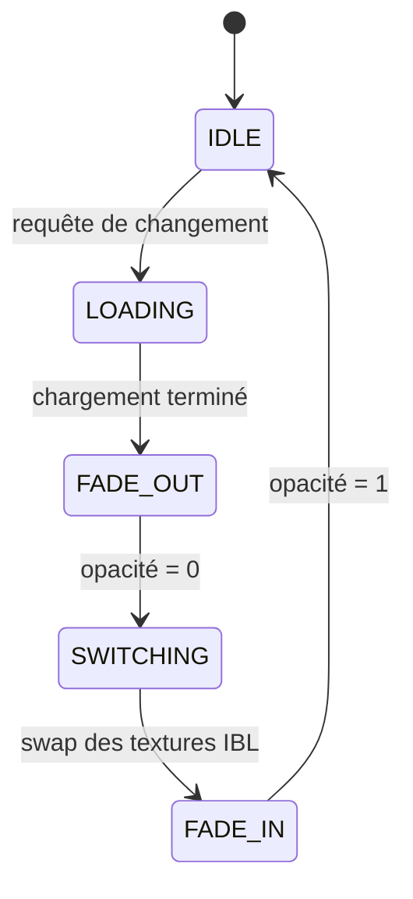

# Transitions entre environnements HDR

Ce document décrit le système de transitions animées entre cartes d'environnement HDR.

## Modes de transition

Deux modes de transition sont disponibles :

| Mode | Description | Raccourci |
|------|-------------|-----------|
| **Fondu enchaîné** | Mélange progressif entre l'ancien et le nouvel environnement | Défaut |
| **Écran noir** | Fondu vers le noir, chargement, fondu depuis le noir | `ALT+T` |

## Machine à états



### États détaillés

| État | Description |
|------|-------------|
| `IDLE` | Environnement stable, aucune transition en cours |
| `LOADING` | Chargement asynchrone du HDR en arrière-plan |
| `FADE_OUT` | Atténuation progressive de l'environnement actuel |
| `SWITCHING` | Échange atomique des ressources GPU |
| `FADE_IN` | Introduction progressive du nouvel environnement |

## Implémentation

### Fondu enchaîné

```c
// Dans le shader de skybox
vec3 env_old = texture(u_env_old, dir).rgb;
vec3 env_new = texture(u_env_new, dir).rgb;
vec3 env = mix(env_old, env_new, u_transition_factor);
```

Le facteur `u_transition_factor` passe de 0.0 à 1.0 en `TRANSITION_DURATION` secondes (valeur par défaut : 0.8 s).

### Écran noir

1. Phase 1 : `u_blackout_factor` passe de 0.0 à 1.0 (0.4 s)
2. Échange des ressources IBL (synchrone, mais masqué par le noir)
3. Phase 2 : `u_blackout_factor` passe de 1.0 à 0.0 (0.4 s)

## Continuité pendant le chargement

Si un second changement d'environnement est demandé pendant qu'une transition est en cours, la requête est mise en file d'attente et exécutée après la fin de la transition courante. Cela évite les artefacts visuels liés aux transitions imbriquées.

## Voir aussi

- [async_loader.md](./async_loader.md) — Chargement asynchrone HDR
- [progressive_ibl.md](./progressive_ibl.md) — Génération IBL progressive
