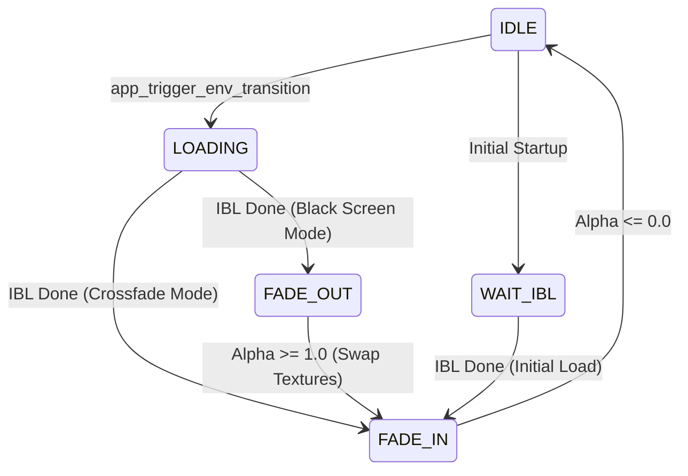

# Environment Transitions

This document describes the architecture, implementation, and configuration of environment map transitions in Suckless OGL.

## Overview

When switching between High Dynamic Range (HDR) environment maps, the application performs a visual transition to ensure a smooth user experience. Two primary modes are supported: **Crossfade** and **Black Screen**.

## Transition Modes

### 1. Crossfade (Default)

The Crossfade mode provides a smooth blend from the previous environment to the new one.

* **Behavior**: As soon as the new environment (and its associated IBL textures) is ready, the application captures a snapshot of the current frame. It then swaps the environment and fades the snapshot over the new scene.
* **Aesthetics**: Provides a high-end, seamless feel.
* **Implementation**: Uses a framebuffer snapshot texture.

### 2. Black Screen

The Black Screen mode provides a classic "fade to black" transition.

* **Behavior**: The current environment remains interactive while the new one loads in the background (`TRANSITION_LOADING`). Once loading is complete, the application fades to black, swaps the textures, and then fades back in.
* **Use Case**: Preferred for slower systems or when a clear visual break between environments is desired.
* **Implementation**: Uses a dummy black texture as an overlay.

## State Machine

Transitions are governed by a state machine in `src/app_env.c`.

### Transition States (`TransitionState`)

- `TRANSITION_IDLE`: No transition active.
* `TRANSITION_LOADING`: Background loading of HDR/IBL textures while the old scene is visible.
* `TRANSITION_WAIT_IBL`: Used during initial startup to keep the screen black until the first environment is ready.
* `TRANSITION_FADE_OUT`: Scene is fading to black or snapshot.
* `TRANSITION_FADE_IN`: Scene is fading in from black or snapshot.

## Implementation Details

### Snapshot Capture

In Crossfade mode, a snapshot is captured using `glCopyTexSubImage2D` into `app->transition_snapshot_tex`. This texture is then rendered as a full-screen quad over the new scene using `debug_tex.frag` with varying alpha.

### Background Loading

Environment maps are loaded using an asynchronous loader. The transition logic defers any visual changes until the `IBL_STATE_MACHINE` reaches `IBL_STATE_DONE`, ensuring that the user never sees an uninitialized or partially loaded environment.

## Configuration

Transitions can be configured via `include/app_settings.h` or controlled at runtime.

### Constants

- `DEFAULT_ENV_TRANSITION_DURATION`: The time in seconds for a full fade.
* `DEFAULT_ENV_TRANSITION_MODE`: The default mode (`ENV_TRANSITION_CROSSFADE` or `ENV_TRANSITION_BLACK_SCREEN`).

### Runtime Controls

- **`T` Key**: Toggles between Crossfade and Black Screen modes.

## Extending the Transition System

To add a new transition type (e.g., "Radial Wipe" or "Pixelate"):

1. **Enums**: Add your new mode to `EnvTransitionMode` in `app_settings.h`.
2. **State Machine**: Update the logic in `app_process_ibl_state_machine` (in `src/app_env.c`) to initiate the correct state sequence for your new mode.
3. **Shaders**: If the transition requires a special effect, create a new fragment shader or extend `debug_tex.frag`.
4. **Rendering**: Update `app_render` in `src/app.c` to bind the necessary textures and set uniforms for your new shader effect when `app->env_transition_mode` matches your new enum value.
5. **Unit Tests**: Add test cases to `tests/test_env_transition.c` to verify your new state flow.
