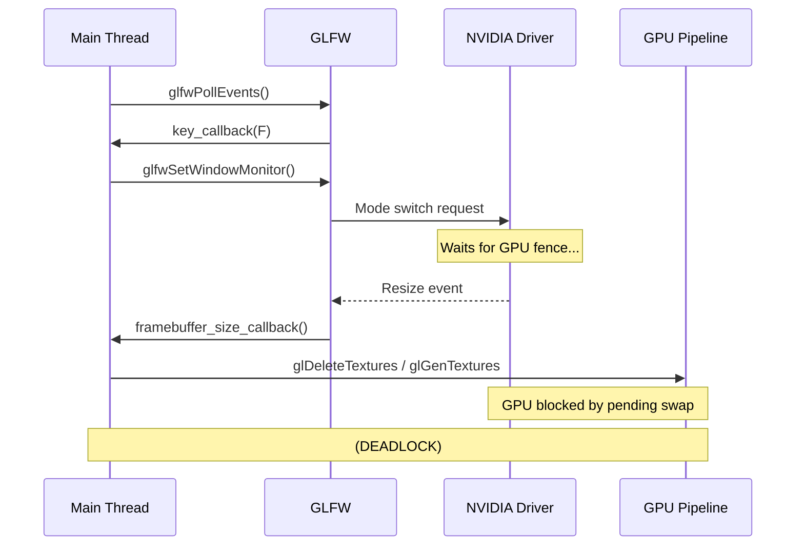
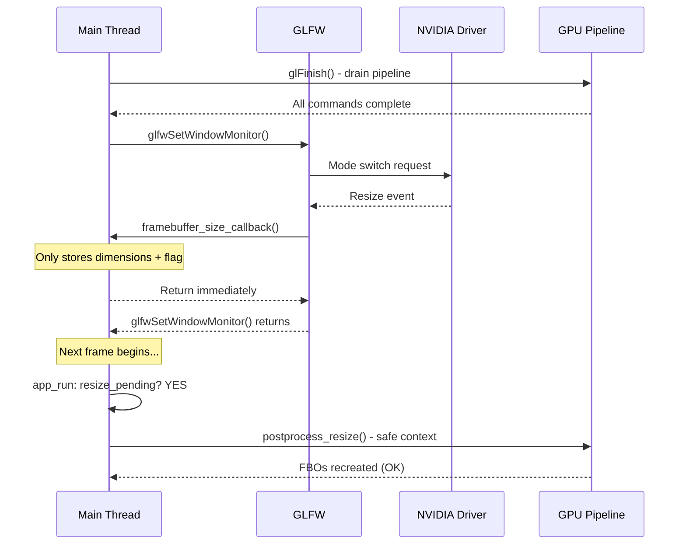

# Fullscreen Toggle Deadlock (NVIDIA)

## Overview

A non-deterministic deadlock was identified when toggling between windowed and fullscreen modes, particularly on NVIDIA hardware (especially using Prime Render Offload). The application would freeze completely during the transition, requiring a force kill.

## Root Cause Analysis

The deadlock was caused by a synchronization conflict between the GLFW event loop, the window manager/compositor, and the OpenGL driver.

### The Problematic Sequence

1.  **Toggle Triggered**: The user presses 'F', which calls `app_toggle_fullscreen()`.
2.  **Synchronous Driver Call**: `app_toggle_fullscreen()` calls `glfwSetWindowMonitor()`. This is a synchronous operation that blocks until the window manager and driver acknowledge the mode switch.
3.  **Nested Callback**: While blocked inside `glfwSetWindowMonitor()`, the window manager sends a resize event. GLFW dispatches this event immediately by calling `framebuffer_size_callback()`.
4.  **Heavy GPU Work**: The callback invoked `postprocess_resize()`, which performed heavy GPU resource management:
    *   Destroying existing Framebuffer Objects (FBOs) and textures.
    *   Allocating new textures for Bloom, Depth of Field, etc.
    *   Recompiling/re-linking shaders for some post-process effects.
5.  **Circular Dependency (Deadlock)**:
    *   The **Driver/Compositor** is waiting for the application to finish its current GPU work (like a pending `glfwSwapBuffers` or fence sync) to complete the mode switch.
    *   The **Application** is blocked inside the resize callback, trying to allocate/delete GPU resources, but the driver's command queue is often locked or stalled during the mode switch handshake.

### Sequence Before (DEADLOCK)



## Implementation: Deferred Resize

The solution is a **Deferred Resize** pattern, which decouples the window manager's resize event from the expensive GPU resource recreation.

### Sequence After (FIXED)



### 1. Lightweight Callback

The `framebuffer_size_callback` no longer performs any GPU resource allocation. It only updates the viewport (which is cheap and safe) and stores the new dimensions in the `App` state.

```c
void framebuffer_size_callback(GLFWwindow* window, int width, int height) {
    App* app = (App*)glfwGetWindowUserPointer(window);
    app->width = width;
    app->height = height;
    glViewport(0, 0, width, height);

    // Only set the request flag
    app->win.pending_width = width;
    app->win.pending_height = height;
    app->win.resize_pending = 1;
}
```

### 2. GPU Pipeline Drain

In `app_toggle_fullscreen()`, we now call `glFinish()` before invoking `glfwSetWindowMonitor()`. This ensures that the GPU pipeline is completely drained and all pending commands (fences, PBO transfers, swaps) are finished before the driver attempts the mode switch.

### 3. Main Loop Processing

The actual heavy lifting (`postprocess_resize`) is moved to the start of the next frame in `app_run`, safely outside the GLFW callback context.

```c
// Inside app_run() while loop
glfwPollEvents();

if (app->win.resize_pending) {
    postprocess_resize(&app->postprocess, app->win.pending_width, app->win.pending_height);
    app->win.resize_pending = 0;
}
```

## Stress Testing

A dedicated stress test was created to verify this fix: `scripts/test_stress_fullscreen.sh`.

### How it works
- It uses `xdotool` to send 'F' keystrokes rapidly (e.g., 10ms-50ms intervals).
- It monitors the application's **log output** rather than window visibility. A deadlocked application may still have a visible window, but it will stop logging "Switched to fullscreen/windowed".
- If the expected log message doesn't appear within 5 seconds, it detects a hang, captures a full GDB stack trace of all threads, and terminates the app.

### Running the test
```bash
# Standard test
just stress-fullscreen

# Aggressive test with ASan
just stress-fullscreen-asan 200 10
```

## Summary of Changes

| File | Change |
| :--- | :--- |
| `include/app.h` | Added `resize_pending`, `pending_width`, `pending_height` fields. |
| `src/app_input.c` | Updated `framebuffer_size_callback` to use flags; added `glFinish()` to toggle. |
| `src/app.c` | Added deferred resize processing logic and state initialization. |
| `Justfile` | Added `stress-fullscreen` automation. |
