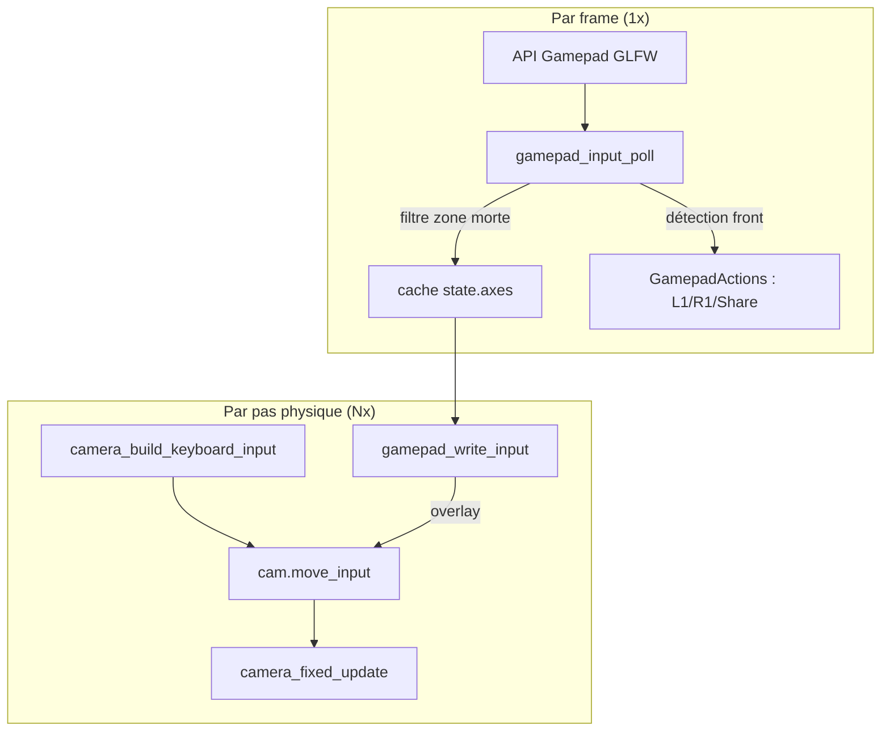

# Contrôle Caméra par Manette

## Vue d'ensemble

Le moteur supporte les manettes/contrôleurs pour la navigation caméra, via
l'API Gamepad de GLFW 3.3+ avec le mapping SDL_GameControllerDB. Toute
manette reconnue par GLFW (DualShock 4, DualSense, Xbox, etc.) fonctionne
directement en USB ou Bluetooth.

## Mapping de la manette

| Entrée | Action | Notes |
|--------|--------|-------|
| **Stick gauche** (X/Y) | Déplacement caméra (avant/arrière/strafe) | Proportionnel à l'inclinaison du stick |
| **Stick droit** (X/Y) | Orientation caméra (yaw/pitch) | Mise à jour directe du yaw/pitch cible |
| **L2 (Gâchette gauche)** | Descendre | Proportionnel à la pression |
| **R2 (Gâchette droite)** | Monter | Proportionnel à la pression |
| **L1 (Bumper gauche)** | Environnement précédent | Détection sur front montant |
| **R1 (Bumper droit)** | Environnement suivant | Détection sur front montant |
| **Share (Select)** | Reset caméra & LOD | Détection sur front montant (équiv. ESPACE) |

## Gestion de la zone morte

Les sticks analogiques ont une zone morte configurable (défaut : 15%) pour
éviter le drift. La zone morte utilise un rescaling linéaire : les valeurs
sous le seuil sont mises à zéro, celles au-dessus sont recalibrées pour que
la plage utile commence à 0.

```text
 Sortie
  1.0 ┤              ╱
      │            ╱
      │          ╱
  0.0 ├────────╱────── Entrée
      0    DZ=0.15   1.0
```

## Configuration

Les valeurs par défaut sont définies dans `gamepad_input.h` :

| Paramètre | Défaut | Description |
|-----------|--------|-------------|
| `GAMEPAD_DEFAULT_DEADZONE` | 0.15 | Seuil de zone morte des sticks |
| `GAMEPAD_DEFAULT_LOOK_SENSITIVITY` | 120.0 | Vitesse de regard du stick droit (degrés/sec) |
| `GAMEPAD_DEFAULT_MOVE_SENSITIVITY` | 1.0 | Multiplicateur de vitesse du stick gauche |
| `GAMEPAD_DEFAULT_TRIGGER_THRESHOLD` | 0.1 | Seuil d'activation des gâchettes |

## Architecture

Le module manette utilise un design d'**entrée unifiée** : clavier et manette
écrivent tous deux dans le même vecteur `Camera.move_input`, consommé par le
pas de physique.



### Fonctions clés

- **`gamepad_input_init()`** — Initialise l'état avec les valeurs par défaut.
- **`gamepad_input_poll()`** — Appelée une fois par frame avant la boucle
  d'accumulation physique. Lit les axes GLFW (avec zone morte), normalise les
  gâchettes de [-1,1] vers [0,1], et détecte les fronts montants L1/R1/Share.
  Les résultats sont mis en cache dans `state->axes[]`.
- **`gamepad_write_input()`** — Appelée à chaque pas physique après
  `camera_build_keyboard_input()`. Superpose les valeurs analogiques sur
  `cam->move_input` et applique la rotation du stick droit sur
  `yaw_target`/`pitch_target`.
- **`gamepad_apply_deadzone()`** — Fonction pure pour le filtrage de zone morte.

Le module est entièrement optionnel : si aucune manette n'est connectée,
`gamepad_input_poll` retourne immédiatement sans surcoût.

### Intégration pas de temps fixe

Le polling de la manette est séparé de l'application pour garantir un
comportement indépendant du FPS :

1. `gamepad_input_poll()` s'exécute **une fois par frame** (cache les axes +
   détecte les fronts des boutons).
2. Dans la boucle d'accumulation à pas fixe, chaque itération :
   - `camera_build_keyboard_input()` — convertit les flags clavier en
     `move_input`.
   - `gamepad_write_input()` — superpose les valeurs analogiques de la manette.
   - `camera_fixed_update()` — consomme `move_input` pour la physique.

Cela garantit une vitesse de déplacement constante quel que soit le framerate.

## Détection de connexion

L'état de connexion de la manette est vérifié chaque frame. Lors d'une
connexion ou déconnexion, un message de log est émis :

```text
[INFO] suckless-ogl.gamepad: Gamepad connected: Wireless Controller
[INFO] suckless-ogl.gamepad: Gamepad disconnected
```

## Prérequis

- **Linux** : La manette doit être appairée en Bluetooth ou connectée en USB.
  GLFW utilise l'API joystick Linux (`/dev/input/js*`). La plupart des
  DualShock 4 fonctionnent nativement.
- **Windows** : Les manettes XInput fonctionnent directement. La DualShock 4
  peut nécessiter DS4Windows ou Steam Input.
- Aucune dépendance supplémentaire au-delà de GLFW 3.3+.

## Intégration caméra

La manette fonctionne en parallèle du clavier+souris. Les deux sources d'entrée
écrivent dans le même vecteur `Camera.move_input` et les cibles yaw/pitch,
donc elles se mélangent naturellement. Si le stick de la manette a une entrée,
elle remplace la valeur du clavier sur cet axe. La caméra doit être activée
(touche `C`) pour que l'entrée manette prenne effet.

!!! tip "Overlay F2"
    Appuyez sur **F2** pour parcourir les pages d'aide. La page manette est
    **automatiquement masquée** lorsqu'aucune manette n'est connectée, le
    cycle est alors **Clavier → Désactivé**. Quand une manette est détectée,
    le cycle complet est **Clavier → Manette → Désactivé**. La page manette
    affiche une disposition spatiale style DualShock avec tous les contrôles
    liés. Les entrées actives sont surlignées en vert et les contrôles
    inactifs s'estompent quand une entrée est active. Survolez un contrôle
    à la souris pour voir sa description.
