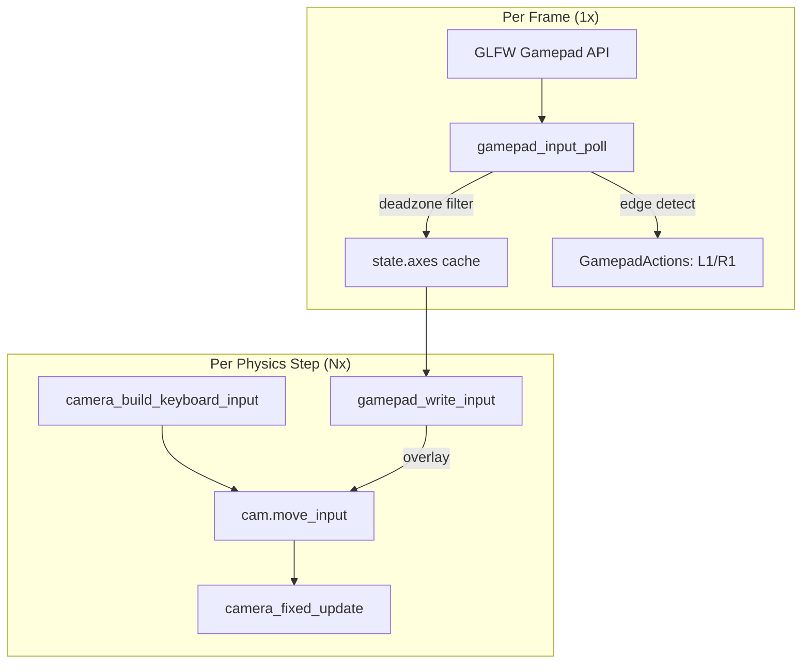

# Gamepad Camera Control

## Overview

The engine supports gamepad/controller input for camera navigation, using
the GLFW 3.3+ Gamepad API with SDL_GameControllerDB mapping. Any controller
recognized by GLFW (DualShock 4, DualSense, Xbox, etc.) works out of the box
over USB or Bluetooth.

## Controller Mapping

| Input | Action | Notes |
|-------|--------|-------|
| **Left Stick** (X/Y) | Camera movement (forward/back/strafe) | Proportional to stick deflection |
| **Right Stick** (X/Y) | Camera look (yaw/pitch) | Direct yaw/pitch target update |
| **L2 (Left Trigger)** | Move down | Proportional to trigger depth |
| **R2 (Right Trigger)** | Move up | Proportional to trigger depth |
| **L1 (Left Bumper)** | Previous environment map | Edge-detected press |
| **R1 (Right Bumper)** | Next environment map | Edge-detected press |

## Dead-Zone Handling

Analog sticks have a configurable dead-zone (default: 15%) to prevent drift.
The dead-zone uses linear rescaling: values below the threshold are zeroed,
values above are rescaled so the usable range starts at 0.

```text
 Output
  1.0 ┤              ╱
      │            ╱
      │          ╱
  0.0 ├────────╱────── Input
      0    DZ=0.15   1.0
```

## Configuration

Default values are defined in `gamepad_input.h`:

| Parameter | Default | Description |
|-----------|---------|-------------|
| `GAMEPAD_DEFAULT_DEADZONE` | 0.15 | Stick dead-zone threshold |
| `GAMEPAD_DEFAULT_LOOK_SENSITIVITY` | 120.0 | Right stick look speed (degrees/sec) |
| `GAMEPAD_DEFAULT_MOVE_SENSITIVITY` | 1.0 | Left stick movement multiplier |
| `GAMEPAD_DEFAULT_TRIGGER_THRESHOLD` | 0.1 | Trigger activation threshold |

## Architecture

The gamepad module uses a **unified input** design: keyboard and gamepad both
write to the same `Camera.move_input` vector, which is consumed by the
physics step.



### Key Functions

- **`gamepad_input_init()`** — Initializes state with defaults.
- **`gamepad_input_poll()`** — Called once per frame before the physics
  accumulator loop. Reads GLFW axes (with deadzone), normalizes triggers
  from [-1,1] to [0,1], and edge-detects L1/R1 bumper presses. Caches
  results in `state->axes[]`.
- **`gamepad_write_input()`** — Called each physics step after
  `camera_build_keyboard_input()`. Overlays cached analog values onto
  `cam->move_input` and applies right-stick look rotation to
  `yaw_target`/`pitch_target`.
- **`gamepad_apply_deadzone()`** — Pure function for dead-zone filtering.

The module is entirely optional: if no gamepad is connected,
`gamepad_input_poll` returns immediately with no overhead.

### Fixed-Timestep Integration

Gamepad polling is split from application to ensure FPS-independent behavior:

1. `gamepad_input_poll()` runs **once per frame** (caches axes + detects
   button edges).
2. Inside the fixed-timestep accumulator loop, each step:
   - `camera_build_keyboard_input()` — converts keyboard flags to
     `move_input`.
   - `gamepad_write_input()` — overlays gamepad analog values.
   - `camera_fixed_update()` — consumes `move_input` for physics.

This ensures consistent movement speed regardless of frame rate.

## Connection Detection

The gamepad connection state is checked every frame. When a gamepad is
connected or disconnected, a log message is emitted:

```text
[INFO] suckless-ogl.gamepad: Gamepad connected: Wireless Controller
[INFO] suckless-ogl.gamepad: Gamepad disconnected
```

## Prerequisites

- **Linux**: The controller must be paired via Bluetooth or connected via USB.
  GLFW uses the Linux joystick API (`/dev/input/js*`). Most DualShock 4
  controllers work natively.
- **Windows**: XInput controllers work out of the box. DualShock 4 may
  require DS4Windows or Steam Input.
- No additional dependencies beyond GLFW 3.3+.

## Camera Integration

The gamepad works alongside keyboard+mouse. Both input sources write to the
same `Camera.move_input` vector and yaw/pitch targets, so they blend
naturally. If the gamepad stick has input, it overrides the keyboard value
on that axis. The camera must be enabled (`C` key toggle) for gamepad input
to take effect.

!!! note "F2 Help Overlay"
    The F2 keyboard help overlay does not yet display gamepad bindings.
    A dedicated gamepad help section is planned for a future release.
