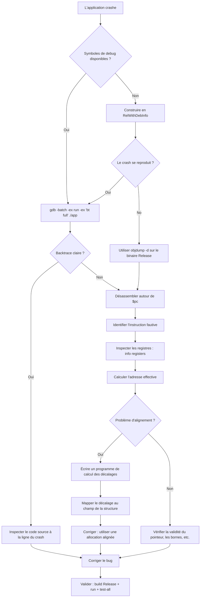

# Tutoriel GDB — Étude de cas : crash d'alignement SIMD

Ce tutoriel documente le processus de débogage GDB étape par étape utilisé pour diagnostiquer et corriger un **crash SIGSEGV qui ne se produisait qu'en build Release** de suckless-ogl. Il couvre les techniques GDB essentielles pour le débogage d'applications C natives, de la première analyse du crash à l'analyse avancée du désassemblage.

## Contexte

Après la migration des allocations heap vers un pattern de descripteurs de sous-systèmes, l'application crashait avec SIGSEGV en build Release (`-O3`) mais fonctionnait parfaitement en Debug (`-g -O0`). La cause racine était une **violation d'alignement AVX** : Clang auto-vectorisait l'initialisation de structs avec `vmovaps` (qui exige un alignement 32 octets), mais `calloc` ne garantit que 16 octets d'alignement sur glibc x86_64.

---

## 1. Premier réflexe : backtrace en mode batch

Quand une application crashe, le premier réflexe est d'obtenir une backtrace. Le **mode batch** de GDB est idéal pour le triage automatisé des crashs — il lance le programme, capture le crash, et affiche la backtrace sans intervention interactive.

### Commande

```bash
gdb -batch -ex run -ex 'bt full' ./build/app
```

### Détail des options

| Option | Rôle |
|--------|------|
| `-batch` | Mode non-interactif. GDB quitte après avoir exécuté toutes les commandes `-ex`. |
| `-ex run` | Démarrer le programme. |
| `-ex 'bt full'` | Afficher une backtrace complète avec les variables locales quand le crash survient. |

### Résultats attendus

- **Avec symboles de debug** (`-g`) : noms de fonctions, fichiers/lignes, valeurs des variables locales.
- **Sans symboles** (Release `-O3`) : uniquement des adresses et `??` — utile malgré tout pour l'adresse du crash.

### Exemple de sortie (Release, sans symboles)

```text
Program received signal SIGSEGV, Segmentation fault.
0x000055555557a3f0 in ?? ()
```

On obtient l'adresse du crash (`0x55555557a3f0`) mais rien d'autre. Il faut plus d'informations.

### Exemple de sortie (Debug ou RelWithDebInfo)

```text
Program received signal SIGSEGV, Segmentation fault.
postprocess_subsys_init (app=0x7fff...) at src/postprocess_init.c:42
42    *app->postprocess = (PostProcess){0};
(gdb) bt full
#0  postprocess_subsys_init (app=0x7fff...) at src/postprocess_init.c:42
#1  0x00005555... in app_init (app=0x7fff...) at src/app.c:180
...
```

### Astuce : passer des arguments

```bash
gdb -batch -ex 'run --width 800 --height 600' -ex 'bt full' ./build/app
```

---

## 2. Types de build et disponibilité des symboles

Tous les builds ne sont pas égaux pour le débogage. Comprendre les types de build CMake est essentiel :

| Type de build | Optimisation | Symboles debug | Le crash se reproduit ? | Usage |
|--------------|-------------|---------------|------------------------|-------|
| `Debug` | `-O0` | Complets (`-g`) | Pas toujours | Exécution pas-à-pas, inspection de variables |
| `RelWithDebInfo` | `-O2` | Complets (`-g`) | Parfois | Le meilleur compromis |
| `Release` | `-O3` | Aucun | **Oui** (si le bug dépend de l'optimisation) | Validation finale |
| `ASAN` | `-O1` | Complets (`-g`) + sanitizers | Parfois | Erreurs mémoire |

### Insight clé

**Les bugs dépendants de l'optimisation peuvent NE PAS se reproduire en Debug.** Dans notre cas, le crash ne se produisait qu'en `-O3` car Clang n'auto-vectorise avec AVX qu'aux niveaux d'optimisation élevés. Le même code en `-O0` utilisait des instructions scalaires `mov` (alignement 8 octets) — pas de crash.

### Construire en RelWithDebInfo

```bash
cmake -B build-reldbg -DCMAKE_BUILD_TYPE=RelWithDebInfo
cmake --build build-reldbg -j$(( $(nproc) - 2 ))
```

Cela donne du code optimisé avec symboles — le compromis idéal pour déboguer les crashs liés à l'optimisation.

---

## 3. Désassemblage : trouver l'instruction fautive

Quand la backtrace n'affiche que `??`, il faut examiner le code machine directement.

### Méthode 1 : `disassemble` dans GDB

```bash
gdb -batch -ex run -ex 'disassemble $pc-32,$pc+32' ./build/app
```

Cela désassemble 64 octets autour du compteur programme (`$pc`) au moment du crash.

### Méthode 2 : `objdump` (hors ligne, sans crash nécessaire)

```bash
objdump -d ./build/app | grep -A5 -B5 "55555557a3f0"
```

Ou avec le désassemblage complet dans less :

```bash
objdump -d ./build/app | less
# Puis chercher avec /vmovaps
```

### Méthode 3 : désassemblage interactif dans GDB

```bash
gdb ./build/app
(gdb) run
# ... crash ...
(gdb) disassemble
(gdb) x/20i $pc-40    # Afficher 20 instructions avant le point de crash
(gdb) info registers   # Afficher tous les registres
```

### Ce que nous avons trouvé

```asm
vmovaps %ymm0, 0x100(%rbx)
```

C'est l'instruction fautive :

- `vmovaps` = **V**ector **MOV**e **A**ligned **P**acked **S**ingle — une instruction AVX qui déplace 32 octets (256 bits) et **exige un alignement 32 octets**.
- `%ymm0` = Registre source (registre YMM 256 bits, mis à zéro par `vxorps`).
- `0x100(%rbx)` = Destination : adresse de base dans `%rbx` plus décalage `0x100` (256 en décimal).

---

## 4. Inspection des registres

Les registres sont la clé pour comprendre quelle adresse mémoire a causé la faute.

### Examiner les registres au moment du crash

```bash
gdb -batch -ex run -ex 'info registers' ./build/app
```

Ou de manière interactive :

```gdb
(gdb) info registers
(gdb) info registers rbx    # Un seul registre
(gdb) p/x $rbx              # Afficher en hexadécimal
(gdb) p/x $rbx + 0x100      # Calculer l'adresse effective
```

### Vérification d'alignement

```gdb
(gdb) p/x ($rbx + 0x100) % 32
$1 = 0x10
```

Si le résultat n'est pas `0x0`, l'adresse n'est **pas alignée sur 32 octets** — et `vmovaps` provoquera une faute.

### Notre cas

```text
rbx = 0x5555559c3f10   (pointeur PostProcess)
adresse effective = rbx + 0x100 = 0x5555559c4010
0x5555559c4010 % 32 = 16  ← PAS aligné sur 32 !
```

`calloc` a retourné une adresse avec un alignement de 16 octets (minimum glibc pour x86_64). L'instruction AVX avait besoin d'un alignement de 32 octets.

---

## 5. Mapper les décalages aux champs de structure

Le décalage `0x100` nous indique quel champ de la structure a déclenché le crash. Pour le mapper, on écrit un petit programme utilitaire :

### Le programme de calcul des décalages

```c
// /tmp/check_offsets.c
#include <stddef.h>
#include <stdio.h>
#include <stdalign.h>
#include "postprocess.h"

int main(void) {
    printf("PostProcess: size=%zu, align=%zu\n",
           sizeof(PostProcess), alignof(PostProcess));

    printf("  +0x%03lx: enabled\n", offsetof(PostProcess, enabled));
    printf("  +0x%03lx: bloom\n", offsetof(PostProcess, bloom));
    printf("  +0x%03lx: dof\n", offsetof(PostProcess, dof));
    // ... ajouter tous les champs ...

    return 0;
}
```

### Compiler et exécuter

```bash
gcc -I include -I _deps/cglm-src/include /tmp/check_offsets.c -o /tmp/check_offsets
/tmp/check_offsets
```

### Exemple de sortie

```text
PostProcess: size=2800, align=16
  +0x000: enabled
  +0x004: bloom
  +0x0f8: dof
  +0x1b0: auto_exposure
  ...
```

Croiser le décalage du crash (`0x100`) avec la disposition de la structure pour identifier le champ exact en cours d'écriture au moment du crash.

---

## 6. Comprendre la cause racine : auto-vectorisation SIMD

### Pourquoi ça crashe en Release mais pas en Debug

En `-O0` (Debug), le compilateur génère du code scalaire :

```asm
movq $0, (%rax)      # Écriture de 8 octets, aucune exigence d'alignement au-delà de 8
movq $0, 8(%rax)
movq $0, 16(%rax)
...
```

En `-O3` (Release), le compilateur **auto-vectorise** l'initialisation à zéro :

```asm
vxorps %ymm0, %ymm0, %ymm0    # Mettre à zéro le registre YMM 256 bits
vmovaps %ymm0, (%rbx)           # Stocker 32 octets (ALIGNÉ — exige alignement 32 octets)
vmovaps %ymm0, 0x20(%rbx)       # 32 octets suivants
vmovaps %ymm0, 0x40(%rbx)       # ...
```

L'instruction `vmovaps` provoque une faute si l'adresse effective n'est pas alignée sur 32 octets. `calloc` ne garantit que `max(16, sizeof(max_align_t))` = 16 octets sur glibc x86_64.

### Le correctif

Remplacer `calloc` par `posix_memalign` (via `platform_aligned_alloc`) avec un alignement de 64 octets :

```c
// Avant (crashe en Release)
PostProcess* pp = calloc(1, sizeof(PostProcess));

// Après (compatible AVX-512)
PostProcess* pp = platform_aligned_alloc(sizeof(*pp), SIMD_ALIGNMENT);
*pp = (PostProcess){0};  // Initialisation à zéro via littéral composé
```

L'alignement de 64 octets (`SIMD_ALIGNMENT`) est choisi car :

1. Il satisfait les exigences AVX (32 octets) et AVX-512 (64 octets)
2. Il correspond à la taille d'une ligne de cache L1 sur les CPU x86_64 modernes
3. Il évite le découpage de lignes de cache (*cache line splitting*) pour de meilleures performances

---

## 7. Référence des commandes GDB essentielles

### Démarrage et exécution

| Commande | Description |
|----------|-------------|
| `gdb ./app` | Lancer GDB avec le programme |
| `gdb -batch -ex run -ex 'bt' ./app` | Mode batch : lancer et backtrace |
| `run` / `r` | Démarrer/redémarrer le programme |
| `run --arg1 val1` | Démarrer avec des arguments |
| `continue` / `c` | Reprendre après un point d'arrêt |
| `next` / `n` | Pas suivant (passe au-dessus des appels) |
| `step` / `s` | Pas dans la fonction |
| `finish` | Exécuter jusqu'au retour de la fonction courante |

### Points d'arrêt

| Commande | Description |
|----------|-------------|
| `break main` | Arrêt à une fonction |
| `break file.c:42` | Arrêt à un fichier:ligne |
| `break *0x555555557a3f0` | Arrêt à une adresse |
| `watch *0x7fff0000` | Arrêt quand la mémoire change |
| `info breakpoints` | Lister les points d'arrêt |
| `delete 1` | Supprimer le point d'arrêt #1 |

### Inspection

| Commande | Description |
|----------|-------------|
| `bt` / `backtrace` | Afficher la pile d'appels |
| `bt full` | Backtrace avec variables locales |
| `frame 3` | Basculer vers le cadre #3 |
| `info locals` | Afficher les variables locales |
| `info args` | Afficher les arguments de la fonction |
| `print expr` | Évaluer une expression C |
| `p/x $rax` | Afficher un registre en hexadécimal |
| `p sizeof(MyStruct)` | Afficher la taille d'un type |

### Mémoire et désassemblage

| Commande | Description |
|----------|-------------|
| `x/10x $rsp` | Examiner 10 mots hex au pointeur de pile |
| `x/20i $pc` | Examiner 20 instructions au compteur programme |
| `x/s $rdi` | Examiner une chaîne à l'adresse du registre |
| `disassemble` | Désassembler la fonction courante |
| `disassemble $pc-32,$pc+32` | Désassembler autour du crash |
| `info registers` | Tous les registres |
| `info registers rax rbx` | Registres spécifiques |

### Avancé

| Commande | Description |
|----------|-------------|
| `set disassembly-flavor intel` | Passer en syntaxe Intel |
| `layout asm` | Vue TUI assembleur |
| `layout split` | Vue TUI source + assembleur |
| `info threads` | Lister les threads |
| `thread 2` | Basculer vers le thread #2 |
| `set follow-fork-mode child` | Déboguer le processus fils après fork |
| `catch signal SIGSEGV` | Arrêt sur un signal spécifique |
| `handle SIGUSR1 nostop` | Ignorer un signal spécifique |

---

## 8. Résumé du workflow de débogage



---

## 9. Astuces pratiques

### Astuce 1 : toujours tester les builds Release

Les builds Debug cachent les bugs d'alignement, les conditions de course et les comportements indéfinis que l'optimiseur expose. Toujours valider avec :

```bash
timeout 5 ./build/app
```

Utiliser `timeout` pour éviter les blocages en environnement headless/CI.

### Astuce 2 : utiliser `objdump` pour les binaires Release

Quand un binaire Release crashe et que le bug ne se reproduit pas en RelWithDebInfo :

```bash
# Trouver la fonction du crash
objdump -d ./build/app | grep -B20 "vmovaps"

# Désassemblage complet dans un fichier pour analyse
objdump -d ./build/app > /tmp/disasm.txt
```

### Astuce 3 : arithmétique d'alignement

Vérification rapide de l'alignement en bash :

```bash
python3 -c "addr=0x5555559c4010; print(f'mod 16: {addr%16}, mod 32: {addr%32}, mod 64: {addr%64}')"
```

Ou dans GDB :

```gdb
(gdb) p/x $rbx % 64
```

### Astuce 4 : core dumps

Activer les core dumps pour l'analyse post-mortem :

```bash
ulimit -c unlimited
./build/app        # Crashe, produit un fichier core
gdb ./build/app core   # Analyser le core dump
(gdb) bt full
```

### Astuce 5 : points d'arrêt conditionnels

S'arrêter uniquement quand une condition est remplie :

```gdb
(gdb) break postprocess_subsys_init if app->postprocess == 0
(gdb) break scene_init.c:42 if count > 100
```

### Astuce 6 : GDB avec les sanitizers

ASAN et GDB fonctionnent ensemble. ASAN détecte l'erreur, GDB permet d'inspecter l'état :

```bash
gdb ./build-asan/app
(gdb) set environment ASAN_OPTIONS=abort_on_error=1
(gdb) run
# ASAN signale l'erreur, puis GDB capture l'abort
(gdb) bt full
```

### Astuce 7 : examiner la mémoire autour d'un pointeur

```gdb
(gdb) x/32xb $rbx          # 32 octets à partir de rbx
(gdb) x/8xg $rbx           # 8 mots géants (64 bits) à partir de rbx
(gdb) p *(PostProcess*)$rbx # Caster le registre en struct et afficher
```

---

## 10. Ressources associées

- [Guide de débogage](debugging.fr.md) — Sortie de débogage OpenGL et ApiTrace
- [Profilage CPU Flamegraph](cpu_profiling_flamegraph.fr.md) — Profilage de performances
- [Audit de gestion mémoire](memory_management_audit.fr.md) — Patterns d'allocation
- [Cycle de vie de l'application](application_lifecycle.fr.md) — Architecture init/cleanup des sous-systèmes
