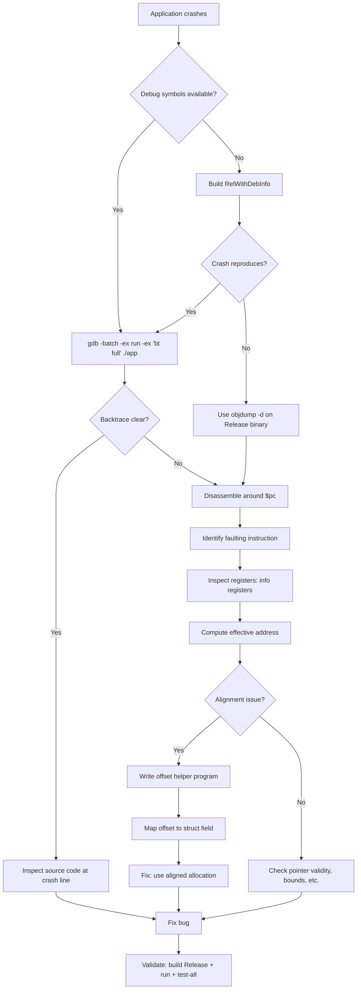

# GDB Debugging Tutorial — Case Study: SIMD Alignment Crash

This tutorial documents the step-by-step GDB debugging process used to diagnose and fix a **SIGSEGV crash that only occurred in Release builds** of suckless-ogl. It covers essential GDB techniques for native C application debugging, from basic crash triage to advanced disassembly analysis.

## Context

After migrating heap allocations to a subsystem descriptor pattern, the application crashed with SIGSEGV in Release (`-O3`) builds but ran fine in Debug (`-g -O0`). The root cause was an **AVX alignment violation**: Clang auto-vectorized struct initialization with `vmovaps` (which requires 32-byte alignment), but `calloc` only guarantees 16-byte alignment on glibc x86_64.

---

## 1. First Response: Batch-Mode Backtrace

When an application crashes, the first reflex is to get a backtrace. GDB's **batch mode** is ideal for automated crash triage — it runs the program, captures the crash, and prints the backtrace without interactive input.

### Command

```bash
gdb -batch -ex run -ex 'bt full' ./build/app
```

### Breakdown

| Flag | Purpose |
|------|---------|
| `-batch` | Non-interactive mode. GDB exits after executing all `-ex` commands. |
| `-ex run` | Start the program. |
| `-ex 'bt full'` | Print a full backtrace with local variables when the crash occurs. |

### What to expect

- **With debug symbols** (`-g`): Full function names, file/line numbers, local variable values.
- **Without symbols** (Release `-O3`): Only addresses and `??` — still useful for the crash address.

### Example output (Release, no symbols)

```text
Program received signal SIGSEGV, Segmentation fault.
0x000055555557a3f0 in ?? ()
```

This tells us the crash address (`0x55555557a3f0`) but nothing else. We need more information.

### Example output (Debug or RelWithDebInfo)

```text
Program received signal SIGSEGV, Segmentation fault.
postprocess_subsys_init (app=0x7fff...) at src/postprocess_init.c:42
42    *app->postprocess = (PostProcess){0};
(gdb) bt full
#0  postprocess_subsys_init (app=0x7fff...) at src/postprocess_init.c:42
#1  0x00005555... in app_init (app=0x7fff...) at src/app.c:180
...
```

### Tip: Adding arguments

```bash
gdb -batch -ex 'run --width 800 --height 600' -ex 'bt full' ./build/app
```

---

## 2. Build Types and Symbol Availability

Not all builds are equal for debugging. Understanding CMake build types is critical:

| Build Type | Optimization | Debug Symbols | Crashes Reproduce? | Use For |
|-----------|-------------|---------------|-------------------|---------|
| `Debug` | `-O0` | Full (`-g`) | Maybe not | Step-through, variable inspection |
| `RelWithDebInfo` | `-O2` | Full (`-g`) | Sometimes | Best of both worlds |
| `Release` | `-O3` | None | **Yes** (if bug is optimization-related) | Final validation |
| `ASAN` | `-O1` | Full (`-g`) + sanitizers | Sometimes | Memory errors |

### Key insight

**Optimization-dependent bugs may NOT reproduce in Debug builds.** In our case, the crash only happened at `-O3` because Clang only auto-vectorizes with AVX at higher optimization levels. The same code at `-O0` used scalar `mov` instructions (8-byte aligned) — no crash.

### Building RelWithDebInfo

```bash
cmake -B build-reldbg -DCMAKE_BUILD_TYPE=RelWithDebInfo
cmake --build build-reldbg -j$(( $(nproc) - 2 ))
```

This gives optimized code with symbols — the sweet spot for debugging optimization-related crashes.

---

## 3. Disassembly: Finding the Faulting Instruction

When the backtrace shows `??`, you need to examine the machine code directly.

### Method 1: GDB `disassemble`

```bash
gdb -batch -ex run -ex 'disassemble $pc-32,$pc+32' ./build/app
```

This disassembles 64 bytes around the program counter (`$pc`) at crash time.

### Method 2: `objdump` (offline, no crash needed)

```bash
objdump -d ./build/app | grep -A5 -B5 "55555557a3f0"
```

Or with full disassembly piped to less:

```bash
objdump -d ./build/app | less
# Then search with /vmovaps
```

### Method 3: GDB interactive disassembly

```bash
gdb ./build/app
(gdb) run
# ... crash ...
(gdb) disassemble
(gdb) x/20i $pc-40    # Show 20 instructions before crash point
(gdb) info registers   # Show all register values
```

### What we found

```asm
vmovaps %ymm0, 0x100(%rbx)
```

This is the faulting instruction:

- `vmovaps` = **V**ector **MOV**e **A**ligned **P**acked **S**ingle — an AVX instruction that moves 32 bytes (256 bits) and **requires 32-byte alignment**.
- `%ymm0` = Source register (256-bit YMM register, zeroed by `vxorps`).
- `0x100(%rbx)` = Destination: base address in `%rbx` plus offset `0x100` (256 decimal).

---

## 4. Register Inspection

Registers are the key to understanding what memory address caused the fault.

### Examining registers at crash

```bash
gdb -batch -ex run -ex 'info registers' ./build/app
```

Or interactively:

```gdb
(gdb) info registers
(gdb) info registers rbx    # Single register
(gdb) p/x $rbx              # Print in hex
(gdb) p/x $rbx + 0x100      # Compute effective address
```

### Alignment check

```gdb
(gdb) p/x ($rbx + 0x100) % 32
$1 = 0x10
```

If the result is not `0x0`, the address is **not 32-byte aligned** — and `vmovaps` will fault.

### Our case

```text
rbx = 0x5555559c3f10   (PostProcess pointer)
effective address = rbx + 0x100 = 0x5555559c4010
0x5555559c4010 % 32 = 16  ← NOT 32-aligned!
```

`calloc` returned an address with 16-byte alignment (glibc minimum for x86_64). The AVX instruction needed 32-byte alignment.

---

## 5. Mapping Offsets to Struct Fields

The offset `0x100` tells us which field in the struct triggered the crash. To map it, write a small helper program:

### The offset helper

```c
// /tmp/check_offsets.c
#include <stddef.h>
#include <stdio.h>
#include <stdalign.h>
#include "postprocess.h"

int main(void) {
    printf("PostProcess: size=%zu, align=%zu\n",
           sizeof(PostProcess), alignof(PostProcess));

    printf("  +0x%03lx: enabled\n", offsetof(PostProcess, enabled));
    printf("  +0x%03lx: bloom\n", offsetof(PostProcess, bloom));
    printf("  +0x%03lx: dof\n", offsetof(PostProcess, dof));
    // ... add all fields ...

    return 0;
}
```

### Compile and run

```bash
gcc -I include -I _deps/cglm-src/include /tmp/check_offsets.c -o /tmp/check_offsets
/tmp/check_offsets
```

### Output example

```text
PostProcess: size=2800, align=16
  +0x000: enabled
  +0x004: bloom
  +0x0f8: dof
  +0x1b0: auto_exposure
  ...
```

Cross-reference the crash offset (`0x100`) with the struct layout to identify the exact field being written when the crash occurred.

---

## 6. Understanding the Root Cause: SIMD Auto-Vectorization

### Why Release crashes but Debug doesn't

At `-O0` (Debug), the compiler generates scalar code:

```asm
movq $0, (%rax)      # 8-byte store, no alignment requirement beyond 8
movq $0, 8(%rax)
movq $0, 16(%rax)
...
```

At `-O3` (Release), the compiler **auto-vectorizes** the zero-initialization:

```asm
vxorps %ymm0, %ymm0, %ymm0    # Zero the 256-bit YMM register
vmovaps %ymm0, (%rbx)           # Store 32 bytes (ALIGNED — requires 32-byte alignment)
vmovaps %ymm0, 0x20(%rbx)       # Next 32 bytes
vmovaps %ymm0, 0x40(%rbx)       # ...
```

The `vmovaps` instruction faults if the effective address is not 32-byte aligned. `calloc` only guarantees `max(16, sizeof(max_align_t))` = 16 bytes on glibc x86_64.

### The fix

Replace `calloc` with `posix_memalign` (via `platform_aligned_alloc`) using 64-byte alignment:

```c
// Before (crashes in Release)
PostProcess* pp = calloc(1, sizeof(PostProcess));

// After (safe for AVX-512)
PostProcess* pp = platform_aligned_alloc(sizeof(*pp), SIMD_ALIGNMENT);
*pp = (PostProcess){0};  // Zero-init via compound literal
```

64-byte alignment (`SIMD_ALIGNMENT`) is chosen because:

1. It satisfies AVX (32-byte) and AVX-512 (64-byte) requirements
2. It matches the L1 cache line size on modern x86_64 CPUs
3. It prevents cache line splitting for better performance

---

## 7. Essential GDB Commands Reference

### Startup and execution

| Command | Description |
|---------|-------------|
| `gdb ./app` | Start GDB with the program |
| `gdb -batch -ex run -ex 'bt' ./app` | Batch mode: run and backtrace |
| `run` / `r` | Start/restart the program |
| `run --arg1 val1` | Start with arguments |
| `continue` / `c` | Resume after breakpoint |
| `next` / `n` | Step over (next line) |
| `step` / `s` | Step into function |
| `finish` | Run until current function returns |

### Breakpoints

| Command | Description |
|---------|-------------|
| `break main` | Break at function |
| `break file.c:42` | Break at file:line |
| `break *0x555555557a3f0` | Break at address |
| `watch *0x7fff0000` | Break when memory changes |
| `info breakpoints` | List breakpoints |
| `delete 1` | Remove breakpoint #1 |

### Inspection

| Command | Description |
|---------|-------------|
| `bt` / `backtrace` | Print call stack |
| `bt full` | Backtrace with local variables |
| `frame 3` | Switch to frame #3 |
| `info locals` | Print local variables |
| `info args` | Print function arguments |
| `print expr` | Evaluate C expression |
| `p/x $rax` | Print register in hex |
| `p sizeof(MyStruct)` | Print type size |

### Memory and disassembly

| Command | Description |
|---------|-------------|
| `x/10x $rsp` | Examine 10 hex words at stack pointer |
| `x/20i $pc` | Examine 20 instructions at program counter |
| `x/s $rdi` | Examine string at register |
| `disassemble` | Disassemble current function |
| `disassemble $pc-32,$pc+32` | Disassemble around crash |
| `info registers` | All registers |
| `info registers rax rbx` | Specific registers |

### Advanced

| Command | Description |
|---------|-------------|
| `set disassembly-flavor intel` | Switch to Intel syntax |
| `layout asm` | TUI assembly view |
| `layout split` | TUI source + assembly |
| `info threads` | List threads |
| `thread 2` | Switch to thread #2 |
| `set follow-fork-mode child` | Debug child after fork |
| `catch signal SIGSEGV` | Break on specific signal |
| `handle SIGUSR1 nostop` | Ignore specific signal |

---

## 8. Debugging Workflow Summary



---

## 9. Practical Tips

### Tip 1: Always test Release builds

Debug builds hide alignment bugs, race conditions, and UB that the optimizer exposes. Always validate with:

```bash
timeout 5 ./build/app
```

Use `timeout` to avoid hanging on a headless/CI environment.

### Tip 2: Use `objdump` for Release binaries

When a Release binary crashes and you can't reproduce in RelWithDebInfo:

```bash
# Find the crash function
objdump -d ./build/app | grep -B20 "vmovaps"

# Full disassembly to a file for analysis
objdump -d ./build/app > /tmp/disasm.txt
```

### Tip 3: Alignment arithmetic

Quick alignment check in bash:

```bash
python3 -c "addr=0x5555559c4010; print(f'mod 16: {addr%16}, mod 32: {addr%32}, mod 64: {addr%64}')"
```

Or in GDB:

```gdb
(gdb) p/x $rbx % 64
```

### Tip 4: Core dumps

Enable core dumps for post-mortem analysis:

```bash
ulimit -c unlimited
./build/app        # Crashes, produces core file
gdb ./build/app core   # Analyze the core dump
(gdb) bt full
```

### Tip 5: Conditional breakpoints

Break only when a condition is met:

```gdb
(gdb) break postprocess_subsys_init if app->postprocess == 0
(gdb) break scene_init.c:42 if count > 100
```

### Tip 6: GDB with sanitizers

ASAN and GDB work together. ASAN detects the error, GDB lets you inspect the state:

```bash
gdb ./build-asan/app
(gdb) set environment ASAN_OPTIONS=abort_on_error=1
(gdb) run
# ASAN reports error, then GDB catches the abort
(gdb) bt full
```

### Tip 7: Examining memory around a pointer

```gdb
(gdb) x/32xb $rbx          # 32 bytes starting at rbx
(gdb) x/8xg $rbx           # 8 giant words (64-bit) starting at rbx
(gdb) p *(PostProcess*)$rbx # Cast register to struct and print
```

---

## 10. Related Resources

- [Debugging Guide](debugging.md) — OpenGL debug output and ApiTrace
- [CPU Profiling Flamegraph](cpu_profiling_flamegraph.md) — Performance profiling
- [Memory Management Audit](memory_management_audit.md) — Allocation patterns
- [Application Lifecycle](application_lifecycle.md) — Subsystem init/cleanup architecture
