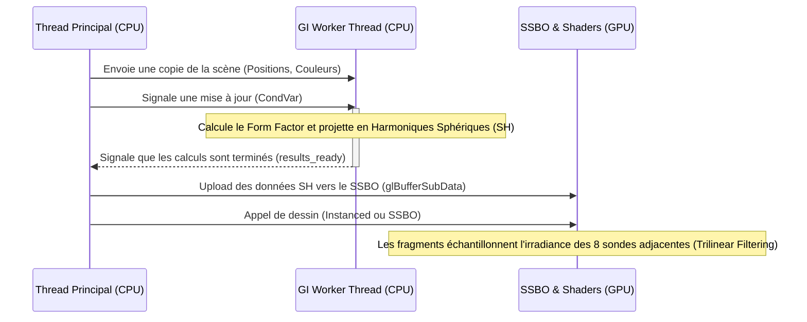

# Global Illumination (1-Bounce)

Suckless-OGL incorpore une solution d'**Illumination Globale (GI) à 1 rebond** légère et performante. L'objectif est de capturer le transfert de couleur diffuse (Color Bleeding) entre les objets de la scène, sans nécessiter de techniques lourdes telles que le Path Tracing ou le Voxel Cone Tracing, et sans avoir recours à des techniques Screen-Space (SSGI) qui souffrent d'artefacts d'occlusion.

L'approche repose sur un **Volume de Light Probes (Sondes de Lumières)** encodant l'irradiance au travers d'**Harmoniques Sphériques (Spherical Harmonics - SH)**.

---

## Architecture de l'Implémentation

Le système combine un calcul CPU asynchrone et un échantillonnage GPU sans aucune interruption (stall) du thread de rendu principal.



1. **Light Probe Grid (CPU)**:
   - Une grille 3D régulière de sondes est dimensionnée pour englober la scène entière.

   - Un thread dédié (`GI Probe Worker`) calcule l'irradiance de chaque sonde depuis chaque objet interactif de la scène, de manière totalement asynchrone.

2. **Synchronisation vers GPU (SSBO)**:
   - Chaque frame, le thread principal vérifie (via un `trylock`) si un nouveau calcul de SH est disponible.

   - Si oui, les données sont envoyées au GPU via un **Shader Storage Buffer Object (SSBO)**, minimisant l'overhead CPU vers GPU.

3. **Échantillonnage (Fragment Shader)**:
   - Lors de l'évaluation PBR, si la GI est activée, le fragment calcule sa position par rapport à la grille.

   - Deux méthodes d'échantillonnage sont disponibles :
     - **Textures 3D (Hardware)** : Utilise 7 textures 3D avec interpolation trilinéaire matérielle. C'est la méthode la plus performante.

     - **SSBO (Software)** : Accède directement au buffer de sondes et effectue l'interpolation trilinéaire manuellement dans le shader.

   - Le résultat est une irradiance douce et continue.

---

## Mathématiques & Optimisations

Le coeur de l'algorithme réside dans le calcul de la lumière rebondie (Color Bleeding). L'intensité de l'échange radiatif (Radiative Transfer) entre un émetteur diffus (une sphère) et un récepteur (la sonde) est définie par l'équation de rendu.

### Facteur de Forme et Simplification Lambertienne

Pour une surface diffuse (Lambertienne), la fonction de distribution de la réflectance bidirectionnelle (BRDF) est définie par :

$$
f_r = \frac{\rho}{\pi}
$$

où $\rho$ est l'albedo.

L'angle solide $\Omega$ sous-tendu par une sphère de rayon $r$ à distance $d$ est approximé pour les petites surfaces par :

$$
\Omega \approx \pi \frac{r^2}{d^2}
$$

L'énergie totale transférée de la sphère à la sonde pour une radiance unitaire (1.0) est le produit de la BRDF émettrice et de l'angle solide récepteur :

$$
\text{Color for SH} \approx L_{exitant} \times \Omega = \left(\frac{albedo}{\pi}\right) \times \left(\pi \frac{r^2}{d^2}\right)
$$

**Optimisation Critique** : Comme nous pouvons le voir ci-dessus, les termes en $\pi$ **s'annulent parfaitement**. L'énergie à accumuler dans l'Harmonique Sphérique se réduit donc au Facteur de Forme (Form Factor) brut :

$$
\text{Form Factor (FF)} = \frac{r^2}{d^2}
$$

Cette factorisation massive élimine plusieurs instructions trigonométriques complexes par sphère et par sonde.

```c
// Extrait depuis light_probes.c
float ff = (radius * radius) / dist2; // dist2 = distance au carré

float diffuse = (1.0f - sphere->metallic) * ff * GI_BOUNCE_SCALE;

vec3 radiance;
glm_vec3_scale((float*)sphere->albedo, diffuse, radiance);

```

_(On observe également que les matériaux purs métaux (`metallic == 1.0f`) ne contribuent pas au rebond diffus, car les métaux n'ont pas de diffusion sous-surfacique par définition de la physique PBR)._

### Seuils Limites (Bounding) et Prévention du SH Ringing

Les Harmoniques Sphériques (SH) sont excellentes pour modéliser une illumination à très basse fréquence, mais elles échouent (provoquent du _ringing_, soit un dépassement des couleurs avec des valeurs négatives ou hyper-brillantes) sous des signaux très concentrés (Delta Function).

De plus, si une sonde est positionnée **à l'intérieur** d'une surface, ou exactement sur sa surface, $d \rightarrow 0$ et le Form Factor diverge vers l'infini.

Pour éviter ces artéfacts et optimiser l'algorithme, des seuils très stricts sont mis en place :

1. **`GI_MIN_DIST_RADII` (1.05)** : Rejette toute contribution si la sonde est à moins de $1.05\times$ le rayon de l'émetteur. Ceci empêche l'auto-illumination aberrante et le Ringing des SH, tout en permettant à la surface de capter avec force la couleur de son plus proche voisin ($d \geq 1.05$).

2. **`GI_MAX_DIST_RADII` (3.0)** : Culling spatial pur. Au-delà de $3\times$ le rayon, le Facteur de Forme est inférieur à $0.0025$, ce qui est indiscernable visuellement. On ignore la sphère et l'on gagne considérablement en performance CPU.

---

## Harmoniques Sphériques (Band 2)

Nous encodons les données colorimétriques projetées sur la **sphère d'irradiance** en utilisant les 3 premières bandes (Bande 0, 1 et 2) des Harmoniques Sphériques.

$$
E(n) = \sum_{l=0}^{2} A_l \sum_{m=-l}^{l} L_{l}^{m} Y_{l}^{m}(n)
$$

- $Y_l^m$ : Fonctions de base réelles.

- $L_l^m$ : Coefficients projetés (Stockés dans les 9 vecteurs des SSBO).

- $A_l$ : Coefficients de Convolution Cosinus ($\pi$, $\frac{2\pi}{3}$, $\frac{\pi}{4}$).

Le shader (`sh_probe.glsl`) et la partie mathématiques CPU (`sh_math.c`) évaluent ces coefficients de la même manière que la théorie originale formalisée par **Ramamoorthi et Hanrahan**.

### Méthodes de Stockage & Échantillonnage GPU

Le système supporte deux modes de transfert et d'échantillonnage, commutables à la volée.

#### 1. Textures 3D (Hardware Interpolation)

Chacun des 9 coefficients est packé dans un ensemble de 7 textures 3D `RGBA16F`. Cela permet de déléguer l'interpolation trilinéaire à l'unité de texture du GPU.

- **Avantage** : Performance maximale, interpolation gratuite.

- **Inconvénient** : Nécessite un packing complexe CPU-side (7 textures).

```glsl
// sh_probe.glsl
uniform sampler3D u_SHTexture0; // ... à 6
vec3 uvw = (local_pos * vec3(u_ProbeGridDim - 1) + 0.5) / vec3(u_ProbeGridDim);

vec4 t0 = texture(u_SHTexture0, uvw); // ...

```

#### 2. SSBO (Software Interpolation)

Les données sont envoyées brutes dans un **Shader Storage Buffer Object (SSBO)**. Le shader effectue alors les 8 lectures et les interpolations `mix()` manuellement.

- **Avantage** : Transfert immédiat sans packing, alignement `std430` simple.

- **Inconvénient** : Plus coûteux en instructions shader et accès mémoire.

```glsl
// sh_probe.glsl
layout(std430, binding = 3) readonly buffer ProbeBuffer {
 LightProbe probes[];
};

```

Chacun des 9 coefficients est stocké sous forme de `vec4` (16 bytes) pour satisfaire les prérequis d'alignement `std430`.

---

## Conclusion et Contrôles

L'approche de la GI dans Suckless-OGL par sondes d'irradiance procure un ajout visuel remarquable, ancrant physiquement les objets entre eux sans coût de rendu supplémentaire par fragment, autre que les 8 interpolations mathématiques et l'évaluation des 9 coefficients en un passage déterministe.

**Raccourcis en cours d'exécution** :

- `Y` : Cycle entre les modes de GI : **Textures 3D** -> **SSBO** -> **Désactivé**.

- `Shift + Y` : Affiche les sondes de la grille sous la forme de sphères lumineuses de debug (Debug Probes Draw).
