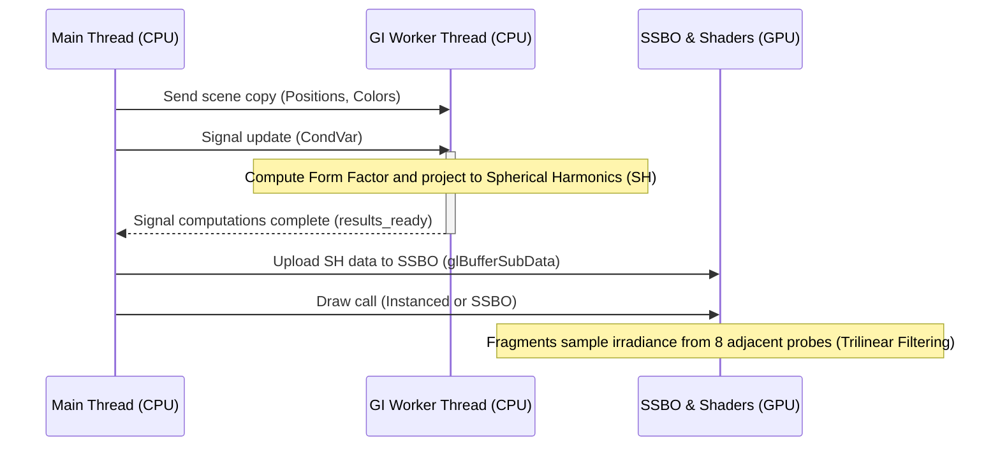

# Global Illumination (1-Bounce)

Suckless-OGL incorporates a lightweight, high-performance **1-bounce Global Illumination (GI)** solution. The goal is to capture diffuse color transfer (Color Bleeding) between scene objects without requiring heavy techniques such as Path Tracing or Voxel Cone Tracing, and without resorting to Screen-Space techniques (SSGI) that suffer from occlusion artifacts.

The approach relies on a **Light Probe Volume** encoding irradiance via **Spherical Harmonics (SH)**.

---

## Implementation Architecture

The system combines asynchronous CPU computation with GPU sampling, with no interruption (stall) to the main render thread.



1. **Light Probe Grid (CPU)**:
   - A regular 3D grid of probes is sized to encompass the entire scene.
   - A dedicated thread (`GI Probe Worker`) asynchronously computes each probe's irradiance from every interactive scene object.
2. **GPU Synchronization (SSBO)**:
   - Each frame, the main thread checks (via `trylock`) whether a new SH computation is available.
   - If so, data is sent to the GPU via a **Shader Storage Buffer Object (SSBO)**, minimizing CPU-to-GPU overhead.
3. **Sampling (Fragment Shader)**:
   - During PBR evaluation, if GI is enabled, the fragment computes its position relative to the grid.
   - Two sampling methods are available:
     - **3D Textures (Hardware)**: Uses 7 3D textures with hardware trilinear interpolation. This is the most performant method.
     - **SSBO (Software)**: Directly accesses the probe buffer and performs trilinear interpolation manually in the shader.
   - The result is smooth, continuous irradiance.

---

## Mathematics & Optimizations

The core of the algorithm lies in computing bounced light (Color Bleeding). The intensity of the radiative exchange between a diffuse emitter (a sphere) and a receiver (the probe) is defined by the rendering equation.

### Form Factor and Lambertian Simplification

For a diffuse (Lambertian) surface, the Bidirectional Reflectance Distribution Function (BRDF) is defined by:

$$
f_r = \frac{\rho}{\pi}
$$

where $\rho$ is the albedo.

The solid angle $\Omega$ subtended by a sphere of radius $r$ at distance $d$ is approximated for small surfaces by:

$$
\Omega \approx \pi \frac{r^2}{d^2}
$$

The total energy transferred from the sphere to the probe for unit radiance (1.0) is the product of the emitter BRDF and the receiver solid angle:

$$
\text{Color for SH} \approx L_{exitant} \times \Omega = \left(\frac{albedo}{\pi}\right) \times \left(\pi \frac{r^2}{d^2}\right)
$$

**Critical Optimization**: As shown above, the $\pi$ terms **cancel out perfectly**. The energy to accumulate in the Spherical Harmonic reduces to the raw Form Factor:

$$
\text{Form Factor (FF)} = \frac{r^2}{d^2}
$$

This massive simplification eliminates several complex trigonometric instructions per sphere per probe.

```c
// Excerpt from light_probes.c
float ff = (radius * radius) / dist2; // dist2 = squared distance
float diffuse = (1.0f - sphere->metallic) * ff * GI_BOUNCE_SCALE;
vec3 radiance;
glm_vec3_scale((float*)sphere->albedo, diffuse, radiance);
```

*(Note that pure metallic materials (`metallic == 1.0f`) do not contribute to diffuse bounce, as metals have no subsurface diffusion by PBR physics definition).*

---

### Clamping Thresholds and SH Ringing Prevention

Spherical Harmonics are excellent for modeling very low-frequency illumination, but they fail (producing *ringing*, i.e., color overshoot with negative or hyper-bright values) under highly concentrated signals (Delta Functions).

Furthermore, if a probe is placed **inside** a surface, or exactly on its surface, $d \rightarrow 0$ and the Form Factor diverges to infinity.

To prevent these artifacts and optimize the algorithm, strict thresholds are enforced:

1. **`GI_MIN_DIST_RADII` (1.05)**: Rejects any contribution if the probe is less than $1.05\times$ the emitter's radius away. This prevents aberrant self-illumination and SH Ringing, while still allowing the surface to strongly capture the color of its nearest neighbor ($d \geq 1.05$).
2. **`GI_MAX_DIST_RADII` (3.0)**: Pure spatial culling. Beyond $3\times$ the radius, the Form Factor is below $0.0025$, which is visually indistinguishable. The sphere is ignored, yielding significant CPU performance gains.

---

## Spherical Harmonics (Band 2)

We encode projected colorimetric data onto the **irradiance sphere** using the first 3 bands (Band 0, 1, and 2) of Spherical Harmonics.

$$
E(n) = \sum_{l=0}^{2} A_l \sum_{m=-l}^{l} L_{l}^{m} Y_{l}^{m}(n)
$$

- $Y_l^m$: Real basis functions.
- $L_l^m$: Projected coefficients (stored in the 9 SSBO vectors).
- $A_l$: Cosine Convolution coefficients ($\pi$, $\frac{2\pi}{3}$, $\frac{\pi}{4}$).

The shader (`sh_probe.glsl`) and the CPU math part (`sh_math.c`) evaluate these coefficients in the same way as the original theory formalized by **Ramamoorthi and Hanrahan**.

### Storage Methods & GPU Sampling

The system supports two transfer and sampling modes, switchable at runtime.

#### 1. 3D Textures (Hardware Interpolation)

Each of the 9 coefficients is packed into a set of 7 `RGBA16F` 3D textures. This delegates trilinear interpolation to the GPU texture unit.

- **Advantage**: Maximum performance, free interpolation.
- **Drawback**: Requires complex CPU-side packing (7 textures).

```glsl
// sh_probe.glsl
uniform sampler3D u_SHTexture0; // ... to 6
vec3 uvw = (local_pos * vec3(u_ProbeGridDim - 1) + 0.5) / vec3(u_ProbeGridDim);
vec4 t0 = texture(u_SHTexture0, uvw); // ...
```

#### 2. SSBO (Software Interpolation)

Data is sent raw into a **Shader Storage Buffer Object (SSBO)**. The shader then performs the 8 reads and `mix()` interpolations manually.

- **Advantage**: Immediate transfer without packing, simple `std430` alignment.
- **Drawback**: More costly in shader instructions and memory accesses.

```glsl
// sh_probe.glsl
layout(std430, binding = 3) readonly buffer ProbeBuffer {
 LightProbe probes[];
};
```

Each of the 9 coefficients is stored as a `vec4` (16 bytes) to meet `std430` alignment requirements.

---

## Conclusion and Controls

Suckless-OGL's irradiance probe GI approach provides a remarkable visual addition, physically grounding objects in relation to each other with no additional per-fragment rendering cost, other than 8 mathematical interpolations and deterministic evaluation of 9 coefficients in a single pass.

**Runtime Shortcuts**:

- `Y`: Cycle between GI modes: **3D Textures** -> **SSBO** -> **Disabled**.
- `Shift + Y`: Display the grid probes as luminous debug spheres (Debug Probes Draw).
