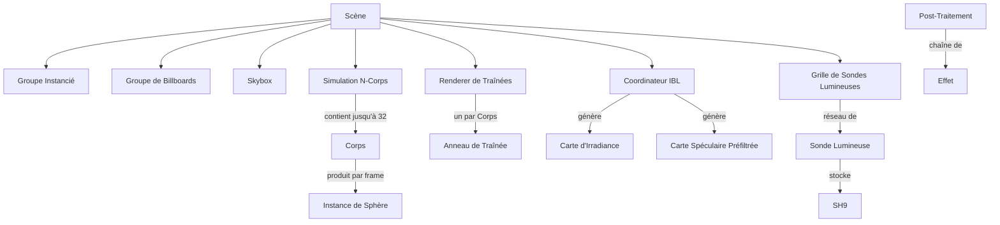

# Lexique Technique

Ce lexique regroupe les termes et expressions techniques utilisés dans le projet, couvrant les aspects théoriques du rendu PBR, les optimisations géométriques, les concepts de bas niveau de l'API graphique, et le **modèle de domaine** utilisé dans l'ensemble du code source.

!!! info "Langage Ubiquitaire"
    Les sections du modèle de domaine ci-dessous définissent la terminologie canonique du projet.
    Chaque terme inclut des **alias à éviter** — des mots à ne pas utiliser dans le code,
    les commentaires ou la documentation car ils créent de l'ambiguïté. Voir
    [Ambiguïtés signalées](#ambiguites-signalees) pour les détails.

---

## 🎨 Rendu & Physique (PBR / IBL)

| Terme | Définition Logicielle / Théorique |
| :--- | :--- |
| **PBR** | *Physically Based Rendering*. Modèle de rendu basé sur les lois de la physique pour simulant l'interaction réelle de la lumière avec les matériaux. |
| **IBL** | *Image Based Lighting*. Utilisation d'une image (cubemap HDR) pour simuler une illumination globale complexe. |
| **BRDF** | *Bidirectional Reflective Distribution Function*. Fonction définissant comment un matériau réfléchit la lumière (modèle de Cook-Torrance). |
| **NDF (GGX)** | *Normal Distribution Function*. Partie du PBR décrivant la micro-géométrie des surfaces (distribution des micro-facettes). |
| **Split-Sum** | Approximation mathématique (Epic Games) permettant de calculer l'IBL spéculaire en temps réel via une pré-intégration (Prefiltered Map + BRDF LUT). |
| **Irradiance / Radiance** | L'Irradiance est le flux lumineux incident total (diffus), la Radiance est le flux dans une direction précise (spéculaire). |
| **Normal Mapping / TBN** | Simulation de détails via une texture. La matrice **TBN** (Tangent, Bitangent, Normal) transforme les vecteurs du "Tangent Space" vers le "World Space". |

## 📐 Optimisations de Projection (Sphères / Billboards)

| Terme | Définition Logicielle |
| :--- | :--- |
| **Imposteurs** | Technique simulant une géométrie 3D complexe (sphère) sur un quad 2D via du ray-casting dans le shader. |
| **Analytic AA** | Anti-Aliasing mathématique sur le bord de la sphère calculé à partir de la dérivée du discriminant (`fwidth`), offrant des contours parfaits. |
| **Tangent Planes** | Méthode géométrique calculant la "bounding box" (AABB) parfaite d'une sphère à l'écran via les plans tangents passant par la caméra. |
| **Conservative Depth** | Positionnement du quad au point le plus proche de la sphère pour garantir un Z-test correct avant l'écriture de `gl_FragDepth`. |
| **Discriminant** | Valeur de l'équation Rayon-Sphère ($b^2 - ac$). Détermine si un pixel est à l'intérieur ($>0$) ou à l'extérieur ($<0$) de la sphère. |
| **Perspective Distortion** | Déformation elliptique d'une sphère lorsqu'elle s'éloigne du centre de l'écran, gérée ici par la projection exacte des tangents. |

## ⚙️ API Graphique & Flux de Données (GPU)

| Terme | Définition Logicielle |
| :--- | :--- |
| **PBO (Zero-Copy)** | *Pixel Buffer Object*. Utilisation de `GL_MAP_UNSYNCHRONIZED_BIT` pour uploader des données sans bloquer le CPU. |
| **Fence Sync** | Objet `glFenceSync` permettant de vérifier la complétion d'une tâche GPU sans forcer un vidage complet (stall) du pipeline. |
| **Flat Interpolation** | Qualificateur `flat` empêchant l'interpolation entre sommets, crucial pour la stabilité numérique des calculs de silouhette sur les sphères. |
| **Provoking Vertex** | Sommet dont la valeur est utilisée par l'ensemble de la primitive lors d'une interpolation `flat`. |
| **Pipeline Stall** | Latence critique où le CPU attend le GPU (causée par une lecture synchrone ou un `glFinish`). |

## 🚀 Architecture & Système

| Terme | Définition Logicielle |
| :--- | :--- |
| **Time Slicing** | Découpage d'opérations lourdes (IBL) en petites tranches réparties sur plusieurs frames pour maintenir un FPS constant. |
| **Double Buffering (Pending)** | Préparation d'un nouvel état (ex: environnement) en arrière-plan pendant que l'ancien est toujours en cours d'affichage. |
| **SIMD (AVX)** | Utilisation d'instructions processeur larges pour traiter plusieurs flottants simultanément (utilisé pour le tri des sphères). |
| **PAL** | *Platform Abstraction Layer*. Couche isolant le code métier des spécificités système (Linux/Windows). |
| **MkDocs / Doxygen** | Outils de génération de documentation (Narrative vs API Reference). |
| **Tracy** | Profileur hybride (CPU/GPU) utilisé pour analyser les performances en temps réel. |

---

# Modèle de Domaine — Langage Ubiquitaire

Les sections ci-dessous définissent le vocabulaire canonique pour les objets du domaine
du projet, leurs relations et les ambiguïtés de nommage connues.

## 🪐 Simulation

| Terme | Définition | Alias à éviter |
| :--- | :--- | :--- |
| **Simulation N-Corps** | Système gravitationnel de particules intégrant les positions des corps via Velocity Verlet avec adoucissement de Plummer. | Simulation physique, système de particules |
| **Corps** (Body) | Une entité gravitationnelle unique avec position, vitesse, masse, rayon et propriétés PBR (`NBodyParticle`). | Particule, sphère, objet |
| **Échelle de Temps** (Time Scale) | Un multiplicateur de vitesse signé qui transite en douceur entre temps réel, pause et inversion. | Vitesse, taux de lecture |
| **Dérive d'Énergie** (Energy Drift) | L'écart relatif de l'énergie totale par rapport à la référence initiale, utilisé pour diagnostiquer la stabilité de l'intégrateur. | Erreur d'énergie |

## 🔷 Rendu — Géométrie

| Terme | Définition | Alias à éviter |
| :--- | :--- | :--- |
| **Scène** (Scene) | Le conteneur racine de toute la géométrie 3D, des ressources GPU, des shaders et de la configuration de rendu (`Scene`). | Monde, niveau, contexte |
| **Icosphère** (Icosphere) | Un maillage sphérique généré procéduralement par subdivision récursive d'un icosaèdre (`IcosphereGeometry`). | Mesh sphère, UV sphere |
| **Groupe Instancié** (Instanced Group) | Un ensemble de sphères opaques dessinées en un seul appel `glDrawElementsInstanced` via un VBO partagé (`InstancedGroup`). | Batch, groupe de dessin |
| **Billboard** | Un quad aligné à l'écran qui rend une sphère via raycasting dans le fragment shader, moins coûteux que le rendu de maillage. | Imposteur, sprite, quad |
| **Groupe de Billboards** (Billboard Group) | Un ensemble géré de **Billboards** avec un VAO partagé et un VBO par instance pour le dessin GPU (`BillboardGroup`). | Batch de billboards |
| **Instance de Sphère** (Sphere Instance) | Un paquet de données par instance de 64 octets alignés (matrice modèle, matériau PBR, position précédente) envoyé au GPU (`SphereInstance`). | Données d'instance |
| **Trieur de Billboards** (Billboard Sorter) | Le sous-système qui ordonne les **Billboards** transparents d'arrière en avant pour un mélange alpha correct (`BillboardSorter`). | Passe de tri |
| **Mode de Tri** (Sorting Mode) | L'algorithme utilisé par le **Trieur** : qsort CPU, radix CPU ou bitonic GPU (`SortingMode`). | Stratégie de tri |

## 🎨 Rendu — Ombrage & Éclairage

| Terme | Définition | Alias à éviter |
| :--- | :--- | :--- |
| **Matériau PBR** (PBR Material) | Une description de surface avec albédo, métallique et rugosité pour le pipeline PBR (`PBRMaterial`). | Matériau, surface |
| **Bibliothèque de Matériaux** (Material Library) | Une collection de préréglages **Matériau PBR** nommés chargés depuis le disque (`MaterialLib`). | Ensemble de matériaux |
| **Shader** | Un programme OpenGL compilé avec cache automatique des uniforms et nettoyage RAII (struct `Shader`). | Programme, shader program |
| **Uniform** | Une variable GPU nommée définie par frame ou par draw ; les locations sont mises en cache dans un tableau trié pour une recherche $O(\log n)$ (`UniformEntry`). | Paramètre shader, constante |
| **UBO** | Uniform Buffer Object — un bloc de données structuré côté GPU (layout std140) partagé entre les draw calls. | Buffer de constantes |
| **SSBO** | Shader Storage Buffer Object — un buffer GPU en lecture/écriture pour les données volumineuses ou de taille variable. | Buffer de stockage |

## 🌍 Image-Based Lighting (IBL)

| Terme | Définition | Alias à éviter |
| :--- | :--- | :--- |
| **Coordinateur IBL** (IBL Coordinator) | La machine à états qui génère progressivement la **Carte d'Irradiance** et la **Carte Spéculaire Préfiltrée** à partir d'un environnement HDR sur plusieurs frames (`IBLCoordinator`). | Pipeline IBL, générateur IBL |
| **État IBL** (IBL State) | Une phase du cycle de vie du coordinateur : Idle → Luminance → Specular Init → Specular Mips → Irradiance → Done (`IBLState`). | Étape IBL, phase IBL |
| **Carte d'Environnement** (Environment Map) | Une texture HDR équirectangulaire représentant l'éclairage à distance infinie. | Carte HDR, texture skybox |
| **Carte d'Irradiance** (Irradiance Map) | Un cubemap basse fréquence encodant l'éclairage diffus de la **Carte d'Environnement** via convolution sphérique. | Carte diffuse |
| **Carte Spéculaire Préfiltrée** (Prefiltered Specular Map) | Un cubemap à chaîne de mips où chaque niveau stocke les réflexions spéculaires à rugosité croissante. | Carte spéculaire, prefilter map |
| **BRDF LUT** | Une table de correspondance 2D encodant l'approximation split-sum pour l'intégrale BRDF spéculaire. | BRDF lookup |
| **Gestionnaire d'Environnement** (Environment Manager) | Le sous-système gérant le chargement asynchrone des fichiers HDR, l'animation de transition et l'orchestration du **Coordinateur IBL** (`EnvManager`). | Chargeur d'env |

## 💡 Illumination Globale (GI)

| Terme | Définition | Alias à éviter |
| :--- | :--- | :--- |
| **Sonde Lumineuse** (Light Probe) | Un point de l'espace stockant 9 coefficients d'Harmoniques Sphériques L2 encodant l'irradiance locale (`LightProbe`). | Probe, sonde SH |
| **Grille de Sondes Lumineuses** (Light Probe Grid) | Un réseau 3D de **Sondes Lumineuses** couvrant l'AABB de la scène, mis à jour de manière asynchrone sur un thread worker (`LightProbeGrid`). | Grille de probes, grille GI |
| **SH9** | Un ensemble de 9 coefficients d'Harmoniques Sphériques alignés vec4 (bande 0 + bande 1 + bande 2). | Coefficients SH |
| **Mode GI** (GI Mode) | La stratégie d'échantillonnage de l'éclairage indirect : Off, Texture 3D ou SSBO (`GIMode`). | Méthode GI |

## 🌌 Skybox

| Terme | Définition | Alias à éviter |
| :--- | :--- | :--- |
| **Skybox** | Le renderer d'arrière-plan à distance infinie utilisant un quad plein écran avec échantillonnage raycasté de la **Carte d'Environnement** (struct `Skybox`). | Fond, renderer d'env |

## ✨ Effets Visuels

| Terme | Définition | Alias à éviter |
| :--- | :--- | :--- |
| **Traînée** (Trail) | Un ruban face-caméra rendu en blending additif avec émission HDR, montrant les positions passées d'un **Corps**. | Chemin, ligne orbitale, trajectoire |
| **Renderer de Traînées** (Trail Renderer) | Le sous-système qui enregistre les positions des **Corps** dans des buffers circulaires et construit la géométrie de ruban triangle-strip à chaque frame (`TrailRenderer`). | Gestionnaire de traînées |
| **Anneau de Traînée** (Trail Ring) | Un buffer circulaire de positions horodatées pour un **Corps**, utilisé pour générer la géométrie de **Traînée** (`TrailRing`). | Historique de traînée |
| **Paramètres Néon** (Neon Params) | Profil de lueur ajustable en temps réel pour les **Traînées** : intensité HDR, resserrement du cœur et largeur du ruban (`TrailNeonParams`). | Paramètres de lueur |

## 🎬 Pipeline de Post-Traitement

| Terme | Définition | Alias à éviter |
| :--- | :--- | :--- |
| **Post-Traitement** (Post-Process) | Le pipeline d'image multi-passes appliqué après le rendu de la scène : bloom, DoF, exposition, color grading, FXAA, brouillard, LUT, motion blur (`PostProcess`). | Post-FX, compositing |
| **Effet** (Effect) | Une passe unique de post-traitement (ex. Bloom, DoF, FXAA) activable via un flag bitmask (`PostProcessEffect`). | Filtre, passe |
| **Bloom** | Un flou gaussien multi-résolution avec passe de seuillage simulant le saignement lumineux des zones HDR. | Lueur, HDR bloom |
| **Profondeur de Champ** (DoF) | Un effet de flou bokeh contrôlé par la distance focale, la plage focale et le ratio anamorphique. | Flou de focus, flou de lentille |
| **Auto-Exposition** (Auto-Exposure) | Adaptation automatique de la luminance basée sur un histogramme, ajustant l'exposition dans le temps. | Adaptation oculaire |
| **Flou de Mouvement** (Motion Blur) | Flou directionnel par pixel basé sur un buffer de vélocité simulant le mouvement caméra/objet. | Flou |
| **FXAA** | Fast Approximate Anti-Aliasing — un filtre de lissage de contours en espace écran. | Anti-aliasing, AA |
| **Étalonnage Couleur** (Color Grading) | Ajustements style Unreal : saturation, contraste, gamma, gain, offset, lift (`ColorGradingParams`). | Correction couleur |
| **Mappage Tonal** (Tone Mapping) | Courbe filmique ACES convertissant la radiance HDR en valeurs LDR affichables (`TonemapParams`). | Mappage HDR |
| **Vignette** | Effet d'assombrissement des bords d'écran avec intensité, douceur et rondeur ajustables (`VignetteParams`). | — |
| **Grain de Film** (Film Grain) | Bruit procédural superposé à l'image simulant la texture de pellicule analogique (`GrainParams`). | Grain, bruit |
| **Aberration Chromatique** (Chromatic Aberration) | Décalage des canaux couleur simulant la dispersion de lentille (`ChromAbberationParams`). | Chrom abbr, CA |
| **Brouillard** (Fog) | Diffusion atmosphérique exponentielle basée sur la profondeur avec atténuation en hauteur (`FogParams`). | Brouillard atmosphérique |
| **LUT 3D** | Table de correspondance couleur 3D pour le mappage de gamut et les transformations créatives. | LUT couleur |
| **Banding** | Effet intentionnel de quantification/postérisation couleur avec modes : linéaire, dithered, perceptuel (`BandingParams`). | Postérisation |
| **Balance des Blancs** (White Balance) | Correction de température (Kelvin) et de teinte appliquée dans le pipeline couleur (`WhiteBalanceParams`). | BB |

## 📊 Profilage & Performance

| Terme | Définition | Alias à éviter |
| :--- | :--- | :--- |
| **Profileur GPU** (GPU Profiler) | Un système de requêtes OpenGL à double buffer mesurant le timing GPU par étage sans stall du pipeline (`GPUProfiler`). | Timer, profileur |
| **Étage GPU** (GPU Stage) | Une région de profilage nommée et hiérarchique (ex. "Scene", "Bloom", "Composite") avec couleur et durée (`GPUStage`). | Section de profilage |
| **Échantillonneur Adaptatif** (Adaptive Sampler) | Un collecteur à fenêtre glissante qui échantillonne stochastiquement les métriques pour produire des moyennes lissées (`AdaptiveSampler`). | Échantillonneur |
| **Benchmark d'Effets** (Effect Benchmark) | Un runner de test A/B automatisé mesurant le coût GPU de l'activation de chaque **Effet** de post-traitement (`EffectBenchmark`). | Test de perf |

## 🎥 Caméra & Entrées

| Terme | Définition | Alias à éviter |
| :--- | :--- | :--- |
| **Caméra** (Camera) | Un contrôleur première personne avec physique de momentum, head-bobbing, mode orbite et interpolation de rotation lissée (struct `Camera`). | Visualiseur, œil |
| **Mode Orbite** (Orbit Mode) | Comportement de caméra où la position est dérivée de yaw/pitch/distance autour d'un point cible. | Arcball, turntable |
| **Registre de Raccourcis** (Binding Registry) | L'`AppBindingRegistry` qui associe les actions clavier/gamepad à des descriptions, affichées via l'overlay F2. | Keymap, système d'aide |

## 🖥️ Ressources GPU

| Terme | Définition | Alias à éviter |
| :--- | :--- | :--- |
| **VAO** | Vertex Array Object — un handle OpenGL capturant les bindings d'attributs de sommets pour un draw call. | Tableau de sommets |
| **VBO** | Vertex Buffer Object — un buffer GPU stockant les données de sommets (positions, normales, etc.). | Buffer de sommets |
| **EBO** | Element Buffer Object — un buffer d'index GPU pour le dessin indexé. | Buffer d'index, IBO |
| **FBO** | Framebuffer Object — une cible de rendu hors écran avec attachements couleur/profondeur/stencil. | Framebuffer, render target |
| **Unité de Texture** (Texture Unit) | Un slot de binding numéroté où les textures sont attachées pour l'échantillonnage shader ; le moteur utilise une allocation par niveaux (SH: 8–14, IBL: 15–17). | Slot de texture |

---

## 🔗 Relations

- Une **Scène** possède un **Groupe Instancié**, un **Groupe de Billboards**, une **Skybox**, une **Simulation N-Corps**, un **Renderer de Traînées**, un **Coordinateur IBL** et une **Grille de Sondes Lumineuses**.
- Une **Simulation N-Corps** contient jusqu'à 32 **Corps**. Chaque **Corps** produit une **Instance de Sphère** par frame.
- Le **Renderer de Traînées** maintient un **Anneau de Traînée** par **Corps** et construit la géométrie de ruban à chaque frame.
- Le **Coordinateur IBL** traite une **Carte d'Environnement** via une machine à états multi-frames pour produire une **Carte d'Irradiance** et une **Carte Spéculaire Préfiltrée**, en réutilisant le **BRDF LUT** partagé.
- La **Grille de Sondes Lumineuses** projette les positions et matériaux des **Corps** en coefficients **SH9** via un thread worker en arrière-plan.
- Le pipeline de **Post-Traitement** lit le **FBO** de la scène et applique une chaîne d'**Effets**, chacun contrôlé par un flag bitmask.
- Le **Profileur GPU** encapsule chaque sous-système de rendu dans un **Étage GPU** et rapporte le timing par frame via des **Échantillonneurs Adaptatifs**.

---

## 💬 Exemple de Dialogue

> **Dev :** « Quand on rend la scène, les **Corps** sont dessinés en tant que **Billboards** ou maillages **Icosphère** ? »
>
> **Expert domaine :** « Les deux chemins existent. Le **Groupe Instancié** dessine les **Corps** opaques en tant que maillages **Icosphère** via `glDrawElementsInstanced`. Le **Groupe de Billboards** dessine les **Corps** transparents en tant que quads alignés à l'écran avec raycasting dans le fragment shader. Le **Trieur de Billboards** ordonne le tableau de **Billboards** d'arrière en avant avant chaque frame. »
>
> **Dev :** « Et les données d'**Instance de Sphère** — c'est le même format pour les deux chemins ? »
>
> **Expert domaine :** « Oui. `SphereInstance` est le paquet commun de 64 octets contenant la matrice modèle, le matériau PBR et la position précédente. Le **Groupe Instancié** et le **Groupe de Billboards** consomment les mêmes données, juste bindées à des VAOs différents. »
>
> **Dev :** « Où se place le **Renderer de Traînées** dans le pipeline ? »
>
> **Expert domaine :** « Après la géométrie de la scène, avant le **Post-Traitement**. Il enregistre la position de chaque **Corps** dans son **Anneau de Traînée**, construit la géométrie de ruban et dessine en blending additif dans le **FBO** HDR. Les **Paramètres Néon** contrôlent l'intensité de la lueur. »

---

## ⚠️ Ambiguïtés Signalées {#ambiguites-signalees}

!!! warning "Conflits de Terminologie Actifs"
    Les mots suivants sont utilisés de manière ambiguë dans le code actuel.
    Chaque entrée identifie le conflit et recommande un usage canonique.

### « Sphere » (Sphère)

**Conflit :** Utilisé pour 4 concepts distincts — le maillage **Icosphère**, un quad imposteur **Billboard**, une entité gravitationnelle **Corps**, et le paquet de données GPU **Instance de Sphère**.

**Recommandation :** Utiliser **Corps** pour les entités de simulation, **Icosphère** pour les données de maillage, **Billboard** pour la primitive de rendu, et **Instance de Sphère** pour le paquet de données GPU par objet. Voir [#206](https://github.com/yoyonel/suckless-ogl/issues/206).

### « Shader »

**Conflit :** Désigne à la fois la struct wrapper haut-niveau `Shader` (avec cache d'uniforms) et les handles `GLuint` bruts utilisés par les passes compute IBL.

**Recommandation :** Utiliser **Shader** pour le wrapper géré. Pour les handles GL bruts, utiliser le suffixe `_program` (ex. `spmap_program`). Voir [#207](https://github.com/yoyonel/suckless-ogl/issues/207).

### « Probe » (Sonde)

**Conflit :** Peut signifier une **Sonde Lumineuse** unique (point d'irradiance SH) ou la **Grille de Sondes Lumineuses** entière.

**Recommandation :** Toujours qualifier : une **Sonde Lumineuse** unique vs. la **Grille de Sondes Lumineuses**. Voir [#208](https://github.com/yoyonel/suckless-ogl/issues/208).

### « Instance »

**Conflit :** Apparaît dans **Instance de Sphère** (données GPU par objet) et **Groupe Instancié** (gestionnaire de draw calls).

**Recommandation :** Utiliser le nom composé complet pour désambiguïser. Voir [#209](https://github.com/yoyonel/suckless-ogl/issues/209).
