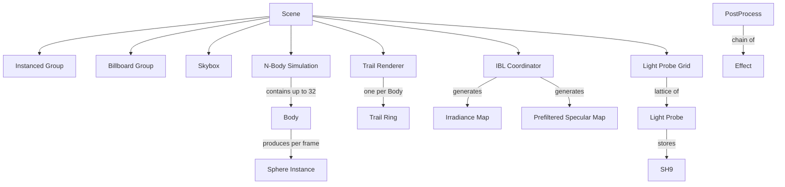

# Technical Glossary

This glossary covers technical terms and expressions used in the project, spanning theoretical PBR rendering aspects, geometric optimizations, low-level graphics API concepts, and the **domain model** used throughout the codebase.

!!! info "Ubiquitous Language"
    The domain model sections below define canonical terminology for the codebase.
    Each term includes **aliases to avoid** — words that should not be used in code,
    comments, or documentation because they create ambiguity. See
    [Flagged Ambiguities](#flagged-ambiguities) for details.

---

## 🎨 Rendering & Physics (PBR / IBL)

| Term | Software / Theoretical Definition |
| :--- | :--- |
| **PBR** | *Physically Based Rendering*. A rendering model grounded in the laws of physics to simulate how light realistically interacts with materials. |
| **IBL** | *Image Based Lighting*. Using an image (HDR cubemap) to simulate complex global illumination. |
| **BRDF** | *Bidirectional Reflective Distribution Function*. A function defining how a material reflects light (Cook-Torrance model). |
| **NDF (GGX)** | *Normal Distribution Function*. The component of PBR describing the micro-geometry of surfaces (microfacet distribution). |
| **Split-Sum** | A mathematical approximation (Epic Games) enabling real-time IBL specular computation via pre-integration (Prefiltered Map + BRDF LUT). |
| **Irradiance / Radiance** | Irradiance is the total incident luminous flux (diffuse); Radiance is the flux in a specific direction (specular). |
| **Normal Mapping / TBN** | Detail simulation via a texture. The **TBN** matrix (Tangent, Bitangent, Normal) transforms vectors from Tangent Space to World Space. |

## 📐 Projection Optimizations (Spheres / Billboards)

| Term | Software Definition |
| :--- | :--- |
| **Impostors** | A technique simulating complex 3D geometry (sphere) on a 2D quad via ray-casting in the shader. |
| **Analytic AA** | Mathematical anti-aliasing on the sphere edge, computed from the discriminant derivative (`fwidth`), yielding perfect contours. |
| **Tangent Planes** | A geometric method computing the perfect screen-space bounding box (AABB) of a sphere via tangent planes passing through the camera. |
| **Conservative Depth** | Positioning the quad at the sphere's closest point to guarantee a correct Z-test before writing `gl_FragDepth`. |
| **Discriminant** | The ray-sphere equation value ($b^2 - ac$). Determines whether a pixel is inside ($>0$) or outside ($<0$) the sphere. |
| **Perspective Distortion** | Elliptical deformation of a sphere when it moves away from screen center, handled here by exact tangent projection. |

## ⚙️ Graphics API & Data Flow (GPU)

| Term | Software Definition |
| :--- | :--- |
| **PBO (Zero-Copy)** | *Pixel Buffer Object*. Using `GL_MAP_UNSYNCHRONIZED_BIT` to upload data without stalling the CPU. |
| **Fence Sync** | A `glFenceSync` object used to check GPU task completion without forcing a full pipeline flush (stall). |
| **Flat Interpolation** | The `flat` qualifier preventing interpolation between vertices, critical for numerical stability of silhouette calculations on spheres. |
| **Provoking Vertex** | The vertex whose value is used for the entire primitive during `flat` interpolation. |
| **Pipeline Stall** | A critical latency where the CPU waits for the GPU (caused by synchronous reads or `glFinish`). |

## 🚀 Architecture & System

| Term | Software Definition |
| :--- | :--- |
| **Time Slicing** | Splitting heavy operations (IBL) into small slices spread across multiple frames to maintain a constant FPS. |
| **Double Buffering (Pending)** | Preparing a new state (e.g., environment) in the background while the old one is still being displayed. |
| **SIMD (AVX)** | Using wide processor instructions to process multiple floats simultaneously (used for sphere sorting). |
| **PAL** | *Platform Abstraction Layer*. A layer isolating business logic from system-specific details (Linux/Windows). |
| **MkDocs / Doxygen** | Documentation generation tools (Narrative vs. API Reference). |
| **Tracy** | A hybrid profiler (CPU/GPU) used to analyze performance in real time. |

---

# Domain Model — Ubiquitous Language

The sections below define the canonical vocabulary for the project's domain objects,
their relationships, and known naming ambiguities.

## 🪐 Simulation

| Term | Definition | Aliases to avoid |
| :--- | :--- | :--- |
| **N-Body Simulation** | A gravitational particle system that integrates body positions via Velocity Verlet with Plummer softening. | Physics sim, particle system |
| **Body** | A single gravitational entity with position, velocity, mass, radius, and PBR material properties (`NBodyParticle`). | Particle, sphere, object |
| **Time Scale** | A signed speed multiplier that smoothly transitions between real-time, pause, and reverse. | Speed, playback rate |
| **Energy Drift** | The relative deviation of total energy from the initial reference, used to diagnose integrator stability. | Energy error, conservation error |

## 🔷 Rendering — Geometry

| Term | Definition | Aliases to avoid |
| :--- | :--- | :--- |
| **Scene** | The top-level container for all 3D geometry, GPU resources, shaders, and rendering configuration (`Scene` struct). | World, level, context |
| **Icosphere** | A procedurally generated sphere mesh created by recursive subdivision of an icosahedron (`IcosphereGeometry`). | Sphere mesh, UV sphere |
| **Instanced Group** | A set of opaque sphere meshes drawn in a single `glDrawElementsInstanced` call via a shared VBO (`InstancedGroup`). | Batch, draw group |
| **Billboard** | A screen-aligned quad that renders a sphere via fragment-shader raycasting, cheaper than mesh rendering. | Impostor, sprite, quad |
| **Billboard Group** | A managed set of **Billboards** with a shared VAO and per-instance VBO for GPU-driven drawing (`BillboardGroup`). | Billboard batch |
| **Sphere Instance** | A 64-byte-aligned per-instance data packet (model matrix, PBR material, previous position) sent to the GPU (`SphereInstance`). | Instance data, per-object data |
| **Billboard Sorter** | The subsystem that orders transparent **Billboards** back-to-front for correct alpha blending (`BillboardSorter`). | Sort pass, transparency sort |
| **Sorting Mode** | The algorithm used by the **Billboard Sorter**: CPU qsort, CPU radix, or GPU bitonic (`SortingMode`). | Sort strategy |

## 🎨 Rendering — Shading & Lighting

| Term | Definition | Aliases to avoid |
| :--- | :--- | :--- |
| **PBR Material** | A surface description with albedo, metallic, and roughness parameters for the physically-based rendering pipeline (`PBRMaterial`). | Material, surface |
| **Material Library** | A collection of named **PBR Material** presets loaded from disk (`MaterialLib`). | Material set, palette |
| **Shader** | A compiled OpenGL program with automatic uniform caching and RAII cleanup (`Shader` struct). | Program, shader program |
| **Uniform** | A named GPU variable set per-frame or per-draw; locations are cached in a sorted array for $O(\log n)$ lookup (`UniformEntry`). | Shader parameter, constant |
| **UBO** | Uniform Buffer Object — a GPU-side block of structured data (std140 layout) shared across draw calls. | Constant buffer, uniform block |
| **SSBO** | Shader Storage Buffer Object — a read/write GPU buffer for large or variable-length data. | Storage buffer |

## 🌍 Image-Based Lighting (IBL)

| Term | Definition | Aliases to avoid |
| :--- | :--- | :--- |
| **IBL Coordinator** | The state machine that progressively generates **Irradiance Map** and **Prefiltered Specular Map** from an HDR environment across multiple frames (`IBLCoordinator`). | IBL pipeline, IBL generator |
| **IBL State** | One phase of the coordinator's lifecycle: Idle → Luminance → Specular Init → Specular Mips → Irradiance → Done (`IBLState`). | IBL step, IBL phase |
| **Environment Map** | An equirectangular HDR texture representing the infinite-distance lighting environment. | HDR map, skybox texture, env map |
| **Irradiance Map** | A low-frequency cubemap encoding diffuse lighting from the **Environment Map** via spherical convolution. | Diffuse map, irradiance cubemap |
| **Prefiltered Specular Map** | A mip-chain cubemap where each level stores specular reflections at increasing roughness. | Specular map, prefilter map |
| **BRDF LUT** | A 2D lookup table encoding the split-sum approximation for the specular BRDF integral. | BRDF lookup, integration map |
| **Environment Manager** | The subsystem handling async HDR file loading, transition animation, and **IBL Coordinator** orchestration (`EnvManager`). | Env loader |

## 💡 Global Illumination (GI)

| Term | Definition | Aliases to avoid |
| :--- | :--- | :--- |
| **Light Probe** | A point in space storing 9 L2 Spherical Harmonic coefficients that encode local irradiance (`LightProbe`). | Probe, SH probe |
| **Light Probe Grid** | A 3D lattice of **Light Probes** covering the scene AABB, updated asynchronously on a worker thread (`LightProbeGrid`). | Probe grid, GI grid, irradiance volume |
| **SH9** | A set of 9 vec4-aligned Spherical Harmonic coefficients (band 0 + band 1 + band 2). | SH coefficients, harmonics |
| **GI Mode** | The sampling strategy for indirect lighting: Off, 3D Texture, or SSBO (`GIMode`). | GI method |

## 🌌 Skybox

| Term | Definition | Aliases to avoid |
| :--- | :--- | :--- |
| **Skybox** | The infinite-distance background renderer using a full-screen quad with raycasted **Environment Map** sampling (`Skybox` struct). | Background, env renderer |

## ✨ Visual Effects

| Term | Definition | Aliases to avoid |
| :--- | :--- | :--- |
| **Trail** | A camera-facing ribbon rendered with additive blending and HDR emission, showing past positions of a **Body**. | Path, orbit line, trajectory |
| **Trail Renderer** | The subsystem that records **Body** positions into per-body ring buffers and builds ribbon triangle-strip geometry each frame (`TrailRenderer`). | Trail manager |
| **Trail Ring** | A circular buffer of timestamped positions for one **Body**, used to generate **Trail** geometry (`TrailRing`). | Trail history, position buffer |
| **Neon Params** | Runtime-adjustable glow profile for **Trails**: HDR intensity, core tightness, and ribbon width (`TrailNeonParams`). | Glow settings |

## 🎬 Post-Processing Pipeline

| Term | Definition | Aliases to avoid |
| :--- | :--- | :--- |
| **Post-Process** | The multi-pass image pipeline applied after scene rendering: bloom, DoF, exposure, color grading, FXAA, fog, LUT, motion blur (`PostProcess`). | Post-FX, compositing |
| **Effect** | A single post-processing pass (e.g., Bloom, DoF, FXAA) that can be toggled via a bitmask flag (`PostProcessEffect`). | Filter, pass |
| **Bloom** | A multi-resolution bright-pass + Gaussian blur that simulates light bleeding from high-luminance areas. | Glow, HDR bloom |
| **Depth of Field (DoF)** | A bokeh-based blur effect controlled by focal distance, focal range, and anamorphic ratio. | Focus blur, lens blur |
| **Auto-Exposure** | Histogram-based automatic luminance adaptation that adjusts exposure over time. | Eye adaptation, auto-EV |
| **Motion Blur** | Velocity-buffer-based per-pixel directional blur simulating camera/object movement. | Blur |
| **FXAA** | Fast Approximate Anti-Aliasing — a screen-space edge-smoothing filter. | Anti-aliasing, AA |
| **Color Grading** | Unreal-style adjustments: saturation, contrast, gamma, gain, offset, lift (`ColorGradingParams`). | Color correction |
| **Tone Mapping** | ACES-like filmic curve converting HDR radiance to displayable LDR values (`TonemapParams`). | HDR mapping |
| **Vignette** | Screen-edge darkening effect with adjustable intensity, smoothness, and roundness (`VignetteParams`). | — |
| **Film Grain** | Procedural noise overlaid on the image to simulate analog film texture (`GrainParams`). | Grain, noise |
| **Chromatic Aberration** | Color channel offset simulating lens dispersion (`ChromAbberationParams`). | Chrom abbr, CA |
| **Fog** | Exponential depth-based atmospheric scattering with height falloff (`FogParams`). | Atmospheric fog, depth fog |
| **LUT 3D** | A 3D color lookup table for gamut mapping and creative color transforms. | Color LUT, 3D LUT |
| **Banding** | Intentional color quantization/posterization effect with multiple modes: linear, dithered, perceptual (`BandingParams`). | Posterization |
| **White Balance** | Temperature (Kelvin) and tint correction applied in the color pipeline (`WhiteBalanceParams`). | WB |

## 📊 Profiling & Performance

| Term | Definition | Aliases to avoid |
| :--- | :--- | :--- |
| **GPU Profiler** | A double-buffered OpenGL query system that measures per-stage GPU timing without pipeline stalls (`GPUProfiler`). | Timer, profiler |
| **GPU Stage** | A named, hierarchical profiling region (e.g., "Scene", "Bloom", "Composite") with color and duration (`GPUStage`). | Profiling section, timer zone |
| **Adaptive Sampler** | A rolling-window collector that stochastically samples metrics to produce smoothed averages (`AdaptiveSampler`). | Sampler, metric collector |
| **Effect Benchmark** | An automated A/B test runner that measures the GPU cost of toggling individual post-processing **Effects** (`EffectBenchmark`). | Perf test |

## 🎥 Camera & Input

| Term | Definition | Aliases to avoid |
| :--- | :--- | :--- |
| **Camera** | A first-person controller with momentum physics, head-bobbing, orbit mode, and smooth rotation interpolation (`Camera` struct). | Viewer, eye |
| **Orbit Mode** | Camera behavior where position is derived from yaw/pitch/distance around a target point. | Arcball, turntable |
| **Binding Registry** | The `AppBindingRegistry` that maps keyboard/gamepad actions to descriptions, displayed via the F2 overlay. | Keymap, help system |

## 🖥️ GPU Resources

| Term | Definition | Aliases to avoid |
| :--- | :--- | :--- |
| **VAO** | Vertex Array Object — an OpenGL handle that captures vertex attribute bindings for a draw call. | Vertex array |
| **VBO** | Vertex Buffer Object — a GPU buffer storing vertex data (positions, normals, etc.). | Vertex buffer |
| **EBO** | Element Buffer Object — a GPU index buffer for indexed drawing. | Index buffer, IBO |
| **FBO** | Framebuffer Object — an off-screen render target with color/depth/stencil attachments. | Framebuffer, render target |
| **Texture Unit** | A numbered binding slot where textures are attached for shader sampling; the engine uses tiered allocation (SH: 8–14, IBL: 15–17). | Texture slot, sampler unit |

---

## 🔗 Relationships

- A **Scene** owns one **Instanced Group**, one **Billboard Group**, one **Skybox**, one **N-Body Simulation**, one **Trail Renderer**, one **IBL Coordinator**, and one **Light Probe Grid**.
- An **N-Body Simulation** contains up to 32 **Bodies**. Each **Body** produces one **Sphere Instance** per frame.
- The **Trail Renderer** maintains one **Trail Ring** per **Body** and builds ribbon geometry each frame.
- The **IBL Coordinator** processes one **Environment Map** through a multi-frame state machine to produce an **Irradiance Map** and a **Prefiltered Specular Map**, reusing the shared **BRDF LUT**.
- The **Light Probe Grid** projects **Body** positions and materials into **SH9** coefficients via a background worker thread.
- The **Post-Process** pipeline reads the scene **FBO** and applies a chain of **Effects**, each controlled by a bitmask flag.
- The **GPU Profiler** wraps each rendering subsystem in a **GPU Stage** and reports per-frame timing via **Adaptive Samplers**.

---

## 💬 Example Dialogue

> **Dev:** "When we render the scene, are the **Bodies** drawn as **Billboards** or **Icosphere** meshes?"
>
> **Domain expert:** "Both paths exist. The **Instanced Group** draws opaque **Bodies** as **Icosphere** meshes via `glDrawElementsInstanced`. The **Billboard Group** draws transparent **Bodies** as screen-aligned quads with raycasting in the fragment shader. The **Billboard Sorter** orders the **Billboard** array back-to-front before each frame."
>
> **Dev:** "And the **Sphere Instance** data — is it the same for both paths?"
>
> **Domain expert:** "Yes. `SphereInstance` is the common 64-byte packet containing the model matrix, PBR material, and previous position. Both the **Instanced Group** and the **Billboard Group** consume the same data, just bound to different VAOs."
>
> **Dev:** "Where does the **Trail Renderer** fit in the pipeline?"
>
> **Domain expert:** "After scene geometry, before **Post-Process**. It records each **Body**'s position into its **Trail Ring**, builds ribbon geometry, and draws with additive blending into the HDR **FBO**. The **Neon Params** control the glow intensity."

---

## ⚠️ Flagged Ambiguities

!!! warning "Active Terminology Conflicts"
    The following words are used ambiguously in the current codebase.
    Each entry identifies the conflict and recommends canonical usage.

### "Sphere"

**Conflict:** Used for 4 distinct concepts — the **Icosphere** mesh, a **Billboard** impostor quad, a gravitational **Body**, and the **Sphere Instance** GPU data packet.

**Recommendation:** Use **Body** for simulation entities, **Icosphere** for the mesh data, **Billboard** for the rendering primitive, and **Sphere Instance** for the per-object GPU data packet. See [#206](https://github.com/yoyonel/suckless-ogl/issues/206).

### "Shader"

**Conflict:** Refers both to the high-level `Shader` wrapper struct (with uniform caching) and to raw `GLuint` program handles used by IBL compute passes.

**Recommendation:** Use **Shader** for the managed wrapper. For raw GL handles, use the suffix `_program` (e.g., `spmap_program`). See [#207](https://github.com/yoyonel/suckless-ogl/issues/207).

### "Probe"

**Conflict:** Could mean a single **Light Probe** (SH irradiance sample point) or the entire **Light Probe Grid**.

**Recommendation:** Always qualify: a single **Light Probe** vs. the **Light Probe Grid**. See [#208](https://github.com/yoyonel/suckless-ogl/issues/208).

### "Instance"

**Conflict:** Appears in both **Sphere Instance** (per-object GPU data) and **Instanced Group** (draw-call manager).

**Recommendation:** Use the full compound noun to disambiguate. See [#209](https://github.com/yoyonel/suckless-ogl/issues/209).
