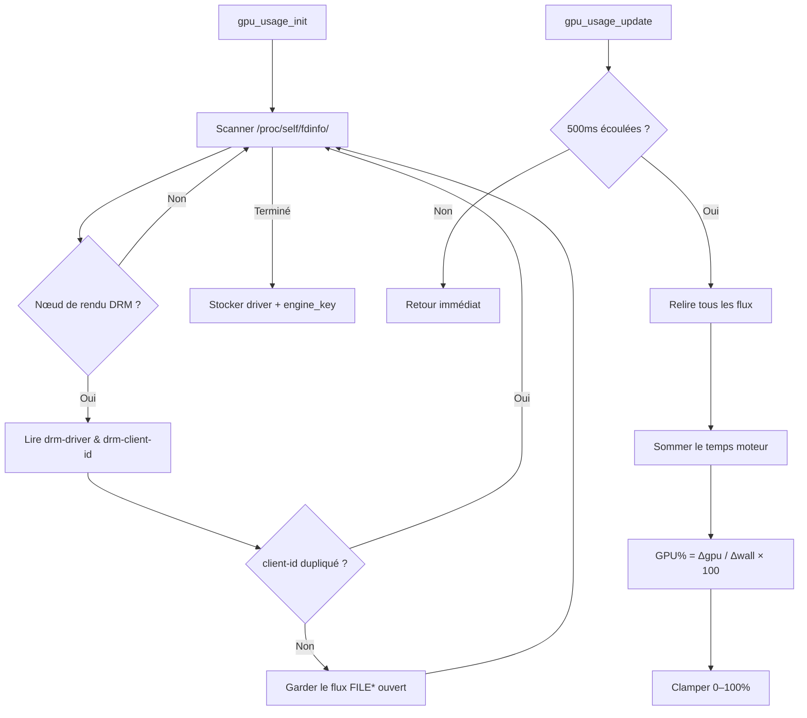

# Moniteur d'utilisation GPU

Pourcentage d'utilisation GPU en temps réel via Linux DRM fdinfo — la même approche utilisée par [MangoHud](https://github.com/flightlessmango/MangoHud).

## Vue d'ensemble

Le moniteur d'utilisation GPU lit le temps moteur GPU par processus depuis `/proc/self/fdinfo/` et calcule l'utilisation comme un simple ratio de delta. Cela fournit une métrique GPU% légère, par processus, sans nécessiter de privilèges root ni d'outils externes.

## Pilotes supportés

| Pilote | Clé moteur | GPUs |
|:---|:---|:---|
| `i915` | `drm-engine-render` | Intel Gen9+ (HD 500/600, UHD, Iris Xe…) |
| `xe` | `drm-engine-render` | Intel Arc / Xe discret & iGPUs récents |
| `amdgpu` | `drm-engine-gfx` | AMD Radeon (GCN+, RDNA) |
| `nouveau` | `drm-engine-gr` | NVIDIA (pilote open-source) |

## Architecture



## Compatibilité MangoHud

Cette implémentation est **ISO avec le chemin fdinfo de MangoHud** :

- Même scan de `/proc/self/fdinfo/`
- Même déduplication par `drm-client-id` (évite le double comptage des contextes partagés)
- Même formule `delta_gpu_time / delta_wall_time × 100`
- Même période de mise à jour de 500ms (`METRICS_UPDATE_PERIOD_MS`)
- Aucun lissage ni moyenne supplémentaire (delta brut, identique à MangoHud)

## Affichage HUD

Lorsqu'un pilote supporté est détecté, l'overlay affiche :

```text
GPU: 63%
```

La métrique apparaît dans l'overlay d'informations principal (F1), sous la ligne FPS. Elle est masquée si aucun pilote DRM supporté n'est trouvé.

## Référence API

### `gpu_usage_init(GPUUsageMonitor* mon)`

Scanne `/proc/self/fdinfo/` pour les descripteurs de fichiers des nœuds de rendu DRM. Ouvre des flux `FILE*` persistants pour une relecture efficace. Positionne `mon->available = true` si un pilote supporté est trouvé.

### `gpu_usage_cleanup(GPUUsageMonitor* mon)`

Ferme tous les flux fdinfo ouverts et réinitialise l'état du moniteur.

### `gpu_usage_update(GPUUsageMonitor* mon)`

Relit tous les flux fdinfo, somme le temps moteur et calcule le pourcentage de charge GPU basé sur le delta. Limité à des intervalles de 500ms. No-op si le moniteur n'est pas disponible.

### `gpu_usage_get_load(const GPUUsageMonitor* mon)`

Retourne la dernière charge GPU calculée (0.0–100.0), ou -1.0 si le moniteur n'est pas disponible.

### `gpu_usage_is_available(const GPUUsageMonitor* mon)`

Retourne `true` si un pilote DRM supporté a été détecté lors de l'initialisation.

## Support des plateformes

| Plateforme | Statut | Notes |
|:---|:---:|:---|
| Linux | ✅ | Support complet via DRM fdinfo |
| Windows | ⊘ | Stub (no-op) : `available = false` |
| macOS | ⊘ | Stub (no-op) : `available = false` |

L'implémentation est protégée par `#ifdef __linux__`. Sur les plateformes non-Linux, `gpu_usage_init()` positionne `available = false` et affiche un avertissement. Toutes les autres fonctions sont des no-ops sûrs.

## Intégration

Le moniteur est intégré dans le cycle de vie de la structure `App` :

```c
// app.c
app_init()  → gpu_usage_init(&app->gpu_usage)
app_run()   → gpu_usage_update(&app->gpu_usage)   // dans la zone de mise à jour UI
app_cleanup() → gpu_usage_cleanup(&app->gpu_usage)
```

## Voir aussi

- [Profilage GPU](gpu_profiling.md) — Profilage par étapes basé sur GL Timer Query
- [Optimisation de l'utilisation GPU](gpu_utilization_optimization.md) — Analyse d'optimisation avec les baselines MangoHud
- [Guide de profilage](profiling_guide.md) — Vue d'ensemble du profilage
