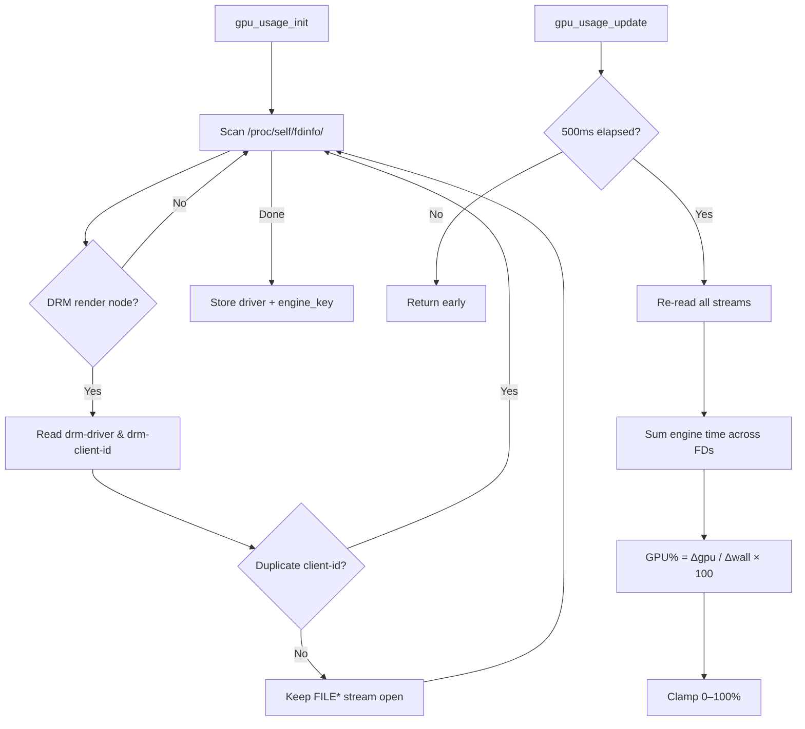

# GPU Usage Monitor

Real-time GPU utilization percentage via Linux DRM fdinfo — the same approach used by [MangoHud](https://github.com/flightlessmango/MangoHud).

## Overview

The GPU Usage Monitor reads per-process GPU engine time from `/proc/self/fdinfo/` and computes utilization as a simple delta ratio. This provides a lightweight, per-process GPU% metric without requiring root privileges or external tools.

## Supported Drivers

| Driver | Engine Key | GPUs |
|:---|:---|:---|
| `i915` | `drm-engine-render` | Intel Gen9+ (HD 500/600, UHD, Iris Xe…) |
| `xe` | `drm-engine-render` | Intel Arc / Xe discrete & newer iGPUs |
| `amdgpu` | `drm-engine-gfx` | AMD Radeon (GCN+, RDNA) |
| `nouveau` | `drm-engine-gr` | NVIDIA (open-source driver) |

## Architecture



## MangoHud Compatibility

This implementation is **ISO with MangoHud's fdinfo codepath**:

- Same `/proc/self/fdinfo/` scanning
- Same `drm-client-id` deduplication (avoids double-counting shared contexts)
- Same `delta_gpu_time / delta_wall_time × 100` formula
- Same 500ms update period (`METRICS_UPDATE_PERIOD_MS`)
- No additional smoothing or averaging (raw delta, same as MangoHud)

## HUD Display

When a supported driver is detected, the overlay shows:

```text
GPU: 63%
```

The metric appears in the main info overlay (F1), below the FPS line. It is hidden when no supported DRM driver is found.

## API Reference

### `gpu_usage_init(GPUUsageMonitor* mon)`

Scans `/proc/self/fdinfo/` for DRM render node file descriptors. Opens persistent `FILE*` streams for efficient re-reading. Sets `mon->available = true` if a supported driver is found.

### `gpu_usage_cleanup(GPUUsageMonitor* mon)`

Closes all open fdinfo streams and resets the monitor state.

### `gpu_usage_update(GPUUsageMonitor* mon)`

Re-reads all fdinfo streams, sums engine time, and computes the delta-based GPU load percentage. Rate-limited to 500ms intervals. No-op if the monitor is unavailable.

### `gpu_usage_get_load(const GPUUsageMonitor* mon)`

Returns the last computed GPU load (0.0–100.0), or -1.0 if the monitor is unavailable.

### `gpu_usage_is_available(const GPUUsageMonitor* mon)`

Returns `true` if a supported DRM driver was detected during init.

## Platform Support

| Platform | Status | Notes |
|:---|:---:|:---|
| Linux | ✅ | Full support via DRM fdinfo |
| Windows | ⊘ | Stub (no-op): `available = false` |
| macOS | ⊘ | Stub (no-op): `available = false` |

The implementation is guarded by `#ifdef __linux__`. On non-Linux platforms, `gpu_usage_init()` sets `available = false` and logs a warning. All other functions are safe no-ops.

## Integration

The monitor is integrated into the `App` struct lifecycle:

```c
// app.c
app_init()  → gpu_usage_init(&app->gpu_usage)
app_run()   → gpu_usage_update(&app->gpu_usage)   // in UI update zone
app_cleanup() → gpu_usage_cleanup(&app->gpu_usage)
```

## See Also

- [GPU Profiling](gpu_profiling.md) — GL Timer Query based stage profiling
- [GPU Utilization Optimization](gpu_utilization_optimization.md) — Optimization analysis using MangoHud baselines
- [Profiling Guide](profiling_guide.md) — General profiling overview
