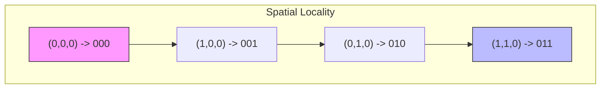
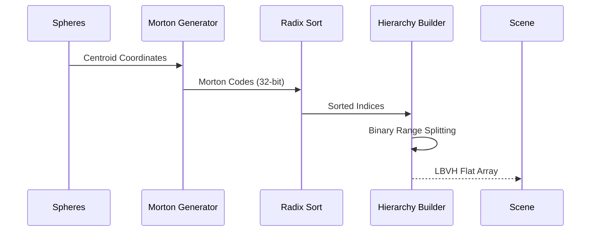

# Morton-based Linear BVH (LBVH)

This document describes the implementation of the **Linear Bounding Volume Hierarchy (LBVH)** in `suckless-ogl`, which uses **Morton codes** for efficient spatial sorting and hierarchical construction on the CPU.

## Overview

The LBVH is a spatial acceleration structure designed to optimize queries like Ray-Tracing, Frustum Culling, and Collision Detection. Unlike traditional top-down BVH construction which can be $O(N \log^2 N)$, the Morton-based LBVH can be built in $O(N \log N)$ (dominated by sorting) and is highly parallelizable.

### Key Benefits

- **Deterministic**: The hierarchy depends only on the sorted order of primitives.
- **Fast Construction**: Linear time construction once primitives are sorted by Morton codes.
- **CPU/GPU Friendly**: Data is stored in flat arrays, suitable for cache-efficient traversal and potential GPU porting.

---

## Technical Details

### 1. Morton Codes (Z-Order Curve)

Morton codes map 3D coordinates $(x, y, z)$ to a 1D index while preserving spatial locality. This is achieved by interleaving the binary bits of the coordinates.

#### Bit Interleaving

For a 30-bit Morton code (10 bits per dimension), the bits are interleaved as follows:

- `x`: `b9 b8 b7 ... b0`
- `y`: `b9 b8 b7 ... b0`
- `z`: `b9 b8 b7 ... b0`
- **Morton**: `z9 y9 x9 z8 y8 x8 ... z0 y0 x0`

#### Diagram: Spatial Mapping



### 2. Hierarchical Construction

Once the spheres are sorted by their Morton codes, we build the tree by recursively splitting the range of sorted indices $[i, j]$.

#### Split Point Discovery

We find the split point $m$ by looking for the highest bit where the Morton codes of the first and last elements in the range differ. This ensures that the two resulting clusters are spatially separated.

#### Construction Flow



### 3. Data Structure

The LBVH is stored in a flat array of `LBVHNode` to maximize cache hits.

```c
typedef struct {
    float aabb_min[4]; // [3] = Left Child Index or -(Primitive Index + 1)
    float aabb_max[4]; // [3] = Right Child Index
} LBVHNode;
```

- **Internal Nodes**: `aabb_min[3] >= 0`.
- **Leaf Nodes**: `aabb_min[3] < 0` (encoded as `- (sphere_idx + 1)`).

---

## Future Usage: Reflection Optimization

The primary goal of this LBVH is to optimize **Inter-Sphere Reflections**. Currently, for each ray, we might check all spheres ($O(N)$), which scales poorly.

### Optimized Traversal Strategy

Instead of checking every sphere, the ray-tracer will traverse the LBVH:

1. **AABB Test**: Check if the ray intersects the current node's AABB.
2. **Pruning**: If no intersection, discard the entire subtree.
3. **Traversal**:
    - If hit internal node: Recurse into children.
    - If hit leaf: Perform precise **Ray-Sphere Intersection** math.

#### Pseudo-code (Stack-less Traversal)

```c
// Future implementation sketch
void trace_ray_bvh(Ray ray, LBVH* bvh) {
    int stack[64];
    int top = 0;
    stack[top++] = 0; // Root

    while (top > 0) {
        int node_idx = stack[--top];
        LBVHNode* node = &bvh->nodes[node_idx];

        if (ray_aabb_intersect(ray, node)) {
            if (is_leaf(node)) {
                check_precise_intersection(ray, get_sphere(node));
            } else {
                stack[top++] = node->right;
                stack[top++] = node->left;
            }
        }
    }
}
```

### Performance Impact

- **Current**: $O(\text{Rays} \times \text{Spheres})$
- **With LBVH**: $O(\text{Rays} \times \log(\text{Spheres}))$
- Highly effective for large scenes (10,000+ spheres) where brute force becomes the bottleneck.

---

## Integration in `suckless-ogl`

- **Construction**: Performed on CPU in `sphere_sorting.c`.
- **Visualization**: Toggle with `SHIFT+O`, depth control with `ALT+O`.
- **State Safety**: Rendered with `GLStateBackup` to avoid UI interference.
