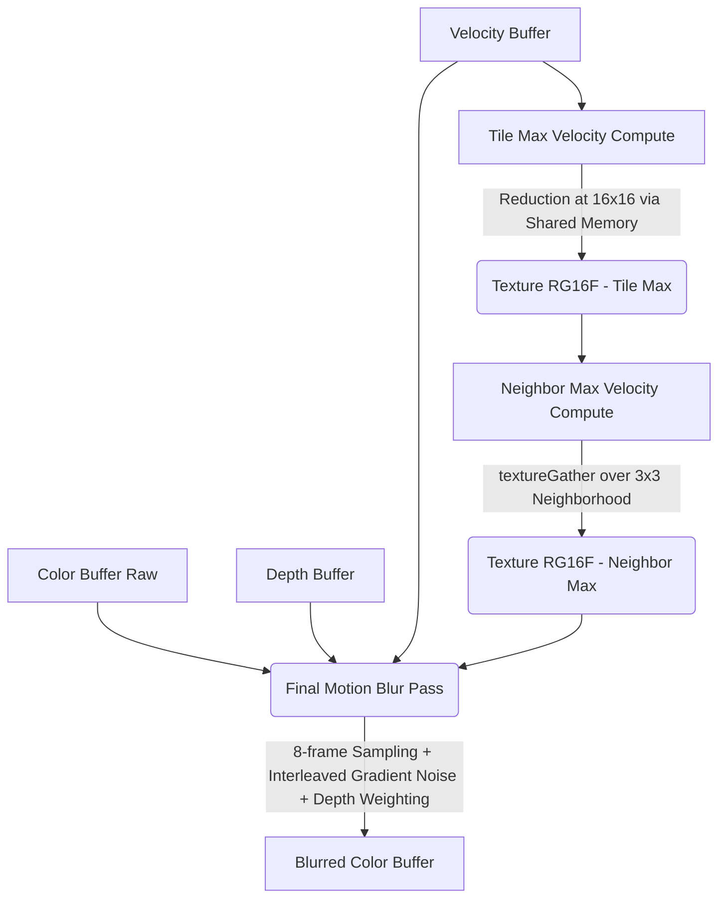
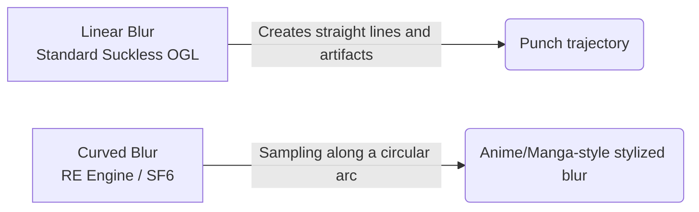

# Motion Blur Implementation Analysis

This document details the current state of the Motion Blur implementation in **Suckless OGL**, its performance, quality, and compares it with AAA engine approaches, drawing particularly on the *RE Engine* case (used for *Street Fighter 6*). It also provides concrete improvement paths.

---

## 1. Current Architecture

The current architecture is based on modern rendering principles using the **Tile-Based / Neighbor Max** approach, originally introduced by Jean-Yves Bouguet and real-time rendering researchers. The main idea is to prevent blur "bleeding" when a fast object passes in front of a static background — a very common artifact in early implementations of this post-process.

### Render Pipeline



### 💡 Strengths of the Solution

1. **Heavy use of Compute Shaders:** The two-pass approach (`tile_max` and `neighbor_max`) is performant. The reduction in shared memory (Shared Memory) for the Tile Max step considerably minimizes bandwidth. The smart use of `textureGather` enables optimal quad reads.
2. **Neighbor Max Velocity:** Effectively prevents blur from propagating incoherently across objects and removes unsightly halos.
3. **Depth Weighting:** Protects the foreground by disabling color blending when the sampled pixel is too far behind the center pixel (`depthDiff > 1.0`).
4. **Interleaved Gradient Noise:** Prevents visual *banding* by transforming stripes from low sample counts into aesthetic film-grain-style noise.

### ✅ Per-Object Velocity (Implemented)

As of the `feat/per-object-motion-blur` branch, the velocity buffer now accounts for **both camera motion and per-object motion**. This was the most critical limitation of the original camera-only approach.

#### Instanced Rendering Path (`pbr_ibl_instanced.vert`)

A new vertex attribute `i_prev_center` (location 8) stores the sphere's previous frame position. The vertex shader reconstructs the previous world position:

```glsl
vec3 prevWorldPos = i_prev_center + (WorldPos - vec3(i_model[3]));
PreviousClipPos = previousViewProj * vec4(prevWorldPos, 1.0);
```

This captures both camera movement (via `previousViewProj`) and object movement (via `i_prev_center != current center`).

#### Billboard/SSBO Path (`pbr_ibl_billboard.vert` / `.frag`)

The SSBO struct stores `prev_center_x/y/z` as 3 separate floats (not `vec3`, to respect std430 alignment at offset 92). The fragment shader reconstructs:

```glsl
vec3 prevHitPos = PrevSphereCenter + (sphereHitPos - SphereCenter);
vec4 prevClip = previousViewProj * vec4(prevHitPos, 1.0);
```

#### Data Flow

- `NBodyParticle.prev_position` snapshots position before each physics step
- `nbody_write_instances()` copies `prev_position` → `SphereInstance.prev_center`
- Static grid spheres have `prev_center == current center` → zero object velocity
- `SphereInstance` remains 128 bytes (SIMD-aligned, validated by `_Static_assert`)

---

## 2. Improvement Paths (Speed and Quality)

To reach state-of-the-art quality, here are the possible optimizations and changes.

### A. Speed and Optimization

* **Adaptive Sampling (Dynamic Sample Count):**
  Currently, the shader always executes `mb_samples` iterations (8 by default), even if the pixel velocity is near zero (`speed < 0.0001` is ignored but low values still pass through). A dynamic iteration count based on proportional velocity would save a monumental number of GPU cycles.
  ```glsl
  int actual_samples = max(2, int(speed * TARGET_SAMPLES_PER_UNIT));
  ```
* **Half-Resolution Reconstruction (TODO):**
  Executing 8+ random, cache-incoherent reads on a 4K or 1440p buffer is extremely costly. Accumulating Motion Blur in a **half-resolution texture** followed by a depth-guided bilateral upsample should be implemented for future performance.

    echo "exit: $?"! warning "Implementation Plan (Refactoring `postprocess.c`)"
        Implementing Half-Res requires:

        1. Restructure the render pipeline and decouple Motion Blur from the current mega-pass.
        2. Create a dedicated `Framebuffer` for sub-sampling at `width/2 x height/2` dimensions.
        3. Create a dedicated pass (via compute or screen quad) that computes *only* the blur effect in this lightweight texture.
        4. Write and execute the bilateral upsample step during the `postprocess.frag` pass or a dedicated pass to recompose the final image cleanly on object edges defined by the `depth buffer`.

* **Per-Object and Skinned Velocity:**
  ~~For motion blur to apply to moving objects or characters, the previous frame's Model matrix must be stored and passed for *each* object.~~ ✅ **Implemented** — per-object velocity is now active via `prev_center` in `SphereInstance`. The next frontier is per-vertex skinned velocity for animated meshes.
* **Soft Depth-Testing:**
  Replace the hard boolean depth test with a smooth weight using `smoothstep()`. Hard limits create grainy noise or pixel flickering on moving edges.

### C. The Special Case: Procedural Analytic Blur

Since **Suckless OGL** natively renders pure objects via **analytical Ray-tracing** in the Fragment Shader (through billboards and sphere *impostors* in `pbr_ibl_billboard.frag`), a mathematically perfect, post-process-free (2D) solution is technically feasible.

When a sphere centered at $C$ moves from position $C_0$ to $C_1$ (via velocity vector $\vec{V}$) during a frame, the volume swept by the sphere geometrically forms a **Capsule** (a cylinder capped by two hemispheres).

**How to implement this mathematically instead of Post-Process:**

1. **Ray-Capsule Intersection:** Instead of intersecting a ray with a sphere, the *impostor* shader computes the analytical intersection of a ray with a capsule extending from the center at $t=0$ to the center at $t=1$.
2. **Temporal Integration:** Once the intersection is resolved along the capsule motion axis, the opacity (Alpha) and surface normal at that point can be computed as a function of the time covered by the crossing.
3. **Camera + Object Motion:** The view transformation matrix over time can simply modify the ray origin $O(t) = O_0 + V_{cam} \cdot t$ to simulate camera blur.
4. **Temporal Jitter / Stochasticity:** Instead of accumulating in a multi-buffer, the ray generated from the screen center can be assigned a random time variable $t$ per frame (e.g., via Blue Noise). Combined with TAA, motion blur becomes instantaneously "free" and mathematically perfect (true 3D blur) without the occlusion errors of 2D post-processing.

This is a very advanced but extremely elegant optimization, often reserved for offline renderers (Pixar/RenderMan) or purely procedural demoscenes.

---

## 3. Comparison with AAA Engines

### Unreal Engine 5 & Unity (HDRP)

These engines use an architecture extremely similar to *Tile Max* / *Neighbor Max*. However, they integrate the effect within their global temporal ecosystem:
* **Decoupling:** These engines have a control explicitly separating the strength of Camera motion blur from Object motion blur, as camera motion blur is a well-known cause of *Motion Sickness* in players.
* **TSR / TAA:** In UE5, motion blur is not just a throwaway post-process effect — it visually aids temporal resolution (Temporal Super Resolution) by combining motion vectors with Anti-Aliasing.

---

## 4. The Street Fighter 6 Case Study (RE Engine)

The **RE Engine** (Capcom) delivers a *Masterclass* on advanced use of the effect in the fighting game **Street Fighter 6**:

1. **Hyper-Precise Per-Vertex Velocity:**
   In SF6, velocity is not just passed per *mesh* — it is computed bone by bone via the *Skinning* shader. When a character kicks, their shoe develops a gigantic velocity vector compared to their thigh.

2. **Targeted High-Samples (Localized Supersampling):**
   To conserve power without sacrificing quality, the RE Engine launches between 16 and 32 samples per pixel, **but only** on silhouettes recording high-amplitude vectors. The static environment behind remains perfectly sharp and very cheap to evaluate.

3. **Curved Motion Blur:**
   Unlike standard linear blur ("take a vector and trace a straight line"), Capcom's engine stores acceleration information in addition to velocity. The blur sampling is thus "curved" in space to simulate the radial trajectory of limbs and fists.



### The Verdict
Suckless OGL now implements **per-object motion blur** via `prev_center` storage in the instance data, covering both camera and object velocity in the velocity buffer. The remaining improvement paths are: **per-vertex skinned velocity** for animated meshes, **half-resolution reconstruction** for performance, and **adaptive sampling** based on per-pixel velocity magnitude.
