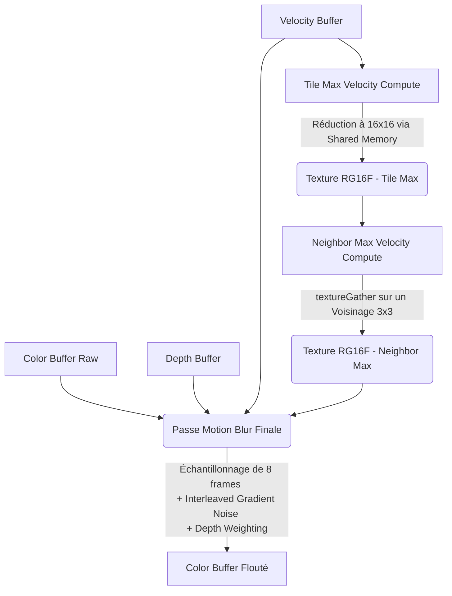
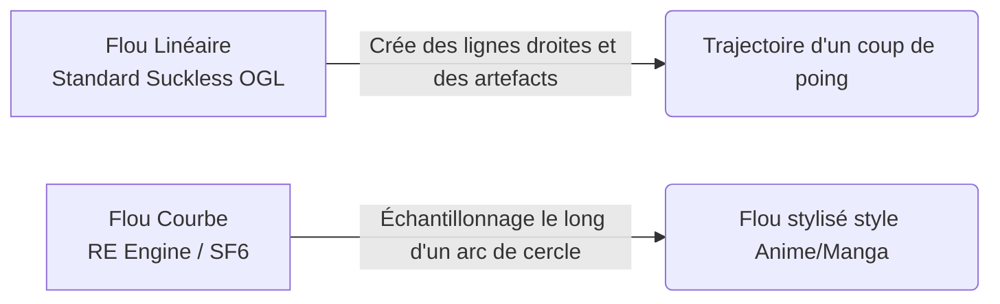

# Analyse de l'implémentation du Motion Blur

Cette documentation détaille l'état actuel de l'implémentation du Motion Blur dans **Suckless OGL**, ses performances, sa qualité, et les compare avec les approches des moteurs AAA, en s'appuyant particulièrement sur le cas du _RE Engine_ (utilisé pour _Street Fighter 6_). Elle offre également des pistes d'amélioration concrètes.

---

## 1. Architecture Actuelle

L'architecture actuelle repose sur des principes modernes de rendu basés sur l'approche **Tile-Based / Neighbor Max**, initialement introduite par Jean-Yves Bouguet et les chercheurs en rendu temps réel. L'idée principale est d'éviter les "fuites" de flou lorsqu'un objet rapide passe devant un arrière-plan fixe, un artefact très commun dans les premières implémentations de ce post-process.

### Pipeline de rendu



### 💡 Points forts de la solution

1. **Utilisation intensive des Compute Shaders :** L'approche en deux passes (`tile_max` et `neighbor_max`) est performante. La réduction dans la mémoire partagée (Shared Memory) pour l'étape Tile Max minimise considérablement la bande passante. L'utilisation intelligente du `textureGather` permet une lecture optimale en quads.

2. **Neighbor Max Velocity :** Empêche efficacement le flou de se propager de manière incohérente sur les objets et supprime les halos disgracieux.

3. **Pondération avec la Profondeur (Depth Weighting) :** Protège le premier plan en désactivant le mélange de couleurs lorsque l'échantillon prélevé est trop éloigné derrière le pixel central (`depthDiff > 1.0`).

4. **Bruit de Gradient (Interleaved Gradient Noise) :** Empêche le phénomène de _banding_ visuel en transformant les stries liées à un faible nombre d'échantillons en bruit esthétique de style pellicule.

### 📉 Limite de l'implémentation actuelle : Camera-Only

Dans le fichier `pbr_ibl_instanced.vert`, on observe que la configuration actuelle ne calcule le déplacement (Velocity) que par le biais de l'ancienne position de la caméra (`previousViewProj` \* la position de la géométrie locale actuelle) :

```glsl

CurrentClipPos = projection * view * vec4(WorldPos, 1.0);

PreviousClipPos = previousViewProj * vec4(WorldPos, 1.0);

```

**Pourquoi c'est tout à fait justifié (pour le moment) :**
Dans **Suckless OGL**, tous les objets 3D (comme la grille de sphères PBR) sont statiques dans l'espace "World". Seule la caméra se déplace ou effectue des rotations. Par conséquent, il n'y a pas (encore) de concept de vélocité "Objet" (Object Velocity). Le **Camera Motion Blur** est donc 100% suffisant à ce stade du développement.

**Toutefois**, dès lors que le moteur implémentera des entités dynamiques (ex: des ennemis ou des objets physiques qui tombent), la vélocité propre de l'objet (sa _Previous World Position_) ainsi calculée sera `0` ou du moins faussée devant ne refléter que de la vélocité caméra. Un objet traversant rapidement l'écran devant une caméra fixe ne s'imprimera pas dans le _Velocity Buffer_ en l'état actuel et ressortira hyper net par dessus le reste de l'image.

---

## 2. Pistes d'Améliorations (Vitesse et Qualité)

Afin d'atteindre l'état de l'art, voici les optimisations et changements possibles.

### A. Vitesse et Optimisation

- **Échantillonnage Adaptatif (Dynamic Sample Count) :**

  Actuellement, le shader effectue **toujours** `mb_samples` itérations (8 par défaut), même si la vitesse du pixel est proche de zéro (`speed < 0.0001` est ignoré, mais les faibles valeurs passent). Un nombre dynamique d'itérations basé sur la vitesse proportionnelle permettrait d'économiser un nombre monumental de cycles GPU.

```glsl
int actual_samples = max(2, int(speed * TARGET_SAMPLES_PER_UNIT));
```

- **Half-Resolution Reconstruction (TODO) :**

  Exécuter 8+ lectures aléatoires non-cohérentes avec le cache sur un buffer 4K ou 1440p est extrêmement gourmand. L'accumulation du Motion Blur dans une **toute petite texture** (à moitié de la résolution native) suivie d'un _upsample_ bilatéral guidé par la profondeur est à implémenter pour les performances futures.

  !!! warning "Plan d'implémentation (Refactoring de `postprocess.c`)"
    L'implémentation du Motion Blur est actuellement incluse dans le composite unifié de la passe finale (`postprocess.frag`). Pour appliquer ce _Half-Res_, il faudra :

    1. Restructurer le rendu et casser le flux actuel en désolidarisant le Motion Blur de cette maxi-passe.

    2. Créer un nouveau `Framebuffer` dédié au sous-échantillonnage de dimensions `width/2 x height/2`.

    3. Créer une passe spécifique (via compute ou quad écran) ne calculant _uniquement_ que l'effet de flou dans cette texture allégée en couleurs et vélocités.

    4. Écrire et exécuter l'étape d'_upsample_ bilatéral durant la passe `postprocess.frag` ou dans une passe dédiée, afin de recomposer judicieusement l'image finale sur les bords des objets définis par le _depth buffer_.

- **Per-Object et Skinned Velocity (Critique) :**

  Pour que le motion blur s'applique aux objets en mouvement ou aux personnages, il faut stocker et transmettre la matrice Modèle de la frame précédente pour _chaque_ objet.

```glsl

  vec4 PrevWorldPos = vec3(i_previous_model * vec4(in_position, 1.0));

  PreviousClipPos = previousViewProj * PrevWorldPos;

```

- **Soft Depth-Testing :**

  Remplacer le test booléen et brutal de profondeur par une pondération lissée à l'aide d'un `smoothstep()`. Des limites dures créent un bruit granuleux ou des tremblements de pixels (flickering) sur les arêtes en mouvement.

### C. Le Cas Exceptionnel : Flou Analytique Procédural

Puisque **Suckless OGL** rend nativement des objets purs via **Raytracing analytique** dans le Fragment Shader (par le biais des billboards et _impostors_ de sphères dans `pbr_ibl_billboard.frag`), une solution mathématiquement parfaite et sans post-process (2D) est techniquement possible.

Lorsqu'une sphère de centre $C$ se déplace d'une position $C_0$ vers $C_1$ (via un vecteur vitesse $\vec{V}$) au cours d'une frame, le volume balayé par cette sphère (_Swept Volume_) forme géométriquement une **Capsule** (un cylindre terminé par deux hémisphères).

**Comment l'implémenter mathématiquement au lieu du Post-Process ?**

1. **Intersection Rayon-Capsule :** Au lieu de croiser un rayon avec une sphère, le shader des _impostors_ calcule l'intersection analytique d'un rayon avec une capsule s'étendant du centre à $t=0$ au centre à $t=1$.

2. **Intégration Temporelle :** Une fois l'intersection résolue sur la droite de mouvement de la capsule, l'opacité (Alpha) et la normale de surface en ce point peuvent être calculées en fonction du temps couvert par le croisement.

3. **Mouvement de la Caméra + Mouvement de l'Objet :** La matrice de transformation de la vue au cours du temps peut simplement modifier l'origine du rayon $O(t) = O_0 + V_{cam} \cdot t$ pour simuler le flou de caméra.

4. **Jittering Temporel / Stochasticité :** Au lieu d'accumuler dans un multi-buffer, le rayon généré depuis le point central de l'écran peut se voir attribuer une variable temps $t$ aléatoire par frame (via du Bruit Bleu par exemple). Couplé à un TAA (Temporal Anti-Aliasing), le flou de mouvement devient instantanément "gratuit" et mathématiquement parfait (vrai flou 3D) sans les erreurs d'occlusion du post-processing 2D.

C'est une optimisation très avancée mais extrêmement élégante, souvent réservée aux moteurs de rendu hors-ligne (Pixar/RenderMan) ou aux _demoscenes_ purement procédurales.

---

## 3. Comparaison avec les Moteurs AAA

### Unreal Engine 5 & Unity (HDRP)

Ces moteurs utilisent une architecture extrêmement similaire au niveau du _Tile Max_ / _Neighbor Max_. Cependant, ils intègrent l'effet au sein de leur écosystème global temporel :

- **Découplage :** Ces moteurs comportent un contrôle séparant explicitement la force du flou de mouvement de la Caméra et celui des Objets, car le flou de mouvement de caméra est une cause très connue de _Motion Sickness_ chez les joueurs.

- **TSR / TAA :** Chez l'UE5, le flou de mouvement n'est pas uniquement un effet de post-process jetable, il aide visuellement la résolution temporelle (Temporal Super Resolution) en combinant les vecteurs de mouvement à l'Anti-Aliasing.

---

## 4. L'Exemple de Street Fighter 6 (RE Engine)

Le **RE Engine** (Capcom) livre un _Masterclass_ sur l'utilisation poussée de l'effet dans le jeu de combat **Street Fighter 6** :

1. **Per-Vertex Velocity Hyper-Précise :**

   Dans SF6, la vélocité n'est pas seulement passée par _mesh_, mais elle est calculée os par os via le shader de _Skinning_. Lorsqu'un personnage donne un coup de pied, sa chaussure développe un vecteur de vélocité gigantesque comparé à sa cuisse.

2. **Sur-Échantillonnage Localisé (Targeted High-Samples) :**

   Pour économiser de la puissance sans sacrifier la qualité, le RE Engine se permet de lancer entre 16 et 32 échantillons (Samples) par pixel, **mais uniquement** sur les silhouettes enregistrant des vecteurs de haute amplitude. L'environnement statique derrière reste parfaitement net et très peu coûteux à évaluer.

3. **Motion Blur Courbe (Curved Motion Blur) :**

   Contrairement à du flou Linéaire standard (« je prends un vecteur et je trace une ligne droite »), le moteur de Capcom stocke l'information de l'accélération en plus de la vitesse. L'échantillonnage de Flou est ainsi "courbé" dans l'espace afin de simuler la trajectoire radiale des membres et poings.



### Le Verdict

Pour permettre à Suckless OGL de concurrencer commercialement ces rendus, l'ajout du _Camera-only_ est insuffisant. **L'implémentation du stockage de l'ancienne matrice de modélisation (Previous Model Matrix)** par instance (dans `pbr_ibl_instanced.vert`) est l'étape la plus immédiate et gratifiante à entreprendre.
