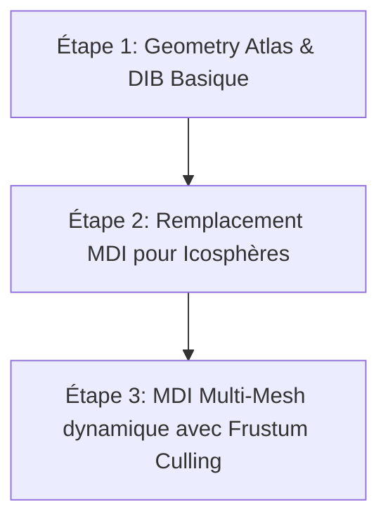

# Étude d'Architecture : Refactoring Multi-Draw Indirect (MDI)

Cette étude analyse l'opportunité, l'impact et la stratégie d'implémentation de la technologie **Multi-Draw Indirect (MDI)** via `glMultiDrawElementsIndirect` et `glMultiDrawArraysIndirect` dans le moteur *suckless-ogl*, en ciblant spécifiquement l'iGPU **Intel Iris Xe Graphics**.

---

## 1. Analyse d'Opportunité & Intérêt Réel

### État Actuel du Rendu dans *suckless-ogl*
Le moteur est déjà fortement optimisé pour limiter les *draw calls* :
1. **Sphères (Géométrie) :** Rendu en une seule passe via `glDrawElementsInstanced` (ou sa variante SSBO).
2. **Billboards (Particules/Effets) :** Rendu en une seule passe via `glDrawArraysInstanced`.
3. **Traînées orbitales (N-Body) :** Rendu groupé via `glMultiDrawArrays` (CPU-side offsets/counts).
4. **Post-process / UI / Skybox :** Passes uniques de type plein écran (quads/skybox).

Le nombre total de *draw calls* par image oscille généralement entre **10 et 20**.

### Est-ce que le MDI est pertinent pour *suckless-ogl* ?
* **Si le moteur reste limité à un seul type de maillage (icosphère) :**
  L'intérêt d'un refactoring MDI est **très faible**. Remplacer un unique appel `glDrawElementsInstanced` par un unique appel `glMultiDrawElementsIndirect` n'apportera aucun gain de performance mesurable et pourrait même introduire un léger overhead de synchronisation mémoire (lecture du buffer indirect par le GPU).
* **Si le moteur évolue vers du multi-maillages (ex: grilles avec icosphères, cubes, cylindres, tores) :**
  C'est ici que le MDI devient **extrêmement performant**. Sans MDI, le rendu nécessiterait un *draw call* instancié par type de maillage. Avec MDI, on regroupe l'ensemble des maillages dans un unique tampon de géométrie (Geometry Atlas) et on soumet l'intégralité de la scène en **un seul appel système**.

### Focus iGPU Intel Iris Xe (Partage Thermique & CPU Overhead)
Sur les architectures Intel Raptor Lake-P (Iris Xe) :
* Le CPU et le GPU partagent la même enveloppe thermique (TDP, ex: 28W) et la même bande passante mémoire LPDDR5/DDR5.
* Réduire l'utilisation CPU en éliminant les appels système de rendu permet de libérer du budget thermique au sein du package SoC. Le système peut alors allouer plus de puissance au GPU (Turbo Boost), augmentant ainsi le taux de rafraîchissement global.
* Le driver Mesa Iris (Linux) gère le MDI de façon matérielle très efficace, mais les architectures iGPU sont sensibles aux conflits de bande passante mémoire lors des transferts fréquents CPU-vers-GPU (comme l'écriture répétée d'un tampon indirect dynamique).

---

## 2. Conséquences et Impacts sur la Base de Code

### A. Fusion de la Géométrie (Geometry Atlas)
Pour dessiner plusieurs objets via un seul appel MDI, ils doivent partager les mêmes tampons de sommets (`VBO`) et d'indices (`EBO`).
* **Impact :** Il faut remplacer la gestion individualisée des VAO/VBO/EBO par un gestionnaire de géométrie globale qui alloue des plages contiguës dans un unique grand tampon.
* **Méta-données :** Chaque maillage devra être décrit par un décalage d'indices (`firstIndex`) et un décalage de sommets (`baseVertex`).

### B. Gestion du Draw Indirect Buffer (DIB)
Il faut créer un tampon OpenGL cible `GL_DRAW_INDIRECT_BUFFER`. Ce tampon contient un tableau de structures de commandes de dessin indirect :
```c
typedef struct {
	GLuint count;         // Nombre d'indices à dessiner
	GLuint instanceCount; // Nombre d'instances
	GLuint firstIndex;    // Indice de départ dans l'EBO
	GLint  baseVertex;    // Décalage appliqué aux indices des sommets
	GLuint baseInstance;  // Décalage de départ dans les attributs d'instance
} DrawElementsIndirectCommand;
```
* **Impact :** Ajout de la gestion du cycle de vie du DIB (init, mise à jour dynamique, destruction).

### C. Adressage dans les Shaders (GLSL 4.3 / 4.5)
Dans un appel MDI, chaque commande du tampon DIB est traitée de manière séquentielle par le GPU.
* **Problème d'indexation :** Si on utilise un SSBO pour stocker les propriétés d'instances (comme l'albedo, la matrice modèle), la variable GLSL `gl_InstanceID` repart à **0** au début de chaque commande de dessin du MDI.
* **Solutions :**
  1. **Attributs d'instance physiques (Vertex Attributes avec Divisor) :** En configurant `baseInstance` dans la commande indirecte, le GPU décale automatiquement la lecture des attributs. C'est simple mais limite la flexibilité (casts `void*` requis à l'initialisation du VAO).
  2. **Indexation via `gl_DrawID` (SSBO pur) :** Recommandé pour supprimer les attributs d'instance physiques. Nécessite l'extension `GL_ARB_shader_draw_parameters` en OpenGL 4.3, intégrée de base en 4.6 :
     ```glsl
     #version 450 core
     #extension GL_ARB_shader_draw_parameters : require
     // ...
     uint instanceIndex = gl_BaseInstanceARB + gl_InstanceID;
     // Ou si nous indexons par type d'objet :
     InstanceData inst = instances[gl_DrawID];
     ```

---

## 3. Évaluation des Risques et Gains

| Facteur | Évaluation | Commentaire |
| :--- | :--- | :--- |
| **Gains Espérés (Multi-mesh)** | **Élevés (temps CPU)** | Réduction drastique du temps passé dans `Render_Submit` si de nombreux types d'objets sont affichés. |
| **Gains Espérés (Single-mesh)** | **Nuls ou négatifs** | Aucun gain si on remplace simplement l'instanciation de l'icosphère par un MDI. Risque de micro-overhead sur Iris Xe. |
| **Risques de Stalls (CPU-GPU)** | **Moyen-Élevé** | Si le tampon indirect (DIB) est mis à jour à chaque frame via `glBufferSubData`, cela crée des bulles de synchronisation (pipeline stalls). Nécessite l'usage de double/triple buffering ou de *Persistent Mapping*. |
| **Complexité du Code** | **Moyenne** | Ajout de structures C strictes pour le DIB et modification de l'indexation GLSL. |
| **Bande Passante Mémoire (iGPU)** | **Risque Faible** | La taille des commandes indirectes est minuscule (~20 octets par commande), donc la consommation de bande passante est négligeable par rapport aux textures. |

---

## 4. Plan de Refactoring Actionnable (Étapes Atomiques)

Pour assurer une transition sans régression sur l'iGPU Intel, le refactoring est découpé en 3 étapes progressives.



---

### Étape Atomique 1 : Geometry Atlas & Infrastructure DIB
**Objectif :** Créer un tampon unique contenant la géométrie de la sphère et configurer le tampon de commande indirecte (DIB) statique sur le CPU.

#### 1. La Cible
* Fichiers à modifier/créer :
  * [NEW] `include/mdi_rendering.h` / `src/mdi_rendering.c`
  * [MODIFY] `src/scene_init.c` (intégration de l'initialisation du DIB).

#### 2. L'Implémentation GL 4.3 (C11 & GLSL)
##### C11 (`include/mdi_rendering.h`)
```c
#ifndef MDI_RENDERING_H
#define MDI_RENDERING_H

#include "gl_common.h"
#include <stddef.h>

typedef struct {
	GLuint count;
	GLuint instanceCount;
	GLuint firstIndex;
	GLint  baseVertex;
	GLuint baseInstance;
} DrawElementsIndirectCommand;

typedef struct {
	GLuint vao;
	GLuint vbo;
	GLuint ebo;
	GLuint dib; // Draw Indirect Buffer
	int command_count;
} MDIGroup;

void mdi_group_init(MDIGroup* group, const DrawElementsIndirectCommand* commands, int command_count);
void mdi_group_cleanup(MDIGroup* group);

#endif
```

##### C11 (`src/mdi_rendering.c`)
```c
#include "mdi_rendering.h"
#include <stdlib.h>

void mdi_group_init(MDIGroup* group, const DrawElementsIndirectCommand* commands, int command_count)
{
	group->command_count = command_count;

	// Création du tampon indirect
	glGenBuffers(1, &group->dib);
	glBindBuffer(GL_DRAW_INDIRECT_BUFFER, group->dib);
	glBufferData(GL_DRAW_INDIRECT_BUFFER,
	             (GLsizeiptr)(command_count * sizeof(DrawElementsIndirectCommand)),
	             commands, GL_STATIC_DRAW);
	glBindBuffer(GL_DRAW_INDIRECT_BUFFER, 0);
}

void mdi_group_cleanup(MDIGroup* group)
{
	GL_SAFE_DELETE_BUFFER(group->dib);
}
```

#### 3. Analyse de Risque iGPU
* **Risque :** Très faible ici car le tampon est statique (`GL_STATIC_DRAW`). Aucune écriture par image n'est effectuée sur le bus mémoire partagé.
* **Compatibilité Intel :** Parfaitement supporté sous Linux via Mesa Iris.

#### 4. Protocole de Benchmark
1. Compiler le projet en mode Debug (`just build`).
2. Lancer l'application et vérifier via les logs OpenGL et le débogueur (`gl_debug`) qu'aucun message d'erreur ou warning n'est émis lors de la création du tampon indirect.

---

### Étape Atomique 2 : Remplacement du Rendu des Sphères par le MDI
**Objectif :** Remplacer le rendu instancié classique des sphères par l'appel indirect.

#### 1. La Cible
* [MODIFY] `src/scene_render.c` (fonction `scene_render_instanced`).
* [MODIFY] `src/scene.c` / `src/scene_cleanup.c`.
* [MODIFY] `shaders/pbr_ibl_ssbo.vert` (mise à jour pour utiliser `gl_BaseInstance` ou `gl_DrawID`).

#### 2. L'Implémentation GL 4.3 (C11 & GLSL)
##### GLSL (`shaders/pbr_ibl_ssbo.vert`)
```glsl
#version 450 core
#extension GL_ARB_shader_draw_parameters : require

layout(location = 0) in vec3 aPos;
layout(location = 1) in vec3 aNormal;

struct InstanceData {
	mat4 model;
	vec3 albedo;
	float metallic;
	float roughness;
	float ao;
	float _padding[2];
};

layout(std430, binding = 0) readonly buffer InstanceBuffer {
	InstanceData instances[];
};

layout(location = 0) uniform mat4 projection;
layout(location = 4) uniform mat4 view;

layout(location = 0) out vec3 WorldPos;
layout(location = 1) out vec3 Normal;
layout(location = 2) out vec3 Albedo;
layout(location = 3) out float Metallic;
layout(location = 4) out float Roughness;
layout(location = 5) out float AO;

void main()
{
	// En MDI avec SSBO, nous combinons gl_BaseInstanceARB et gl_InstanceID
	uint instanceIndex = gl_BaseInstanceARB + gl_InstanceID;
	InstanceData inst = instances[instanceIndex];

	vec4 worldPos = inst.model * vec4(aPos, 1.0);
	WorldPos = worldPos.xyz;
	Normal = normalize(mat3(inst.model) * aNormal);

	Albedo = inst.albedo;
	Metallic = inst.metallic;
	Roughness = inst.roughness;
	AO = inst.ao;

	gl_Position = projection * view * worldPos;
}
```

##### C11 (`src/scene_render.c` - extrait de `scene_render_instanced`)
```c
void scene_render_instanced_mdi(Scene* scene, mat4 view, mat4 proj)
{
	// ... (liaison des textures PBR et IBL) ...

	glBindVertexArray(scene->ssbo_group.vao);
	glBindBuffer(GL_DRAW_INDIRECT_BUFFER, scene->mdi_group.dib);

	// Appel unique Multi-Draw Indirect
	glMultiDrawElementsIndirect(GL_TRIANGLES, GL_UNSIGNED_INT, NULL,
	                            scene->mdi_group.command_count, 0);

	glBindBuffer(GL_DRAW_INDIRECT_BUFFER, 0);
	glBindVertexArray(0);
}
```

#### 3. Analyse de Risque iGPU
* **Risque :** Si l'iGPU Mesa Intel rencontre des soucis d'optimisation avec `gl_BaseInstanceARB` lors d'appels MDI complexes, un ralentissement ou un artefact visuel peut apparaître.
* **Bande passante :** La lecture du tampon indirect se faisant côté GPU, le CPU n'émet plus que l'ordre de dessin (`glMultiDraw...`), limitant le trafic sur le bus PCIe/système.

#### 4. Protocole de Benchmark
1. Compiler en Release (`just release`).
2. Activer l'affichage du Profiler UI (touche dédiée dans l'application) et noter le frametime moyen.
3. Activer Tracy (`just run-tracy-release`) et mesurer la durée de la zone `Scene Render` / `Instanced Render`.
4. **Critère de validation :** Le temps CPU de soumission ne doit pas augmenter par rapport à la version de base. L'affichage doit être strictement identique (pas de sphère manquante ou déformée).

---

### Étape Atomique 3 : MDI Dynamique (Multi-Mesh & Culling)
**Objectif :** Rendre le tampon DIB dynamique pour supporter le frustum culling et le tri par type de maillage (ex: dessiner sélectivement des Icosphères et des Cubes).

#### 1. La Cible
* [MODIFY] `src/scene_simulation.c` / `src/scene_render.c`
* [MODIFY] `src/mdi_rendering.c` (mise en place d'un DIB dynamique double-bufferisé).

#### 2. L'Implémentation GL 4.3 (C11)
Pour éviter les blocages de pipeline (stalls) sur Iris Xe lors de la mise à jour des commandes à chaque image, on utilise un système de double-tampon (ou triple-tampon) pour le DIB :

##### C11 (`include/mdi_rendering.h` - modifications)
```c
#define MDI_DOUBLE_BUFFER_COUNT 2

typedef struct {
	GLuint dibs[MDI_DOUBLE_BUFFER_COUNT];
	int current_buffer_idx;
	// ...
} MDIGroupDynamic;

void mdi_dynamic_update_and_draw(MDIGroupDynamic* group,
                                 const DrawElementsIndirectCommand* commands,
                                 int active_commands);
```

##### C11 (`src/mdi_rendering.c` - extrait de la mise à jour dynamique)
```c
void mdi_dynamic_update_and_draw(MDIGroupDynamic* group,
                                 const DrawElementsIndirectCommand* commands,
                                 int active_commands)
{
	// Passage au tampon suivant (Double Buffering)
	group->current_buffer_idx = (group->current_buffer_idx + 1) % MDI_DOUBLE_BUFFER_COUNT;
	GLuint active_dib = group->dibs[group->current_buffer_idx];

	glBindBuffer(GL_DRAW_INDIRECT_BUFFER, active_dib);

	// Mise à jour sans attente (Orphaning + glBufferSubData)
	glBufferData(GL_DRAW_INDIRECT_BUFFER,
	             (GLsizeiptr)(active_commands * sizeof(DrawElementsIndirectCommand)),
	             NULL, GL_STREAM_DRAW);
	glBufferSubData(GL_DRAW_INDIRECT_BUFFER, 0,
	                (GLsizeiptr)(active_commands * sizeof(DrawElementsIndirectCommand)),
	                commands);

	glMultiDrawElementsIndirect(GL_TRIANGLES, GL_UNSIGNED_INT, NULL, active_commands, 0);

	glBindBuffer(GL_DRAW_INDIRECT_BUFFER, 0);
}
```

#### 3. Analyse de Risque iGPU
* **Risque Élevé de Bottleneck Mémoire :** Sans double buffering, le GPU lirait le tampon DIB pendant que le CPU tente de le modifier, forçant le driver à bloquer l'exécution (pipeline stall). L'usage de `GL_STREAM_DRAW` et du double-buffering est obligatoire pour maintenir de bonnes performances sur l'architecture de mémoire unifiée de l'Intel Iris Xe.

#### 4. Protocole de Benchmark
1. Configurer la scène avec le maximum de particules/sphères supporté (ex: 10000).
2. Observer le frametime et la consommation de puissance CPU/SoC via Tracy ou l'outil système d'Intel (`intel_gpu_top`).
3. Comparer avec le mode d'instanciation classique. Le frametime CPU global doit montrer une baisse notable sous forte charge d'objets divers ciblés par le culling.
