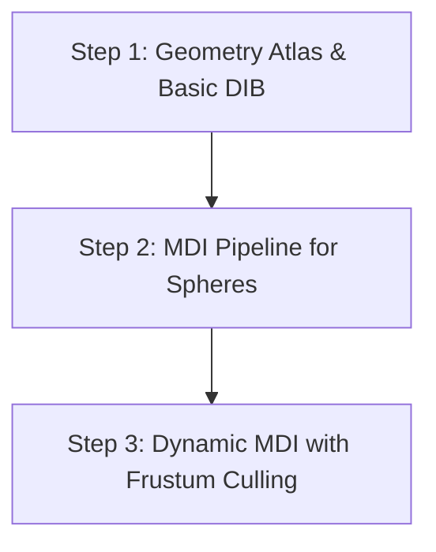

# Multi-Draw Indirect (MDI) Refactoring Study

This study analyzes the opportunity, impact, and implementation strategy of the **Multi-Draw Indirect (MDI)** technology via `glMultiDrawElementsIndirect` and `glMultiDrawArraysIndirect` in the *suckless-ogl* engine, targeting the **Intel Iris Xe Graphics** iGPU.

---

## 1. Opportunity Analysis & Practical Value

### Current Rendering State in *suckless-ogl*
The engine is already highly optimized to limit draw calls:
1. **Spheres (Geometry):** Rendered in a single pass via `glDrawElementsInstanced` (or its SSBO variant).
2. **Billboards (Particles/Effects):** Rendered in a single pass via `glDrawArraysInstanced`.
3. **Orbital Trails (N-Body):** Rendered in a single batched call via `glMultiDrawArrays` (with CPU-side offsets/counts).
4. **Post-process / UI / Skybox:** Individual fullscreen/quad passes.

The total number of draw calls per frame typically ranges between **10 and 20**.

### Is MDI Relevant for *suckless-ogl*?
* **If the engine remains limited to a single mesh type (icosphere):**
  The benefit of MDI refactoring is **negligible**. Replacing a single `glDrawElementsInstanced` with a single `glMultiDrawElementsIndirect` will not yield any measurable performance gain and could introduce a minor memory synchronization overhead (reading the indirect buffer from GPU memory).
* **If the engine evolves to support multiple mesh types (e.g., grids with icospheres, cubes, cylinders, toruses):**
  This is where MDI becomes **extremely powerful**. Without MDI, rendering multiple different meshes would require a separate instanced draw call for each type. With MDI, we can group all geometries into a single vertex/index buffer (Geometry Atlas) and submit the entire scene in **a single system call**.

### Focus on iGPU Intel Iris Xe (Thermal Sharing & CPU Overhead)
On Intel Raptor Lake-P (Iris Xe) architectures:
* The CPU and GPU share the same thermal envelope (TDP, e.g., 28W) and memory bandwidth (LPDDR5/DDR5).
* Reducing CPU usage by eliminating driver-side render command validation and context switches frees up thermal headroom. The SoC can then redirect this power to the GPU (Turbo Boost), increasing overall framerate.
* The Linux Mesa Iris driver handles MDI efficiently at the hardware level, but iGPUs are sensitive to memory bus contention from frequent CPU-to-GPU memory transfers (e.g., dynamic updates to the indirect buffer).

---

## 2. Impacts on the Codebase

### A. Geometry Consolidation (Geometry Atlas)
To draw different objects in a single MDI call, they must share the same vertex (`VBO`) and index (`EBO`) buffers.
* **Consequence:** We must replace individual VAO/VBO/EBO management with a global geometry manager that allocates contiguous ranges in a single large buffer.
* **Metadata:** Each mesh must be described by its index count (`count`), start index (`firstIndex`), and vertex offset (`baseVertex`).

### B. Draw Indirect Buffer (DIB) Management
We need to create a `GL_DRAW_INDIRECT_BUFFER` target buffer containing a list of draw command structures:
```c
typedef struct {
	GLuint count;         // Number of indices to draw
	GLuint instanceCount; // Number of instances
	GLuint firstIndex;    // Start index in EBO
	GLint  baseVertex;    // Offset applied to vertex indices
	GLuint baseInstance;  // Start offset in instance attribute arrays
} DrawElementsIndirectCommand;
```
* **Consequence:** Adding DIB lifecycle management (init, dynamic updates, cleanup).

### C. Shader Indexing (GLSL 4.3 / 4.5)
In an MDI call, each command in the DIB is executed sequentially by the GPU.
* **Indexing Issue:** If we use an SSBO to store instance properties (e.g., albedo, model matrix), the GLSL variable `gl_InstanceID` resets to **0** at the beginning of each command.
* **Solutions:**
  1. **Physical Instance Attributes (Vertex Attribs with Divisor):** By specifying `baseInstance` in the indirect command, the GPU shifts attribute indexing automatically. This is simple but requires VAO setup boilerplate and casts.
  2. **SSBO indexing via `gl_DrawID`:** Recommended to eliminate physical vertex instance attributes. Requires the `GL_ARB_shader_draw_parameters` extension in OpenGL 4.3 (native in 4.6):
     ```glsl
     #version 450 core
     #extension GL_ARB_shader_draw_parameters : require
     // ...
     uint instanceIndex = gl_BaseInstanceARB + gl_InstanceID;
     // Or index by draw command ID:
     InstanceData inst = instances[gl_DrawID];
     ```

---

## 3. Risks & Expected Gains

| Factor | Evaluation | Comment |
| :--- | :--- | :--- |
| **Expected Gains (Multi-mesh)** | **High (CPU time)** | Major reduction in time spent in `Render_Submit` under heavy multi-mesh workloads. |
| **Expected Gains (Single-mesh)** | **None / Negative** | No gain replacing standard instancing with MDI for a single mesh. Risk of minor overhead. |
| **Pipeline Stall Risks** | **Medium-High** | Modifying the DIB every frame via `glBufferSubData` causes CPU-GPU synchronization stalls. Requires double/triple buffering or *Persistent Mapping*. |
| **Code Complexity** | **Medium** | Introduces strict C structs for DIB commands and changes GLSL shader indexing. |
| **Memory Bandwidth (iGPU)** | **Low Risk** | Indirect command buffers are tiny (~20 bytes per command), so bus traffic is negligible compared to textures. |

---

## 4. Action Plan (Atomic Steps)



### Step 1: Geometry Atlas & DIB Infrastructure
**Goal:** Create a consolidated buffer for geometries and set up a static Draw Indirect Buffer (DIB) on the CPU.

#### Target Files
* [NEW] `include/mdi_rendering.h` / `src/mdi_rendering.c`
* [MODIFY] `src/scene_init.c` (to initialize the DIB).

#### Implementation Details (C11)
##### C11 (`include/mdi_rendering.h`)
```c
#ifndef MDI_RENDERING_H
#define MDI_RENDERING_H

#include "gl_common.h"
#include <stddef.h>

typedef struct {
	GLuint count;
	GLuint instanceCount;
	GLuint firstIndex;
	GLint  baseVertex;
	GLuint baseInstance;
} DrawElementsIndirectCommand;

typedef struct {
	GLuint vao;
	GLuint vbo;
	GLuint ebo;
	GLuint dib; // Draw Indirect Buffer
	int command_count;
} MDIGroup;

void mdi_group_init(MDIGroup* group, const DrawElementsIndirectCommand* commands, int command_count);
void mdi_group_cleanup(MDIGroup* group);

#endif
```

##### C11 (`src/mdi_rendering.c`)
```c
#include "mdi_rendering.h"
#include <stdlib.h>

void mdi_group_init(MDIGroup* group, const DrawElementsIndirectCommand* commands, int command_count)
{
	group->command_count = command_count;

	glGenBuffers(1, &group->dib);
	glBindBuffer(GL_DRAW_INDIRECT_BUFFER, group->dib);
	glBufferData(GL_DRAW_INDIRECT_BUFFER,
	             (GLsizeiptr)(command_count * sizeof(DrawElementsIndirectCommand)),
	             commands, GL_STATIC_DRAW);
	glBindBuffer(GL_DRAW_INDIRECT_BUFFER, 0);
}

void mdi_group_cleanup(MDIGroup* group)
{
	GL_SAFE_DELETE_BUFFER(group->dib);
}
```

#### iGPU Risk Analysis
* **Risk:** Very low since the buffer is static (`GL_STATIC_DRAW`). No frame-by-frame CPU writes to the shared system memory bus.
* **Compatibility:** Native support in Linux Mesa Iris.

#### Benchmark Protocol
1. Compile in Debug mode (`just build`).
2. Run the application and check OpenGL logs/debug output to ensure no errors/warnings occur during DIB initialization.

---

### Step 2: Replacing Sphere Rendering with MDI
**Goal:** Replace the current instanced rendering of the sphere grid with an indirect draw call.

#### Target Files
* [MODIFY] `src/scene_render.c` (in `scene_render_instanced`).
* [MODIFY] `src/scene.c` / `src/scene_cleanup.c`.
* [MODIFY] `shaders/pbr_ibl_ssbo.vert` (to use `gl_BaseInstanceARB`).

#### Implementation Details
##### GLSL (`shaders/pbr_ibl_ssbo.vert`)
```glsl
#version 450 core
#extension GL_ARB_shader_draw_parameters : require

layout(location = 0) in vec3 aPos;
layout(location = 1) in vec3 aNormal;

struct InstanceData {
	mat4 model;
	vec3 albedo;
	float metallic;
	float roughness;
	float ao;
	float _padding[2];
};

layout(std430, binding = 0) readonly buffer InstanceBuffer {
	InstanceData instances[];
};

layout(location = 0) uniform mat4 projection;
layout(location = 4) uniform mat4 view;

layout(location = 0) out vec3 WorldPos;
layout(location = 1) out vec3 Normal;
layout(location = 2) out vec3 Albedo;
layout(location = 3) out float Metallic;
layout(location = 4) out float Roughness;
layout(location = 5) out float AO;

void main()
{
	uint instanceIndex = gl_BaseInstanceARB + gl_InstanceID;
	InstanceData inst = instances[instanceIndex];

	vec4 worldPos = inst.model * vec4(aPos, 1.0);
	WorldPos = worldPos.xyz;
	Normal = normalize(mat3(inst.model) * aNormal);

	Albedo = inst.albedo;
	Metallic = inst.metallic;
	Roughness = inst.roughness;
	AO = inst.ao;

	gl_Position = projection * view * worldPos;
}
```

##### C11 (`src/scene_render.c` - `scene_render_instanced_mdi`)
```c
void scene_render_instanced_mdi(Scene* scene, mat4 view, mat4 proj)
{
	// ... (bind PBR and IBL textures) ...

	glBindVertexArray(scene->ssbo_group.vao);
	glBindBuffer(GL_DRAW_INDIRECT_BUFFER, scene->mdi_group.dib);

	glMultiDrawElementsIndirect(GL_TRIANGLES, GL_UNSIGNED_INT, NULL,
	                            scene->mdi_group.command_count, 0);

	glBindBuffer(GL_DRAW_INDIRECT_BUFFER, 0);
	glBindVertexArray(0);
}
```

#### iGPU Risk Analysis
* **Risk:** Potential driver/compiler bugs or suboptimal shader codegen on Intel Mesa when combining `gl_BaseInstanceARB` with MDI under specific hardware configurations.
* **Bandwidth:** Positive, as render command validation and dispatch move entirely to GPU-side memory buffers.

#### Benchmark Protocol
1. Compile in Release mode (`just release`).
2. Open the Profiler UI inside the application and record average frametimes.
3. Start the application with Tracy (`just run-tracy-release`) and profile the duration of the `Scene Render` pass.
4. **Validation Criteria:** Submission CPU times must not regress compared to the baseline. Spheres must render without visual artifacts.

---

### Step 3: Dynamic MDI (Multi-Mesh & Culling)
**Goal:** Implement a dynamic DIB supporting CPU/GPU frustum culling and multi-mesh rendering (e.g. rendering spheres and cubes in a single call).

#### Target Files
* [MODIFY] `src/scene_simulation.c` / `src/scene_render.c`.
* [MODIFY] `src/mdi_rendering.c` (implement double-buffered dynamic DIB).

#### Implementation Details (C11)
##### C11 (`include/mdi_rendering.h` - Extensions)
```c
#define MDI_DOUBLE_BUFFER_COUNT 2

typedef struct {
	GLuint dibs[MDI_DOUBLE_BUFFER_COUNT];
	int current_buffer_idx;
	// ...
} MDIGroupDynamic;

void mdi_dynamic_update_and_draw(MDIGroupDynamic* group,
                                 const DrawElementsIndirectCommand* commands,
                                 int active_commands);
```

##### C11 (`src/mdi_rendering.c` - Dynamic upload)
```c
void mdi_dynamic_update_and_draw(MDIGroupDynamic* group,
                                 const DrawElementsIndirectCommand* commands,
                                 int active_commands)
{
	group->current_buffer_idx = (group->current_buffer_idx + 1) % MDI_DOUBLE_BUFFER_COUNT;
	GLuint active_dib = group->dibs[group->current_buffer_idx];

	glBindBuffer(GL_DRAW_INDIRECT_BUFFER, active_dib);

	// Orphan current buffer storage to avoid sync stalls
	glBufferData(GL_DRAW_INDIRECT_BUFFER,
	             (GLsizeiptr)(active_commands * sizeof(DrawElementsIndirectCommand)),
	             NULL, GL_STREAM_DRAW);
	glBufferSubData(GL_DRAW_INDIRECT_BUFFER, 0,
	                (GLsizeiptr)(active_commands * sizeof(DrawElementsIndirectCommand)),
	                commands);

	glMultiDrawElementsIndirect(GL_TRIANGLES, GL_UNSIGNED_INT, NULL, active_commands, 0);

	glBindBuffer(GL_DRAW_INDIRECT_BUFFER, 0);
}
```

#### iGPU Risk Analysis
* **High Risk of Memory Stalls:** Modifying a buffer currently read by the GPU causes CPU-GPU pipeline stalls. Using `GL_STREAM_DRAW` coupled with double/triple buffering is mandatory to prevent performance degradation on Intel's Unified Memory Architecture (UMA).

#### Benchmark Protocol
1. Configure the scene with high particle/sphere counts (e.g., 10,000).
2. Measure overall frametime and monitor GPU/CPU usage via `intel_gpu_top` or Tracy.
3. Compare with standard instanced rendering. Under high-density, multi-mesh workloads, MDI with frustum culling should show significantly lower CPU-side driver overhead.
