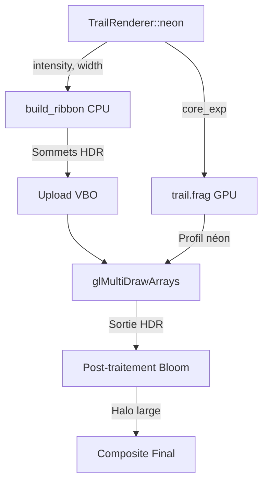

# Rendu des Traînées Néon

Le système de traînées néon affiche des rubans orientés caméra derrière chaque sphère de la simulation N-corps, avec un profil de brillance inspiré des tubes néon réels. Les traînées émettent de la lumière HDR qui interagit avec le post-traitement bloom pour créer de larges halos colorés.

## Profil Visuel

Le fragment shader (`shaders/trail.frag`) simule un tube néon avec trois couches concentriques de luminosité :

| Couche | Exposant | Poids | Rôle Visuel |
|--------|----------|-------|-------------|
| **Cœur** | `u_core_exp` (défaut 12.0) | 45% | Filament étroit blanc-chaud |
| **Intérieur** | `core_exp × 0.25` | 35% | Halo coloré de taille moyenne |
| **Extérieur** | 0.8 (fixe) | 20% | Halo diffus pour le bloom |

### Centre Blanc-Chaud

Les vrais tubes néon apparaissent quasi-blancs à leur point le plus lumineux. Le shader désature le centre en interpolant vers `vec3(peak)` (blanc préservant la luminance) proportionnellement à l'intensité du cœur :

```glsl
vec3 neon_color = mix(vColor, hot_white, core * 0.7);
neon_color *= (1.0 + core * 2.0);  // Boost HDR pour le bloom
```

### Interaction HDR / Bloom

La fonction `build_ribbon()` côté CPU pré-multiplie les couleurs par le paramètre d'intensité HDR. Combiné au boost du shader au niveau du cœur, le centre du ruban atteint des valeurs bien supérieures au seuil du bloom (défaut 1.0), déclenchant un halo bloom large qui forme l'éclat néon caractéristique.

## Contrôles en Temps Réel

Les trois paramètres néon sont ajustables en temps réel au clavier :

| Touche | Action |
|--------|--------|
| `I` | Cycle le paramètre actif : Intensité → Cœur → Largeur |
| `Shift+I` | Augmente le paramètre sélectionné |
| `Ctrl+I` | Diminue le paramètre sélectionné |

### Paramètres

| Paramètre | Défaut | Pas | Min | Description |
|-----------|--------|-----|-----|-------------|
| **Intensité** | 5.0 | ±0.5 | 0.5 | Multiplicateur HDR — contrôle la luminosité globale et la réponse bloom |
| **Cœur** | 12.0 | ±2.0 | 2.0 | Exposant de serrage — plus haut = filament fin et brillant, plus bas = lueur diffuse |
| **Largeur** | 0.24 | ±0.02 | 0.04 | Demi-largeur du ruban en unités monde — épaisseur physique de la traînée |

Chaque changement affiche une notification à l'écran avec la valeur courante.

## Architecture



### Fichiers Clés

| Fichier | Rôle |
|---------|------|
| `shaders/trail.frag` | Profil néon (3 couches Gaussiennes, cœur blanc-chaud) |
| `shaders/trail.vert` | Transformation des sommets du ruban orienté caméra |
| `include/trail_renderer.h` | Struct `TrailNeonParams` + valeurs par défaut |
| `src/trail_renderer.c` | Construction de la géométrie ruban + upload des uniforms |
| `src/app_input.c` | Gestionnaires clavier `I` / `Shift+I` / `Ctrl+I` |
| `src/app_binding.c` | Enregistrement dans l'aide F2 |

## Guide de Réglage

- **Plus de halo, moins de centre net** : Diminuer Cœur (ex. 4.0–6.0)
- **Ligne brillante type laser** : Augmenter Cœur (ex. 20.0+)
- **Halo bloom plus fort** : Augmenter Intensité (ex. 8.0–10.0)
- **Traînées subtiles** : Diminuer Intensité (ex. 1.0–2.0) et Largeur (0.08)
- **Gros tubes néon** : Augmenter Largeur (ex. 0.40+)

## Voir Aussi

- [Physique N-Corps](nbody_physics.md) — Simulation alimentant les positions des traînées
- [Débogage Bloom](bloom_debug.fr.md) — Visualisation des étapes bloom créant le halo néon
