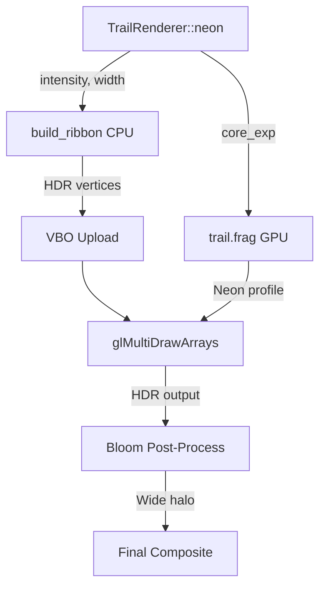

# Neon Trail Rendering

The neon trail system renders camera-facing ribbon trails behind each N-body sphere with a physically-inspired neon tube glow profile. Trails emit HDR light that interacts with the bloom post-process to create wide, colorful neon halos.

## Visual Profile

The fragment shader (`shaders/trail.frag`) simulates a neon tube with three concentric glow layers:

| Layer | Exponent | Weight | Visual Role |
|-------|----------|--------|-------------|
| **Core** | `u_core_exp` (default 12.0) | 45% | Tight white-hot filament |
| **Inner** | `core_exp × 0.25` | 35% | Medium saturated color glow |
| **Outer** | 0.8 (fixed) | 20% | Soft diffuse halo for bloom |

### White-Hot Center

Real neon tubes appear near-white at their brightest point. The shader desaturates the center by mixing towards `vec3(peak)` (luminance-preserving white) proportionally to the core intensity:

```glsl
vec3 neon_color = mix(vColor, hot_white, core * 0.7);
neon_color *= (1.0 + core * 2.0);  // HDR boost for bloom
```

### HDR / Bloom Interaction

The CPU-side `build_ribbon()` function pre-multiplies colors by the HDR intensity parameter. Combined with the shader's core boost, the center of the ribbon reaches values well above the bloom threshold (default 1.0), triggering a wide bloom halo that forms the characteristic neon glow.

## Runtime Controls

All three neon parameters are adjustable at runtime via keyboard:

| Key | Action |
|-----|--------|
| `I` | Cycle active parameter: Intensity → Core → Width |
| `Shift+I` | Increase the selected parameter |
| `Ctrl+I` | Decrease the selected parameter |

### Parameters

| Parameter | Default | Step | Min | Description |
|-----------|---------|------|-----|-------------|
| **Intensity** | 5.0 | ±0.5 | 0.5 | HDR intensity multiplier — controls overall brightness and bloom response |
| **Core** | 12.0 | ±2.0 | 2.0 | Core tightness exponent — higher = thinner bright filament, lower = diffuse glow |
| **Width** | 0.24 | ±0.02 | 0.04 | Ribbon half-width in world units — physical thickness of the trail |

Each change displays an on-screen notification with the current value.

## Architecture



### Key Files

| File | Role |
|------|------|
| `shaders/trail.frag` | Neon glow profile (3-layer Gaussian, white-hot core) |
| `shaders/trail.vert` | Camera-facing ribbon vertex transform |
| `include/trail_renderer.h` | `TrailNeonParams` struct + defaults |
| `src/trail_renderer.c` | Ribbon geometry builder + uniform upload |
| `src/app_input.c` | `I` / `Shift+I` / `Ctrl+I` keyboard handlers |
| `src/app_binding.c` | F2 help overlay registration |

## Tuning Guide

- **More glow, less sharp center**: Decrease Core (e.g., 4.0–6.0)
- **Laser-thin bright line**: Increase Core (e.g., 20.0+)
- **Stronger bloom halo**: Increase Intensity (e.g., 8.0–10.0)
- **Subtle trails**: Decrease Intensity (e.g., 1.0–2.0) and Width (0.08)
- **Fat neon tubes**: Increase Width (e.g., 0.40+)

## See Also

- [N-Body Physics](nbody_physics.md) — Simulation driving the trail positions
- [Bloom Debug](bloom_debug.md) — Visualizing bloom stages that create the neon halo
