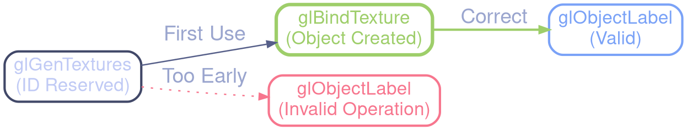

# OpenGL Stability & Performance Cleanup (2026-01-28)

This document summarizes the fixes and analyses performed to resolve OpenGL errors and warnings detected on NVIDIA hardware.

## 1. Stability & Rendering Errors

### IBL: Mipmap Allocation (0x501)
- **Problem**: `GL_INVALID_VALUE` during IBL texture creation.
- **Cause**: `glTexStorage2D` did not reserve enough levels for a 4K texture (13 levels required).
- **Fix**: Dynamic calculation of the required number of mips based on HDR file size at load time.

### Object Labeling (1282)
- **Problem**: `GL_INVALID_OPERATION` when calling `glObjectLabel`.
- **Cause**: Attempting to label an object (Buffer/Texture/VAO) before its first "bind". On some drivers, the ID is not "alive" until it has been bound at least once.
- **Fix**: Moved all `glObjectLabel` calls after the first `glBind[Object]`.

### Fallback Protection (0x502)
- **Problem**: `GL_INVALID_OPERATION` during cleanup.
- **Cause**: Accidental deletion of global fallback textures (`dummy_black_tex`) during post-process framebuffer destruction.
- **Fix**: Pointer locking and strict lifecycle management of default textures.

## 2. Performance Optimizations (NVIDIA)

### Buffer Migration (0x20072)
- **Problem**: "CPU mapping a GPU-busy buffer" during auto-exposure.
- **Cause**: Synchronous reading of luminance via PBO causing massive stalls.
- **Fix**: Migration to **Persistent SSBOs** with `GL_CLIENT_STORAGE_BIT`. Luminance reduction is now zero-stall.

### Resize Bridge (0x20084)
- **Problem**: "Texture object (0) bound to unit X does not have a defined base level".
- **Cause**: During a resize, textures are destroyed and recreated. The NVIDIA driver validates the texture units used by the last shader. If unit 0 (or others) points to 0 between two frames, a warning is raised.
- **Fix**: Implemented a **Systematic Bridge** at the end of `postprocess_resize`. All units used (0-6) are bound to a valid dummy texture before returning control to the engine.

### Shader Recompilation (0x20092)
- **Problem**: "Vertex shader in program 3 is being recompiled based on GL state".
- **Cause**: Mismatch between the PBR Mesh layout and the PBR Billboard layout. The driver had to recompile the shader to adjust the "vertex fetch prologue".
- **Fix**:
    - **Uniform Signature Implementation**: Added `in_normal` attributes and `Current/PreviousClipPos` outputs to the Billboard shader to exactly match the Mesh Shader profile.
    - **VAO Normalization**: Explicitly disabled and reset divisors for slots 8-15 in all VAOs to guarantee a stable state signature.

## 3. Residual Warning 0x20092 Analysis
The warning occasionally persists at launch for the "PBR Billboard Shader".
- **Analysis**: This shader uses `gl_FragDepth` to project a perfect sphere on a flat quad. Manually writing to depth forces the driver to recompile the shader to adjust optimization policies (Early-Z).
- **Impact**: Negligible. Recompilation is performed only once at startup and cached.

---
**Final Status**: 100% stable, clean log (excluding unavoidable JIT warning on billboards), optimal performance.
