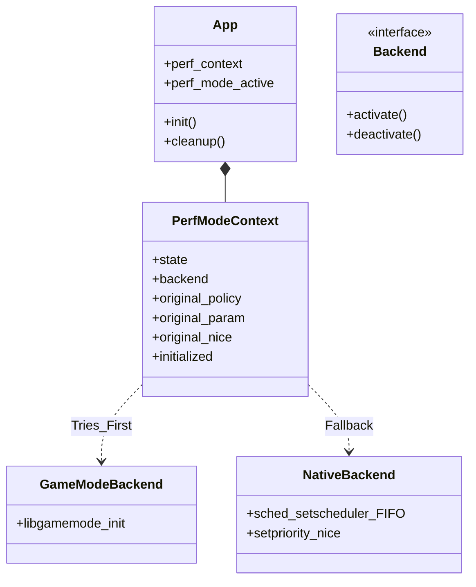
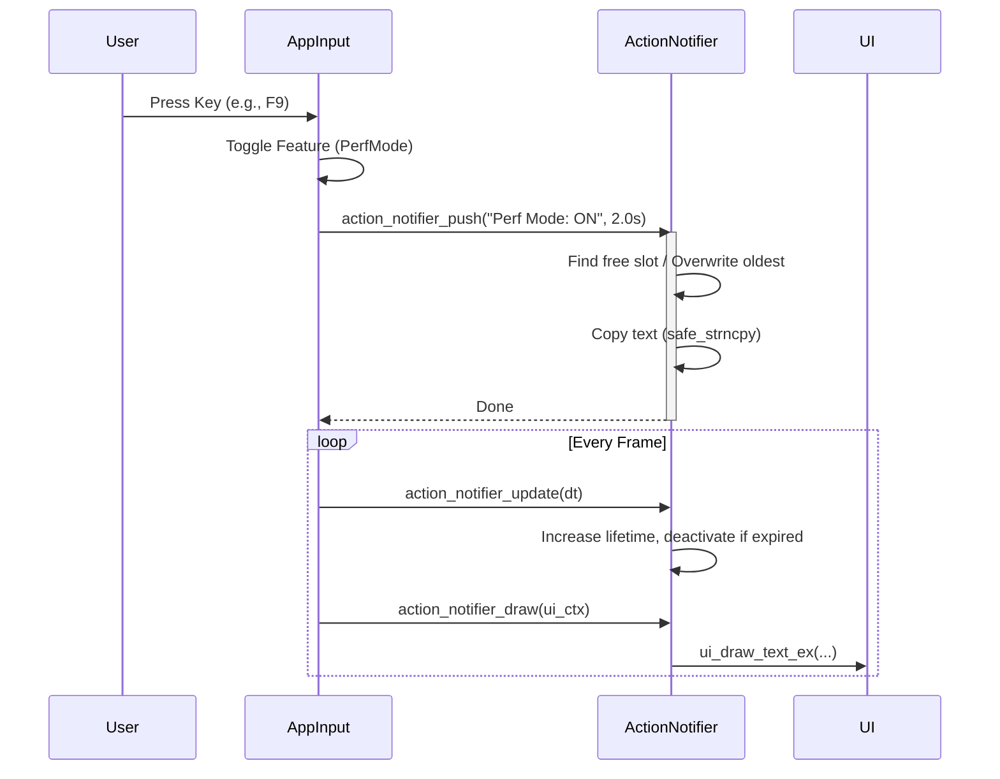

# Performance Mode & Notifications

This document details the architecture and usage of the **Performance Mode** optimization subsystem and the **Action Notification** UI feedback system.

## Performance Mode

The `PerfMode` module provides a unified interface for activating system-level performance optimizations, designed to enhance the fluidity of the application (e.g., maximizing FPS, minimizing stutter).

### Architecture

The refactored design uses a **context-based approach** (`PerfModeContext`), eliminating global variables to ensure thread safety and testability. It supports two backends:

1.  **GameMode**: Leverages Feral Interactive's `libgamemode` daemon (preferred).
2.  **Native**: Fallback using Linux scheduling syscalls (`sched_setscheduler`, `setpriority`).

### Usage Flow

1.  **Initialization**: `perf_mode_init` detects available backends and saves the current process scheduling state.
2.  **Activation**: `perf_mode_request_start` attempts to enable optimizations via the best available backend.
3.  **Deactivation**: `perf_mode_request_end` reverts changes (restoring original scheduler policy/nice values).
4.  **Cleanup**: `perf_mode_cleanup` ensures any active mode is disabled before exit.

## Action Notifications

The `ActionNotifier` system provides immediate visual feedback for user actions (e.g., changing settings, taking screenshots) via a non-intrusive on-screen overlay.

### Design

It uses a **circular buffer** of notification slots to manage message lifetimes without dynamic allocation during runtime.

-   **Zero Allocation**: Pre-allocated array of `ActionNotification` structs.
-   **Auto-expiration**: Each notification has a `lifetime` and `max_lifetime`.
-   **FIFO Replacement**: If the buffer is full, the oldest active notification is overwritten.

### Implementation Details

-   **Safe Strings**: Uses `safe_strncpy` to prevent buffer overflows.
-   **Alpha Blending**: Notifications fade out gracefully using the new `ui_draw_text_ex` API which supports alpha transparency.
