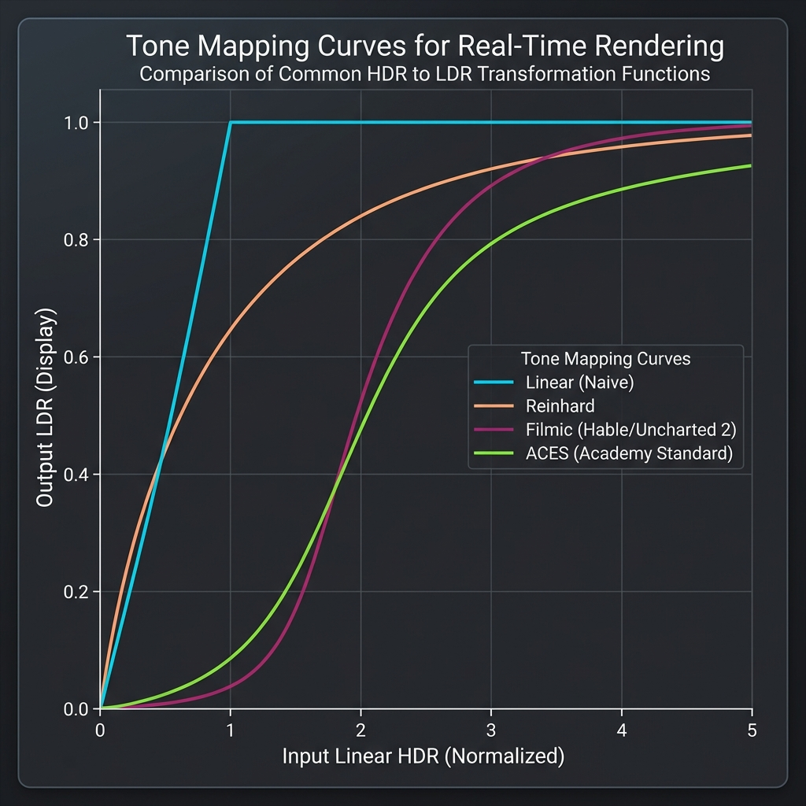

# Photographic Standards for Real-Time Rendering

Comprehensive guide to values and photographic concepts used in modern game engines and tone mapping.

## 📸 The 18% Middle Gray - The Cornerstone

### Photographic Origin

**18% gray** (0.18 in linear space) has been the **universal standard of photometry** since the 1940s.

\code
Value: 0.18 (linear) = 18% reflectance
sRGB: ~119/255 = 0.466
Hex: #777777
\endcode

### Why 18%?

1.  **Human Perception**: Our eye perceives 18% reflectance as a neutral "middle tone".
2.  **Statistical Average**: The majority of real-world scenes have an average reflectance of ~12-20%.
3.  **Ansel Adams' Zone System**: Zone V (middle of the 0-X scale) = 18%.

### Applications

-   **Gray cards** for camera calibration.
-   **Light meters** calibrated to 18% to calculate correct exposure.
-   **Lightroom/Photoshop**: Target for auto-exposure.
-   **Unreal Engine, Unity**: Default Key value for eye adaptation.

## 🎚️ Photographic Values Scale

### Exposure Values (EV)

The EV scale measures the quantity of light:

| EV | Condition | Luminance (cd/m²) | Rendering Usage |
|----|-----------|-------------------|-----------------|
| **-6** | Moonlight | 0.001 | Very dark scenes |
| **-4** | Dimly lit interior | 0.01 | Dungeons, caves |
| **0** | Lit interior | 1.0 | Standard rooms |
| **+4** | Outdoor shadow | 16 | Shaded outdoor scenes |
| **+10** | Full sunlight | 1,000 | Sunny day |
| **+15** | Snow in sunlight | 32,000 | Very bright environments |
| **+20** | Direct Sun (surface) | 1,000,000 | Extreme HDR |

### Visual EV Scale

\dot
digraph EVScale {
  rankdir=LR;
  bgcolor="transparent";
  dpi=72;

  // Suckless-Modern "Ghost" Design Tokens (Upscaled)
  node [
    shape=rect,
    style="rounded",
    fontname="Helvetica,Arial,sans-serif",
    fontsize=16,
    fillcolor="none",
    color="#414868",
    fontcolor="#c0caf5",
    penwidth=2
  ];

  edge [
    color="#565f89",
    fontname="Helvetica,Arial,sans-serif",
    fontsize=18,
    fontcolor="#9aa5ce",
    arrowsize=0.8,
    penwidth=1.2
  ];

  Moon [label="Moonlight (-6)", color="#7aa2f7", fontcolor="#7aa2f7"];
  Dark [label="Dark Interior (-4)", color="#565f89", fontcolor="#565f89"];
  Room [label="Standard Room (0)", color="#9aa5ce", fontcolor="#9aa5ce"];
  Shadow [label="Outdoor Shadow (+4)", color="#c0caf5", fontcolor="#c0caf5"];
  Sun [label="Full Sun (+10)", color="#e0af68", fontcolor="#e0af68"];
  Snow [label="Snow/Ski (+15)", color="#ffffff", fontcolor="#ffffff", penwidth=3];

  Moon -> Dark -> Room -> Shadow -> Sun -> Snow [arrowhead=none, color="#414868"];
}
\enddot

### Auto-Exposure Formula

\code{.glsl}
targetExposure = keyValue / sceneLuminance
\endcode

**Examples** (with keyValue = 0.18):

-   Dark scene (0.01 cd/m²) → Exposure = 18.0 (boost ×18)
-   Middle gray (0.18 cd/m²) → Exposure = 1.0 (neutral)
-   Bright scene (10 cd/m²) → Exposure = 0.018 (attenuation)

## 🌈 Material Reflectance Values

### Standard Albedos (Physically Based)

| Material | Reflectance | Linear | sRGB (8-bit) |
|----------|-------------|--------|--------------|
| **Charcoal** | 4% | 0.04 | 61 |
| **Dark Skin** | 12% | 0.12 | 105 |
| **18% Gray Card** | 18% | 0.18 | 119 |
| **Light Skin** | 35% | 0.35 | 160 |
| **Concrete** | 50% | 0.50 | 186 |
| **Fresh Snow** | 90% | 0.90 | 241 |
| **Maximum (Physical)** | 100% | 1.0 | 255 |

> ⚠️ In PBR, albedos exceeding 0.90 are non-physical (except for special materials).

## 📊 Tone Mapping - Standard Curves

### 1. Linear (Naive)

\code{.glsl}
output = input * exposure
\endcode

**Problem**: Brutal clipping at 1.0, loss of HDR details.

### 2. Reinhard (Simple)

\code{.glsl}
output = input / (input + 1.0)
\endcode

**Pros**: Soft compression, never clips.
**Cons**: Desaturates colors too much.

### 3. Uncharted 2 / Hable (Filmic)

\code{.glsl}
// Reproduces film response
vec3 FilmicToneMapping(vec3 x) {
    float A = 0.15; // Shoulder strength
    float B = 0.50; // Linear strength
    float C = 0.10; // Linear angle
    float D = 0.20; // Toe strength
    float E = 0.02; // Toe numerator
    float F = 0.30; // Toe denominator

    return ((x * (A * x + C * B) + D * E) /
            (x * (A * x + B) + D * F)) - E / F;
}
\endcode

**Features**:
-   **Toe**: Lifts shadows.
-   **Shoulder**: Compresses highlights.
-   **Linear section**: Preserves mid-tones.

### 4. ACES (Academy Color Encoding System)

**THE Hollywood Standard** (default in Unreal Engine).

\code{.glsl}
vec3 ACESFilm(vec3 x) {
    float a = 2.51;
    float b = 0.03;
    float c = 2.43;
    float d = 0.59;
    float e = 0.14;
    return clamp((x * (a * x + b)) / (x * (c * x + d) + e), 0.0, 1.0);
}
\endcode

**Pros**:
-   Preserves saturated colors.
-   Smooth transition to white.
-   Industry standard (Movies, AAA Games).

## 🎮 Recommended Values for Games

### Auto-Exposure Settings

| Parameter | Conservative Value | Dynamic Value | Usage |
|-----------|--------------------|---------------|-------|
| **keyValue** | 0.18 | 0.14 - 0.20 | Standard / Fast FPS |
| **minLuminance** | 1.0 | 0.5 - 2.0 | No boost / Dungeons |
| **maxLuminance** | 5000 | 1000 - 10000 | Daylight / Extreme HDR |
| **speedUp** | 2.0 | 1.0 - 3.0 | Slow / Fast Adaptation |
| **speedDown** | 1.0 | 0.5 - 2.0 | Pupil Adaptation |

### Examples by Genre

**Realistic FPS** (like Call of Duty)
\code{.c}
keyValue = 0.15        // Slightly darker (tactical)
minLuminance = 0.8
maxLuminance = 8000
speedUp = 3.0          // Fast adaptation (gameplay)
speedDown = 1.5
\endcode

**Fantasy RPG** (like Skyrim)
\code{.c}
keyValue = 0.20        // Brighter (exploration)
minLuminance = 0.5     // Boost for dungeons
maxLuminance = 10000   // Magic HDR sky
speedUp = 1.5          // Soft adaptation
speedDown = 1.0
\endcode

**Horror** (like Resident Evil)
\code{.c}
keyValue = 0.12        // Very dark (atmosphere)
minLuminance = 2.0     // No boost (oppressive)
maxLuminance = 1000
speedUp = 0.5          // Very slow adaptation
speedDown = 2.0        // Fast return to black
\endcode

## 🔧 Interesting Alternative Values

### Key Value Alternatives

| Value | Name | Effect | Usage |
|-------|------|--------|-------|
| **0.18** | Photographic Standard | Neutral, balanced | Universal default |
| **0.14** | Unreal Engine (UE4/5) | Slightly darker | AAA Games |
| **0.12** | Low-Key | Dark, dramatic | Cinematic, Horror |
| **0.25** | High-Key | Bright, airy | Cartoon, Light Fantasy |
| **0.50** | Very High-Key | Very bright | Artistic overexposure |

### Middle Gray in sRGB

Warning: 18% **linear** ≠ 18% **sRGB**!

\code
Linear 0.18  → sRGB 0.466  (gamma 2.2)
Linear 0.18  → 8-bit ~119
\endcode

**Common Trap**: Using 0.18 directly in sRGB results in a gray that is too dark!

## 📐 Useful Formulas

### Luminance Conversion

\code{.glsl}
// Rec. 709 (HD TV standard)
float luminance_709 = dot(color.rgb, vec3(0.2126, 0.7152, 0.0722));

// Alternative (Rec. 601 - SD TV)
float luminance_601 = dot(color.rgb, vec3(0.299, 0.587, 0.114));
\endcode

### EV ↔ Luminance Conversion

\code{.glsl}
float ev_val = log2(luminance_val);
float luminance_res = exp2(ev_val);
\endcode

### Temporal Adaptation

\code{.glsl}
float adaptationSpeed = (target > current) ? speedUp : speedDown;
float factor = 1.0 - exp(-deltaTime * adaptationSpeed);
float newExposure = mix(current, target, factor);
\endcode

## 🎨 Practical Workflow

### 1. Initial Calibration

\code{.c}
// Start with neutral values
keyValue = 0.18
minLuminance = 1.0
maxLuminance = 5000.0
\endcode

### 2. Test with Type Scenes

-   **Dark Interior**: Check boost isn't excessive.
-   **Outdoor Day**: Check for no over-exposure.
-   **Rapid Transition**: Adjust adaptation speeds.

### 3. Artistic Tweaking

-   **Too bright** → Reduce keyValue (0.14 - 0.16)
-   **Too dark** → Increase keyValue (0.20 - 0.25)
-   **Flashy/Unstable** → Reduce speedUp/Down
-   **Too slow** → Increase speedUp

## 📚 Recommended Resources

1.  **Film Lighting Simulator** (Unreal Engine docs)
2.  **"Physically Based Rendering"** - Matt Pharr, Greg Humphreys
3.  **Tone Mapping Comparison** - John Hable (Filmic Worlds blog)
4.  **ACES Documentation** - Academy of Motion Picture Arts
5.  **"Real Shading in Unreal Engine 4"** - Brian Karis (SIGGRAPH 2013)

## ✨ Bonus: Exotic Values

### Lunar Scenes

\code{.c}
keyValue = 0.09       // Scotopic adaptation (rods)
minLuminance = 5.0    // No boost, night vision
\endcode

### Underwater

\code{.c}
keyValue = 0.22       // Light diffusion compensation
speedUp = 0.3         // Very slow adaptation (water)
\endcode

### Space

\code{.c}
minLuminance = 10.0   // Extreme contrast
maxLuminance = 100000 // Direct sunlight without atmosphere
\endcode
