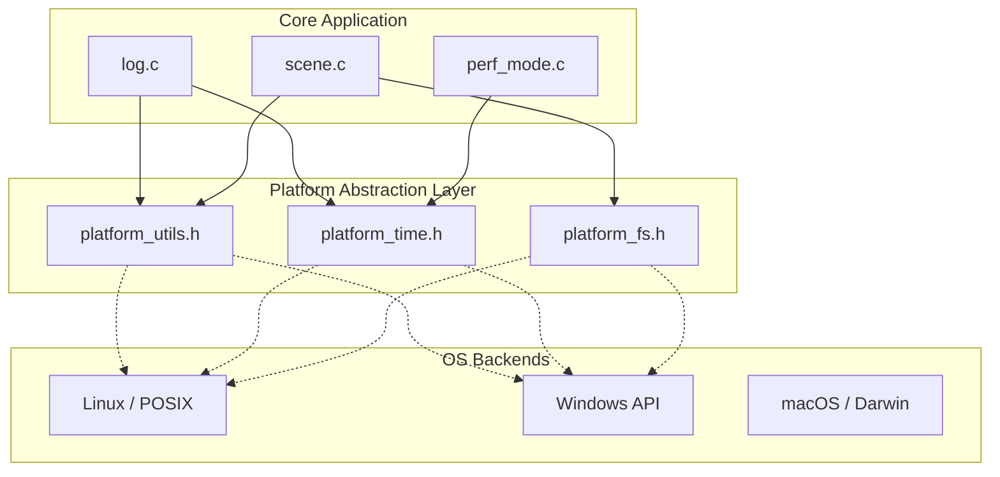

# Platform Abstraction Layer (PAL)

This document describes the design and implementation of the Platform Abstraction Layer (PAL) introduced to decouple the core application from OS-specific dependencies (primarily Linux/POSIX).

## Objectives

The PAL was introduced to:

- **Enable Cross-Platform Support**: Prepare the codebase for Windows and macOS ports.

- **Reduce Coupling**: Isolate OS-specific syscalls and headers from high-level engine logic.

- **Improve Maintainability**: Centralize platform-specific code in a well-defined directory structure.

## Architecture

The PAL acts as an intermediary between the core application logic and the underlying Operating System.



## PAL Components

### 1. Platform Utilities (`platform_utils.h`)

Handles process/thread identification and memory management.

- `platform_get_pid()`: Portable process ID retrieval.

- `platform_get_tid()`: Portable thread ID retrieval (e.g., uses `syscall(SYS_gettid)` on Linux, `GetCurrentThreadId` on Windows).

- `platform_aligned_alloc()` / `platform_aligned_free()`: Abstracts `posix_memalign` and `_aligned_malloc`.

### 2. Platform Time (`platform_time.h`)

Provides high-resolution timing and sleeping.

- `platform_get_time_ns()`: Monotonic nanosecond timer.

- `platform_get_time_precise()`: Real-time clock for timestamps (Unix epoch).

- `platform_sleep_ms()`: Millisecond-precision sleep.

### 3. Platform Filesystem (`platform_fs.h`)

Abstracts directory operations to avoid `dirent.h`.

- `platform_dir_list()`: Recursively (or linearly) scans a directory using a callback-based interface.

## Implementation Details

### Callback-based Directory Listing

To avoid OS-specific directory handles in high-level code, the PAL uses a callback pattern for filesystem scanning:

```c
typedef void (*PlatformDirCallback)(const char* name, bool is_dir, void* user_data);

bool platform_dir_list(const char* path, PlatformDirCallback callback, void* user_data);

```

This allows `scene.c` to scan for HDR files without knowing if the backend uses `opendir/readdir` or `FindFirstFile/FindNextFile`.

## Adding a New Platform

1. Open the relevant PAL implementation file in `src/platform/` (e.g., `platform_utils.c`).
1. Add a new `#elif defined(__YOUR_OS__)` block.
1. Implement the required functions using your platform's native API.
1. Update `CMakeLists.txt` to handle any new platform-specific compile definitions or library links.

## Build System Integration

The PAL is integrated into the build system via CMake. Linux-specific libraries like `m` and `dl` are now conditionally linked:

```cmake
if(UNIX)
    target_link_libraries(app PRIVATE m dl)
endif()

```

- **Compiler Flags**: Hardcoded `-rdynamic` and OS-specific linker flags were abstracted or wrapped in `if(UNIX)` blocks in CMake.

## CI/CD Integration

The project uses GitHub Actions to ensure cross-platform compatibility and produce release assets.

### Automated Windows Builds

Every push to `master` and every Pull Request triggers a Windows cross-compilation job using MinGW. This ensures that portability is maintained and no Windows-specific regressions are introduced.

### Local Windows Testing via Wine

If you develop on Linux and want to test the Windows build locally, you can use the provided `just` targets. These targets rely on your `clang-dev` distrobox environment having `mingw` and `wine` installed.

1. **Install Dependencies:** Enter your distrobox and install MinGW-w64 and Wine (e.g., on Fedora/Bazzite):

```bash
   distrobox enter clang-dev
   sudo dnf install -y mingw64-gcc mingw64-gcc-c++ wine
```

1. **Run Windows Targets:** Use the `just` commands suffixed with `-win`. The Justfile automatically uses the distrobox container for these commands.
   - `just configure-win`: Configure the CMake build using the `toolchain-mingw.cmake` file.

   - `just build-win`: Build the Windows executables (`.exe`).

   - `just run-win`: Run the compiled Windows application via Wine.

   - `just test-win`: Run the integration tests via Wine.

   - `just test-win-unit`: Run the CTest unit test suite via Wine.

### Nightly Releases

The CI pipeline automatically generates a **Nightly Build** release.

- **Assets**: Includes `app-Windows-Release.exe` alongside Linux binaries.

- **Automation**: The release is recreated on every push to `master`, ensuring the latest binaries are always available with a fresh timestamp.

### Pre-merge Validation

To ensure stability, the CI is configured to run the full unit test suite on both Linux and Windows (via Wine) before allowing a merge. Release assets are only produced if all tests pass on all platforms.

## Known Limitations & Workarounds

### Fullscreen Focus under Wine

When running the Windows build via Wine (`just build-win` and executing `app.exe`), transitioning to fullscreen via `glfwSetWindowMonitor` can cause the application to lose exclusive mouse focus.

- **Workaround**: `glfwWindowHint(GLFW_AUTO_ICONIFY, GLFW_FALSE);` is set during window creation to prevent the window from minimizing automatically.

- **Cursor Re-capture**: A manual cursor reset (`glfwSetInputMode(window, GLFW_CURSOR, GLFW_CURSOR_NORMAL)` followed by `GLFW_CURSOR_DISABLED` and `glfwSetCursorPos()`) was added to `app_input.c` to help Wine re-capture the cursor, but perfect focus parity with native Linux is not always guaranteed due to Window Manager and Wine interactions.
