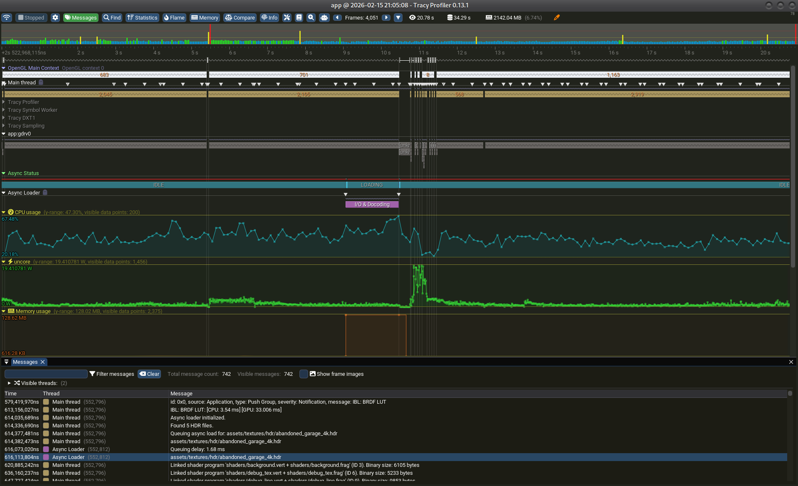

# Tutorial: Exploiting Tracy Profiler in suckless-ogl



This guide explains how to read and analyze the profiling data captured with Tracy.

## 1. Understanding the Interface

### The Timeline (Top)

- **Frame Marks:** Each vertical bar is a frame. Green is good, red indicates a "slow" frame.
- **Navigation:** Use the mouse wheel to zoom (centered on the cursor) and click-drag to move.

### The Lanes (Main View)

- **Main Thread:** Shows CPU zones. Look for wide blocks (expensive functions).
- **OpenGL Main Context:** This is the most important for GPU work. It shows the actual GPU execution time.
- **Async Status (Fibers):** A custom lane showing the loader's state machine.
  - `IDLE`: No current task.
  - `LOADING`: Worker thread is decoding an image/mesh.
- **Async Loader:** The dedicated thread for disk I/O and CPU decoding.
- **CPU/Memory/Power Usage:** Charts showing system resource consumption.

## 2. What to look for?

### CPU/GPU Sync Issues

- Compare the gaps in the **Main Thread** with the **OpenGL Context**.
- If the CPU is waiting (empty space) while the GPU is busy, you are **GPU Bound**.
- If the GPU is idle while the CPU is working hard, you are **CPU Bound**.

### Asset Loading Analysis

1. Find a jump in the **Memory Usage** graph.
2. Look at the **Async Status** lane just before the jump.
3. Check the **Async Loader** thread to see which function was active (e.g., `stbi_load`).
4. Look at the **CPU Usage**; spikes during loading confirmed heavy decoding work.

### Finding "Stutter" (Glitches)

- Locate a frame in the **Frames** row that is significantly wider than others.
- Zoom in to see what caused the delay.
  - Is it a driver stall (Wait for GPU)?
  - Is it a long disk read?
  - Is it a heavy CPU calculation?

## 3. Hybrid Profiling Identifiers

When using the `HYBRID_MEASURE_LOG` macro, you will see specific zones in the timeline designed to separate CPU work from GPU waits:

### Host (CPU)

- **Color:** Reddish
- **Meaning:** This measures the time the CPU spent **recording commands** (e.g., `glDraw*`, `glUniform*`) and submitting them to the driver.
- **Analysis:**
  - **Short duration (< 0.1ms):** Excellent. The command buffer was built quickly and sent to the GPU without blocking.
  - **Long duration:** The CPU is struggling to generate commands, or the driver is stalling (e.g., implicit sync, resource creation).

### Sync (GPU Wait)

- **Color:** Greenish
- **Meaning:** This measures the time the CPU spent **waiting** for the GPU to finish execution of the previous commands.
- **Analysis:**
  - **Presence:** Usually undesirable in a real-time loop, as it means the CPU is blocked.
  - **Context:** In `HYBRID_MEASURE_LOG`, we *intentionally* wait to measure the true GPU cost.

## 4. Advanced Tools

- **Statistics Button:** View which functions take the most cumulative time.
  > [!NOTE]
  > Since the application is multi-threaded (Main Thread + Async Loader), the sum of percentages may exceed 100%. This is normal: it represents total CPU time across all threads relative to wall-clock time.
- **Find Button:** Search for specific zones or log messages.
- **Memory Button:** Audit every allocation and find exactly who leaked memory.
- **Messages:** View your application logs (`LOG_INFO`, etc.) perfectly synced with the timeline.

## 5. Enabling Sampling (Linux)

If the **Sampling** tab in Statistics is empty, it means the kernel blocked access to performance counters.

To enable it, run this command on your host machine (or inside the container if running as root):

```bash
sudo sysctl -w kernel.perf_event_paranoid=-1
```

> [!WARNING]
> This setting allows all users to monitor system performance.

## 6. Analyzing Sampling Data

The **Sampling** tab shows where the CPU spends its time based on periodic stack traces (samples), **even for functions that are not manually instrumented**. This is crucial for finding hidden performance bottlenecks.

### Interpreting the Rows

By default, you will see a lot of noise (kernel functions, libc, drivers).

- **Name:** The function name.
- **Time:** The percentage of total CPU time spent in this function (Self time).
- **Location:** Source file and line number (if debug symbols are available).

### Filtering the Noise

To make sense of the data, use the buttons at the top of the Sampling view:

1. **Uncheck `Kernel`**: Hides OS functions (like `__memmove_avx`, `sys_call`, etc.).
2. **Uncheck `External`**: Hides functions from external libraries (like `libc`, `libGL`).
3. **Check `Inlines`**: Shows functions that were inlined by the compiler (requires debug info).

### Finding Hotspots

Once filtered, look for functions from your `suckless-ogl` codebase with high **Time** percentages.

- **Self Time:** Time spent strictly inside the function logic (excluding children).
- **Call Stacks:** Select a function row to see who called it (Call Stack) and whom it called (Callees) in the bottom pane.
- **Code View:** Double-click a row to see the assembly and source code, annotated with the cost of each instruction!
