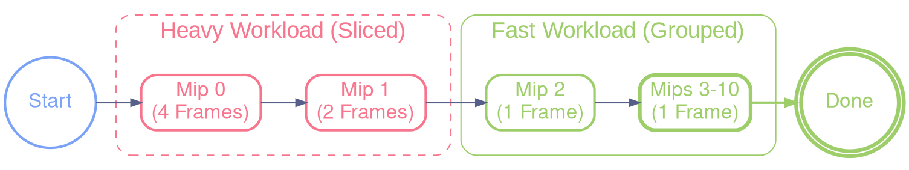
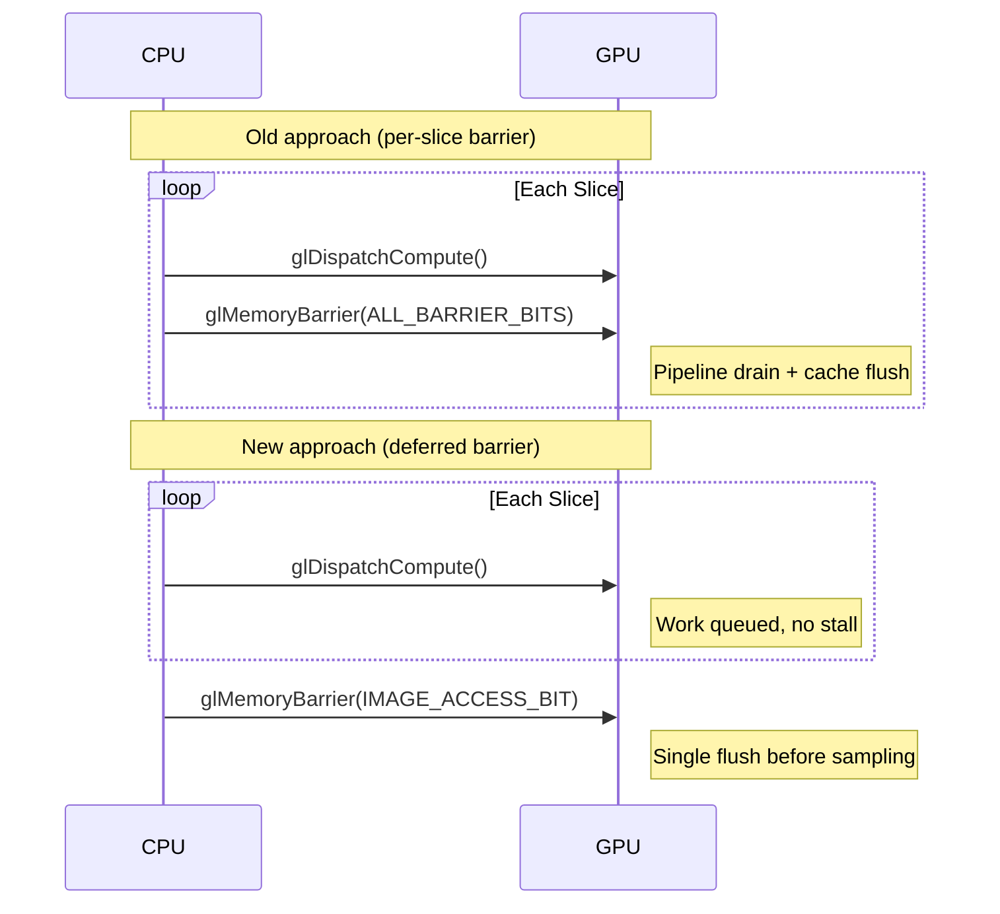

# Progressive & Asynchronous IBL Architecture

This document details the implementation of asynchronous loading and progressive generation of IBL (Image Based Lighting) maps to eliminate freezes when changing environments.

## 1. Overview

The goal was to move from a blocking synchronous load (100ms - 800ms freeze) to a fluid approach where computation time is spread over multiple frames (Time Slicing).

### The Pipeline

1. **Disk Load (Separate Thread)**: The `.hdr` file is loaded and decoded (stb_image) in a dedicated thread (`async_loader.c`).
2. **GPU Upload (Main Thread)**: Once ready, raw data is uploaded to VRAM (HDR texture).
3. **IBL Generation (Progressive)**: A state machine (`app_process_ibl_state_machine`) drives the compute shaders step-by-step to generate:
    * Irradiance Map (Diffuse).
    * Specular Prefiltered Map (Reflection).
4. **Swap (Double Buffering)**: We use "Pending" textures. The old environment remains displayed until the new one is 100% ready.

---

## 2. "Slicing" Strategy

PBR Compute Shaders (especially for high-resolution Specular maps) are very expensive. Computing a full 512x512 texture takes ~250ms on an integrated GPU, freezing the application.

**Solution**: Slice the work horizontally ("Slicing") and only compute one strip of the image per frame.

### 2.1 Overlap Protection (Crucial)

Compute Shader Workgroups have a fixed size (32x32). If we ask to compute a slice **1 pixel** high, the GPU still launches a block 32 pixels high.
Without protection, the 31 excess rows overwrite/recalculate neighboring pixels, massively wasting resources.

**The Fix (`u_max_y_slice`)**:
We pass a precise limit to the shader:

```glsl
// shaders/IBL/spmap.glsl & irmap.glsl
uniform int u_max_y_slice; // Y limit of the current slice

void main_task() {
    // ...
    // Surgical stop to avoid wasted workgroups on slice edges
    if (pixel_pos.y >= u_max_y_slice) return; // Immediate stop for phantom threads
    // ...
}
```

---

## 3. Optimized Configuration (Adaptive Slicing)

To reconcile **fluidity** (no freeze) and **overall speed** (fast loading), we use an adaptive strategy based on the workload weight.

### A. Irradiance Map (64x64)

- **Strategy**: Constant slicing.
* **Slicing**: 12 Slices.
* **Cost**: ~5ms / slice.

### B. Specular Map (1024x1024)

This is the heaviest part. The cost per mipmap decreases exponentially.

| Mip Level | Size | Strategy | Est. Cost / Frame | Description |
| :--- | :--- | :--- | :--- | :--- |
| **Mip 0** | 1024x1024 | **24 Slices** | ~25-35ms | Heaviest (High Frequency details). |
| **Mip 1** | 512x512 | **8 Slices** | ~15-25ms | Medium. |
| **Mip 2** | 256x256 | **1 Slice** | ~15ms | Light, computed in one go. |
| **Mip 3-10** | 128..1 | **Tail Grouping** | ~20ms (Total) | All computed in **a single frame**. |

**Total "Tail Grouping"**: Grouping small mips (3 to 10) avoids wasting 7 frames of latency for tiny jobs (<1ms each).



---

## 4. Deferred Memory Barrier Optimization

### 4.1 The Problem: Per-Slice Barrier Overhead

Initially, each slice dispatch called `glMemoryBarrier(GL_ALL_BARRIER_BITS)` at
the end. This forced the GPU to:

1. **Drain the entire pipeline** — all in-flight commands complete before the
    next dispatch starts.
2. **Invalidate all GPU caches** — texture cache, L2, framebuffer, etc.
3. **Cold-restart** — the next dispatch re-fetches `env_hdr_tex` from VRAM
    instead of hitting cache.

The overhead was **super-linear**: doubling the slice count more than doubled
the total processing time. This made fine-grained slicing (many small slices
for ~33ms/frame budget) impractical.

### 4.2 Key Observation: No Inter-Slice Data Dependencies

Analyzing the data flow reveals that slices are **independent**:

```
Slice 0: READ env_hdr_tex → WRITE dest_tex[mip][y: 0..N]
Slice 1: READ env_hdr_tex → WRITE dest_tex[mip][y: N..2N]
...etc
```

* All slices **read** from the same source HDR texture (never modified).
* Each slice **writes** to a disjoint Y-range of the destination texture.
* There is no read-after-write or write-after-write hazard between slices.

The same holds across mip levels: each mip writes to a different mip level of
the destination, and reads from the same source HDR.

### 4.3 Solution: Single Deferred Barrier

Remove all per-slice barriers and issue **one** barrier at the end:

* `pbr_prefilter_mip()` and `pbr_irradiance_slice_compute()` no longer call
    `glMemoryBarrier()`. The caller is responsible.
* A single `glMemoryBarrier(GL_SHADER_IMAGE_ACCESS_BARRIER_BIT)` is placed in
    `IBL_STATE_DONE`, just before the textures are sampled for rendering.
* The barrier type is narrowed from `GL_ALL_BARRIER_BITS` to
    `GL_SHADER_IMAGE_ACCESS_BARRIER_BIT` — only the image-store-to-texture-fetch
    coherency path is flushed.



### 4.4 Benchmark Results (16 slices on Mip 0)

| Metric | Before (per-slice barrier) | After (deferred) | Improvement |
| :--- | :--- | :--- | :--- |
| **Average** | ~1004 ms | ~875 ms | **~13%** |
| **Min** | 792 ms | 668 ms | **~16%** |
| **Max** | 1189 ms | 904 ms | **~24%** |
| **Variance** | ±200 ms | ±80 ms | **Much more stable** |

The variance reduction is significant: per-slice pipeline drains introduced
unpredictable GPU idle time. With the deferred barrier, the GPU runs
continuously without stalls.

> [!IMPORTANT]
> With the deferred barrier, the slice count can be increased freely without
> super-linear overhead. This allows targeting a ~33ms/frame budget per slice
> for smooth 30 FPS during IBL generation.

---

## 5. Global Performance

With this architecture on a discrete GPU:
* **FPS**: Remains fluid (~30+ FPS during IBL generation).
* **Total Time**: A complete environment transition takes about **850ms to 950ms** (with 24+8+12 slices).
* **Perceived Latency**: Near-zero thanks to continuous display of the old environment during computation.

## 6. Key Files

* `src/app_env.c`: Contains the State Machine (`app_process_ibl_state_machine`) and the deferred barrier in `IBL_STATE_DONE`.
* `src/pbr.c`: Implements sliced compute dispatches (`pbr_prefilter_mip`, `pbr_irradiance_slice_compute`) — no internal barriers.
* `include/pbr.h`: API documentation with `@note` about caller barrier responsibility.
* `shaders/IBL/*.glsl`: Shaders modified to support `u_offset_y` and `u_max_y`.
